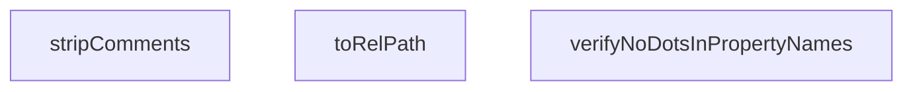

## Genel Bakış

Bu modül, uygulama genelindeki uluslararasılaştırma (i18n) anahtarlarının ve çevirilerin yapısal tutarlılığını doğrulayan bir conformance test yardımcıları setidir. TypeScript kaynak dosyalarından yorum temizleme, dosya yolları dönüştürme ve nesne yapılarını doğrulama gibi destekleyici işlemler sunar. Testlerin i18n kaynaklarının standartlara uygunluğunu garanti altına almayı hedefler.

## Fonksiyon Grupları

### Doğrulama Yardımcıları
i18n anahtarlarının ve nesne yapılarının beklenen kurallara uygun olup olmadığını kontrol eder; özellikle özellik adlarında nokta karakteri gibi sorunlu yapıları tespit eder.
- `verifyNoDotsInPropertyNames`

### Kaynak İşleme
TypeScript veya JavaScript kaynak kodları üzerinde temizleme ve dönüşüm işlemleri yaparak testlerin ham veriyle değil, işlenmiş verilerle çalışmasını sağlar.
- `stripComments`, `toRelPath`

---

## AXIOMS – Mimari Varsayımlar

Bu modül, i18n anahtarlarının mimari doğrulamasını sağlayan yardımcı fonksiyonlar içerir.

**[Aksiyom 1]**: Eğer `verifyNoDotsInPropertyNames` fonksiyonuna `pathPrefix` parametresi olarak geçerli bir yol öneki (string) verilmezse, noktalı property'lerin konumu raporlanamaz ve fonksiyon anlamsız sonuçlar döner.

**[Aksiyom 2]**: Eğer `verifyNoDotsInPropertyNames` fonksiyonuna `obj` parametresi olarak geçerli bir `Record<string, unknown>` nesnesi verilmezse, fonksiyon hata fırlatır veya boş dizi döner; iç içe geçmiş nesnelerin recursively taranması başarısız olur.

**[Aksiyom 3]**: Eğer `stripComments` fonksiyonuna `source` parametresi olarak geçerli bir string verilmezse, kaynak koddaki yorumlar doğru kaldırılamaz ve i18n anahtarları yanlış tespit edilebilir.

**[Aksiyom 4]**: Eğer `toRelPath` fonksiyonuna `globKey` parametresi olarak geçerli bir glob pattern anahtarı verilmezse, dosya yolu dönüşümü hatalı sonuç verir ve dosya eşleştirmesi başarısız olur.

**[Aksiyom 5]**: Eğer `SOURCES` sabiti doğru yapılandırılmamışsa (çağrılmamışsa), test edilecek kaynak dosya listesi boş kalır ve hiçbir i18n anahtarı doğrulanamaz.

**[Aksiyom 6]**: `verifyNoDotsInPropertyNames` fonksiyonunun dönüş tipi `string[]` olduğundan, noktalı property içeren yolların dizisi olarak döner — bu listenin boş olması, tüm property isimlerinin nokta içermediği anlamına gelir.

---

## FONKSİYON DETAYLARI

### verifyNoDotsInPropertyNames
**Ne yapar**: Verilen nesnede (nesne veya dizi) nokta (`.`) içeren tüm anahtarları (propertileri) bulur ve bu anahtarların tam yollarını (hiyerarşik yolunu) bir dizi olarak döndürür. Bu, yapılandırma dosyalarında veya nesne anahtarlarında nokta kullanımını engelleyen bir kural denetimi için kullanılır.

**Nasıl yapar**: Fonksiyon, nesnenin tüm girişlerini döngüye alır. Her bir anahtarın kendisinde nokta olup olmadığını kontrol eder; varsa tam yolu (`fullPath`) ihlal listesine ekler. Ardından, değerin nesne tipinde olup olmadığını (dizi olmadığını ve `null` olmadığını kontrol ederek) belirler ve bu durumda, kendi kendini çağırarak (recursion) iç içe nesneleri de tarar. `pathPrefix` parametresi, mevcut hiyerarşik konumu temsil eder ve her递归 çağrısında güncellenir.

**Parametreler**:
- `obj`: `Record<string, unknown>` — Tarannacak, anahtar-değer çiftlerinden oluşan nesne. Değerler herhangi bir tipte olabilir; nesne ise递归 olarak taranır.
- `pathPrefix`: `string` — Varsayılan değeri boş string (`''`) olan, mevcut arama yolunun öneki. İlk çağrıda boş olarak başlar ve递var过程中 `key` adı ile nokta eklenerek güncellenir.

**Dönüş**: `string[]` — Nokta içeren tüm anahtarların tam yollarını (örn: `"a.b.c"`) içeren dizi. İhlal yoksa boş döner.

### stripComments
**Ne yapar**: Verilen bir kaynak kodu dizisinden (`string`) JavaScript/TypeScript tarzı yorum satırlarını ve blok yorumlarını kaldırarak, temiz bir kod stringi döndürür.

**Nasıl yapar**: İki aşamalı bir regex (`RegExp`) dönüşümü uygular. Önce `/*...*/` şeklindeki blok yorumları (`/\/\*[\s\S]*?\*\//g`) eşleşen tüm grupları boş string ile değiştirerek siler. Ardından, `//...` şeklindeki tek satır yorumlarını (`/(^|[^:])\/\/.*$/gm`) kaldırır; bu regex, `:` karakterinden sonraki `//` yorumlarını (örn: URL'lerdeki `://`) yanlışlıkla silmemek için tasarlanmıştır. Dönüşüm, orijinal diziyi değiştirmez, yeni bir string döndürür.

**Parametreler**:
- `source`: `string` — Yorumları çıkarılacak kaynak kodu veya metin.

**Dönüş**: `string` — Yorumları kaldırılmış, temiz metin.

### toRelPath
**Ne yapar**: Verilen bir glob anahtarını (tam dosya yolu), projenin kaynak kod dizinine (`src/`) göreli ve çapraz platform uyumlu bir dosya yoluna dönüştürür.

**Nasıl yapar**: Fonksiyon, girdi dizisi içinde `/src/` marker'ının (işaretçisinin) konumunu bulur. Bu marker bulunduysa, marker'dan sonraki kısmı keser (`slice`); bulunamazsa tüm girişi kullanır. Son olarak, Windows tarzı ters eğik çizgileri (`\`) Unix tarzı eğik çizgilere (`/`) dönüştürerek (`replace(/\\/g, '/')`) yolun çapraz platformda çalışmasını sağlar.

**Parametreler**:
- `globKey`: `string` — Dönüştürülecek, genellikle bir glob kalıbından elde edilen tam dosya yolu.

**Dönüş**: `string` — `/src/` önekinden arındırılmış, yalnızca eğik çizgi içeren göreli dosya yolu.

---

## İTHALATLAR (IMPORTS)
- import: ../../i18n/dictionaries/tr::tr
- import: ../../i18n/getDictValue::getDictValue
- import: vitest::describe
- import: vitest::expect
- import: vitest::it

---

## SABİTLER
- **SOURCES** (call) — `import.meta.glob('/src/**/*.{ts,tsx}', {
  query: '?raw',
  import: 'default'...`

---

## AST POINTERS

### [N1_NASIL] AST Pointer: `__tests__/conformance/i18n-keys.test.ts`::verifyNoDotsInPropertyNames
- **params**: `(obj: Record<string, unknown>, pathPrefix = '')`
- **ic_degiskenler**:
  - `offenders` — noktalı key isimlerinin tam path'lerini toplayan dizi
  - `fullPath` — mevcut key'in üst seviyelerle birleşik tam yolu (`pathPrefix.key` veya sadece `key`)
  - `key` — `Object.entries` ile dönen mevcut sözlük anahtarı
  - `value` — `key`'e karşılık gelen sözlük değeri
- **Dönüş**: `string[]` — noktalı key bulunan tam path'lerin listesi

---

### [N2_NASIL] AST Pointer: `__tests__/conformance/i18n-keys.test.ts`::stripComments
- **params**: `(source: string)`
- **ic_degiskenler**: yok
- **Dönüş**: `string` — yorum satırları (`/* */` ve `//`) çıkarılmış kaynak kod stringi

---

### [N3_NASIL] AST Pointer: `__tests__/conformance/i18n-keys.test.ts`::toRelPath
- **params**: `(globKey: string)`
- **ic_degiskenler**:
  - `marker` — path分割자 olarak kullanılan `/src/` literal stringi
  - `idx` — `globKey` içinde `/src/` marker'ının bulunduğu indeks (-1 ise bulunamadı)
- **Dönüş**: `string` — `/src/` prefix'inden sonraki göreli yol, backslash'ler forwardslash'e çevrilmiş

---

### [N4_NASIL] AST Pointer: `__tests__/conformance/i18n-keys.test.ts`::(it callback: "nested-only")
- **params**: yok
- **ic_degiskenler**:
  - `trOffenders` — `verifyNoDotsInPropertyNames(tr)` çağrısının döndüğü noktalı key path listesi
- **Dönüş**: yok (assertion ile test sonucu üretir)

---

### [N5_NASIL] AST Pointer: `__tests__/conformance/i18n-keys.test.ts`::(it callback: "keycheck")
- **params**: yok
- **ic_degiskenler**:
  - `missingKeys` — `{ file: string; key: string }` tipli dizide çözümlenemeyen key'lerin kaydı
  - `staticKeyRegex` — `t('...')` çağrılarını yakalayan正则表现式 (`/\bt\(\s*['"]([a-zA-Z0-9_.-]+)['"]\s*[),]/g`)
  - `key` — `Object.entries(SOURCES)` ile dönen kaynak dosya glob yolu
  - `source` — ilgili dosyanın ham kaynak kodu
  - `rel` — `toRelPath(key)` ile elde edilmiş göreli dosya yolu
  - `clean` — `stripComments(source)` ile yorumları temizlenmiş kaynak kod
  - `match` — regex.exec() ile bulunan her eşleşme sonucu (array)
  - `tKey` — `match[1]`'den elde edilen çeviri key stringi
  - `resolved` — `getDictValue(tr, tKey)` ile sözlükten çözümlenen değer
  - `uniqueMissing` — `missingKeys` dizisinden `file -> key` formatında tekrarsız liste
- **Dönüş**: yok (assertion ile test sonucu üretir)

---

## MERMAID CALL GRAPH

## NODE ID STANDARD

  file: src\__tests__\conformance\i18n-keys.test.ts
  function: src\__tests__\conformance\i18n-keys.test.ts::verifyNoDotsInPropertyNames
  function: src\__tests__\conformance\i18n-keys.test.ts::stripComments
  function: src\__tests__\conformance\i18n-keys.test.ts::toRelPath

---

## DISA AKTARILANLAR (EXPORTS)
  export: stripComments
  export: toRelPath
  export: verifyNoDotsInPropertyNames