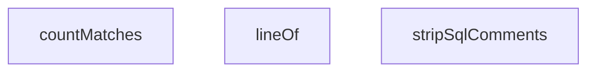

## Genel Bakış
Bu modül, SQL tabanlı migration dosyalarının atomikliğini test etmek için kullanılan yardımcı fonksiyonlar içeren bir test yardımcıları (test utilities) modülüdür. SQL yorumlarının temizlenmesi, metin içinde desen konumlarının tespiti ve desen eşleşme sayılarının hesaplanması gibi temel metin işleme operasyonlarını sağlayarak test senaryolarının hazırlanmasına ve doğrulanmasına katkıda bulunur.

## Fonksiyon Grupları
### SQL Yorum İşleme Fonksiyonları
Bu grup, SQL kodunu analiz edilebilir hale getirmek için yorum satırlarını temizleme operasyonlarını kapsar.
- stripSqlComments

### Metin Konum Belirleme Fonksiyonları
Bu grup, metin içinde belirli bir desenin (regex) bulunduğu satır numarasını tespit etmek için kullanılır.
- lineOf

### Desen Eşleşme Analiz Fonksiyonları
Bu grup, metin içinde belirli bir desenin kaç kez geçtiğini sayarak nicel analiz yapmaya yarar.
- countMatches

---

## AXIOMS – Mimari Varsayımlar
- Bu modül davranışsal mantık içermez (salt veri / konfigürasyon / tip tanımı).
- [Aksiyom 1]: Modülün dışa açtığı yapı (anahtar kümesi / şema) bir sözleşmedir; tüketiciler bu sabit yapıya bağlıdır — kırıcı değişiklik tüm tüketicileri etkiler.
- [Aksiyom 2]: Bir öğe ekleme/çıkarma yapısal-uyumlu olmalı; ilgili tipler ve seçiciler aynı commit'te güncel tutulmalıdır.

---

## FONKSİYON DETAYLARI

### stripSqlComments
**Ne yapar**: SQL metni içindeki tek satır (`--`) ve çok satır (`/* */`) yorumları kaldırarak temiz bir SQL döndürür.
**Nasıl yapar**: `String.replace` metodunu kullanarak sırasıyla çok satır yorumları (`/*...*/`) ve tek satır yorumları (`--...`) eşleştirir ve boşluk karakteriyle değiştirir. `replace` metoduna verilen RegExp kalıpları sırasıyla `/\/\*[\s\S]*?\*\//g` (göreceli olarak en kısa eşleşmeyi bulan `*?` ile) ve `/--[^\n]*/g` şeklindedir. `g` (global) bayrağı, metin içindeki tüm eşleşmeleri bulmasını sağlar. İşlevsel olarak, SQL parser'lar tarafından yorum satırlarının hatalı yorumlanmasını engellemek için kullanılır.
**Parametreler**:
- sql: string — Yorumları kaldırılacak ham SQL metni.
**Dönüş**: string — Yorumları (boşluk ile değiştirilmiş) temiz SQL metni.

### lineOf
**Ne yapar**: Verilen bir metin içinde, belirli bir düzenli ifadeyle (RegExp) eşleşen ilk parçanın kaçıncı satırda olduğunu (1-tabanlı indeksleme ile) bulur.
**Nasıl yapar**: Girdi olarak alınan RegExp'i kopyalayarak global (`g`) bayrağını kaldırır (böylece sadece ilk eşleşmeyi arar) ve `RegExp.exec()` ile metin üzerinde çalıştırır. Eşleşme bulunursa, `text.slice(0, m.index)` ile eşleşme noktasına kadar olan metni alır ve `split('\n').length` ile bu parçanın kaç satır oluşturduğunu hesaplayarak 1-tabanlı satır numarasını döndürür. Eşleşme hiç bulunamazsa 0 döner.
**Parametreler**:
- text: string — Aramanın yapılacağı kaynak metin.
- re: RegExp — Aranacak düzenli ifade. Fonksiyon, `g` bayrağı olsa bile sadece ilk eşleşmeyi kullanır.
**Dönüş**: number — Eşleşmenin 1-tabanlı satır numarası. Eşleşme yoksa 0.

### countMatches
**Ne yapar**: Verilen bir metin içinde, belirli bir düzenli ifadenin (RegExp) kaç kez eşleştiğini sayar.
**Nasıl yapar**: Girdi olarak alınan RegExp'i kopyalayarak, eğer global (`g`) bayrağı yoksa onu ekler (böylece tüm eşleşmeleri bulur) ve `String.match` metodunu kullanarak tüm eşleşmeleri bir diziye toplar. Elde edilen dizinin `.length` özelliğini döndürür. `match` metodunun null döndüğü (hiç eşleşme olmadığı) durumlarda boş bir dizi (`[]`) kullanarak `.length` özelliğinin 0 olmasını sağlar.
**Parametreler**:
- text: string — Sayının yapılacağı kaynak metin.
- re: RegExp — Sayılacak düzenli ifade. Fonksiyon, `g` bayrağı yoksa otomatik olarak ekler.
**Dönüş**: number — Düzenli ifadenin metin içindeki toplam eşleşme sayısı.

---

## İTHALATLAR (IMPORTS)
- import: vitest::describe
- import: vitest::expect
- import: vitest::it

---

## SABİTLER
- **MIGRATIONS** (call) — `import.meta.glob('/supabase/migrations/*.sql', {
  query: '?raw',
  import:...`
- **NON_TRANSACTIONAL** (array) — `[
  { ad: 'CREATE INDEX CONCURRENTLY', re: /\bcreate\s+(?:unique\s+)?index\s...`
- **BEGIN_RE** (regex) — `/^\s*(?:begin|start\s+transaction)\s*;/gim`
- **COMMIT_RE** (regex) — `/^\s*commit\s*;/gim`

---

## AST POINTERS

### [N1_NASIL] AST Pointer: src/__tests__/conformance/migration-atomicity.test.ts::stripSqlComments
- **params**: `sql: string` — SQL metni, yorum satırları ve blok yorumları içerebilir
- **ic_degiskenler**: (yok — doğrudan parametre üzerinde zincirli `.replace()` çağrısı yapılır)
- **Dönüş**: `string` — yorumları boşlukla değiştirilmiş temiz SQL

---

### [N2_NASIL] AST Pointer: src/__tests__/conformance/migration-atomicity.test.ts::lineOf
- **params**: `text: string` — arama yapılacak metin, `re: RegExp` — satır numarası bulunacak regex deseni
- **ic_degiskenler**:
  - `m` — `exec()` ile text içinde yapılan eşleşmenin sonucu; eşleşme varsa `index` değeri ile satır sayısını hesaplar
- **Dönüş**: `number` — eşleşmenin bulunduğu satır numarası (1-tabanlı), bulunamazsa `0`

---

### [N3_NASIL] AST Pointer: src/__tests__/conformance/migration-atomicity.test.ts::countMatches
- **params**: `text: string` — aranacak metin, `re: RegExp` —全局 eşleşme deseni
- **ic_degiskenler**: (yok — `.match()` sonucunun `.length`'i doğrudan döner)
- **Dönüş**: `number` — regex'in text içinde kaç kez eşleştiği

---

### [N4_NASIL] AST Pointer: src/__tests__/conformance/migration-atomicity.test.ts::anonymous_map_callback
- **params**: `[path, raw]` — destructured; `path` migration dosyasının yolu, `raw` dosyanın işlenmemiş SQL içeriği
- **ic_degiskenler**: (yok — parametreler üzerinden doğrudan nesne döner)
- **Dönüş**: `{ path, ad, raw, code }` — `ad`: dosya adı (`path.split('/').pop()`), `code`: yorumları ayıklanmış SQL (`stripSqlComments(raw)`)

---

### [N5_NASIL] AST Pointer: src/__tests__/conformance/migration-atomicity.test.ts::anonymous_describe_callback
- **params**: (yok)
- **ic_degiskenler**:
  - `dosyalar` — `MIGRATIONS` object'inden üretilen array; her eleman `{ path, ad, raw, code }` yapısında migration bilgisi taşır; `Object.entries(MIGRATIONS).map(...)` ile oluşturulur
- **Dönüş**: yok — yan etki olarak 4 adet `it(...)` test bloğunu tanımlar

---

### [N6_NASIL] AST Pointer: src/__tests__/conformance/migration-atomicity.test.ts::anonymous_it_callback_dosya_sayisi
- **params**: (yok)
- **ic_degiskenler**: (yok — `dosyalar.length` erişimi doğrudan `expect` içine yapılır)
- **Dönüş**: yok — `expect(dosyalar.length).toBeGreaterThan(100)` ile assertion yapar

---

### [N7_NASIL] AST Pointer: src/__tests__/conformance/migration-atomicity.test.ts::anonymous_it_callback_begin_commit_dengesi
- **params**: (yok)
- **ic_degiskenler**:
  - `bozuk` — BEGIN ve COMMIT sayıları eşleşmeyen dosya adlarını içeren `string[]`; `dosyalar` array'i `.map()` ile `countMatches(d.code, BEGIN_RE)` ve `countMatches(d.code, COMMIT_RE)` çağrılarıyla `b` ve `c` alanları eklenir, `.filter((d) => d.b !== d.c)` ile dengesiz olanlar seçilir, `.map((d) => ...)` ile formatlanmış string'e dönüştürülür
- **Dönüş**: yok — `expect(bozuk, ...).toEqual([])` ile boş dizi olduğunu doğrular

---

### [N8_NASIL] AST Pointer: src/__tests__/conformance/migration-atomicity.test.ts::anonymous_it_callback_ihlal_taramasi
- **params**: (yok)
- **ic_degiskenler**:
  - `ihlaller` — `string[]`; transaction-dışı ifadelerin yasalara aykırı kullanımını tanımlayan hata mesajları listesi
  - `d` — `for...of` döngüsünde her bir `dosyalar` elemanı (`{ path, ad, raw, code }`)
  - `beginLine` — `lineOf(d.code, BEGIN_RE)` ile mevcut dosyadaki BEGIN ifadesinin satır numarası
  - `commitLine` — `lineOf(d.code, COMMIT_RE)` ile mevcut dosyadaki COMMIT ifadesinin satır numarası
  - `kendiIslemi` — `boolean`; dosyanın kendi BEGIN/COMMIT bloğuna sahip olup olmadığını belirtir (`beginLine > 0 && commitLine > 0`)
  - `satir` — `NON_TRANSACTIONAL` array'indeki her bir `{ ad, re }` çifti için `lineOf(d.code, re)` ile transaction-dışı ifadenin bulunduğu satır numarası
- **Dönüş**: yok — `expect(ihlaller.sort(), ...).toEqual([])` ile ihlal listesinin boş olduğunu doğrular

---

### [N9_NASIL] AST Pointer: src/__tests__/conformance/migration-atomicity.test.ts::anonymous_it_callback_dedektor_kontrol
- **params**: (yok)
- **ic_degiskenler**:
  - `ornek` — pozitif ve negatif test senaryolarında kullanılan SQL snippet string'i; her iki `for...of` döngüsünde `NON_TRANSACTIONAL.some(({ re }) => re.test(ornek))` ile regex dedektörünün yakalayıp yakalamadığı test edilir
  - `mesru` — `string`; COMMIT之后 `CREATE INDEX CONCURRENTLY` içeren meşru SQL bloğu; `BEGIN;\nselect 1;\nCOMMIT;\nCREATE INDEX CONCURRENTLY i ON t(c);`
  - `ihlal` — `string`; COMMIT之前 `CREATE INDEX CONCURRENTLY` içeren ihlal SQL bloğu; `BEGIN;\nCREATE INDEX CONCURRENTLY i ON t(c);\nCOMMIT;`
  - `idx` — `(sql: string) => number` inner fonksiyon; verilen SQL'de `NON_TRANSACTIONAL[0].re` deseninin satır numarasını döner; `mesru` ve `ihlal` string'lerinin `COMMIT_RE`'ye göre sıra kontrolünde kullanılır
- **Dönüş**: yok — birden fazla `expect(...)` assertion'ı ile dedektörün doğru çalıştığını, comment stripper'ın yorumlardaki ifadeleri yok saydığını ve BEGIN/COMMIT sınır mantığının düzgün olduğunu doğrular

---

## MERMAID CALL GRAPH

## NODE ID STANDARD

  file: src\__tests__\conformance\migration-atomicity.test.ts
  function: src\__tests__\conformance\migration-atomicity.test.ts::stripSqlComments
  function: src\__tests__\conformance\migration-atomicity.test.ts::lineOf
  function: src\__tests__\conformance\migration-atomicity.test.ts::countMatches

---

## DISA AKTARILANLAR (EXPORTS)
  export: countMatches
  export: lineOf
  export: stripSqlComments