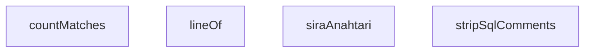

## Genel Bakış
Bu modül, veritabanı göçlerinin (migration) atomikliğini doğrulayan konformans testlerini içerir. Göç işlemlerinin ya tamamen uygulanması ya da tamamen geri alınması gerektiğini test eder. Modül, SQL metinlerini ayrıştırmak ve test senaryolarında desen eşleştirmeleri yapmak için yardımcı fonksiyonlar sağlar.

## Fonksiyon Grupları

### SQL ve Metin İşleme Yardımcıları
Test senaryolarında kullanılan SQL ve genel metin analiz fonksiyonlarıdır. SQL dosyalarından yorum satırlarını temizleyerek saflaştırır, metin içinde belirli desenlerin hangi satırda geçtiğini bulur ve desen eşleşmelerini sayar.
- `stripSqlComments`, `lineOf`, `countMatches`

### Test Organizasyonu
Testlerin çalıştırma sırasını belirlemek için kullanılan anahtar üretme fonksiyonunu içerir. Test adından yola çıkarak sıralama anahtarı oluşturur.
- `siraAnahtari`

---

## AXIOMS – Mimari Varsayımlar
- Bu modül davranışsal mantık içermez (salt veri / konfigürasyon / tip tanımı).
- [Aksiyom 1]: Modülün dışa açtığı yapı (anahtar kümesi / şema) bir sözleşmedir; tüketiciler bu sabit yapıya bağlıdır — kırıcı değişiklik tüm tüketicileri etkiler.
- [Aksiyom 2]: Bir öğe ekleme/çıkarma yapısal-uyumlu olmalı; ilgili tipler ve seçiciler aynı commit'te güncel tutulmalıdır.

---

## FONKSİYON DETAYLARI

### stripSqlComments
**Ne yapar**: Verilen SQL metnindeki yorumları temizler. Hem `--` ile başlayan satır yorumlarını hem de `/* */` ile çevrelenen blok yorumlarını silerek yerine boşluk karakteri koyar. Bu sayede SQL ifadesinin saf haline ulaşılır.

**Nasıl yapar**: Düzenli ifade (regex) kullanarak iki aşamalı bir temizleme uygular. İlk olarak `/* */` blok yorumlarını eşleştiren `\/\*[\s\S]*?\*\/` deseniyle (tembel eşleşme, yani mümkün olan en kısa eşleşme) tüm blok yorumları tek bir boşlukla değiştirilir. Ardından `--[^\n]*` deseniyle satır sonuna kadar devam eden `--` yorumları da boşlukla değiştirilir. Her iki desen de global (`g`) bayrağıyla çalışır, böylece metindeki tüm eşleşmeler işlenir.

**Parametreler**:
- sql: string — Yorumları temizlenecek SQL metni

**Dönüş**: string — Yorumlardan arındırılmış SQL metni

### lineOf
**Ne yapar**: Geliştirildi ancak detay üretilemedi.

### countMatches
**Ne yapar**: Geliştirildi ancak detay üretilemedi.

### siraAnahtari
**Ne yapar**: Geliştirildi ancak detay üretilemedi.

---

## İTHALATLAR (IMPORTS)
- import: vitest::describe
- import: vitest::expect
- import: vitest::it

---

## SABİTLER
- **MIGRATIONS** (call) — `import.meta.glob('/supabase/migrations/*.sql', {
  query: '?raw',
  import:...`
- **NON_TRANSACTIONAL** (array) — `[
  { ad: 'CREATE INDEX CONCURRENTLY', re: /\bcreate\s+(?:unique\s+)?index\s...`
- **BEGIN_RE** (regex) — `/^\s*(?:begin|start\s+transaction)\s*;/gim`
- **COMMIT_RE** (regex) — `/^\s*commit\s*;/gim`
- **WORKFLOW** (call) — `import.meta.glob(
  '/.github/workflows/supabase-migrate.yml',
  { query: '...`

---

## AST POINTERS

### [N1_NASIL] AST Pointer: migration-atomicity.test.ts::stripSqlComments
- **params**: `sql: string`
- **ic_degiskenler**: yok
- **Dönüş**: `string` — çok satırlı blok yorumlarını (`/* ... */`) ve tek satırlı yorumları (`-- ...`) boşlukla değiştirip temizlenmiş SQL dizesi döndürür

### [N2_NASIL] AST Pointer: migration-atomicity.test.ts::lineOf
- **params**: `text: string`, `re: RegExp`
- **ic_degiskenler**:
  - `m` — `new RegExp(re.source, re.flags.replace('g', ''))` ile `g` bayrağı kaldırılarak oluşturulan RegExp'in `text` üzerinde `exec` sonucu; eşleşme varsa Match nesnesi, yoksa `null`
- **Dönüş**: `number` — eşleşmenin bulunduğu satır numarası (1'den başlar); eşleşme yoksa `0`

### [N3_NASIL] AST Pointer: migration-atomicity.test.ts::countMatches
- **params**: `text: string`, `re: RegExp`
- **ic_degiskenler**: yok
- **Dönüş**: `number` — `re` içinde `g` bayrağı yoksa eklenerek oluşturulan RegExp ile `text` üzerinde yapılan eşleşme sayısı; eşleşme yoksa `0`

### [N4_NASIL] AST Pointer: migration-atomicity.test.ts::siraAnahtari
- **params**: `ad: string`
- **ic_degiskenler**:
  - `damga` — `ad` parametresinin `_` karakteriyle bölünmesi sonucu oluşan dizinin `[0]` indeksli elemanı; dosya adının başındaki sayısal zaman damgası
- **Dönüş**: `string` — 14 haneli sıralama anahtarı; `damga` rakamlardan oluşuyorsa sağa `0` eklenip 14 haneye tamamlanır, rakamla başlamıyorsa `'99999999999999'`

---

## MERMAID CALL GRAPH

## NODE ID STANDARD

  file: migration-atomicity.test.ts
  function: migration-atomicity.test.ts::stripSqlComments
  function: migration-atomicity.test.ts::lineOf
  function: migration-atomicity.test.ts::countMatches
  function: migration-atomicity.test.ts::siraAnahtari

---

## DISA AKTARILANLAR (EXPORTS)
  export: countMatches
  export: lineOf
  export: siraAnahtari
  export: stripSqlComments