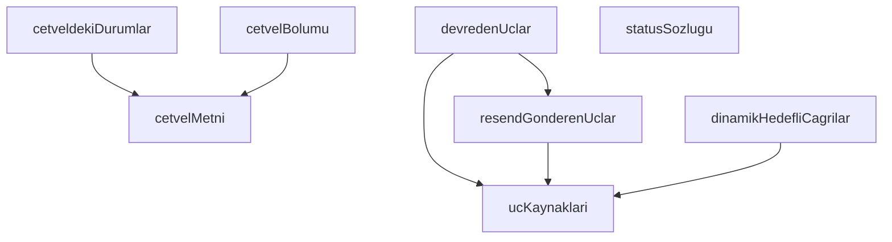

## Genel Bakış

Bu modül, bildirim standardına uygunluk (conformance) testlerini destekleyen yardımcı fonksiyonları içerir. Test dosyası, standart cetvel metnini çözümleyerek beklenen uç noktaları, durumları ve çağrı türlerini çıkaran veri sağlayıcı fonksiyonlar tanımlar. Tüm fonksiyonlar saf veri döndürücüdür; yan etki içermez.

## Fonksiyon Grupları

### Standart Cetvel Çözümleyicileri
Bildirim standardının cetvel (spesifikasyon) metnini parse ederek yapısal bilgi çıkaran fonksiyonlardır. `cetvelBolumu` muhtemelen `cetvelMetni` fonksiyonunun döndürdüğü tam metin üzerinde RegExp ile bölüm araması yapar; `cetveldekiDurumlar` ise cetvel metninden tanımlı durum listesini türetir.
- cetvelMetni, cetvelBolumu, cetveldekiDurumlar

### Uç Nokta ve Kaynak Tanımlayıcıları
Test senaryolarında kullanılacak endpoint bilgilerini ve bunların kaynak eşlemelerini hazırlayan fonksiyonlardır. `ucKaynaklari` bir Map yapısıyla uç-kaynak eşleşmesi sağlarken; diğer üç fonksiyon farklı kategorilerdeki uç listelerini (resend gönderen, devre dışı, dinamik hedefli) döndürür.
- ucKaynaklari, resendGonderenUclar, devredenUclar, dinamikHedefliCagrilar

### Durum Sözlüğü
Bildirim standardında tanımlı geçerli durum değerlerini liste olarak sunan yardımcı fonksiyondur. `statusSozlugu` ile `cetveldekiDurumlar` arasında anlam yakınlığı vardır; ancak kaynakta aralarındaki kesin ilişki belirtilmemiştir.
- statusSozlugu

---

## AXIOMS – Mimari Varsayımlar

Bu modül için özel aksiyom tanımlanmamıştır.

**Gerekçe:** Fonksiyon gövdeleri verilmemiştir; yalnızca imzalar ve sabit adları mevcuttur. Aksiyom üretimi kural gereği yalnızca fonksiyon gövdesinden yapılır — imzalar, docstring'ler veya değişken isimlerinden çıkarım yapılmaz. Gövde sağlanmadığı için bu modülün doğru çalışması için hangi koşulların var olması gerektiğini belirlemek mümkün değildir.

---

## FONKSİYON DETAYLARI

### cetvelMetni
**Ne yapar**: Cetvel dosyasının tamamını okuyup ham metin olarak döndürür. Projenin kural ve gereksinim tanımlarını içeren bu dosya, diğer fonksiyonlar tarafından bölümlere ayrılarak analiz edilir.

**Nasıl yapar**: `CETVEL` sabitinde tanımlı dosya yolunu `readFileSync` ile eşzamanlı olarak okur ve UTF-8 kodlamasıyla çözümleyerek string olarak döndürür.

**Parametreler**:
- (parametre yok)

**Dönüş**: `string` — Cetvel dosyasının tam metin içeriği.

### ucKaynaklari
**Ne yapar**: Geliştirildi ancak detay üretilemedi.

### resendGonderenUclar
**Ne yapar**: Geliştirildi ancak detay üretilemedi.

### devredenUclar
**Ne yapar**: Geliştirildi ancak detay üretilemedi.

### dinamikHedefliCagrilar
**Ne yapar**: Geliştirildi ancak detay üretilemedi.

### cetvelBolumu
**Ne yapar**: Geliştirildi ancak detay üretilemedi.

### statusSozlugu
**Ne yapar**: Geliştirildi ancak detay üretilemedi.

### cetveldekiDurumlar
**Ne yapar**: Geliştirildi ancak detay üretilemedi.

---

## İTHALATLAR (IMPORTS)
- import: node:fs::existsSync
- import: node:fs::readFileSync
- import: node:fs::readdirSync
- import: node:fs::statSync
- import: node:path::join
- import: vitest::describe
- import: vitest::expect
- import: vitest::it

---

## SABİTLER
- **KOK** (call) — `process.cwd()`
- **CETVEL** (call) — `join(KOK, 'docs/standards/notification-standard.md')`
- **UCLAR_KOK** (call) — `join(KOK, 'supabase/functions')`
- **SUPABASE_KOK** (call) — `join(KOK, 'supabase')`

---

## AST POINTERS

### [N1_NASIL] AST Pointer: notification-standard.test.ts::cetvelMetni
- **params**: yok
- **ic_degiskenler**: yok — doğrudan `readFileSync` çağrısının sonucunu döndürür
- **Dönüş**: `string` — `CETVEL` sabitindeki dosyanın UTF-8 içeriği

### [N2_NASIL] AST Pointer: notification-standard.test.ts::ucKaynaklari
- **params**: yok
- **ic_degiskenler**:
  - `harita` — `new Map<string, string>()`, uc adı ile `index.ts` içeriğini eşleyen harita; döngü boyunca `harita.set(ad, ...)` ile doldurulur
  - `ad` — `readdirSync(UCLAR_KOK)` ile dönen dizin adı; her yinelemede bir üst seviye klasör adı
  - `dizin` — `join(UCLAR_KOK, ad)` ile oluşturulan tam yol; `statSync(dizin).isDirectory()` ile dizin olup olmadığı denetlenir
  - `giris` — `join(dizin, 'index.ts')` ile oluşturulan dosya yolu; `existsSync(giris)` ile varlığı denetlenir
- **Dönüş**: `Map<string, string>` — anahtar: uc klasör adı, değer: `index.ts` dosyasının UTF-8 içeriği

### [N3_NASIL] AST Pointer: notification-standard.test.ts::resendGonderenUclar
- **params**: yok
- **ic_degiskenler**: yok — `ucKaynaklari().entries()` zincirleme işlemi; `.filter` içinde `kaynak` parametresi `api.resend.com` içeriyor mu diye denetler, `.map` içinde `ad` parametresi uc adını çıkarır
- **Dönüş**: `string[]` — `api.resend.com` içeren uc kaynaklarının adları, alfabetik sıralı

### [N4_NASIL] AST Pointer: notification-standard.test.ts::devredenUclar
- **params**: yok
- **ic_degiskenler**:
  - `kaynaklar` — `ucKaynaklari()` sonucu, tüm uc ad-kaynak eşlemesi
  - `gonderenler` — `resendGonderenUclar()` sonucu, doğrudan e-posta gönderen uc adları
  - `ulasan` — `new Set(gonderenler)`, bildirim zincirinde yer alan (devreye giren) uc adları kümesi; sabit nokta döngüsünde büyütülür
  - `degisti` — `boolean`, sabit nokta döngüsünün devam koşulu; `true` iken döngü tekrar eder
  - `ad` — dış `for` döngüsü değişkeni, `kaynaklar` haritasındaki uc adı
  - `kaynak` — dış `for` döngüsü değişkeni, ilgili uc'nin kaynak kodu metni
  - `hedef` — iç `for` döngüsü değişkeni, `ulasan` kümesindeki bir hedef uc adı; `kaynak.includes(`functions/v1/${hedef}`)` ile eşleşme aranır
- **Dönüş**: `string[]` — doğrudan gönderici olmayıp zincirleme tetikleyen uc adları, alfabetik sıralı

### [N5_NASIL] AST Pointer: notification-standard.test.ts::dinamikHedefliCagrilar
- **params**: yok
- **ic_degiskenler**:
  - `bulunan` — `string[]`, dinamik hedef deseni taşıyan uc adlarının toplandığı dizi
  - `ad` — `for` döngüsü değişkeni, `ucKaynaklari()` haritasındaki uc adı
  - `kaynak` — `for` döngüsü değişkeni, ilgili uc'nin kaynak kodu metni; `/functions\/v1\/(?:\$\{|['"`]\s*\+)/` RegExp'i ile denetlenir
- **Dönüş**: `string[]` — `functions/v1/` hedefi dinamik üretilen uc adları, alfabetik sıralı

### [N6_NASIL] AST Pointer: notification-standard.test.ts::cetvelBolumu
- **params**:
  - `baslikDeseni` — `RegExp`, cetveldeki bölüm başlığını eşleyen desen (ör. `/^###\s+B2\.1\s/m`)
- **ic_degiskenler**:
  - `metin` — `cetvelMetni()` sonucu, cetvel dosyasının tam UTF-8 içeriği
  - `parcalar` — `metin.split(baslikDeseni)` sonucu; `parcalar.length < 2` ise eşleşme yoktur, boş döner; aksi halde `parcalar[1]` bölümün başlangıcıdır
- **Dönüş**: `string` — eşleşen başlıktan bir sonraki `#`-başlığına kadar olan metin; eşleşme yoksa boş string

### [N7_NASIL] AST Pointer: notification-standard.test.ts::statusSozlugu
- **params**: yok
- **ic_degiskenler**:
  - `dosyalar` — `string[]`, `SUPABASE_KOK` altındaki tüm `.sql` dosya yollarını toplayan dizi
  - `gez` — `(dizin: string) => void`, `SUPABASE_KOK` dizinini özyinelemeli (recursive) olarak tarayan fonksiyon; `node_modules` ve `.` ile başlayan dizinleri atlar
  - `dizin` — `gez` fonksiyonunun parametresi, taranacak dizin yolu
  - `ad` — `readdirSync(dizin)` ile dönen dosya/dizin adı
  - `yol` — `join(dizin, ad)` ile oluşturulan tam yol; `statSync(yol)` ile türü denetlenir
  - `st` — `statSync(yol)` sonucu; `st.isDirectory()` ile dizin olup olmadığı belirlenir
  - `desen` — `/venthub_orders_status_check\s+CHECK\s*\(([\s\S]*?)\)/` RegExp'i, SQL CHECK kısıtlamasını yakalar; `s` bayrağı yerine `[\s\S]` kullanılır (TS1501 uyumluluğu)
  - `yol` — `for` döngüsü değişkeni, `dosyalar` dizisindeki her `.sql` dosya yolu
  - `m` — `desen.exec(readFileSync(yol, 'utf8'))` sonucu, `RegExpExecArray | null`; `null` ise bu dosyada eşleşme yoktur
  - `degerler` — `m[1].matchAll(/'([a-z_]+)'::text/g)` sonucundan çıkarılan durum değerleri dizisi; `new Set` ile tekrarlar ayıklanır
  - `x` — `matchAll` döngüsü değişkeni; `x[1]` yakalanan grup (durum adı)
- **Dönüş**: `string[]` — CHECK kısıtlamasından çıkarılan benzersiz durum değerleri, alfabetik sıralı; bulunamazsa boş dizi

### [N8_NASIL] AST Pointer: notification-standard.test.ts::cetveldekiDurumlar
- **params**: yok
- **ic_degiskenler**:
  - `metin` — `cetvelMetni()` sonucu, cetvel dosyasının tam UTF-8 içeriği
  - `bolum` — `metin.split(/^###\s+B2\.3\s/m)[1]` sonucu, B2.3 bölümünden sonraki metin; tanımsız ise fonksiyon boş dizi döner
  - `tablo` — `bolum.split(/^##\s/m)[0]` sonucu, B2.3 bölümünden bir sonraki `##` başlığına kadar olan metin
  - `adlar` — `tablo.matchAll(/^\|\s*`([a-z_]+)`\s*\|/gm)` sonucundan çıkarılan durum adları dizisi; `new Set` ile tekrarlar ayıklanır
  - `m` — `matchAll` döngüsü değişkeni; `m[1]` yakalanan grup (durum adı)
- **Dönüş**: `string[]` — cetvelin B2.3 tablosundaki benzersiz durum adları, alfabetik sıralı; bölüm bulunamazsa boş dizi

---

## MERMAID CALL GRAPH

## NODE ID STANDARD

  file: src\__tests__\conformance\notification-standard.test.ts
  function: src\__tests__\conformance\notification-standard.test.ts::cetvelMetni
  function: src\__tests__\conformance\notification-standard.test.ts::ucKaynaklari
  function: src\__tests__\conformance\notification-standard.test.ts::resendGonderenUclar
  function: src\__tests__\conformance\notification-standard.test.ts::devredenUclar
  function: src\__tests__\conformance\notification-standard.test.ts::dinamikHedefliCagrilar
  function: src\__tests__\conformance\notification-standard.test.ts::cetvelBolumu
  function: src\__tests__\conformance\notification-standard.test.ts::statusSozlugu
  function: src\__tests__\conformance\notification-standard.test.ts::cetveldekiDurumlar

---

## DISA AKTARILANLAR (EXPORTS)
  export: cetvelBolumu
  export: cetvelMetni
  export: cetveldekiDurumlar
  export: devredenUclar
  export: dinamikHedefliCagrilar
  export: resendGonderenUclar
  export: statusSozlugu
  export: ucKaynaklari