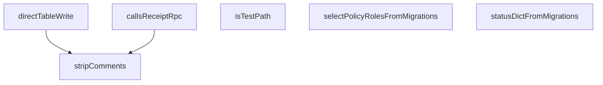

## Genel Bakış
Bu modül, `purchasing-machine-and-evidence` modülünün mimari kurallara uygunluğunu doğrulayan bir uyumluluk testi dosyasıdır. Modül, kod analizi yaparak yasaklanmış kalıpları (doğrudan tablo yazma, RPC çağrıları) tespit eder ve migrasyon dosyalarından politika bilgilerini çıkararak kuralların ihlal edilip edilmediğini kontrol eder.

## Fonksiyon Grupları

### Kod Analiz Yardımcıları
Kaynak kodu analiz etmek için kullanılan temel yardımcı fonksiyonlar. Yorumları temizleyerek ve belirli kalıpları arayarak kodun yapısını incelerler.
- `isTestPath`, `stripComments`

### Mimari Kural Kontrolcüleri
Kaynak kodun tanımlanmış mimari kurallara uyup uymadığını test eden fonksiyonlar. Doğrudan tablo yazma ve RPC çağrıları gibi yasaklanmış yöntemlerin kullanımını denetlerler.
- `callsReceiptRpc`, `directTableWrite`

### Migrasyon Analiz Fonksiyonları
Veritabanı migrasyon dosyalarını analiz ederek politika bilgilerini çıkaran fonksiyonlar. Modülün dinamik yapılandırma ve durum yönetimini doğrulamak için kullanılır.
- `statusDictFromMigrations`, `selectPolicyRolesFromMigrations`

---

## AXIOMS – Mimari Varsayımlar

Bu modül, satın alma (purchasing) alanında kaynak kod analizi yapan ve migration dosyalarından yapılandırma okuyan bir denetim/test altyapısına aittir. Aşağıdaki varsayımlar fonksiyon imzalarından çıkarılmıştır.

**[Aksiyom 1 – Kaynak Analiz Girdisi]:** Eğer `stripComments`, `callsReceiptRpc` veya `directTableWrite` fonksiyonlarına geçilen `src` parametresi geçerli bir kaynak kod string'i değilse (boş string, null veya malformed veri), fonksiyonların dönüş değerleri tanımsız olur; bu fonksiyonların ham/saf kaynak kod kabul ettiği varsayılır.

**[Aksiyom 2 – Test Yolu Tespiti]:** Eğer `isTestPath` fonksiyonuna verilen `path` parametresinde test dosyasını tanımlayan bir patern (örn: `__tests__`, `.test.`, `.spec.` vb.) bulunmuyorsa, fonksiyon `false` döner. Bu fonksiyonun test/prod ayrımını dosya yolundaki kalıplara dayandırdığı varsayılır.

**[Aksiyom 3 – Tab Adı Zorunluluğu]:** Eğer `directTableWrite` fonksiyonuna geçilen `table` parametresi boş string ise veya bilinmeyen bir tablo adı ise, fonksiyon tablo yazma tespiti yapamaz ve `false` döner. Bu fonksiyonun çalışması için tablo adının bilinmesi zorunludur.

**[Aksiyom 4 – Migration Dosyası Erişimi]:** Eğer `statusDictFromMigrations` veya `selectPolicyRolesFromMigrations` fonksiyonları çağrıldığında `migrationSql` sabiti (bir "call" fonksiyonu) çağrılamıyor veya döndürdüğü migration dosya listesi boş/null ise, her iki fonksiyon da `null` döner. Bu fonksiyonların migration SQL dosyalarına erişime bağımlı olduğu varsayılır.

**[Aksiyom 5 – Migration İçerik Biçimi]:** Eğer `statusDictFromMigrations` tarafından okunan migration SQL dosyaları durum bilgisini içeren bilinmeyen/desteklenmeyen bir formatta ise, dönen `statuses` dizisi boş olabilir veya `null` dönülebilir. Migration dosyalarının belirli bir parse edilebilir formata sahip olduğu varsayılır (bilinmiyor: hangi specific format olduğu fonksiyon gövdesinden çıkarılamaz).

**[Aksiyom 6 – Policy Rollerinin Migration Kaynağı]:** Eğer `selectPolicyRolesFromMigrations` tarafından okunan migration dosyaları rol bilgisi içermiyorsa, dönen `roles` dizisi boş olabilir. Rollerin tamamen migration dosyalarından türetildiği ve başka bir kaynaktan gelmediği varsayılır.

**[Aksiyom 7 – Kaynak Havuzlarının Çağrılabilirliği]:** Eğer `appSources`, `edgeSources`, `productionSources` veya `purchasingSources` sabitlerinden herhangi biri çağrılamıyorsa (invocable değilse), ilgili kaynak havuzu analiz edilemez. Bu sabitlerin "call" türünde olduğu, yani fonksiyon olarak çağrılması gerektiği varsayılır.

**[Aksiyom 8 – Receipt RPC Tespiti]:** Eğer `callsReceiptRpc` fonksiyonuna verilen `src` içinde receipt RPC çağrısını tanımlayan belirli bir fonksiyon/adres kalıbı (örn: `receipt` içeren bir RPC endpoint çağrısı) bulunmuyorsa, fonksiyon `false` döner. Tespit mekanizması tamamen kaynak kod string'i üzerindedir; çalışma zamanı analizi yapılmaz.

---

## FONKSİYON DETAYLARI

### isTestPath
**Ne yapar**: Verilen dosya yolunun bir test dosyası yolu olup olmadığını belirler.
**Nasıl yapar**: `__tests__`, `.test.`, `.spec.` veya `/tests?/` desenlerini içeren yolları tanımak için bir düzenli ifade (regex) kullanır. Fonksiyon, regex'in `test` metodunu çağırarak eşleşme olup olmadığını döndürür.
**Parametreler**:
- path: string — Kontrol edilecek dosya yolu.
**Dönüş**: boolean — Yol test desenlerinden birini içeriyorsa `true`, aksi halde `false` döner.

### stripComments
**Ne yapar**: Kaynak kodundan blok ve satır yorumlarını kaldırarak temiz bir metin döndürür.
**Nasıl yapar**: CRLF (Satır Başı/Bitişi) karakterlerine karşı güvenli iki aşamalı bir `replace` işlemi uygular. İlk olarak `/.../` biçimindeki blok yorumlarını, ardından `//` ile başlayan satır yorumlarını regex kullanarak siler. Bu işlem, sonraki analiz fonksiyonlarının yorum içeriği tarafından yanıltılmasını engeller.
**Parametreler**:
- src: string — Yorumları çıkarılacak kaynak kodu.
**Dönüş**: string — Yorumları kaldırılmış temiz kaynak kodu.

### callsReceiptRpc
**Ne yapar**: Kaynak kodunun malzeme teslim (goods receipt) RPC'sini çağırıp çağırmadığını kontrol eder.
**Nasıl yapar**: Önce `stripComments` ile yorumları temizler. Ardından iki olası çağrı kalıbını arar: 1) JavaScript/TypeScript tarafındaki `.rpc('process_goods_receipt')` çağrısı, 2) Ham PostgREST URL'i olan `/rest/v1/rpc/process_goods_receipt`. Her iki regex deseni de `RECEIPT_RPC` sabitinden (muhtemelen 'process_goods_receipt') referans alarak dinamik oluşturulur ve temizlenmiş kodda test edilir.
**Parametreler**:
- src: string — Analiz edilecek kaynak kodu.
**Dönüş**: boolean — Kodda belirtilen RPC çağrısı tespit edilirse `true`, aksi halde `false` döner.

### directTableWrite
**Ne yapar**: Kaynak kodunun belirli bir tabloya istemci tarafı (supabase-js veya PostgREST) kullanarak doğrudan yazma yapıp yapmadığını tespit eder.
**Nasıl yapar**: Yorumları temizledikten sonra iki write kalıbını arar:
1. `.from('<tablo>')` çağrısının ardından kısa bir pencerede `.insert(` veya `.upsert(`调用larını kontrol eder.
2. Ham PostgREST POST isteklerini (`/rest/v1/<tablo>` URL'i ile `method: 'POST'` içeren istekleri) tarar.
Her iki tarama da `String.raw` ile oluşturulmuş regex'leri `matchAll` ile kullanarak tüm olası eşleşmeleri kontrol eder.
**Parametreler**:
- src: string — Analiz edilecek kaynak kodu.
- table: string — Yazma işlemi aranacak tablonun adı.
**Dönüş**: boolean — Kodda belirtilen tabloya doğrudan yazma işlemi tespit edilirse `true`, aksi halde `false` döner.

### statusDictFromMigrations
**Ne yapar**: `purchase_orders` tablosunun `status` alanının izin verilen değerler sözlüğünü, en son tanımlayan migration dosyasından çıkarır.
**Nasıl yapar**: `migrationSql` nesnesindeki (dışarıdan gelen, SQL cümlelerini tutan bir sözlük) tüm değerleri tarar. `purchase_orders` tablosunu oluşturan veya `status` alanını `in (...)` ile tanımlayan SQL bloklarını filtreler. Dosya adına göre alfabetik sıralama yapar ve tersten (son tanım öncelikli olarak) iterasyona başlar. İlk geçerli `status in ('a', 'b', ...)` desenini bulduğunda, içindeki string değerleri bir diziye dönüştürerek {file, statuses} nesnesini döndürür.
**Parametreler**: Yok.
**Dönüş**: { file: string; statuses: string[] } | null — Bulunan son tanım dosyası ve durum değerleri dizisi veya hiçbir tanımsa `null`.

### selectPolicyRolesFromMigrations
**Ne yapar**: `purchase_orders` tablosu için tanımlanmış `admin_select` politikasının hedef rol dizisini en son tanımlayan migration dosyasından çıkarır.
**Nasıl yapar**: `migrationSql` içindeki `CREATE POLICY purchase_orders_admin_select` içeren SQL bloklarını filtreler. Dosya adlarına göre sıralayıp son tanımdan başlayarak arama yapar. Politika gövdesini (`;` karakterine kadar) çıkarıp `array[...]` desenini bulur. Dizge içindeki string değerleri regex ile ayrıştırarak {file, roles} nesnesini döndürür. Bu fonksiyon, politikanın `DROP POLICY IF EXISTS` + `CREATE` ile yeniden tanımlandığı senaryoları handle eder.
**Parametreler**: Yok.
**Dönüş**: { file: string; roles: string[] } | null — Bulunan son politika tanımının dosyası ve rol dizisi veya hiçbir tanımsa `null`.

---

## İTHALATLAR (IMPORTS)
- import: @/lib/purchasing/poStatusMachine::PO_STATUSES
- import: @/lib/rbac::canWrite
- import: @/lib/rbac::type UserRole
- import: vitest::describe
- import: vitest::expect
- import: vitest::it

---

## SABİTLER
- **appSources** (call) — `import.meta.glob(['/src/**/*.{ts,tsx}', '!**/*.compiled.*.ts'], {
  query: '...`
- **edgeSources** (call) — `import.meta.glob(['/supabase/functions/**/*.ts', '!**/*.compiled.*.ts'], {
 ...`
- **migrationSql** (call) — `import.meta.glob(['/supabase/migrations/*.sql'], {
  query: '?raw',
  impor...`
- **productionSources** (call) — `Object.fromEntries(
  [...Object.entries(appSources), ...Object.entries(edge...`
- **purchasingSources** (call) — `Object.fromEntries(
  Object.entries(productionSources).filter(([p]) =>
   ...`

---

## AST POINTERS

### [N1_NASIL] AST Pointer: __tests__/conformance/purchasing-machine-and-evidence.test.ts::isTestPath
- **params**: `(path: string)`
- **ic_degiskenler**:
  - `path` — test edilecek dosya yolu, regex pattern ile eşleştirilir
- **Dönüş**: boolean (regex test sonucu)

### [N2_NASIL] AST Pointer: __tests__/conformance/purchasing-machine-and-evidence.test.ts::stripComments
- **params**: `(src: string)`
- **ic_degiskenler**:
  - `src` — yorumlar çıkarılacak kaynak kod stringi
- **Dönüş**: string (yorumları çıkarılmış kod)

### [N3_NASIL] AST Pointer: __tests__/conformance/purchasing-machine-and-evidence.test.ts::callsReceiptRpc
- **params**: `(src: string)`
- **ic_degiskenler**:
  - `src` — kontrol edilecek kaynak kod
  - `kodsuz` — yorumları çıkarılmış kaynak kod (stripComments ile)
  - `jsRpc` — .rpc('process_goods_receipt') çağrısını regex ile arar
  - `restRpc` — /rest/v1/rpc/process_goods_receipt URL'ini regex ile arar
- **Dönüş**: boolean (RPC çağrısı varsa true)

### [N4_NASIL] AST Pointer: __tests__/conformance/purchasing-machine-and-evidence.test.ts::directTableWrite
- **params**: `(src: string, table: string)`
- **ic_degiskenler**:
  - `src` — kontrol edilecek kaynak kod
  - `table` — yazma kontrolü yapılacak tablo adı
  - `kodsuz` — yorumları çıkarılmış kaynak kod
  - `fromCall` — .from('table') çağrısını regex ile arar
  - `m` — fromCall regex eşleşmeleri (matchAll iterator)
  - `window` — eşleşme civarındaki 300 karakterlik kod parçası
  - `rawUrl` — PostgREST URL formatını regex ile arar
  - `m` — rawUrl regex eşleşmeleri (matchAll iterator)
  - `window` — eşleşme civarındaki 700 karakterlik kod parçası
- **Dönüş**: boolean (doğrudan tablo yazma varsa true)

### [N5_NASIL] AST Pointer: __tests__/conformance/purchasing-machine-and-evidence.test.ts::statusDictFromMigrations
- **params**: (yok)
- **ic_degiskenler**:
  - `migrationSql` — global sabit, migration SQL sözlüğü
  - `defs` — purchase_orders tablosunu içeren migration'lar (dosya adı ve SQL)
  - `file` — current migration dosya adı
  - `sql` — current migration SQL içeriği
  - `tableIdx` — purchase_orders tablo tanımının SQL içindeki indeksi
  - `scope` — tablo tanımından itibaren SQL parçası
  - `m` — status in (...) CHECK constraint eşleşmesi
  - `statuses` — CHECK constraint içindeki statü değerleri dizisi
- **Dönüş**: `{ file: string; statuses: string[] } | null` (en son migration'daki statü listesi)

### [N6_NASIL] AST Pointer: __tests__/conformance/purchasing-machine-and-evidence.test.ts::selectPolicyRolesFromMigrations
- **params**: (yok)
- **ic_degiskenler**:
  - `migrationSql` — global sabit, migration SQL sözlüğü
  - `defs` — purchase_orders_admin_select politikasını içeren migration'lar
  - `file` — current migration dosya adı
  - `sql` — current migration SQL içeriği
  - `idx` — politika tanımının SQL içindeki indeksi
  - `body` — politika gövdesi (;'e kadar olan kısım)
  - `m` — array [...] ifadesindeki rol listesi eşleşmesi
  - `roles` — politikadaki rol değerleri dizisi
- **Dönüş**: `{ file: string; roles: string[] } | null` (en son migration'daki rol listesi)

---

## MERMAID CALL GRAPH

## NODE ID STANDARD

  file: src\__tests__\conformance\purchasing-machine-and-evidence.test.ts
  function: src\__tests__\conformance\purchasing-machine-and-evidence.test.ts::isTestPath
  function: src\__tests__\conformance\purchasing-machine-and-evidence.test.ts::stripComments
  function: src\__tests__\conformance\purchasing-machine-and-evidence.test.ts::callsReceiptRpc
  function: src\__tests__\conformance\purchasing-machine-and-evidence.test.ts::directTableWrite
  function: src\__tests__\conformance\purchasing-machine-and-evidence.test.ts::statusDictFromMigrations
  function: src\__tests__\conformance\purchasing-machine-and-evidence.test.ts::selectPolicyRolesFromMigrations

---

## DISA AKTARILANLAR (EXPORTS)
  export: callsReceiptRpc
  export: directTableWrite
  export: isTestPath
  export: selectPolicyRolesFromMigrations
  export: statusDictFromMigrations
  export: stripComments