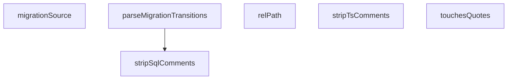

## Genel Bakış

Bu modül, quote-machine-ssot uyumluluk (conformance) testlerini içerir. Migration SQL dosyalarını analiz ederek quotes tablolarına dokunup dokunmadığını tespit eder ve SQL geçişlerini (transitions) ayrıştırır. Yardımcı fonksiyonlar aracılığıyla yorum temizleme, dosya yolu hesaplama ve SQL ayrıştırma gibi ön işlemleri gerçekleştirir.

## Fonksiyon Grupları

### SQL ve Kaynak Kod Yorum Temizleme
Kaynak kodlardaki yorum satırlarını temizleyerek analiz için saf içeriği elde eder. Bu fonksiyonlar, SQL ve TypeScript dosyalarındaki yorum bloklarını kaldırır.
- stripSqlComments, stripTsComments

### SQL Analizi ve Geçiş Ayrıştırma
SQL ifadelerini analiz ederek quotes tablolarına erişim olup olmadığını belirler ve migration SQL'lerinden geçiş (transition) bilgilerini çıkarır.
- touchesQuotes, parseMigrationTransitions

### Dosya Yolu ve Migration Kaynak Yönetimi
Test edilecek dosyaların göreceli yollarını hesaplar ve migration kaynak dosyasının yolunu ve SQL içeriğini sağlar.
- relPath, migrationSource

---

## AXIOMS – Mimari Varsayımlar
- Bu modül davranışsal mantık içermez (salt veri / konfigürasyon / tip tanımı).
- [Aksiyom 1]: Modülün dışa açtığı yapı (anahtar kümesi / şema) bir sözleşmedir; tüketiciler bu sabit yapıya bağlıdır — kırıcı değişiklik tüm tüketicileri etkiler.
- [Aksiyom 2]: Bir öğe ekleme/çıkarma yapısal-uyumlu olmalı; ilgili tipler ve seçiciler aynı commit'te güncel tutulmalıdır.

---

## FONKSİYON DETAYLARI

### touchesQuotes
**Ne yapar**: Verilen SQL içeriğinin `quote` adlı bir tabloya ya da geçiş tetiğine dokunup dokunmadığını kontrol eder. Boolean değer döndürür.

**Nasıl yapar**: İki koşulu OR operatörüyle birleştirerek kontrol eder. Birincisi, `public.` şemasıyla başlayan ve içinde `quote` kelimesini barındıran tablo adlarını büyük-küçük harf duyarsız regex ile arar. İkincisi, SQL metninin `'enforce_quote_status_transition'` ifadesini içerip içermediğini string `includes` ile denetler. Herhangi biri doğruysa `true` döner.

**Parametreler**:
- sql: string — Kontrol edilecek SQL metni

**Dönüş**: boolean — SQL metni quote tablosuna veya geçiş tetiğine dokunuyorsa `true`, aksi halde `false`

### stripSqlComments
**Ne yapar**: Geliştirildi ancak detay üretilemedi.

### stripTsComments
**Ne yapar**: Geliştirildi ancak detay üretilemedi.

### relPath
**Ne yapar**: Geliştirildi ancak detay üretilemedi.

### migrationSource
**Ne yapar**: Geliştirildi ancak detay üretilemedi.

### parseMigrationTransitions
**Ne yapar**: Geliştirildi ancak detay üretilemedi.

---

## İTHALATLAR (IMPORTS)
- import: vitest::describe
- import: vitest::expect
- import: vitest::it

---

## SABİTLER
- **SRC** (call) — `import.meta.glob('/src/**/*.{ts,tsx}', {
  query: '?raw',
  import: 'defaul...`
- **ALL_MIGRATIONS** (call) — `import.meta.glob(
  '/supabase/migrations/*.sql',
  { query: '?raw', import...`
- **QUOTE_MIGRATIONS** (call) — `Object.fromEntries(
  Object.entries(ALL_MIGRATIONS).filter(([, sql]) => tou...`

---

## AST POINTERS

### [N1_NASIL] AST Pointer: quote-machine-ssot.test.ts::touchesQuotes
- **params**: `sql` — string, test edilecek SQL içeriği
- **ic_degiskenler**: yok
- **Dönüş**: boolean — SQL içinde `public.*quote*` tablo adı veya `enforce_quote_status_transition` tetikleyici adı geçiyorsa `true`

### [N2_NASIL] AST Pointer: quote-machine-ssot.test.ts::stripSqlComments
- **params**: `sql` — string, yorumları temizlenecek SQL metni
- **ic_degiskenler**: yok
- **Dönüş**: string — `--` ile başlayan satır içi yorumları kaldırılmış SQL

### [N3_NASIL] AST Pointer: quote-machine-ssot.test.ts::stripTsComments
- **params**: `source` — string, yorumları temizlenecek TypeScript/JavaScript kaynak kodu
- **ic_degiskenler**: yok
- **Dönüş**: string — `/* ... */` blok yorumları ve `//` satır içi yorumları kaldırılmış kaynak kodu

### [N4_NASIL] AST Pointer: quote-machine-ssot.test.ts::relPath
- **params**: `globKey` — string, tam dosya yolu (glob anahtarı)
- **ic_degiskenler**:
  - `idx` — `globKey` içinde `/src/` alt dizgesinin başlangıç indeksi; bulunamazsa `-1`
- **Dönüş**: string — `/src/` sonrasındaki göreli yol, ters eğik çizgiler `/` ile değiştirilmiş

### [N5_NASIL] AST Pointer: quote-machine-ssot.test.ts::migrationSource
- **params**: yok
- **ic_degiskenler**:
  - `entries` — `QUOTE_MIGRATIONS` nesnesinin `Object.entries()` ile elde edilen `[path, sql]` çiftleri dizisi
  - `withTrigger` — `entries` içinden SQL'inde `enforce_quote_status_transition` tetikleyici tanımı barındıran çiftlerin filtrelenmiş alt kümesi
  - `path` — `withTrigger` dizisinin son elemanının dosya yolu (indeks 0)
  - `sql` — `withTrigger` dizisinin son elemanının SQL içeriği (indeks 1)
- **Dönüş**: `{ path: string; sql: string }` — tetikleyiciyi tanımlayan son migration'ın yolu ve SQL'i

### [N6_NASIL] AST Pointer: quote-machine-ssot.test.ts::parseMigrationTransitions
- **params**: `sql` — string, geçiş tetikleyici tanımını içeren SQL
- **ic_degiskenler**:
  - `clean` — `stripSqlComments(sql)` sonucu, yorumlardan arındırılmış SQL
  - `out` — `Record<string, string[]>`, kaynak durum adından hedef durum adları dizisine eşleme haritası
  - `re` — `old.status = '...' and new.status in (...)` kalıbını yakalayan RegExp nesnesi (global flag'li)
  - `m` — `RegExpExecArray | null`, her döngü adımındaki regex eşleşme sonucu
  - `from` — `m[1]`, regex yakalama grubundan elde edilen kaynak durum adı (ör. `draft`)
  - `targets` — `m[2]` içindeki `'...'` kalıplarından çıkarılan hedef durum adları dizisi
- **Dönüş**: `Record<string, string[]>` — her kaynak durum için izin verilen hedef durumların benzersiz listesi

---

## MERMAID CALL GRAPH

## NODE ID STANDARD

  file: src\__tests__\conformance\quote-machine-ssot.test.ts
  function: src\__tests__\conformance\quote-machine-ssot.test.ts::touchesQuotes
  function: src\__tests__\conformance\quote-machine-ssot.test.ts::stripSqlComments
  function: src\__tests__\conformance\quote-machine-ssot.test.ts::stripTsComments
  function: src\__tests__\conformance\quote-machine-ssot.test.ts::relPath
  function: src\__tests__\conformance\quote-machine-ssot.test.ts::migrationSource
  function: src\__tests__\conformance\quote-machine-ssot.test.ts::parseMigrationTransitions

---

## DISA AKTARILANLAR (EXPORTS)
  export: migrationSource
  export: parseMigrationTransitions
  export: relPath
  export: stripSqlComments
  export: stripTsComments
  export: touchesQuotes