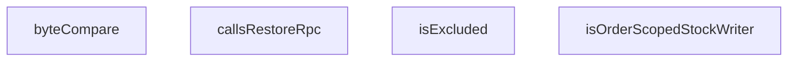

## Genel Bakış
Bu modül, stok geri yükleme davranışlarının doğrulanmasına yönelik test süreçlerinde kullanılan temel yardımcı fonksiyonları içerir. Modül, kaynak kod dosyalarının belirli kalıpları (örn., belirli bir RPC çağrısı veya stok yazma aralığı) taşıyıp taşımadığını analiz etmek ve dosya içeriklerini karşılaştırmak için araçlar sunar. Genel olarak, test senaryolarının koşullarını belirlemek ve veri doğrulamak için低级 bir yardımcı katmandır.

## Fonksiyon Grupları
### Byte Karsilastirma Yardimcilari
Dosya içerikleri veya metin blokları arasındaki byte düzeyindeki farkları tespit etmek için kullanılır.
- byteCompare

### Kaynak Kod Analiz Yardimcilari
Test edilecek kaynak kod dosyalarının belirli mimari kalıplara (RPC çağrısı, stok yazıcı türü) ve dosya yolu kurallarına uyup uymadığını doğrulamak için kullanılır.
- isExcluded, isOrderScopedStockWriter, callsRestoreRpc

---

## AXIOMS – Mimari Varsayımlar
- Bu modül davranışsal mantık içermez (salt veri / konfigürasyon / tip tanımı).
- [Aksiyom 1]: Modülün dışa açtığı yapı (anahtar kümesi / şema) bir sözleşmedir; tüketiciler bu sabit yapıya bağlıdır — kırıcı değişiklik tüm tüketicileri etkiler.
- [Aksiyom 2]: Bir öğe ekleme/çıkarma yapısal-uyumlu olmalı; ilgili tipler ve seçiciler aynı commit'te güncel tutulmalıdır.

---

## FONKSİYON DETAYLARI

### byteCompare
**Ne yapar**: İki string değerini leksikografik olarak karşılaştırır ve sıralama ilişkisini sayısal olarak döndürür. Bu fonksiyon, dosya isimlerini veya metin değerlerini sıralama işlemlerinde karşılaştırma kriteri olarak kullanılır.

**Nasıl yapar**: Basit bir üçlü karşılaştırma mantığı uygular. JavaScript'in doğal string karşılaştırma operatörlerini (`<` ve `>`) kullanarak birinci stringin ikinciden küçük olup olmadığını, büyük olup olmadığını veya eşit olup olmadığını belirler. Bu tür bir karşılaştırma, Unicode kod noktalarına göre çalışır ve büyük-küçük harf duyarlılığı vardır.

**Parametreler**:
- `a`: string — Karşılaştırmada ilk olarak ele alınacak string değer
- `b`: string — Karşılaştırmada ikinci olarak ele alınacak string değer

**Dönüş**: number — `a` parametresi `b`'den leksikografik olarak daha küçükse `-1`, daha büyükse `1`, eşitlerse `0` döndürür.

### isExcluded
**Ne yapar**: Geliştirildi ancak detay üretilemedi.

### isOrderScopedStockWriter
**Ne yapar**: Geliştirildi ancak detay üretilemedi.

### callsRestoreRpc
**Ne yapar**: Geliştirildi ancak detay üretilemedi.

---

## İTHALATLAR (IMPORTS)
- import: vitest::describe
- import: vitest::expect
- import: vitest::it

---

## SABİTLER
- **RESTORE_FN_DECL** (template) — ``create or replace function public.${RESTORE_RPC}``
- **PENDING_MIGRATION** (object) — `{
  // T053-VH (2026-08-16): iki EDGE-REFUND satırı SİLİNDİ — borç kapandı, ...`
- **appSources** (as_expression) — `import.meta.glob('/src/**/*.{ts,tsx}', {
  query: '?raw',
  import: 'defaul...`
- **edgeSources** (as_expression) — `import.meta.glob(['/supabase/functions/**/*.ts', '!**/*.compiled.*.ts'], {
 ...`
- **migrationSql** (as_expression) — `import.meta.glob('/supabase/migrations/*.sql', {
  query: '?raw',
  import:...`
- **productionSources** (call) — `Object.fromEntries(
  [...Object.entries(appSources), ...Object.entries(edge...`
- **stockWriters** (call) — `Object.entries(productionSources)
  .filter(([, src]) => isOrderScopedStockW...`

---

## AST POINTERS

### [N1_NASIL] AST Pointer: `src/__tests__/conformance/stock-restore-evidence.test.ts`::byteCompare
- **params**: `a: string`, `b: string`
- **ic_degiskenler**: (yok)
- **Dönüş**: `number` — a < b ise -1, a > b ise 1, değilse 0 döner; iki byte dizgesini sıralama karşılaştırması yapar

---

### [N2_NASIL] AST Pointer: `src/__tests__/conformance/stock-restore-evidence.test.ts`::isExcluded
- **params**: `path: string`
- **ic_degiskenler**: (yok — tek satırda regex `.test(path)` ve `.endsWith()` ile boolean döner)
- **Dönüş**: `boolean` — yol `__tests__`, `.test.`, `.spec.`, `/tests/` içeriyorsa veya `database.types.ts` ile bitiyorsa true

---

### [N3_NASIL] AST Pointer: `src/__tests__/conformance/stock-restore-evidence.test.ts`::isOrderScopedStockWriter
- **params**: `src: string`
- **ic_degiskenler**:
  - `mentionsOrder` — `/\border_id\b|venthub_order_items/.test(src)` sonucu; src'de sipariş alanına referans olup olmadığını tutar
  - `movementInsert` — `/\.from\(\s*['"`]inventory_movements['"`]\s*\)/g` RegExp nesnesi; inventory_movements tablosuna yapılan insert/upsert kalıplarını aramak için kullanılır
  - `m` — `src.matchAll(movementInsert)` iterator'ünden gelen her bir eşleşme nesnesi (loop içinde)
  - `window` — `src.slice(m.index ?? 0, (m.index ?? 0) + 300)` ile elde edilen, eşleşme civarındaki 300 karakterlik alt dizi; insert/upsert kontrolü bu pencere üzerinde yapılır
- **Dönüş**: `boolean` — src sipariş-stok yazımı içeriyorsa true, aksi halde false

---

### [N4_NASIL] AST Pointer: `src/__tests__/conformance/stock-restore-evidence.test.ts`::callsRestoreRpc
- **params**: `src: string`
- **ic_degiskenler**:
  - `kodsuz` — `src.replace(/\/\*[\s\S]*?\*\//g, '').replace(/^\s*\/\/.*$/gm, '')` ile yorumlardan arındırılmış kaynak kodu
  - `jsRpc` — `new RegExp(String.raw\`\\.rpc\\(\\s*['"\`]` + RESTORE_RPC + String.raw\`['"\`]\`)` ile oluşturulmuş regex; JS tarafında `.rpc('restore_stock', ...)` çağrısını arar
  - `restRpc` — `new RegExp(String.raw\`/rest/v1/rpc/\` + RESTORE_RPC + String.raw\`\\b\`)` ile oluşturulmuş regex; REST tarafında `/rest/v1/rpc/restore_stock` endpoint'ini arar
- **Dönüş**: `boolean` — src RESTORE_RPC'yi JS `.rpc()` çağrısıyla veya REST endpoint'iyle çağırıyorsa true

---

### [N5_NASIL] AST Pointer: `src/__tests__/conformance/stock-restore-evidence.test.ts`::sonRpcTanimi
- **params**: (yok)
- **ic_degiskenler**:
  - `adaylar` — `Object.entries(migrationSql)` dizisinin, SQL içeriği `RESTORE_FN_DECL` barındıranlarını filtreleyip `byteCompare` ile yollarını alfabetik sıraya dizmiş hali; RPC tanımlayan migration adaylarını tutar
  - `son` — `adaylar[adaylar.length - 1]` ifadesi; en son (en büyük tarih damgalı) migration girişini tutar; `[0]` yolu, `[1]` SQL içeriğini barındırır
- **Dönüş**: `{ path: string; sql: string }` — RESTORE_RPC fonksiyonunu tanımlayan en son migration dosyasının yolu ve SQL içeriği

---

### [N6_NASIL] AST Pointer: `src/__tests__/conformance/stock-restore-evidence.test.ts`::it("dedektör çalışıyor: sentetik pozitif/negatif ayırt ediliyor (parser sağlığı)")
- **params**: (yok)
- **ic_degiskenler**:
  - `dogrudanYazan` — iki satırlık string; `venthub_order_items` select + `products` update örneğini birleştirir, `isOrderScopedStockWriter`'a pozitif test girdisi olarak verilir
  - `hareketYazan` — iki satırlık string; `inventory_movements` insert örneğini birleştirir, `isOrderScopedStockWriter`'a hareket-tabanlı pozitif test girdisi olarak verilir
  - `saltOkuma` — iki satırlık string; `products` select + Number dönüşümü örneğini birleştirir, `isOrderScopedStockWriter`'a negatif (yanlış-pozitif engelleme) test girdisi olarak verilir
- **Dönüş**: void — `expect` ile üç adet `isOrderScopedStockWriter` çağrısının sonucunu doğrular

---

### [N7_NASIL] AST Pointer: `src/__tests__/conformance/stock-restore-evidence.test.ts`::it("muafiyet listesi BAYAT değil: her satır hâlâ var ve hâlâ doğrudan yazıyor")
- **params**: (yok)
- **ic_degiskenler**:
  - `bayat` — `string[]` tipinde dizi; artık geçerli olmayan muafiyet satırlarını (dosya silinmiş veya artık doğrudan yazmıyor) toplar
  - `path` — `Object.entries(PENDING_MIGRATION)` destructuring'inden gelen döngü değişkeni; muafiyet listesindeki dosya yolunu temsil eder
  - `gerekce` — `Object.entries(PENDING_MIGRATION)` destructuring'inden gelen döngü değişkeni; muafiyetin gerekçesini temsil eder
- **Dönüş**: void — `bayat` dizisinin boş olmasını `expect(...).toEqual([])` ile doğrular

---

### [N8_NASIL] AST Pointer: `src/__tests__/conformance/stock-restore-evidence.test.ts`::it("muaf olmayan HER sipariş-stok yazarı RPC üzerinden gider")
- **params**: (yok)
- **ic_degiskenler**:
  - `ihlaller` — `string[]` tipinde dizi; RESTORE_RPC'yi çağırmayan (doğrudan stok yazan) dosya yollarını toplar
  - `path` — `stockWriters` dizisi üzerindeki döngü değişkeni; her bir stok-yazan dosya yolunu temsil eder
- **Dönüş**: void — `ihlaller` dizisinin boş olmasını `expect(...).toEqual([])` ile doğrar

---

### [N9_NASIL] AST Pointer: `src/__tests__/conformance/stock-restore-evidence.test.ts`::it("şema tarafı: RPC kanıta bağlı ve düşme kapısı gerçek statü sözlüğünü kullanıyor")
- **params**: (yok)
- **ic_degiskenler**:
  - `path` — `sonRpcTanimi()` dönüşünden destructured; RESTORE_RPC'yi tanımlayan migration dosyasının yolu
  - `sql` — `sonRpcTanimi()` dönüşünden destructured; migration SQL içeriği
  - `n` — `sql.toLowerCase()` ; SQL'in küçük harf versiyonu; tüm regex eşleştirmeleri bu üzerinde yapılır
  - `sebepListeleri` — `n.matchAll(/reason\s+in\s*\(([^)]*)\)/g)` ile eşleşen sebep listesi dizileri; her bir eleman bir `(...)` parantez içeriğidir
  - `geriVermeListesi` — `sebepListeleri.find((l) => l.includes("'order_cancel'"))` ile bulunan, `'order_cancel'` içeren sebep listesi stringi
  - `reductionSql` — `Object.entries(migrationSql)` içinden `process_order_stock_reduction` fonksiyonunu tanımlayan en son migration girdisi (`[path, sql]`); `pop()` ile alınır
  - `rn` — `reductionSql![1].toLowerCase()` ; process_order_stock_reduction SQL'inin küçük harf versiyonu
  - `gate` — `rn.slice(rn.indexOf('from public.venthub_orders'))` ; SQL'in FROM venthub_orders sonrasındaki alt dizi; statü koşulları bu kısımda kontrol edilir
- **Dönüş**: void — dört adet `expect` ile RPC'nin order_sale kanıtı kullandığını, return sebebini içerdiğini ve düşme kapısında 'paid' statüsünün bulunmadığını doğrular

---

### [N10_NASIL] AST Pointer: `src/__tests__/conformance/stock-restore-evidence.test.ts`::it("migration dosya adı 14 haneli damga kuralına uyuyor")
- **params**: (yok)
- **ic_degiskenler**:
  - `base` — `sonRpcTanimi().path.split('/').pop() ?? ''` ; migration dosya yolunun yalnızca dosya adı kısmı (son `/`'den sonraki bölüm)
- **Dönüş**: void — `base`'in `YYYYMMDDHHMMSS_` formatında başladığını `expect(...).toMatch()` ile doğrular

---

## MERMAID CALL GRAPH

## NODE ID STANDARD

  file: src\__tests__\conformance\stock-restore-evidence.test.ts
  function: src\__tests__\conformance\stock-restore-evidence.test.ts::byteCompare
  function: src\__tests__\conformance\stock-restore-evidence.test.ts::isExcluded
  function: src\__tests__\conformance\stock-restore-evidence.test.ts::isOrderScopedStockWriter
  function: src\__tests__\conformance\stock-restore-evidence.test.ts::callsRestoreRpc

---

## DISA AKTARILANLAR (EXPORTS)
  export: byteCompare
  export: callsRestoreRpc
  export: isExcluded
  export: isOrderScopedStockWriter