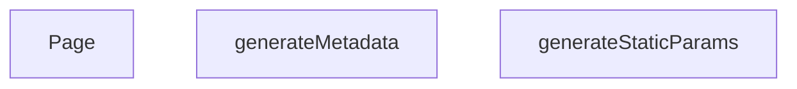

## Genel Bakış
Bu modül, Next.js App Router yapısında dinamik bir marka detay sayfasını yönetir. Her bir marka (`slug`) için derleme aşamasında statik yolları oluşturur, SEO uyumlu meta bilgileri dinamik olarak üretir ve marka verisini çekerek nihai sayfa arayüzünü render eder.

## Fonksiyon Grupları

### Statik Yol Üretimi
Uygulama derlenirken hangi marka sayfalarının statik olarak oluşturulacağını belirler; böylece build aşamasında gerekli tüm slug'lar hazırlanır.
- `generateStaticParams`

### SEO Meta Bilgi Üretimi
Her marka sayfası için başlık, açıklama ve Open Graph gibi SEO etiketlerini ilgili marka verisine göre dinamik olarak hazırlar.
- `generateMetadata`

### Sayfa Render
Marka verisini çeker ve kullanıcıya gösterilecek tam sayfa bileşenini döndürerek istenen marka detay sayfasını render eder.
- `Page`

---

## AXIOMS – Mimari Varsayımlar

Bu modül için, yalnızca fonksiyon imzalarından çıkarılabilecek temel mimari varsayımlar aşağıdadır. `generateStaticParams` fonksiyonunun dönüş yapısı bilinmediği için, bu fonksiyonun output'a dair bir varsayımda bulunulamamaktadır.

[Aksiyom 1]: Eğer `generateMetadata` veya `Page` fonksiyonuna iletilen `params` nesnesi içinde `lang` alanı string olarak sağlanmazsa, fonksiyonun doğru çalışması garanti edilemez.

[Aksiyom 2]: Eğer `generateMetadata` veya `Page` fonksiyonuna iletilen `params` nesnesi içinde `slug` alanı string olarak sağlanmazsa, fonksiyonun doğru çalışması garanti edilemez.

[Aksiyom 3]: Eğer `generateMetadata` veya `Page` fonksiyonuna iletilen `params` değeri bir `Promise` olarak çözülmemiş (await edilmemiş) haliyle kullanılmaya çalışılırsa, fonksiyonun doğru çalışması garanti edilemez.

---

## FONKSİYON DETAYLARI

### generateStaticParams

**Ne yapar**: Next.js statik site oluşturma (SSG) süreci için tüm marka sayfalarının önceden oluşturulması gereken yolları (path'leri) üretir. Bu fonksiyon sayesinde build aşamasında her marka için hem Türkçe hem İngilizce dil versiyonları statik olarak hazırlanır.

**Nasıl yapar**: HVAC_BRANDS dizisinden tüm benzersiz slug değerlerini çıkarır ve her slug için iki farklı dil seçeneği ('tr' ve 'en') oluşturarak bir yol listesi üretir.flatMap yöntemiyle her slug'ı iki dile genişletir. Herhangi bir hata oluşursa konsola uyarı yazdırarak boş bir dizi döndürür ve build sürecinin kesintiye uğramasını engeller.

**Parametreler**: Bu fonksiyon herhangi bir parametre almaz.

**Dönüş**: `Array<{ lang: string, slug: string }>` — Her bir marka ve dil kombinasyonu için bir nesne içeren dizi. Örnek: `[{ lang: 'tr', slug: 'daikin' }, { lang: 'en', slug: 'daikin' }]`. Hata durumunda boş dizi döner.

### generateMetadata
**Ne yapar**: Geliştirildi ancak detay üretilemedi.

### Page
**Ne yapar**: Geliştirildi ancak detay üretilemedi.

---

## AST POINTERS

### [N1_NASIL] AST Pointer: app/[lang]/brands/[slug]/page.tsx::generateStaticParams
- **params**: (yok)
- **ic_degiskenler**:
  - `uniqueBrands` — HVAC_BRANDS dizisindeki her markanın slug değerini içeren dizi
  - `paths` — uniqueBrands dizisinden oluşturulan ve her slug için 'tr' ve 'en' dillerini içeren yollar dizisi
  - `e` — try bloğunda yakalanan hata nesnesi
- **Dönüş**: `{ lang: string, slug: string }[]` dizisi veya boş dizi

### [N2_NASIL] AST Pointer: app/[lang]/brands/[slug]/page.tsx::generateMetadata
- **params**: `{ params: Promise<{ lang: string, slug: string }> }` — Asenkron olarak çözülecek parametreler nesnesi
- **ic_degiskenler**:
  - `slug` — params nesnesinden çözülen ve URL'deki slug değerini içeren string
  - `brand` — HVAC_BRANDS dizisinde slug eşleşmesiyle bulunan marka nesnesi veya undefined
- **Dönüş**: Metadata nesnesi (title, description, alternates, openGraph alanlarını içerir)

### [N3_NASIL] AST Pointer: app/[lang]/brands/[slug]/page.tsx::Page
- **params**: `{ params: Promise<{ lang: string, slug: string }> }` — Asenkron olarak çözülecek parametreler nesnesi
- **ic_degiskenler**:
  - `slug` — params nesnesinden çözülen ve URL'deki slug değerini içeren string
  - `brand` — HVAC_BRANDS dizisinde slug eşleşmesiyle bulunan marka nesnesi veya undefined
  - `jsonLd` — JSON-LD yapılandırılmış veri nesnesi (schema.org formatında marka bilgisi)
- **Dönüş**: JSX içeriği (script etiketi ve PageComponent bileşeni)

---

## MERMAID CALL GRAPH

## NODE ID STANDARD

  file: src\app\[lang]\brands\[slug]\page.tsx
  function: src\app\[lang]\brands\[slug]\page.tsx::generateStaticParams
  function: src\app\[lang]\brands\[slug]\page.tsx::generateMetadata
  function: src\app\[lang]\brands\[slug]\page.tsx::Page

---

## DISA AKTARILANLAR (EXPORTS)
  export: Page
  export: generateMetadata
  export: generateStaticParams

---

## STİL TOKENLERİ

### Arbitrary Değerler (token'a geçirilmemiş)
Yok — tüm stiller token'a geçirilmiş. ✅

### Kullanılan Token'lar (zaten token'a geçirilmiş)
- (yok)

### Tailwind Sınıf Özeti
- **Renkler:** (yok)
- **Layout:** (yok)
- **Varyant/Responsive:** (yok)
- **Yardımcı Sınıflar:** (yok)