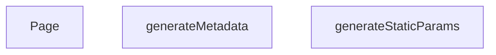

## Genel Bakış
Bu modül, Next.js uygulamasındaki belirli bir marka sayfasını ([slug]) yönetir. Derleme anında statik yolları oluşturur, marka özelinde SEO meta verilerini dinamik olarak üretir ve son olarak istenen marka verisini çekerek kullanıcı arayüzünü render eder.

## Fonksiyon Grupları
### Statik Yol Üretimi
Uygulama derlenirken hangi marka sayfalarının (slug) statik olarak oluşturulacağını belirler.
- generateStaticParams

### Meta‑Bilgi Oluşturma
İlgili marka sayfası için başlık, açıklama ve SEO uyumlu meta etiketlerini dinamik olarak hazırlar.
- generateMetadata

### Sayfa Renderı
Marka verisini alır ve kullanıcıya gösterilecek nihai React bileşenini döndürerek sayfayı render eder.
- Page

---

## AXIOMS – Mimari Varsayımlar

Bu modül, Next.js App Router dinamik route yapısına bağlı olarak çalışır.

[Aksiyom 1]: Eğer route paterninde `lang` ve `slug` parametreleri yoksa, `generateMetadata` ve `Page` fonksiyonları `params` erişiminde başarısız olur.

[Aksiyom 2]: Eğer `params` bir `Promise` olarak gelip `await` edilmezse, `lang` ve `slug` değerlerine erişilemez (undefined kalır).

[Aksiyom 3]: Eğer `lang` string değilse, sayfa dili tanımsız kalır.

[Aksiyom 4]: Eğer `slug` string değilse veya geçerli bir marka tanımlayıcısına karşılık gelmiyorsa, `generateMetadata` hatalı SEO meta-bilgisi üretir.

[Aksiyom 5]: Eğer `generateStaticParams` boş dizi döndürürse, derleme aşamasında hiçbir marka sayfası statik olarak üretilmez.

[Aksiyom 6]: Eğer `generateStaticParams` tarafından döndürülen objelerde `lang` veya `slug` alanları eksikse, ilgili sayfa derleme sırasında oluşmaz.

---

## FONKSİYON DETAYLARI

### generateStaticParams

**Ne yapar**: Next.js statik site oluşturma (SSG) süreci için tüm marka sayfalarının önceden oluşturulması gereken yolları (path'leri) üretir. Bu fonksiyon sayesinde build aşamasında her marka için hem Türkçe hem İngilizce dil versiyonları statik olarak hazırlanır.

**Nasıl yapar**: HVAC_BRANDS dizisinden tüm benzersiz slug değerlerini çıkarır ve her slug için iki farklı dil seçeneği ('tr' ve 'en') oluşturarak bir yol listesi üretir.flatMap yöntemiyle her slug'ı iki dile genişletir. Herhangi bir hata oluşursa konsola uyarı yazdırarak boş bir dizi döndürür ve build sürecinin kesintiye uğramasını engeller.

**Parametreler**: Bu fonksiyon herhangi bir parametre almaz.

**Dönüş**: `Array<{ lang: string, slug: string }>` — Her bir marka ve dil kombinasyonu için bir nesne içeren dizi. Örnek: `[{ lang: 'tr', slug: 'daikin' }, { lang: 'en', slug: 'daikin' }]`. Hata durumunda boş dizi döner.

### generateMetadata
**Ne yapar**: Geliştirildi ancak detay üretilemedi.

### Page
**Ne yapar**: Geliştirildi ancak detay üretilemedi.

---

## AST POINTERS

### [N1_NASIL] AST Pointer: src/app/[lang]/brands/[slug]/page.tsx::generateStaticParams
- **params**: (parametre yok)
- **ic_degiskenler**:
  - `uniqueBrands` — `HVAC_BRANDS` dizisinden her markanın `slug` değerlerini çıkararak oluşturulan string dizisi
  - `paths` — `uniqueBrands` dizisini her slug için `lang: 'tr'` ve `lang: 'en'` varyasyonlarıyla genişleterek oluşan statik yol nesneleri dizisi
  - `e` — try-catch bloğu içinde yakalanan hata nesnesi, `console.warn` ile loglanır
- **Dönüş**: `paths` dizisi (statik parametreler dizisi) veya hata durumunda boş dizi `[]`

### [N2_NASIL] AST Pointer: src/app/[lang]/brands/[slug]/page.tsx::generateMetadata
- **params**: `{ params }: { params: Promise<{ lang: string, slug: string }> }` — Next.js tarafından sağlanan parametreler promise'i, `await` ile çözülür
- **ic_degiskenler**:
  - `slug` — `params` promise'inden `await` ile çözülen ve route segmentinden gelen marka slug string değeri
  - `brand` — `HVAC_BRANDS` dizisi üzerinde `find()` ile `slug` eşleşmesi aranarak bulunan marka nesnesi (bulunamazsa `undefined`)
- **Dönüş**: SEO metadata nesnesi (`title`, `description`, `alternates`, `openGraph` alanlarını içerir); marka bulunamazsa sadece `title` alanına sahip basit nesne

### [N3_NASIL] AST Pointer: src/app/[lang]/brands/[slug]/page.tsx::Page
- **params**: `{ params }: { params: Promise<{ lang: string, slug: string }> }` — Next.js tarafından sağlanan parametreler promise'i, `await` ile çözülür
- **ic_degiskenler**:
  - `slug` — `params` promise'inden `await` ile çözülen ve route segmentinden gelen marka slug string değeri
  - `brand` — `HVAC_BRANDS` dizisi üzerinde `find()` ile `slug` eşleşmesi aranan marka nesnesi (bulunamazsa `undefined`)
  - `jsonLd` — Schema.org JSON-LD yapılandırılmış veri nesnesi; `brand` nesnesinin `name`, `description` alanlarını veya slug fallback'ini kullanarak `@type: "Brand"` yapısı oluşturur
- **Dönüş**: JSX fragment — `<script>` etiketi ile JSON-LD verisini (XSS koruması ile HTML escape'lenmiş) ve `<PageComponent>` bileşenini (`initialBrandSlug` prop'u ile) render eder

---

## MERMAID CALL GRAPH

## NODE ID STANDARD

  file: src\app\[lang]\brands\[slug]\page.tsx
  function: src\app\[lang]\brands\[slug]\page.tsx::generateStaticParams
  function: src\app\[lang]\brands\[slug]\page.tsx::generateMetadata
  function: src\app\[lang]\brands\[slug]\page.tsx::Page

---

## DISA AKTARILANLAR (EXPORTS)
  export: Page
  export: generateMetadata
  export: generateStaticParams

---

## STİL TOKENLERİ

### Arbitrary Değerler (token'a geçirilmemiş)
Yok — tüm stiller token'a geçirilmiş. ✅

### Kullanılan Token'lar (zaten token'a geçirilmiş)
- (yok)

### Tailwind Sınıf Özeti
- **Renkler:** (yok)
- **Layout:** (yok)
- **Varyant/Responsive:** (yok)
- **Yardımcı Sınıflar:** (yok)