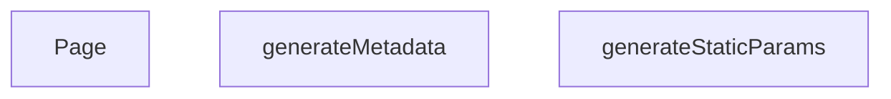

## Genel Bakış

Bu modül, Next.js App Router yapısında dinamik bir marka detay sayfasını yönetir. Her bir marka için derleme aşamasında statik yolları oluşturur, SEO uyumlu meta bilgilerini dinamik olarak üretir ve marka verisini çekerek nihai sayfa arayüzünü render eder.

## Fonksiyon Grupları

### Statik Yol Üretimi
Uygulama derlenirken hangi marka sayfalarının statik olarak oluşturulacağını belirler; böylece build aşamasında gerekli tüm slug'lar hazırlanır.
- generateStaticParams

### SEO Meta Bilgi Üretimi
Her marka sayfası için başlık, açıklama ve Open Graph gibi SEO etiketlerini ilgili marka verisine göre dinamik olarak hazırlar.
- generateMetadata

### Sayfa Render
Marka verisini çeker ve kullanıcıya gösterilecek tam sayfa bileşenini döndürerek istenen marka detay sayfasını render eder.
- Page

## Mimari Notlar

Bu modül, Next.js'in statik site üretim (SSG) ve dinamik yönlendirme yeteneklerini bir arada kullanır. `generateStaticParams` ile derleme zamanında yollar belirlenirken, `generateMetadata` ve `Page` fonksiyonları çalıştırma zamanında `params` nesnesinden gelen `lang` ve `slug` değerlerine bağlı olarak çalışır. Her iki fonksiyon da `params` değerini bir `Promise` olarak alır ve çözümlenmesini bekler. `lang` veya `slug` alanlarının sağlanmaması durumunda fonksiyonların doğru çalışması garanti edilemez.

---

## AXIOMS – Mimari Varsayımlar
- Bu modül davranışsal mantık içermez (salt veri / konfigürasyon / tip tanımı).
- [Aksiyom 1]: Modülün dışa açtığı yapı (anahtar kümesi / şema) bir sözleşmedir; tüketiciler bu sabit yapıya bağlıdır — kırıcı değişiklik tüm tüketicileri etkiler.
- [Aksiyom 2]: Bir öğe ekleme/çıkarma yapısal-uyumlu olmalı; ilgili tipler ve seçiciler aynı commit'te güncel tutulmalıdır.

---

## FONKSİYON DETAYLARI

### generateStaticParams

**Ne yapar**: Next.js statik site oluşturma (SSG) süreci için tüm marka sayfalarının önceden oluşturulması gereken yolları (path'leri) üretir. Bu fonksiyon sayesinde build aşamasında her marka için hem Türkçe hem İngilizce dil versiyonları statik olarak hazırlanır.

**Nasıl yapar**: HVAC_BRANDS dizisinden tüm benzersiz slug değerlerini çıkarır ve her slug için iki farklı dil seçeneği ('tr' ve 'en') oluşturarak bir yol listesi üretir.flatMap yöntemiyle her slug'ı iki dile genişletir. Herhangi bir hata oluşursa konsola uyarı yazdırarak boş bir dizi döndürür ve build sürecinin kesintiye uğramasını engeller.

**Parametreler**: Bu fonksiyon herhangi bir parametre almaz.

**Dönüş**: `Array<{ lang: string, slug: string }>` — Her bir marka ve dil kombinasyonu için bir nesne içeren dizi. Örnek: `[{ lang: 'tr', slug: 'daikin' }, { lang: 'en', slug: 'daikin' }]`. Hata durumunda boş dizi döner.

### generateMetadata
**Ne yapar**: Next.js App Router'ın metadata API'si için bir marka sayfasının SEO meta verilerini oluşturur. Sayfa başlığı, açıklama, canonical URL, dil alternatifleri ve OpenGraph etiketlerini içeren bir metadata nesnesi döndürür. Marka bulunamadığında "Marka Bulunamadı" başlığıyla sınırlı bir metadata döndürür.

**Nasıl yapar**: Fonksiyon önce `params` Promise'ini `await` ile çözerek `lang` ve `slug` değerlerini elde eder. Ardından `HVAC_BRANDS` dizisi üzerinde `slug` alanına göre arama yaparak ilgili markayı bulur. Marka bulunamazsa yalnızca `title` içeren bir nesne döndürerek işlemi sonlandırır. Marka bulunduğunda ise dil bazlı canonical URL'ler üretir: `SITE_URL` sabiti ile `/tr` veya `/en` dil öneki ve `Routes.brand(slug)` fonksiyonunun dönüş değeri birleştirilerek `trUrl` ile `enUrl` oluşturulur. Aktif dile göre `canonicalUrl` belirlenir — `lang` değeri `'en'` ise `enUrl`, aksi halde `trUrl` kullanılır. Bu yapı kasıtlı olarak `sitemap.ts` dosyasındaki ifadeyle birebir aynıdır; böylece iki yüzey (sitemap ve sayfa) arasında canonical URL tutarsızlığı önlenir. Son olarak `title`, `description`, `alternates` (canonical ve dil varyasyonları), `openGraph` alanlarını içeren eksiksiz bir metadata nesnesi döndürür. `alternates.languages` içinde `'x-default'` olarak Türkçe URL atanmıştır.

**Parametreler**:
- `{ params }`: `{ params: Promise<{ lang: string, slug: string }> }` — Next.js route parametrelerini taşıyan nesne. `params` bir Promise olduğundan `await` ile çözülmesi gerekir. `lang` aktif dili (`'tr'` veya `'en'`), `slug` ise URL'deki marka tanımlayıcısını temsil eder.

**Dönüş**: Bir metadata nesnesi döndürür. Marka bulunamadığında yalnızca `title` alanı (`'Marka Bulunamadı | VentHub'`) bulunan bir nesne döndürülür. Marka bulunduğunda aşağıdaki alanları içeren kapsamlı bir nesne döndürülür:
- `title`: `"${brand.name} Ürünleri ve Çözümleri | VentHub"` biçiminde sayfa başlığı.
- `description`: Marka adına göre dinamik olarak oluşturulmuş Türkçe açıklama metni.
- `alternates`: `canonical` (aktif dile göre seçilen URL), `languages` (`tr`, `en`, `x-default` anahtarlarıyla dil varyasyonları) alt alanlarını içerir.
- `openGraph`: `title`, `description`, `url` (canonical URL), `siteName` (`'VentHub'`), `images` (`/images/og-default.jpg`, 1200×630), `locale` (`'tr_TR'`), `type` (`'website'`) alt alanlarını içerir.

### Page
**Ne yapar**: Geliştirildi ancak detay üretilemedi.

---

## İTHALATLAR (IMPORTS)
- import: ../../../../config/siteUrl::SITE_URL
- import: ../../../../data/brands::HVAC_BRANDS
- import: ../../../../utils/routes::Routes
- import: ../../../../views/BrandDetailPage::PageComponent

---

## AST POINTERS

### [N1_NASIL] AST Pointer: src/app/[lang]/brands/[slug]/page.tsx::generateStaticParams
- **params**: yok
- **ic_degiskenler**:
  - `uniqueBrands` — `HVAC_BRANDS` dizisindeki her elemanın `b.slug` özelliği alınarak oluşturulan slug dizisi
  - `paths` — her slug için `{ lang: 'tr', slug: b }` ve `{ lang: 'en', slug: b }` olmak üzere iki yol nesnesi üretilip `flatMap` ile düzleştirilen dizi
  - `e` — `catch` bloğunda yakalanan hata nesnesi; `console.warn` ile `'generateStaticParams error for brands:'` mesajıyla birlikte konsola yazdırılır
- **Dönüş**: `paths` dizisi (boş olabilir); hata durumunda boş dizi `[]`

### [N2_NASIL] AST Pointer: src/app/[lang]/brands/[slug]/page.tsx::generateMetadata
- **params**: `{ params }: { params: Promise<{ lang: string, slug: string }> }`
- **ic_degiskenler**:
  - `lang` — `await params` sonucu elde edilen dil kodu (`'tr'` veya `'en'`)
  - `slug` — `await params` sonucu elde edilen marka slug'ı
  - `brand` — `HVAC_BRANDS.find(b => b.slug === slug)` ile slug eşleşen marka nesnesi; bulunamazsa `undefined`
  - `trUrl` — `` `${SITE_URL}/tr${Routes.brand(slug)}` `` ifadesiyle oluşturulan Türkçe kanonik URL
  - `enUrl` — `` `${SITE_URL}/en${Routes.brand(slug)}` `` ifadesiyle oluşturulan İngilizce kanonik URL
  - `canonicalUrl` — `lang === 'en'` ise `enUrl`, değilse `trUrl` olarak seçilen kanonik URL
- **Dönüş**: metadata nesnesi — `brand` bulunamazsa `{ title: 'Marka Bulunamadı | VentHub' }`; bulunursa `title`, `description`, `alternates` (canonical, languages: tr/en/x-default), `openGraph` (title, description, url, siteName, images, locale, type) alanlarını içeren nesne

### [N3_NASIL] AST Pointer: src/app/[lang]/brands/[slug]/page.tsx::Page
- **params**: `{ params }: { params: Promise<{ lang: string, slug: string }> }`
- **ic_degiskenler**:
  - `slug` — `await params` sonucu elde edilen marka slug'ı
  - `brand` — `HVAC_BRANDS.find(b => b.slug === slug)` ile slug eşleşen marka nesnesi; bulunamazsa `undefined`
  - `jsonLd` — JSON-LD yapılandırılmış veri nesnesi; `@context: "https://schema.org"`, `@type: "Brand"`, `name: brand?.name || slug`, `description: brand?.description || `${brand?.name || slug} marka ürünler``, `url: `${SITE_URL}/brands/${slug}``
- **Dönüş**: JSX fragment — `<script type="application/ld+json">` etiketi içinde `JSON.stringify(jsonLd)` sonucu `<` ve `>` karakterleri escape edilerek `dangerouslySetInnerHTML` ile yerleştirilir; ardından `<PageComponent initialBrandSlug={slug} />` bileşeni render edilir

---

## MERMAID CALL GRAPH

## NODE ID STANDARD

  file: src\app\[lang]\brands\[slug]\page.tsx
  function: src\app\[lang]\brands\[slug]\page.tsx::generateStaticParams
  function: src\app\[lang]\brands\[slug]\page.tsx::generateMetadata
  function: src\app\[lang]\brands\[slug]\page.tsx::Page

---

## DISA AKTARILANLAR (EXPORTS)
  export: Page
  export: generateMetadata
  export: generateStaticParams

---

## STİL TOKENLERİ

### Arbitrary Değerler (token'a geçirilmemiş)
Yok — tüm stiller token'a geçirilmiş. ✅

### Kullanılan Token'lar (zaten token'a geçirilmiş)
- (yok)

### Tailwind Sınıf Özeti
- **Renkler:** (yok)
- **Layout:** (yok)
- **Varyant/Responsive:** (yok)
- **Yardımcı Sınıflar:** (yok)