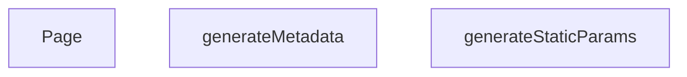

## Genel Bakış
Bu modül, Next.js’in dinamik “marka (brand) sayfalarını” oluşturmak için gerekli olan üç temel işlemi bir araya getirir. `slug` değişkenine bağlı olarak statik yolları belirler, sayfaya özgü SEO meta‑bilgilerini üretir ve son olarak kullanıcıya gösterilecek React bileşenini hazırlar.

## Fonksiyon Grupları

### Statik Yol Üretimi
Derleme sırasında hangi marka sayfalarının statik olarak oluşturulacağını belirler.
- generateStaticParams

### Meta‑Bilgi Oluşturma
Gelen `slug` parametresinden yola çıkarak sayfa başlığı, açıklaması ve diğer SEO etiketlerini dinamik şekilde hazırlar.
- generateMetadata

### Sayfa Renderı
İlgili markanın verisini alıp kullanıcıya sunulan nihai UI bileşenini döndürür.
- Page

---

## AXIOMS – Mimari Varsayımlar
Bu modül için özel aksiyom tanımlanmamıştır.

---

---

## FONKSIYON DETAYLARI

### generateStaticParams
**Ne yapar**: Bu fonksiyon Next.js tarafından, `brands/[slug]` dinamik rotası için statik olarak hangi slug değerlerinin önceden oluşturulacağını belirlemek amacıyla kullanılır. Derleme zamanında çağrılarak tüm olası marka slug’larının listesini sağlar.
**Nasıl yapar**: Fonksiyonun gövdesi ve docstring’i boş olduğundan tam işleyişi kod üzerinde görülmemektedir. Genel Next.js yaklaşımında bir API veya veri kaynağından slug listesi alınarak `[{ slug: string }]` formatında döndürülür, ancak bu örnekte uygulama detayı paylaşılmamıştır.
**Parametreler**: Parametre almaz (void).
**Dönüş**: Kod içerisinde dönüş tipi açıkça belirtilmemiştir; verilen bilgiye göre void veya bilinmiyor olarak değerlendirilmelidir.

### generateMetadata
**Ne yapar**: Next.js’in sayfa meta bilgilerini (başlık, açıklama, vb.) oluşturmak için çağırdığı bir fonksiyondur. `[slug]` parametresine göre markaya özgü meta verileri döndürür.
**Nasıl yapar**: Parametre olarak aldığı `params` Promise’ini bekler ve içindeki `slug` değerini çıkarır. Bu slug ile ilgili marka verilerini alarak uygun metadata nesnesini oluşturması beklenir. Ancak docstring boş olduğu için somut adımlar görülmemektedir.
**Parametreler**:
- params: `{ params: Promise<{ slug: string }> }` — İçinde `slug` anahtarına sahip bir Promise barındıran nesne, sayfanın dinamik rotasından gelen parametreyi temsil eder.
**Dönüş**: Mevcut kodda dönüş tipi verilmemiştir; void veya bilinmiyor olarak işaretlenmiştir.

### Page
**Ne yapar**: `brands/[slug]` rota sayfasının ana React bileşenidir. Kullanıcıya ilgili marka hakkında içeriği sunar.
**Nasıl yapar**: Asenkron bir fonksiyon olarak tanımlanmıştır; `params` Promise’ini `await` ile çözümleyerek `slug` değerine ulaşır. Bu değer kullanılarak marka verileri yüklenir ve JSX çıktısı üretilir. Docstring eksik olduğundan iç detaylar belirtilmemiştir.
**Parametreler**:
- params: `{ params: Promise<{ slug: string }> }` — Rotadan gelen `slug` bilgisini tutan Promise içeren parametre nesnesi.
**Dönüş**: İmzada dönüş tipi belirtilmemiştir; void veya bilinmiyor olarak değerlendirilebilir (standart Next.js ortamında JSX.Element döndürmesi beklenir, ancak kodda bu ifade edilmemiştir).

---

## AST POINTERS

### [N1_NASIL] AST Pointer: brands/[slug]/page.tsx::generateStaticParams
- **params**: (parametre yok)
- **ic_degiskenler**:
  - `uniqueBrands` — HVAC_BRANDS üzerinden map ile elde edilen slug stringleri listesi
  - `paths` — her slug için `{slug: string}` objesi oluşturulan dizi
  - `e` — catch bloğunda hata yakalamak için kullanılan hata nesnesi
- **Dönüş**: Dizi (slug objeleri) veya boş dizi (hata durumunda)

### [N2_NASIL] AST Pointer: brands/[slug]/page.tsx::generateMetadata
- **params**: `{ params: Promise<{ slug: string }> }`
  - `params` — await edilerek slug değeri çıkarılır
- **ic_degiskenler**:
  - `slug` — URL parametresinden alınan marka slug değeri
  - `brand` — HVAC_BRANDS içinde slug eşleşen marka bilgisi (bulunamazsa undefined)
- **Dönüş**: Meta veri objesi (title, description, alternates, openGraph içerir)

### [N3_NASIL] AST Pointer: brands/[slug]/page.tsx::Page
- **params**: `{ params: Promise<{ slug: string }> }`
  - `params` — await edilerek slug değeri çıkarılır
- **ic_degiskenler**:
  - `slug` — URL parametresinden alınan marka slug değeri
  - `brand` — HVAC_BRANDS içinde slug eşleşen marka bilgisi (bulunamazsa undefined)
  - `jsonLd` — Schema.org yapılandırılmış veri objesi (brand name, description, url)
- **Dönüş**: JSX (script etiketi ve PageComponent bileşeni içerir)

---

## MERMAID CALL GRAPH

## NODE ID STANDARD

  file: src\app\brands\[slug]\page.tsx
  function: src\app\brands\[slug]\page.tsx::generateStaticParams
  function: src\app\brands\[slug]\page.tsx::generateMetadata
  function: src\app\brands\[slug]\page.tsx::Page

---

## DISA AKTARILANLAR (EXPORTS)
  export: Page
  export: generateMetadata
  export: generateStaticParams