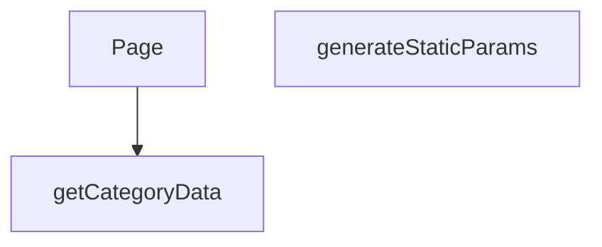

## Genel Bakış
Bu modül, Next.js'in dinamik rota yapısını kullanarak kategori ve alt kategori sayfalarını sunucu tarafında oluşturur. URL'deki parametreleri alarak ilgili kategori verisini çeker ve bu veriyi kullanarak istemciye sayfayı sunar. Ayrıca, önceden oluşturulabilecek sayfaları build aşamasında belirlemek için gerekli parametre listesini üretir.

## Fonksiyon Grupları
### Veri Temini
Bu grup, sayfanın içeriğini oluşturacak olan temel veriyi, dış bir kaynaktan asenkron olarak getirerek modülün veri bağımlılığını karşılar.
- getCategoryData

### Sayfa Rotalama ve Oluşturma
Bu grup, URL'deki dinamik parametreleri işleyerek hem sayfa bileşeninin render edilmesini hem de statik site oluşturma süreçleri için gerekli rota parametrelerinin sağlanmasını yönetir.
- Page, generateStaticParams

---
## AXIOMS – Mimari Varsayımlar
Bu modül, bir Next.js sayfa bileşeni olup dinamik kategori sayfaları oluşturmak için sunucu taraflı veri çeker ve statik parametreleri üretir.

**[Aksiyom 1]:** `getCategoryData` fonksiyonu, geçerli bir veri olmadığında veya hata oluştuğunda sayfa oluşturmayı engelleyecek şekilde tanımlı bir hata veya boş durum döndürmelidir.

**[Aksiyom 2]:** `generateStaticParams`, SSG süreci için tüm olası ve geçerli `categorySlug` ve `subCategorySlug` kombinasyonlarını eksiksiz olarak döndürmelidir; aksi takdirde bazı sayfalar build aşamasında oluşturulamaz.

**[Aksiyom 3]:** `Page` bileşeni, asenkron olarak çözülecek `params` Promise'inden gelen verileri kullanarak sunucu tarafında render edilmelidir.

---

## AXIOMS – Mimari Varsayımlar

Bu modül, Next.js App Router yapısında dinamik kategori/alt kategori sayfa bileşenidir.

---

**[Aksiyom 1]:** `getCategoryData(slug)` fonksiyonuna geçilen `slug` parametresi geçerli bir string değilse, veri çekme işlemi başarısız olur veya boş/yanlış veri döner.

**[Aksiyom 2]:** `Page` bileşeninin `params` Promise'i çözümlendiğinde `categorySlug` ve `subCategorySlug` alanlarını içermesi gerekir; bu alanlardan herhangi biri eksikse sayfa düzgün render edilemez.

**[Aksiyom 3]:** `getCategoryData` fonksiyonu asenkron çalışmalıdır (Promise döner); eğer bu fonksiyon senkron çalıştırılmaya zorlanırsa zaman aşımlı hata oluşur.

**[Aksiyom 4]:** `generateStaticParams()` fonksiyonu, SSG (Static Site Generation) sırasında çağrılmalı ve geçerli kategori/alt kategori slug çiftleri listesi döndürmelidir; boş liste dönerse hiçbir sayfa statik olarak oluşturulamaz.

**[Aksiyom 5]:** URL yapısı (`[lang]/category/[categorySlug]/[subCategorySlug]`) üç dinamik segment içerir; `Page` fonksiyonunun `params` imzasında yalnızca `categorySlug` ve `subCategorySlug` görünmektedir — `lang` parametresinin farklı bir mekanizma (middleware,更高 katman context) ile sağlandığı varsayılır.

**[Aksiyom 6]:** `getCategoryData` bir string `slug` alırken, `Page` bileşeni iki ayrı slug (`categorySlug` ve `subCategorySlug`) alır; dolayısıyla `getCategoryData`'ya hangi slug'ın (üst kategori mi, alt kategori mi) geçirildiği调用 noktasında belirlenmelidir — bu eşleşme modül içinde net olarak tanımlı değildir ve调用ya bağımlıdır.

---

> **Not:** Modül sabitleri bölümü boş olduğundan, eşik değeri, format veya kabul kriteri gibi sabit tabanlı aksiyom tanımlanamamıştır. `getCategoryData`'nın dönüş tipi ve hata fırlatma davranışı fonksiyon imzasında görünmediğinden bu konularda aksiyom türetilememiştir.

---

## FONKSİYON DETAYLARI

### getCategoryData
**Ne yapar**: Verilen bir kategori slug'ı ile veritabanından ilgili kategori verisini çeker ve alanları haritalandırarak domain modeline dönüştürür.

**Nasıl yapar**: Supabase istemcisi kullanarak 'categories' tablosundan belirtilen slug'a sahip tek bir kaydı seçer. Hata oluşursa veya veri bulunamazsa null döner. Veri bulunduğunda, `mapDatabaseCategoryToDomain` yardımcı fonksiyonunu çağırarak ham veritabanı kaydını (`DbCategory`) uygulama içi kullanım için tasarlanmış domain modeline dönüştürür. Bazı alanların tipleri açıkça belirtilerek dönüşüm yapılır.

**Parametreler**:
- slug: `string` — Aranacak kategorinin benzersiz tanımlayıcısı (slug).

**Dönüş**: Başarılı sorgulama ve haritalandırma sonucu bir `DbCategory` nesnesini alan `mapDatabaseCategoryToDomain` fonksiyonunun dönüş değerini döner. Hata durumunda veya veri yokluğunda `null` döner.

### generateStaticParams
**Ne yapar**: Next.js statik site oluşturma (SSG) süreci için, oluşturulan alt kategori sayfalarının URL parametrelerini (lang, categorySlug, subCategorySlug) üreten asenkron bir fonksiyondur.

**Nasıl yapar**: Önce Supabase'den tüm aktif ve `parent_id`'si dolu olan (yani alt kategoriler) kayıtları çeker. Ardından, bu alt kategorilerin ait olduğu üst kategorilerin bilgilerini (id ve slug) ayrı bir sorguyla getirir ve bir haritaya (`parentMap`) dönüştürür. Her bir alt kategori için, üst kategorinin slug'ını haritadan bulur ve 'tr' ile 'en' dil kodları için iki ayrı parametre seti oluşturarak döndürür.

**Parametreler**: Bu fonksiyon parametre almaz.

**Dönüş**: `Promise<Array<{ lang: string; categorySlug: string; subCategorySlug: string }>>` — Statik olarak oluşturulacak tüm alt kategori sayfaları için URL parametrelerini içeren bir dizi. Her bir alt kategori, iki farklı dil (tr ve en) için bir dizi elemanı olarak temsil edilir.

### Page
**Ne yapar**: Bir alt kategori sayfasının React server component'idir. URL parametrelerinden alt kategori slug'ını alır, ilgili kategori ve ürün verilerini getirir ve istemci tarafında render edilecek bileşene aktarır.

**Nasıl yapar**: Fonksiyon, bir `Promise` olarak gelen `params` nesnesini `await` ile çözerek `subCategorySlug` değerine erişir. Bu slug'ı `getCategoryData` fonksiyonuna göndererek kategori bilgisini çeker. Eğer kategori varsa, o kategorideki ürünleri (maksimum 100 adet) `getProductsEnriched` fonksiyonuyla getirir. Son olarak, elde edilen `category` ve `products` başlangıç verilerini (`initialCategory`, `initialProducts`) `PageComponent`'e prop olarak geçirir ve bir `React.Suspense` sarmalayıcısı içinde sunar.

**Parametreler**:
- params: `Promise<{ categorySlug: string, subCategorySlug: string }>` — Next.js tarafından sağlanan, URL segmentlerinden çözülen parametrelerin promise'i. `categorySlug` üst kategoriyi, `subCategorySlug` ise mevcut sayfanın alt kategoriyi temsil eder.

**Dönüş**: JSX elementi döner. Spesifik olarak, `React.Suspense` ile sarılmış ve bir `fallback` (yükleniyor mesajı) içeren `PageComponent` JSX'ini döner.

---

## AST POINTERS

### [N1_NASIL] AST Pointer: `[lang]/category/[categorySlug]/[subCategorySlug]/page.tsx`::getCategoryData
- **params**: `(slug: string)` — Veritabanından çekilecek kategorinin URL slug'ı
- **ic_degiskenler**:
  - `data` — Supabase sorgusundan dönen tek satırlık kategori ham verisi (`id, name, parent_id, slug, is_active, sort_order, level, image_url, seo_title, seo_desc, created_at, updated_at, description, display_mode, is_featured, marketing_title, menu_label, metadata, translation_key, authority_content` alanları); `single()` ile tek obje olarak gelir
  - `error` — Supabase `.single()` sorgusunun hata nesnesi; `data` ile birlikte destructure edilir (`{ data, error }`); truthy ise sorgu başarısızdır
- **Dönüş**: `mapDatabaseCategoryToDomain(...)` ile dönüştürülmüş domain kategori objesi veya `null` (hata ya da veri yoksa)

---

### [N2_NASIL] AST Pointer: `[lang]/category/[categorySlug]/[subCategorySlug]/page.tsx`::generateStaticParams
- **params**: (yok)
- **ic_degiskenler**:
  - `data` — İlk Supabase sorgusundan dönen aktif alt kategoriler listesi (`slug, parent_id` alanları); `parent_id` NULL olmayan (yani alt kategori olan) kayıtlar
  - `parents` — İkinci Supabase sorgusundan dönen tüm aktif kategoriler listesi (`id, slug` alanları); ebeveyn slug'larını eşlemek için kullanılır
  - `parentsList` — `parents`'ın type-cast edilmiş hali `{ id: string, slug: string | null }[]`; null-safe遍历 için güvenli referans
  - `parentMap` — `Map<string, string>` yapısı; kategori `id`'sini ebeveyn `slug`'ına eşler (`parentsList.map(p => [p.id, p.slug || ''])`); alt kategorinin `parent_id`'sinden ebeveyn slug'ını bulmak için kullanılır
  - `subCategoriesList` — `data`'nın type-cast edilmiş hali `{ slug: string | null, parent_id: string | null }[]`; flatMap iterasyonunda her bir alt kategori kaydı olarak kullanılır
- **flatMap callback içindeki değişkenler**:
  - `c` — `subCategoriesList`'teki her bir alt kategori objesi; `c.slug` (alt kategori slug'ı) ve `c.parent_id` (ebeveyn kategori id'si) alanlarına erişilir
  - `parentSlug` — `parentMap.get(c.parent_id || '')` ile bulunan ebeveyn kategorinin slug'ı; bulunamazsa `'unknown'` default'u alınır
- **Dönüş**: `{ lang: string, categorySlug: string, subCategorySlug: string }` objelerinden oluşan array; her alt kategori için `tr` ve `en` dilleri olmak üzere ikişer eleman döner

---

### [N3_NASIL] AST Pointer: `[lang]/category/[categorySlug]/[subCategorySlug]/page.tsx`::Page
- **params**: `{ params: Promise<{ categorySlug: string, subCategorySlug: string }> }` — Next.js tarafından sağlanan URL parametreleri promise'i
- **ic_degiskenler**:
  - `subCategorySlug` — `await params` ile çözülen alt kategori slug string'i; `getCategoryData` çağrısına argüman olarak verilir
  - `category` — `getCategoryData(subCategorySlug)` çağırılarak çekilen domain kategori objesi; `null` olabilir (kategori bulunamazsa)
  - `products` — Başlangıçta boş `DomainProduct[]` dizisi; `category` truthy ise `getProductsEnriched({ categoryIds: [category.id], limit: 100 })` ile en fazla 100 adet enriched ürün listesi ile overwrite edilir
- **API çağrıları**:
  - `getCategoryData(subCategorySlug)` — Supabase'den kategori verisi çeker
  - `getProductsEnriched({ categoryIds: [category.id], limit: 100 })` — İlgili kategorideki ürünleri enriched olarak çeker
- **Dönüş**: JSX — `React.Suspense` sarıcısı içinde `PageComponent` bileşeni; `initialCategory` ve `initialProducts` prop'ları ile render edilir; Suspense fallback'i `"Yükleniyor..."` metnidir

---

## MERMAID CALL GRAPH

## NODE ID STANDARD

  file: src\app\[lang]\category\[categorySlug]\[subCategorySlug]\page.tsx
  function: src\app\[lang]\category\[categorySlug]\[subCategorySlug]\page.tsx::getCategoryData
  function: src\app\[lang]\category\[categorySlug]\[subCategorySlug]\page.tsx::generateStaticParams
  function: src\app\[lang]\category\[categorySlug]\[subCategorySlug]\page.tsx::Page

---

## DISA AKTARILANLAR (EXPORTS)
  export: Page
  export: generateStaticParams
  export: getCategoryData

---

## STİL TOKENLERİ

### Arbitrary Değerler (token'a geçirilmemiş)
Yok — tüm stiller token'a geçirilmiş. ✅

### Kullanılan Token'lar (zaten token'a geçirilmiş)
- (yok)

### Tailwind Sınıf Özeti
- **Renkler:** `text-center`, `text-slate-500`
- **Layout:** (yok)
- **Varyant/Responsive:** (yok)
- **Yardımcı Sınıflar:** `container`, `mx-auto`, `px-4`, `py-12`