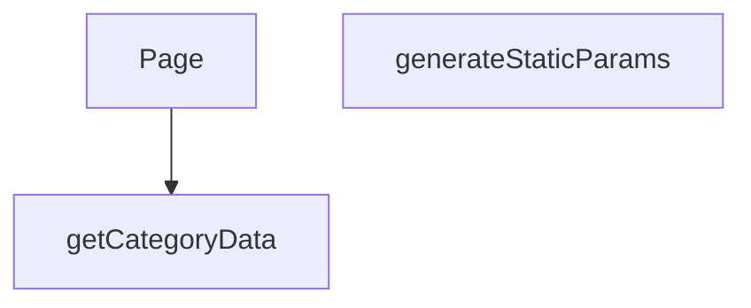

## Genel Bakış
Bu modül, Next.js'in dinamik rota yapısını kullanarak kategori ve alt kategori sayfalarını sunucu tarafında oluşturur. URL'deki parametreleri alarak ilgili kategori verisini çeker ve bu veriyi kullanarak istemciye sayfayı sunar. Ayrıca, önceden oluşturulabilecek sayfaları build aşamasında belirlemek için gerekli parametre listesini üretir.

## Fonksiyon Grupları
### Veri Temini
Bu grup, sayfanın içeriğini oluşturacak olan temel veriyi, dış bir kaynaktan asenkron olarak getirerek modülün veri bağımlılığını karşılar.
- getCategoryData

### Sayfa Rotalama ve Oluşturma
Bu grup, URL'deki dinamik parametreleri işleyerek hem sayfa bileşeninin render edilmesini hem de statik site oluşturma süreçleri için gerekli rota parametrelerinin sağlanmasını yönetir.
- Page, generateStaticParams

---
## AXIOMS – Mimari Varsayımlar
Bu modül, bir Next.js sayfa bileşeni olup dinamik kategori sayfaları oluşturmak için sunucu taraflı veri çeker ve statik parametreleri üretir.

**[Aksiyom 1]:** `getCategoryData` fonksiyonu, geçerli bir veri olmadığında veya hata oluştuğunda sayfa oluşturmayı engelleyecek şekilde tanımlı bir hata veya boş durum döndürmelidir.

**[Aksiyom 2]:** `generateStaticParams`, SSG süreci için tüm olası ve geçerli `categorySlug` ve `subCategorySlug` kombinasyonlarını eksiksiz olarak döndürmelidir; aksi takdirde bazı sayfalar build aşamasında oluşturulamaz.

**[Aksiyom 3]:** `Page` bileşeni, asenkron olarak çözülecek `params` Promise'inden gelen verileri kullanarak sunucu tarafında render edilmelidir.

---

## AXIOMS – Mimari Varsayımlar

Bu modül, Next.js App Router yapısında dinamik kategori/alt kategori sayfa bileşenidir.

---

## FONKSİYON DETAYLARI

### getCategoryData
**Ne yapar**: Verilen bir kategori slug'ı ile veritabanından ilgili kategori verisini çeker ve alanları haritalandırarak domain modeline dönüştürür.

**Nasıl yapar**: Supabase istemcisi kullanarak 'categories' tablosundan belirtilen slug'a sahip tek bir kaydı seçer. Hata oluşursa veya veri bulunamazsa null döner. Veri bulunduğunda, `mapDatabaseCategoryToDomain` yardımcı fonksiyonunu çağırarak ham veritabanı kaydını (`DbCategory`) uygulama içi kullanım için tasarlanmış domain modeline dönüştürür. Bazı alanların tipleri açıkça belirtilerek dönüşüm yapılır.

**Parametreler**:
- slug: `string` — Aranacak kategorinin benzersiz tanımlayıcısı (slug).

**Dönüş**: Başarılı sorgulama ve haritalandırma sonucu bir `DbCategory` nesnesini alan `mapDatabaseCategoryToDomain` fonksiyonunun dönüş değerini döner. Hata durumunda veya veri yokluğunda `null` döner.

### generateStaticParams
**Ne yapar**: Next.js statik site oluşturma (SSG) süreci için, oluşturulan alt kategori sayfalarının URL parametrelerini (lang, categorySlug, subCategorySlug) üreten asenkron bir fonksiyondur.

**Nasıl yapar**: Önce Supabase'den tüm aktif ve `parent_id`'si dolu olan (yani alt kategoriler) kayıtları çeker. Ardından, bu alt kategorilerin ait olduğu üst kategorilerin bilgilerini (id ve slug) ayrı bir sorguyla getirir ve bir haritaya (`parentMap`) dönüştürür. Her bir alt kategori için, üst kategorinin slug'ını haritadan bulur ve 'tr' ile 'en' dil kodları için iki ayrı parametre seti oluşturarak döndürür.

**Parametreler**: Bu fonksiyon parametre almaz.

**Dönüş**: `Promise<Array<{ lang: string; categorySlug: string; subCategorySlug: string }>>` — Statik olarak oluşturulacak tüm alt kategori sayfaları için URL parametrelerini içeren bir dizi. Her bir alt kategori, iki farklı dil (tr ve en) için bir dizi elemanı olarak temsil edilir.

### Page
**Ne yapar**: Belirli bir alt kategorinin sayfasını sunucu tarafında render eden asenkron React bileşenidir. Ana görevi, URL parametrelerinden kategori bilgisini çekerek ilgili kategori ve ürünlerini yüklemek ve bunları istemciye bir Suspense sarmalayıcısı içinde sunmaktır.

**Nasıl yapar**: Fonksiyon, promise olarak gelen `params` nesnesini await ederek `subCategorySlug` değerini çıkarır. Ardından `getCategoryData` fonksiyonunu çağırarak ilgili kategorinin tüm verisini alır. Eğer kategori başarıyla yüklendiyse, `getProductsEnriched` fonksiyonunu kullanarak o kategoriye ait en fazla 100 ürünü getirir. Son olarak, hem kategori hem de ürün verilerini `PageComponent`'e başlangıç verisi olarak aktarır ve tüm bu sürecin yüklenme (fallback) durumunu yöneten bir `React.Suspense` bileşeni içinde render eder.

**Parametreler**:
- params: `Promise<{ categorySlug: string, subCategorySlug: string }>` — URL'den gelen asenkron parametreler nesnesi. `categorySlug` ve `subCategorySlug` olmak üzere iki string değer içerir. Fonksiyon içinde sadece `subCategorySlug` değeri kullanılır.

**Dönüş**: `JSX.Element` — `React.Suspense` ile sarmalanmış `PageComponent`'i döndürür. Yükleme durumunda bir fallback (Yükleniyor...) mesajı gösterir.

---

## AST POINTERS

### [N1_NASIL] AST Pointer: `[lang]/category/[categorySlug]/[subCategorySlug]/page.tsx`::getCategoryData
- **params**: `slug: string` — Kategorinin URL slug değeri, veritabanında sorgulanacak anahtar
- **ic_degiskenler**:
  - `data` — Supabase'den dönen kategori satır verisi (tüm alanlarıyla birlikte, `select` ile belirtilen kolonlar)
  - `error` — Supabase sorgusundan dönen hata nesnesi, sorgu başarısızsa dolu olur
  - `data.name` — Kategorinin adı, `''` ile fallback uygulanarak asla undefined olmaması sağlanır
  - `data.menu_label` — Menüde görünen kısa etiket, `string | null` olarak cast edilir
  - `data.marketing_title` — Pazarlama amaçlı başlık, `string | null` olarak cast edilir
  - `data.translation_key` — Çeviri anahtarı, `string | null` olarak cast edilir
  - `data.description` — Kategori açıklaması, `string | null` olarak cast edilir
  - `data.metadata` — Kategorinin JSON metadata yapısı, `CategoryMetadata | null` olarak cast edilir
  - `data.authority_content` — Yetkili içerik bilgisi, `AuthorityContent | null` olarak cast edilir
- **Dönüş**: `mapDatabaseCategoryToDomain` ile dönüştürülmüş domain kategori nesnesi veya sorgu başarısızsa `null`

---

### [N2_NASIL] AST Pointer: `[lang]/category/[categorySlug]/[subCategorySlug]/page.tsx`::generateStaticParams
- **params**: yok
- **ic_degiskenler**:
  - `data` — Supabase'den dönen alt kategori satırları, `slug` ve `parent_id` alanlarını içerir
  - `parents` — Supabase'den dönen tüm aktif kategoriler (ana kategoriler dahil), `id` ve `slug` alanlarını içerir
  - `parentsList` — `parents` dizisinin tip güvensiz cast edilmiş hali, `id: string` ve `slug: string | null` alanlarıyla
  - `parentMap` — `id -> slug` eşleştirmesi yapan Map yapısı, her alt kategorinin üst kategorisinin slug'ını bulmak için kullanılır
  - `subCategoriesList` — `data` dizisinin tip güvensiz cast edilmiş hali, `slug: string | null` ve `parent_id: string | null` alanlarıyla
  - `parentSlug` — flatMap callback içinde hesaplanan üst kategori slug'ı, `parentMap.get()` ile alınır, bulunamazsa `'unknown'` fallback'i kullanılır
- **Dönüş**: `{ lang: string, categorySlug: string, subCategorySlug: string }[]` — Her alt kategori için Türkçe ve İngilizce olmak üzere ikişer parametre objesi

---

### [N3_NASIL] AST Pointer: `[lang]/category/[categorySlug]/[subCategorySlug]/page.tsx`::Page
- **params**: `{ params: Promise<{ categorySlug: string, subCategorySlug: string }> }` — Next.js tarafından sağlanan URL parametreleri, Promise olarak gelir ve await ile çözümlenir
- **ic_degiskenler**:
  - `subCategorySlug` — `params` Promise'i await ile çözümlendiğinde elde edilen alt kategori slug değeri, `getCategoryData`'ya argüman olarak geçirilir
  - `category` — `getCategoryData` çağrısından dönen domain kategori nesnesi veya `null`, `null` ise ürün sorgulanmaz
  - `products` — `DomainProduct[]` tipinde ürün listesi, başlangıçta boş dizi olarak tanımlanır; `category` mevcutsa `getProductsEnriched` ile doldurulur
- **Dönüş**: `React.Suspense` ile sarılmış `<PageComponent>` JSX'i, `initialCategory` ve `initialProducts` prop'larıyla birlikte render edilir

---

## MERMAID CALL GRAPH

## NODE ID STANDARD

  file: src\app\[lang]\category\[categorySlug]\[subCategorySlug]\page.tsx
  function: src\app\[lang]\category\[categorySlug]\[subCategorySlug]\page.tsx::getCategoryData
  function: src\app\[lang]\category\[categorySlug]\[subCategorySlug]\page.tsx::generateStaticParams
  function: src\app\[lang]\category\[categorySlug]\[subCategorySlug]\page.tsx::Page

---

## DISA AKTARILANLAR (EXPORTS)
  export: Page
  export: generateStaticParams
  export: getCategoryData

---

## STİL TOKENLERİ

### Arbitrary Değerler (token'a geçirilmemiş)
Yok — tüm stiller token'a geçirilmiş. ✅

### Kullanılan Token'lar (zaten token'a geçirilmiş)
- (yok)

### Tailwind Sınıf Özeti
- **Renkler:** `text-center`, `text-slate-500`
- **Layout:** (yok)
- **Varyant/Responsive:** (yok)
- **Yardımcı Sınıflar:** `container`, `mx-auto`, `px-4`, `py-12`