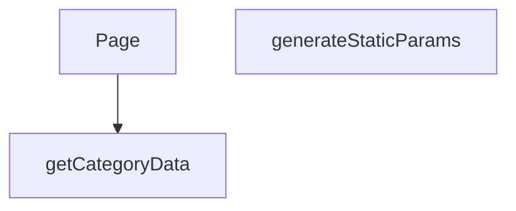

## Genel Bakış
Bu modül, Next.js App Router yapısında dinamik olarak kategori ve alt kategori sayfalarını oluşturur. URL'deki `categorySlug` ve `subCategorySlug` parametrelerine göre sunucu taraflı veri çekerek ilgili sayfayı render eder. Ayrıca, `generateStaticParams` fonksiyonuyla statik site oluşturma (SSG) süreçleri için gerekli parametreleri sağlar.

## Fonksiyon Grupları
### Veri Çekme
Bu grup, belirli bir kategoriye ait verileri harici bir kaynaktan asenkron olarak getirerek sayfa içeriğinin temelini oluşturur.
- getCategoryData

### Sayfa Oluşturma ve Yönlendirme
Bu grup, rota parametrelerini işleyerek hem istemci tarafında dinamik sayfa renderını hem de build zamanında statik sayfa üretimini yönetir.
- Page, generateStaticParams

---

## AXIOMS – Mimari Varsayımlar
Bu modül, bir Next.js sayfa bileşeni olup dinamik kategori sayfaları oluşturmak için sunucu taraflı veri çeker ve statik parametreleri üretir.

[Aksiyom 1]: Eğer `getCategoryData(slug)` fonksiyonuna geçerli bir `slug` parametresi verilmezse veya harici veri kaynağından veri çekme işlemi başarısız olursa, fonksiyon bir hata fırlatmalı veya sayfanın hatalı veri ile oluşturulmasını önleyecek şekilde tanımlı bir boş/hata durumu döndürmelidir.

[Aksiyom 2]: Eğer `generateStaticParams()` fonksiyonu, SSG (Statik Site Oluşturma) süreci için geçerli ve eksiksiz bir `categorySlug` ve `subCategorySlug` kombinasyonları listesi döndürmezse, bazı dinamik sayfalar build aşamasında oluşturulamaz veya hatalı URL'ler oluşur.

[Aksiyom 3]: Eğer `Page` bileşenine iletilen `params` Promise'i çözülemez veya içinde `categorySlug` ya da `subCategorySlug` alanlarından herhangi biri eksik/boş gelirse, bileşen render edilemez veya hatalı bir sayfa sunulur.

[Aksiyom 4]: Eğer `getCategoryData` fonksiyonu, bir `slug` için veri döndürdüğünde, dönen veri yapısı `Page` bileşeninin render edeceği format ile uyumsuzsa (örn: beklenen alanlar eksikse), sayfa render aşamasında hata verir veya bozuk görünür.

[Aksiyom 5]: Eğer `generateStaticParams` fonksiyonu, veri tabanı veya API'den mevcut tüm kategori/alt kategori yapısını çekemezse, statik olarak oluşturulacak sayfa sayısı gerçek yapıyla uyuşmaz; bazı sayfalar atlanır veya gereksiz boş sayfalar oluşur.

---

## FONKSİYON DETAYLARI

### getCategoryData
**Ne yapar**: Verilen bir kategori slug'ı ile veritabanından ilgili kategori verisini çeker ve alanları haritalandırarak domain modeline dönüştürür.

**Nasıl yapar**: Supabase istemcisi kullanarak 'categories' tablosundan belirtilen slug'a sahip tek bir kaydı seçer. Hata oluşursa veya veri bulunamazsa null döner. Veri bulunduğunda, `mapDatabaseCategoryToDomain` yardımcı fonksiyonunu çağırarak ham veritabanı kaydını (`DbCategory`) uygulama içi kullanım için tasarlanmış domain modeline dönüştürür. Bazı alanların tipleri açıkça belirtilerek dönüşüm yapılır.

**Parametreler**:
- slug: `string` — Aranacak kategorinin benzersiz tanımlayıcısı (slug).

**Dönüş**: Başarılı sorgulama ve haritalandırma sonucu bir `DbCategory` nesnesini alan `mapDatabaseCategoryToDomain` fonksiyonunun dönüş değerini döner. Hata durumunda veya veri yokluğunda `null` döner.

### generateStaticParams
**Ne yapar**: Next.js statik site oluşturma (SSG) süreci için, oluşturulan alt kategori sayfalarının URL parametrelerini (lang, categorySlug, subCategorySlug) üreten asenkron bir fonksiyondur.

**Nasıl yapar**: Önce Supabase'den tüm aktif ve `parent_id`'si dolu olan (yani alt kategoriler) kayıtları çeker. Ardından, bu alt kategorilerin ait olduğu üst kategorilerin bilgilerini (id ve slug) ayrı bir sorguyla getirir ve bir haritaya (`parentMap`) dönüştürür. Her bir alt kategori için, üst kategorinin slug'ını haritadan bulur ve 'tr' ile 'en' dil kodları için iki ayrı parametre seti oluşturarak döndürür.

**Parametreler**: Bu fonksiyon parametre almaz.

**Dönüş**: `Promise<Array<{ lang: string; categorySlug: string; subCategorySlug: string }>>` — Statik olarak oluşturulacak tüm alt kategori sayfaları için URL parametrelerini içeren bir dizi. Her bir alt kategori, iki farklı dil (tr ve en) için bir dizi elemanı olarak temsil edilir.

### Page
**Ne yapar**: Bir alt kategori sayfasının React server component'idir. URL parametrelerinden alt kategori slug'ını alır, ilgili kategori ve ürün verilerini getirir ve istemci tarafında render edilecek bileşene aktarır.

**Nasıl yapar**: Fonksiyon, bir `Promise` olarak gelen `params` nesnesini `await` ile çözerek `subCategorySlug` değerine erişir. Bu slug'ı `getCategoryData` fonksiyonuna göndererek kategori bilgisini çeker. Eğer kategori varsa, o kategorideki ürünleri (maksimum 100 adet) `getProductsEnriched` fonksiyonuyla getirir. Son olarak, elde edilen `category` ve `products` başlangıç verilerini (`initialCategory`, `initialProducts`) `PageComponent`'e prop olarak geçirir ve bir `React.Suspense` sarmalayıcısı içinde sunar.

**Parametreler**:
- params: `Promise<{ categorySlug: string, subCategorySlug: string }>` — Next.js tarafından sağlanan, URL segmentlerinden çözülen parametrelerin promise'i. `categorySlug` üst kategoriyi, `subCategorySlug` ise mevcut sayfanın alt kategoriyi temsil eder.

**Dönüş**: JSX elementi döner. Spesifik olarak, `React.Suspense` ile sarılmış ve bir `fallback` (yükleniyor mesajı) içeren `PageComponent` JSX'ini döner.

---

## AST POINTERS

### [N1_NASIL] AST Pointer: [lang]/category/[categorySlug]/[subCategorySlug]/page.tsx::getCategoryData
- **params**: slug: string
- **ic_degiskenler**:
  - `data` — supabase'den dönen category satırı (tüm alanlar: id, name, parent_id, slug, is_active, sort_order, level, image_url, seo_title, seo_desc, created_at, updated_at, description, display_mode, is_featured, marketing_title, menu_label, metadata, translation_key, authority_content)
  - `error` — supabase sorgusundaki hata nesnesi
- **Dönüş**: `mapDatabaseCategoryToDomain()` ile dönüştürülmüş domain kategori nesnesi; hata veya veri yoksa `null`

### [N2_NASIL] AST Pointer: [lang]/category/[categorySlug]/[subCategorySlug]/page.tsx::generateStaticParams
- **params**: (yok)
- **ic_degiskenler**:
  - `data` — aktif ve parent_id'si dolu alt kategorilerin `{slug, parent_id}` kayıtları
  - `parents` — tüm aktif kategorilerin `{id, slug}` kayıtları
  - `parentsList` — `parents` dizisinin `{ id: string, slug: string | null }[]` olarak cast edilmiş hali
  - `parentMap` — kategori id → slug eşlemesi yapan `Map<string, string>`
  - `subCategoriesList` — `data` dizisinin `{ slug: string | null, parent_id: string | null }[]` olarak cast edilmiş hali
- **Dönüş**: `{ lang, categorySlug, subCategorySlug }` objelerinden oluşan statik parametre listesi (her alt kategori tr + en olmak üzere iki satır)

### [N3_NASIL] AST Pointer: [lang]/category/[categorySlug]/[subCategorySlug]/page.tsx::Page
- **params**: { params: Promise<{ categorySlug: string, subCategorySlug: string }> }
- **ic_degiskenler**:
  - `subCategorySlug` — `await params` ile çözülen alt kategori slug'ı
  - `category` — `getCategoryData(subCategorySlug)` çağrısı sonucu dönen domain kategori nesnesi veya `null`
  - `products` — `getProductsEnriched()` ile getirilen `DomainProduct[]` dizisi; category yoksa boş dizi kalır
- **Dönüş**: `React.Suspense` ile sarılmış `<PageComponent initialCategory={category} initialProducts={products} />` JSX'i

---

## MERMAID CALL GRAPH

## NODE ID STANDARD

  file: src\app\[lang]\category\[categorySlug]\[subCategorySlug]\page.tsx
  function: src\app\[lang]\category\[categorySlug]\[subCategorySlug]\page.tsx::getCategoryData
  function: src\app\[lang]\category\[categorySlug]\[subCategorySlug]\page.tsx::generateStaticParams
  function: src\app\[lang]\category\[categorySlug]\[subCategorySlug]\page.tsx::Page

---

## DISA AKTARILANLAR (EXPORTS)
  export: Page
  export: generateStaticParams
  export: getCategoryData

---

## STİL TOKENLERİ

### Arbitrary Değerler (token'a geçirilmemiş)
Yok — tüm stiller token'a geçirilmiş. ✅

### Kullanılan Token'lar (zaten token'a geçirilmiş)
- (yok)

### Tailwind Sınıf Özeti
- **Renkler:** `text-center`, `text-slate-500`
- **Layout:** (yok)
- **Varyant/Responsive:** (yok)
- **Yardımcı Sınıflar:** `container`, `mx-auto`, `px-4`, `py-12`