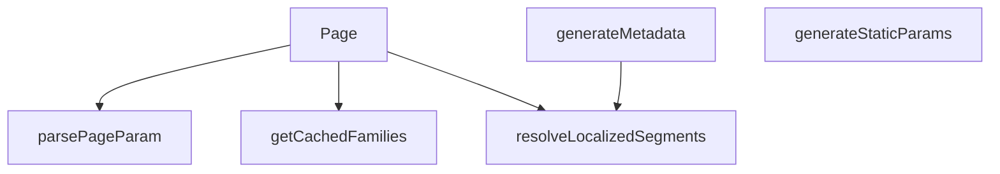

## Genel Bakış

Bu modül, Next.js App Router yapısında `[categorySlug]/[subCategorySlug]` dinamik rotasını temsil eden sunucu tarafı bir sayfa bileşenidir. URL'den gelen dil, kategori ve alt kategori parametrelerini işleyerek ilgili ürün/aile listesini çeker, yerelleştirilmiş içeriği hazırlar ve SEO metadata'sını dinamik olarak üretir. Ayrıca derleme aşamasında oluşturulabilecek tüm olası sayfa kombinasyonlarını belirleyerek statik site oluşturmayı destekler.

## Fonksiyon Grupları

### Sayfa Bileşeni ve Metadata Üretimi
Modülün dışa açılan ana noktasıdır; istek geldiğinde sayfayı render eder ve tarayıcı/motor için gerekli SEO bilgilerini (başlık, açıklama vb.) üretir.
- `Page`, `generateMetadata`

### Veri Çekme ve Önbellekleme
Sayfanın içeriğini oluşturmak için gerekli kategori ve aile verilerini sunucu tarafında asenkron olarak çeker; performans için önbellekleme stratejileri uygular.
- `getCachedFamilies`, `resolveLocalizedSegments`

### Parametre İşleme Yardımcıları
URL'den gelen ham parametreleri (sayfa numarası, slug'lar) geçerli ve kullanıma hazır türlere dönüştürerek hata önleme sağlar.
- `parsePageParam`

### Statik Sayfa Oluşturma Desteği
Build aşamasında Next.js'e sunulması gereken tüm olası dil, kategori ve alt kategori parametrelerini belirleyerek statik dosya üretimini tetikler.
- `generateStaticParams`

---

## AXIOMS – Mimari Varsayımlar

Bu modül, dinamik Next.js rotalarında kategori ve alt kategori sayfalarını sunmak için tasarlanmıştır. Mimari varsayımlar, veri bağımlılıkları, URL parametrelerinin işlenmesi ve statik site oluşturma süreçlerine dayanır.

[Aksiyom 1]: Eğer `lang`, `tenantId` veya `categoryId` geçerli bir değer içermiyorsa, `getCachedFamilies` fonksiyonu hatalı veri döndürür veya hiç veri döndüremez.

[Aksiyom 2]: Eğer `page` parametresi negatif bir tamsayı değeri alırsa, `parsePageParam` fonksiyonu beklenmeyen bir sayfa numarası döndürür (örneğin, 1'den küçük bir değer).

[Aksiyom 3]: Eğer `generateStaticParams` fonksiyonu çalıştırıldığında geçerli bir kategori verisi (tüm olası `categorySlug` ve `subCategorySlug` kombinasyonları) alınamazsa, derleme aşamasında hiçbir statik sayfa oluşturulamaz.

[Aksiyom 4]: Eğer `resolveLocalizedSegments` fonksiyonuna geçersiz bir `category` nesnesi (null veya undefined) veya geçersiz bir `lang` değeri girilirse, localized segmentler (örneğin, `fallbackParentSlug`) doğru çözümlenemez ve URL'ler hatalı oluşturulur.

[Aksiyom 5]: Eğer `generateMetadata` fonksiyonuna geçersiz `params` (geçersiz `categorySlug`, `subCategorySlug` veya `lang`) girilirse, sayfa için metadata (başlık, açıklama vb.) üretilemez ve varsayılan veya boş metadata kullanılır.

[Aksiyom 6]: Eğer `getParentSlugSource` çağrılmazsa veya geçerli bir kaynak döndürmezse, `resolveLocalizedSegments` fonksiyonu fallback değerlerini doğru şekilde çözemeyebilir.

[Aksiyom 7]: Eğer `searchParams` içindeki `page` parametresi tanımlanmamışsa veya geçersiz bir tamsayı (örneğin, negatif veya çok büyük bir değer) ise, `Page` bileşeni varsayılan sayfa numarasını (muhtemelen 1) kullanır.

[Aksiyom 8]: Eğer `getCachedFamilies` fonksiyonu asynchronous olarak çalıştırıldığında zaman aşımı veya ağ hatası oluşursa, `Page` bileşeni veri olmadan render edilir veya hata gösterir.

[Aksiyom 9]: Eğer `tenantId` veya `categoryId` boş string ("") ise, `getCachedFamilies` fonksiyonu beklenmeyen davranış gösterebilir (örneğin, tüm verileri döndürebilir veya hiç veri döndüremeyebilir).

[Aksiyom 10]: Eğer `generateStaticParams` fonksiyonu çok büyük miktarda sayfa kombinasyonu döndürürse, derleme süresi önemli ölçüde uzayabilir ve kaynak tüketimi artabilir.

---

## FONKSİYON DETAYLARI

### getCachedFamilies
**Ne yapar**: Belirli bir dil, kiracı, kategori ve sayfa numarasına karşılık gelen alt kategori aile listesini önbellekten getirir veya hesaplar. Bu fonksiyon, sayfa başına gösterilecek aile listesinin yüksek performanslı bir şekilde sunulmasını sağlar.

**Nasıl yapar**: Fonksiyon, bir önbellekleme mekanizması kullanarak veri erişimini hızlandırır. Docstring'de belirtildiği üzere, önbellek anahtarı `lang + tenantId + kategori + sayfa` formatında oluşturulur (kural 12). Etiketleme stratejisi olarak "KEŞİF" alanı kullanılır; ana sayfa verisi (home-data etiketi) bu önbellek anahtarına dahil edilmez (PS-042). Bu sayede, ana sayfa ile kategori sayfaları arasındaki veri izolasyonu korunur ve gereksiz önbellek ihlalleri önlenir.

**Parametreler**:
- lang: string — İçerik ve arayüzün gösterileceği dil kodu (örn: 'tr', 'en').
- tenantId: string — İsteği yapan kullanıcının ait olduğu kiracı (tenant) tanımlayıcısı.
- categoryId: string — Alt kategorinin ait olduğu üst kategorinin benzersiz tanımlayıcısı.
- page: number — Getirilecek sayfanın 1 tabanlı numarası.

**Dönüş**: Fonksiyonun dönüş tipi doğrudan belirtilmemiş olup, genellikle bir sayfa objesi (items dizisi ve toplam sayfa sayısını içeren bir yapı) döndürmesi beklenir. Ancak kesin dönüş yapısı docstring'de verilmemiştir.

### parsePageParam
**Ne yapar**: URL'deki `?page=` arama parametresini alır ve güvenli bir şekilde 1 tabanlı pozitif bir tam sayıya dönüştürür. Bu fonksiyon, sayfalama parametrelerinin doğrulanmasını ve standartlaştırılmasını sağlayarak hatalı veya eksik girişlere karşı dayanıklılık kazandırır.

**Nasıl yapar**: Fonksiyon, girdi olarak string, string dizisi veya undefined alabilir. Önce girdinin dizi olup olmadığını kontrol eder; eğer dizi ise ilk elemanı kullanır. Ardından bu değeri `parseInt` ile tam sayıya dönüştürmeye çalışır. Sonuç, `isFinite` kontrolünden geçerse ve 1'den büyükse kullanılır; aksi halde varsayılan olarak 1 döner. Bu mantık, geçersiz, negatif veya boş değerlerin güvenli bir şekilde ele alınmasını garanti eder.

**Parametreler**:
- raw: string | string[] | undefined — URL arama parametrelerinden gelen ham `page` değeri. Tek bir string, string dizisi veya tanımsız olabilir.

**Dönüş**: number — Doğrulanmış ve 1 tabanlı sayfa numarası. Geçersiz veya eksik girdiler için her zaman 1 döner.

### generateStaticParams
**Ne yapar**: Next.js'in Statik Site Üretimi (SSG) modu için, derleme zamanında oluşturulacak tüm olası alt kategori sayfalarının parametrelerini üretir. Bu, alt kategori sayfalarının önceden statik olarak oluşturulmasını sağlayarak performansı artırır.

**Nasıl yapar**: Fonksiyon, Supabase veritabanından iki ayrı sorgu çalıştırır. İlk olarak, aktif olan ve bir üst kategorisi (`parent_id` dolu) bulunan tüm alt kategorileri çeker. İkinci olarak, tüm aktif üst kategorileri çeker ve bir harita (Map) oluşturarak üst kategorilerin ID'lerini doğrudan erişilebilir hale getirir. Ardından, her alt kategori için hem 'tr' hem de 'en' dillerinde olmak üzere iki set parametre üretir. `getLocalizedCategorySlug` yardımcı fonksiyonunu kullanarak, her dil için üst ve alt segment slug'larını bulur. Sonuç olarak, her dil ve alt kategori kombinasyonu için bir `{ lang, categorySlug, subCategorySlug }` nesnesi içeren düz bir dizi döner.

**Parametreler**: Bu fonksiyon parametre almaz.

**Dönüş**: Promise<Array<{ lang: string, categorySlug: string, subCategorySlug: string }>> — Statik olarak oluşturulacak sayfaların parametrelerini içeren bir promise. Her eleman, bir sayfanın dilini ve URL segmentlerini belirtir.

### resolveLocalizedSegments
**Ne yapar**: Verilen bir kategori nesnesi için, belirli bir dildeki doğru üst ve alt segment (slug) çiftini belirler. Bu fonksiyon, URL'nin dil ile tutarlı olmasını ve doğru lokalize slug'ların kullanılmasını garanti altına alır.

**Nasıl yapar**: Fonksiyon, öncelikle `getLocalizedCategorySlug` kullanarak verilen dil için alt kategorinin slug'ını üretir. Üst slug için ise, bir fallback değeri (varsayılan) alır. Eğer kategorinin bir üst kategorisi varsa (`parent_id` dolu ise), `getParentSlugSource` fonksiyonunu asenkron olarak çağırarak üst kategorinin verisini çeker. Başarılı olursa, üst kategorinin de lokalize edilmiş slug'ını üretir; başarısız olursa fallback değerini kullanır. Son olarak, her iki slug'ı da içeren bir nesne döner.

**Parametreler**:
- category: NonNullable<Awaited<ReturnType<typeof getCachedCategoryData>>> — Üst verileri önceden getirilmiş, boş olmayan bir kategori nesnesi.
- lang: string — Slug'ların çözüleceği hedef dil.
- fallbackParentSlug: string — Üst kategorinin slug'ı çözülemediğinde veya üst kategori mevcut olmadığında kullanılacak varsayılan üst slug.

**Dönüş**: Promise<{ parentSlug: string, subSlug: string }> — Belirtilen dil için çözülmüş üst ve alt segment slug'larını içeren bir promise.

### generateMetadata
**Ne yapar**: Bir alt kategori sayfası için SEO dostu metadata (başlık, açıklama, kanonik URL ve dil alternatifleri) üretir. Bu fonksiyon, arama motoru optimizasyonu için gerekli olan tüm meta etiketlerini merkezi bir yerden yönetir.

**Nasıl yapar**: Fonksiyon, öncelikle URL parametrelerini (dil, üst ve alt slug) çıkarır. Ardından `getCachedCategoryData` ile alt kategorinin verilerini getirir. Kategori bulunamazsa, dile özgü bir "bulunamadı" başlığı döner. Kategori varsa, `getCategoryDisplayName` ve sözlük (`dict`) kullanarak kullanıcılara görünen adını üretir. Açıklama metni de dil bazlı olarak oluşturulur. En kritik adım, `resolveLocalizedSegments` fonksiyonunu her iki dil ('tr' ve 'en') için çağırarak doğru lokalize URL segmentlerini elde etmektir. Bu sayede, canonical URL ve `hreflang` alternatifleri tutarlı ve doğru diller için üretilir. Canonical URL, mevcut dilin URL'si olarak ayarlanır.

**Parametreler**:
- { params }: { params: Promise<{ categorySlug: string, subCategorySlug: string, lang: string }> } — Next.js tarafından sağlanan, URL segmentlerini ve dil bilgisini içeren asenkron parametre nesnesi.

**Dönüş**: Promise<{ title: string, description?: string, alternates?: { canonical: string, languages: { [lang: string]: string } } }> — Sayfa için metadata objesini içeren bir promise. Bulunamama durumunda sadece başlık döner; aksi halde başlık, açıklama ve alternatif URL'leri içeren bir obje döner.

### Page
**Ne yapar**: Alt kategori sayfasının ana React bileşenini render eder. Bu fonksiyon, veri getirme, yönlendirme mantığı ve arayüzün asenkron hazırlanmasından sorumludur.

**Nasıl yapar**: Fonksiyon, asenkron çalışarak URL parametrelerini ve arama parametrelerini (`page`) alır. `parsePageParam` ile sayfa numarını doğrular. `getCachedCategoryData` ile alt kategorinin verisini getirir. Kategori varsa, dil ile tutarsız slug'ları düzeltmek için `resolveLocalizedSegments` çağırır ve gerekirse 308 (kalıcı) yönlendirme yapar. Ardından, `getCachedFamilies` ile o sayfaya ait aile listesini getirir. Son olarak, `React.Suspense` içinde `PageComponent`'i, gerekli tüm verileri (kategori, aileler, sayfalama bilgisi) prop olarak geçirerek render eder. Suspense'in fallback'i olarak basit bir yükleniyor mesajı gösterilir.

**Parametreler**:
- params: Promise<{ categorySlug: string, subCategorySlug: string, lang: string }> — URL'den gelen ve üst kategori slug'ını, alt kategori slug'ını ve dil kodunu içeren asenkron parametre.
- searchParams: Promise<{ page?: string | string[] }> — URL'nin query kısmından gelen ve sayfa numarasını belirten opsiyonel asenktron parametre.

**Dönüş**: Promise<React.ReactNode> — Render edilecek React bileşenini içeren bir promise. Bu bileşen, sayfanın tüm içeriğini (yükleniyor durumu dahil) temsil eder.

---

## İTHALATLAR (IMPORTS)
- import: ../../../../../config/siteUrl::SITE_URL
- import: ../../../../../lib/cache/tags::PRODUCTS_DISCOVERY_TAG
- import: ../../../../../lib/cache/tags::discoveryTag
- import: ../../../../../lib/data/preload::getCachedCategoryData
- import: ../../../../../types/ui-models::type { FamilyListItem }
- import: ../../../../../utils/tenantServer::getTenantConfig
- import: ../../../../../views/CategoryPage::PageComponent
- import: @/i18n/dictionaries/en::en
- import: @/i18n/dictionaries/tr::tr
- import: @/i18n/getDictValue::getDictValue
- import: @/lib/services/family.service::getFamiliesEnriched
- import: @/lib/supabase/static::supabaseStaticClient
- import: @/utils/categoryHelpers::getCategoryDisplayName
- import: @/utils/categoryHelpers::getLocalizedCategorySlug
- import: next/cache::unstable_cache
- import: next/navigation::permanentRedirect
- import: react::React
- import: react::cache

---

## SABİTLER
- **getParentSlugSource** (call) — `cache(async (parentId: string) => {
  const { data } = await supabase
    ....`

---

## AST POINTERS

### [N1_NASIL] AST Pointer: [lang]/category/[categorySlug]/[subCategorySlug]/page.tsx::getCachedFamilies
- **params**: `lang: string`, `tenantId: string`, `categoryId: string`, `page: number`
- **ic_degiskenler**:
  - Fonksiyon gövdesi tek bir `unstable_cache(...)` çağrısıdır — iç değişken yoktur
- **Dönüş**: `unstable_cache` ile sarılmış `getFamiliesEnriched` sonucu (aile listesi + total), invoke ile tetiklenir

---

### [N2_NASIL] AST Pointer: [lang]/category/[categorySlug]/[subCategorySlug]/page.tsx::parsePageParam
- **params**: `raw: string | string[] | undefined`
- **ic_degiskenler**:
  - `value` — raw dizise ise ilk elemanı, değilse raw'un kendisini alır; tek string'e normalize eder
  - `parsed` — value'yu `Number.parseInt` ile 10 tabanında tam sayıya dönüştürür
- **Dönüş**: `number` — parsed geçerli ve 1'den büyükse parsed, aksi halde 1 döner

---

### [N3_NASIL] AST Pointer: [lang]/category/[categorySlug]/[subCategorySlug]/page.tsx::generateStaticParams
- **params**: yok
- **ic_degiskenler**:
  - `data` — supabase'den çekilen `categories` tablosu satırları (`slug, metadata, parent_id`); aktif ve parent_id'si olan (yani alt kategoriler) kayıtlar
  - `parents` — supabase'den çekilen üst kategoriler tablosu satırları (`id, slug, metadata`); tüm aktif kategoriler (üst + alt)
  - `parentsList` — parents'ın tip güvencesi ile assert edilmiş hali (`{ id, slug, metadata }[]`)
  - `parentMap` — üst kategorilerin `id → { slug, metadata }` eşlemesi; parent_id ile üst kategoriyi hızlıca bulmak için kullanılır
  - `subCategoriesList` — data'nın tip güvencesi ile assert edilmiş hali (`{ slug, metadata, parent_id }[]`)
  - `c` — `flatMap` iterasyonunda her bir alt kategori satırı
  - `parent` — `parentMap.get(c.parent_id || '')` ile bulunan üst kategori nesnesi (bulunamazsa undefined)
  - `lang` — `(['tr', 'en'] as const)` dizisi iterasyonunda her bir dil kodu
- **Dönüş**: `{ lang, categorySlug, subCategorySlug }` nesneleri dizisi — Next.js statik parametre üretimi için

---

### [N4_NASIL] AST Pointer: [lang]/category/[categorySlug]/[subCategorySlug]/page.tsx::resolveLocalizedSegments
- **params**: `category: NonNullable<Awaited<ReturnType<typeof getCachedCategoryData>>>`, `lang: string`, `fallbackParentSlug: string`
- **ic_degiskenler**:
  - `subSlug` — `getLocalizedCategorySlug(category, lang)` çağrısı ile elde edilen dil本土化 alt kategori slug'ı
  - `parentSlug` — başlangıçta `fallbackParentSlug` değerini alır; parent_id varsa üst kategoriden çözülerek güncellenir
  - `parent` — `getParentSlugSource(category.parent_id)` çağrısı ile veritabanından çekilen üst kategori verisi (null olabilir)
- **Dönüş**: `{ parentSlug, subSlug }` — çözümelenmiş yerelleştirilmiş üst ve alt segmentler

---

### [N5_NASIL] AST Pointer: [lang]/category/[categorySlug]/[subCategorySlug]/page.tsx::generateMetadata
- **params**: `{ params: Promise<{ categorySlug, subCategorySlug, lang }> }`
- **ic_degiskenler**:
  - `categorySlug` — `await params` ile çözümlenen üst kategori slug'ı (ham URL segmenti)
  - `subCategorySlug` — `await params` ile çözümlenen alt kategori slug'ı (ham URL segmenti)
  - `lang` — `await params` ile çözümlenen dil kodu (`'tr'` veya `'en'`)
  - `category` — `getCachedCategoryData(subCategorySlug)` ile cached olarak çekilen kategori nesnesi; null ise "not found" metadata döner
  - `dict` — lang `'en'` ise `en` sözlüğü, `'tr'` ise `tr` sözlüğü
  - `t` — `getDictValue(dict, key)` çağrısını saran çeviri fonksiyonu; dict key çözümleyicisi
  - `displayName` — `getCategoryDisplayName(category, t)` ile elde edilen kategorinin görnen adı
  - `desc` — lang'a göre İngilizce veya Türkçe meta açıklama cümlesi; `displayName` interpolasyonu içerir
  - `trSegments` — `resolveLocalizedSegments(category, 'tr', categorySlug)` çağrısı ile Türkçe URL segmentleri
  - `enSegments` — `resolveLocalizedSegments(category, 'en', categorySlug)` çağrısı ile İngilizce URL segmentleri
  - `trUrl` — Türkçe kanonik URL; `SITE_URL`, `trSegments.parentSlug`, `trSegments.subSlug` birleştirilir
  - `enUrl` — İngilizce kanonik URL; `SITE_URL`, `enSegments.parentSlug`, `enSegments.subSlug` birleştirilir
  - `canonicalUrl` — lang `'en'` ise `enUrl`, aksi halde `trUrl`
- **Dönüş**: `{ title, description, alternates: { canonical, languages } }` — Next.js metadata nesnesi

---

### [N6_NASIL] AST Pointer: [lang]/category/[categorySlug]/[subCategorySlug]/page.tsx::Page
- **params**: `{ params: Promise<{ categorySlug, subCategorySlug, lang }>, searchParams: Promise<{ page?: string | string[] }> }`
- **ic_degiskenler**:
  - `categorySlug` — `await params` ile çözümlenen üst kategori slug'ı (ham URL segmenti)
  - `subCategorySlug` — `await params` ile çözümlenen alt kategori slug'ı (ham URL segmenti)
  - `lang` — `await params` ile çözümlenen dil kodu
  - `pageParam` — `await searchParams` ile çözümlenen `page` arama parametresi (string veya string[] veya undefined)
  - `page` — `parsePageParam(pageParam)` çağrısı ile parse edilmiş sayfa numarası
  - `category` — `getCachedCategoryData(subCategorySlug)` ile cached kategori nesnesi; null ise empty liste ile render edilir
  - `dict` — lang `'en'` ise `en` sözlüğü, `'tr'` ise `tr` sözlüğü; loading fallback metni için kullanılır
  - `parentSlug` — `resolveLocalizedSegments` sonucu elde edilen çözümlenmiş üst kategori slug'ı
  - `subSlug` — `resolveLocalizedSegments` sonucu elde edilen çözümlenmiş alt kategori slug'ı
  - `families` — `FamilyListItem[]` tipinde; başlangıçta boş dizi, kategori varsa `getCachedFamilies` ile doldurulur
  - `total` — number; başlangıçta 0, kategori varsa `getCachedFamilies` sonucunun `total` değeri ile güncellenir
  - `tenantId` — `getTenantConfig()` ile çekilen tenant yapılandırmasının `id` değeri
  - `familiesPage` — `getCachedFamilies(lang, tenantId, category.id, page)` sonucu; `{ items, total }` yapısındadır
- **Dönüş**: `React.Suspense` ile sarılmış `PageComponent` JSX'i; kategori bulunamazsa empty aile listesi ile render edilir; slug uyumsuzluğunda `permanentRedirect` ile 308 yönlendirme yapar (yan etki)

---

## MERMAID CALL GRAPH

## NODE ID STANDARD

  file: src\app\[lang]\category\[categorySlug]\[subCategorySlug]\page.tsx
  function: src\app\[lang]\category\[categorySlug]\[subCategorySlug]\page.tsx::getCachedFamilies
  function: src\app\[lang]\category\[categorySlug]\[subCategorySlug]\page.tsx::parsePageParam
  function: src\app\[lang]\category\[categorySlug]\[subCategorySlug]\page.tsx::generateStaticParams
  function: src\app\[lang]\category\[categorySlug]\[subCategorySlug]\page.tsx::resolveLocalizedSegments
  function: src\app\[lang]\category\[categorySlug]\[subCategorySlug]\page.tsx::generateMetadata
  function: src\app\[lang]\category\[categorySlug]\[subCategorySlug]\page.tsx::Page

---

## DISA AKTARILANLAR (EXPORTS)
  export: Page
  export: generateMetadata
  export: generateStaticParams
  export: getCachedFamilies
  export: parsePageParam
  export: resolveLocalizedSegments

---

## STİL TOKENLERİ

### Arbitrary Değerler (token'a geçirilmemiş)
Yok — tüm stiller token'a geçirilmiş. ✅

### Kullanılan Token'lar (zaten token'a geçirilmiş)
- (yok)

### Tailwind Sınıf Özeti
- **Renkler:** `text-center`, `text-slate-500`
- **Layout:** (yok)
- **Varyant/Responsive:** (yok)
- **Yardımcı Sınıflar:** `container`, `mx-auto`, `px-4`, `py-12`