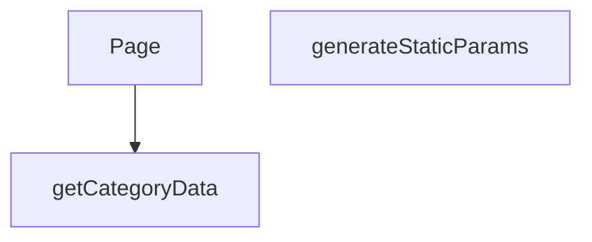

## Genel Bakış
Bu modül, Next.js uygulamasındaki dinamik rotaları kullanarak kategori ve alt kategori sayfalarını sunucu tarafında sunar. Temel amacı, URL'den gelen `categorySlug` ve `subCategorySlug` parametrelerini işleyerek ilgili sayfa verisini çekmek ve istemciye sunmaktır. Ayrıca, statik site oluşturma (SSG) sürecinde derleme aşamasında oluşturulacak tüm olası sayfa kombinasyonlarını belirleyerek build işlemini destekler.

## Fonksiyon Grupları
### Veri Temini ve İşleme
Modülün temel veri bağımlılığını karşılar; belirli bir alt kategorinin verisini dış kaynaktan asenkron olarak çeker ve sayfanın içeriğini oluşturmak için işlenmek üzere hazır hale getirir.
- getCategoryData

### Sayfa Rotalama ve Statik Oluşturma
URL parametrelerini (slug'ları) işleyerek hem istek anında sayfa bileşeninin render edilmesini yönetir hem de build aşamasında statik olarak oluşturulacak tüm sayfa yollarını (parametrelerini) belirleyerek uygulama yapılandırmasını destekler.
- Page, generateStaticParams

---

## AXIOMS – Mimari Varsayımlar

Bu modül, Next.js App Router'da dinamik kategori/alt kategori sayfalarını sunucu tarafında render eden bir sayfa bileşenidir.

[Aksiyom 1]: Eğer `getCategoryData` fonksiyonuna geçerli bir `slug` string'i sağlanmazsa, veri çekme işlemi başarısız olur veya hatalı veri döner.

[Aksiyom 2]: Eğer `Page` bileşeninin `params` parametresinde `categorySlug`, `subCategorySlug` veya `lang` alanlarından herhangi biri eksikse, sayfa render edilemez.

[Aksiyom 3]: Eğer `generateStaticParams` fonksiyonu, build aşamasında tüm olası kategori/alt kategori kombinasyonlarını döndürmezse, eksik sayfalar oluşturulmaz.

[Aksiyom 4]: Eğer `getCategoryData` tarafından erişilen dış veri kaynakçası (API/DB) erişilemez durumdaysa, sayfa veri olmadan render edilir veya hata fırlatır.

[Aksiyom 5]: Eğer `params` Promise'i çözülmezse veya geçersiz bir değer döndürürse, `Page` bileşeni doğru parametreleri alamaz ve sayfa hatalı çalışır.

---

## FONKSİYON DETAYLARI

### getCategoryData
**Ne yapar**: Verilen bir kategori slug'ı ile veritabanından ilgili kategori verisini çeker ve alanları haritalandırarak domain modeline dönüştürür.

**Nasıl yapar**: Supabase istemcisi kullanarak 'categories' tablosundan belirtilen slug'a sahip tek bir kaydı seçer. Hata oluşursa veya veri bulunamazsa null döner. Veri bulunduğunda, `mapDatabaseCategoryToDomain` yardımcı fonksiyonunu çağırarak ham veritabanı kaydını (`DbCategory`) uygulama içi kullanım için tasarlanmış domain modeline dönüştürür. Bazı alanların tipleri açıkça belirtilerek dönüşüm yapılır.

**Parametreler**:
- slug: `string` — Aranacak kategorinin benzersiz tanımlayıcısı (slug).

**Dönüş**: Başarılı sorgulama ve haritalandırma sonucu bir `DbCategory` nesnesini alan `mapDatabaseCategoryToDomain` fonksiyonunun dönüş değerini döner. Hata durumunda veya veri yokluğunda `null` döner.

### generateStaticParams
**Ne yapar**: Next.js statik site oluşturma (SSG) süreci için, oluşturulan alt kategori sayfalarının URL parametrelerini (lang, categorySlug, subCategorySlug) üreten asenkron bir fonksiyondur.

**Nasıl yapar**: Önce Supabase'den tüm aktif ve `parent_id`'si dolu olan (yani alt kategoriler) kayıtları çeker. Ardından, bu alt kategorilerin ait olduğu üst kategorilerin bilgilerini (id ve slug) ayrı bir sorguyla getirir ve bir haritaya (`parentMap`) dönüştürür. Her bir alt kategori için, üst kategorinin slug'ını haritadan bulur ve 'tr' ile 'en' dil kodları için iki ayrı parametre seti oluşturarak döndürür.

**Parametreler**: Bu fonksiyon parametre almaz.

**Dönüş**: `Promise<Array<{ lang: string; categorySlug: string; subCategorySlug: string }>>` — Statik olarak oluşturulacak tüm alt kategori sayfaları için URL parametrelerini içeren bir dizi. Her bir alt kategori, iki farklı dil (tr ve en) için bir dizi elemanı olarak temsil edilir.

### Page
**Ne yapar**: Bu fonksiyon, bir alt kategori sayfasını sunucu tarafında render eden bir Next.js sayfa bileşenidir. Asenkron olarak çalışarak gerekli verileri (kategori bilgisi ve ürün listesi) sunucuda çeker ve istemciye bir yükleme durumu (Suspense) ile birlikte sunulacak bir bileşen döndürür.

**Nasıl yapar**: Fonksiyon, `params` prop'unu `await` ederek `subCategorySlug` ve `lang` değerlerini çıkarır. Ardından `getCategoryData` asenkron fonksiyonunu çağırarak ilgili kategori bilgisini alır. Dil tercihine göre (`lang` parametresi) İngilizce (`en`) veya Türkçe (`tr`) sözlük nesnesini seçer. Eğer kategori başarıyla retrieve edilmişse (`category` mevcutsa), `getProductsEnriched` fonksiyonunu kullanarak o kategoriye ait ürünleri (maksimum 100 adet) çeker. Son olarak, çekilen verileri `PageComponent` bileşenine `initialCategory` ve `initialProducts` olarak props olarak iletir ve bunu bir `React.Suspense` zarfı içinde, bir fallback (yükleniyor mesajı) ile birlikte döndürür.

**Parametreler**:
- `params`: `Promise<{ categorySlug: string, subCategorySlug: string, lang: string }>` — Sayfa route parametrelerini içeren asenkron bir nesne. `categorySlug`, `subCategorySlug` ve `lang` (dil kodu) alanlarını barındırır. `await` ile çözümlenerek kullanım için hazır hale getirilir.

**Dönüş**: `JSX.Element` — Asenkron olarak hazırlanmış, `PageComponent`'i `React.Suspense` ile sarmalayan bir JSX bileşeni döndürür. `PageComponent`, başlangıç kategori verisi ve ürün listesi ile beslenerek istemci tarafında render edilmeye hazır hale getirilir.

---

## AST POINTERS

### [N1_NASIL] AST Pointer: `[lang]/category/[categorySlug]/[subCategorySlug]/page.tsx`::getCategoryData
- **params**: `slug: string` — Veritabanında eşleşecek kategorinin slug değeri
- **ic_degiskenler**:
  - `data` — Supabase sorgusundan dönen tek satır kategori verisi; alanlar: `id`, `name`, `parent_id`, `slug`, `is_active`, `sort_order`, `level`, `image_url`, `seo_title`, `seo_desc`, `created_at`, `updated_at`, `description`, `display_mode`, `is_featured`, `marketing_title`, `menu_label`, `metadata`, `translation_key`, `authority_content`
  - `error` — Supabase sorgusundan dönen hata nesnesi; hata yoksa `null`
  - `data.name` — Kategorinin adı, `null` ise boş string'e defaultlanır
  - `data.menu_label` — Kategorinin menü etiketi, `string | null` olarak cast edilir
  - `data.marketing_title` — Kategorinin pazarlama başlığı, `string | null` olarak cast edilir
  - `data.translation_key` — Kategorinin çeviri anahtarı, `string | null` olarak cast edilir
  - `data.description` — Kategorinin açıklaması, `string | null` olarak cast edilir
  - `data.metadata` — Kategorinin metadata nesnesi, `CategoryMetadata | null` olarak cast edilir
  - `data.authority_content` — Kategorinin otorite içeriği, `AuthorityContent | null` olarak cast edilir
- **Dönüş**: `mapDatabaseCategoryToDomain(...)` ile oluşturulmuş domain kategori nesnesi; hata veya veri yoksa `null`

---

## MERMAID CALL GRAPH

## NODE ID STANDARD

  file: src\app\[lang]\category\[categorySlug]\[subCategorySlug]\page.tsx
  function: src\app\[lang]\category\[categorySlug]\[subCategorySlug]\page.tsx::getCategoryData
  function: src\app\[lang]\category\[categorySlug]\[subCategorySlug]\page.tsx::generateStaticParams
  function: src\app\[lang]\category\[categorySlug]\[subCategorySlug]\page.tsx::Page

---

## DISA AKTARILANLAR (EXPORTS)
  export: Page
  export: generateStaticParams
  export: getCategoryData

---

## STİL TOKENLERİ

### Arbitrary Değerler (token'a geçirilmemiş)
Yok — tüm stiller token'a geçirilmiş. ✅

### Kullanılan Token'lar (zaten token'a geçirilmiş)
- (yok)

### Tailwind Sınıf Özeti
- **Renkler:** `text-center`, `text-slate-500`
- **Layout:** (yok)
- **Varyant/Responsive:** (yok)
- **Yardımcı Sınıflar:** `container`, `mx-auto`, `px-4`, `py-12`