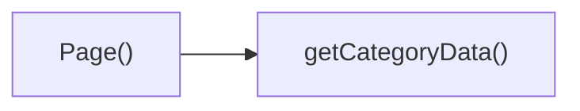

## Genel Bakış
Bu modül, URL'deki `categorySlug` ve `subCategorySlug` parametrelerine göre ilgili alt kategori sayfasını sunucu tarafında hazırlar. `Page` bileşeni, rota parametrelerini alır ve `getCategoryData` fonksiyonu yardımıyla gerekli kategori verisini çekerek sayfanın render edilmesini sağlar.

## Fonksiyon Grupları
### Veri Çekme
Bu grup, verilen slug değerine karşılık gelen kategori verisini asenkron olarak dış kaynaktan (API, veritabanı vb.) alır.
- getCategoryData

### Sayfa Oluşturma
Bu grup, rota parametrelerini çözümler, veri çekme fonksiyonunu çağırarak gerekli veriyi elde eder ve bu veriyi kullanarak sayfanın React bileşenini oluşturup döndürür.
- Page

---

## AXIOMS – Mimari Varsayımlar
Bu modül için özel aksiyom tanımlanmamıştır.

---

---

## FONKSIYON DETAYLARI

### getCategoryData
**Ne yapar**: Verilen bir slug (kısa ad) ile bir kategori verisini getirir. Kategori sayfasında kullanılmak üzere kategori bilgilerini sağlar.  
**Nasıl yapar**: İç işleyiş bu kod parçasında bulunmamaktadır. Mevcut bilgiye göre, tek parametre olarak bir string alır ve muhtemelen bir veri kaynağından kategori bilgilerini alır.  
**Parametreler**:  
- slug: string — Getirilecek kategorinin benzersiz tanımlayıcısı (slug).  
**Dönüş**: Kod parçasında dönüş tipi belirtilmemiştir (void veya bilinmiyor).

### Page
**Ne yapar**: Next.js App Router’da tanımlanmış dinamik bir sayfa bileşenidir. `[categorySlug]` ve `[subCategorySlug]` route parametrelerini alarak ilgili kategori alt sayfasını oluşturur ve `PageComponent`’i gerekli başlangıç verileriyle render eder.  
**Nasıl yapar**: `params` prop’u aracılığıyla route parametrelerini bir `Promise` olarak alır. Bu Promise çözümlenerek `categorySlug` ve `subCategorySlug` değerleri elde edilir (await mekanizması ile). Daha sonra bu değerler kullanılarak kategori ve ürün verileri çekilir (veri çekme mantığı bu kodda gösterilmemiştir). Elde edilen `category` ve `products` değişkenleri `PageComponent`’e `initialCategory` ve `initialProducts` prop’ları olarak iletilir ve bileşen döndürülür.  
**Parametreler**:  
- params: Promise<{ categorySlug: string, subCategorySlug: string }> — Next.js tarafından sağlanan, sayfanın route parametrelerini içeren Promise nesnesi. `categorySlug` üst kategoriyi, `subCategorySlug` alt kategoriyi belirtir.  
**Dönüş**: `<PageComponent initialCategory={category} initialProducts={products} />` ifadesiyle bir JSX elementi (React bileşeni) döndürür. Bu bileşen ilgili kategori ve ürün listesini başlangıç verisi olarak alır.

---

## AST POINTERS

### [N1_NASIL] AST Pointer: C:\Users\alize\venthub-hvac\src\app\category\[categorySlug]\[subCategorySlug]\page.tsx::getCategoryData
- **params**: `slug` (string) — Kategori slug değeri. Supabase sorgusunda filtreleme için kullanılır.
- **ic_degiskenler**:
  - `data` — `supabase.from('categories').select(...).eq('slug', slug).single()` sonucundan alınan veri (DbCategory tipinde). İçerdiği alanlar: `name`, `menu_label`, `marketing_title`, `translation_key`, `description`, `metadata`, `authority_content`. Bu alanlar spread operatörü ile `mapDatabaseCategoryToDomain` fonksiyonuna aktarılır.
  - `error` — Supabase sorgusunda oluşan hata. `null` ise hata yok demektir.
- **Dönüş**: `null` (veri bulunamazsa veya hata oluşursa) ya da `mapDatabaseCategoryToDomain` fonksiyonunun dönüş değeri (DomainCategory tipinde).

### [N2_NASIL] AST Pointer: C:\Users\alize\venthub-hvac\src\app\category\[categorySlug]\[subCategorySlug]\page.tsx::Page
- **params**: `params` (Promise<{ categorySlug: string; subCategorySlug: string }>) — await edilerek `subCategorySlug` değeri elde edilir.
- **ic_degiskenler**:
  - `subCategorySlug` — `params` Promise'inden destructuring ile alınan alt kategori slug değeri. `getCategoryData(subCategorySlug)` çağrısında kullanılır.
  - `category` — `getCategoryData(subCategorySlug)` dönüş değeri. `null` veya DomainCategory tipinde. Eğer `category` varsa, `category.id` ile `getProductsEnriched` sorgusuna parametre olarak verilir.
  - `products` — `DomainProduct` dizisi. Başlangıçta boş; `category` varsa `getProductsEnriched` ile doldurulur. Son olarak `<PageComponent>` bileşenine `initialProducts` prop'u olarak aktarılır.
- **Dönüş**: React JSX öğesi (`<PageComponent initialCategory={category} initialProducts={products} />`) döndürülür.

---

## ÇAĞRI HARİTASI

### Disariya Cagrilar (Outgoing)
Page fonksiyonu, kategori verilerini almak için aynı dosyadaki getCategoryData fonksiyonunu çağırmaktadır.

### Disaridan Cagrilanlar (Incoming)
Sağlanan verilerde, bu modülde tanımlı fonksiyonları çağıran herhangi bir harici dosya veya modül belirtilmemiştir.

### Ic Ice Fonksiyonlar (Nested)
Yok.

---

## DOSYA-İÇİ ÇAĞRI GRAFİĞİ
  Page() → getCategoryData()

---

## NODE ID STANDARD

  file: src\app\category\[categorySlug]\[subCategorySlug]\page.tsx
  function: src\app\category\[categorySlug]\[subCategorySlug]\page.tsx::getCategoryData
  function: src\app\category\[categorySlug]\[subCategorySlug]\page.tsx::Page

---

## DISA AKTARILANLAR (EXPORTS)
  export: Page
  export: getCategoryData