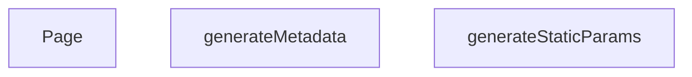

## Genel Bakış
Bu modül, Next.js App Router yapısında dinamik kategori sayfalarını sunar. URL'deki `categorySlug` parametresine göre sayfa içeriğini, SEO meta bilgilerini ve statik üretim parametrelerini yönetir. Modül, hem sunucu taraflı veri çekme hem de istemci tarafı arayüz sunma sorumluluğunu taşır.

## Fonksiyon Grupları

### Statik Üretim Yapılandırması
Uygulama derleme aşamasında hangi kategori slug'larının önceden üretileceğini belirleyerek statik site oluşturma sürecini yönetir.
- `generateStaticParams`

### SEO Meta Bilgisi Oluşturma
Dinamik kategori sayfasının tarayıcı ve arama motorları için başlık, açıklama gibi meta bilgilerini üretir.
- `generateMetadata`

### Sayfa Bileşeni
Kategori sayfasının ana React bileşenini oluşturarak kullanıcının gördüğü arayüzü render eder.
- `Page`

---

## AXIOMS – Mimari Varsayımlar
Bu modül, dinamik kategori sayfalarının URL parametreleri ile çalışması için aşağıdaki mimari varsayımlara bağlıdır.

[Aksiyom 1]: Eğer `categorySlug` parametresi geçerli bir string değeri içermiyorsa, `generateMetadata` ve `Page` fonksiyonları doğru meta

---

## FONKSİYON DETAYLARI

### generateStaticParams
**Ne yapar**: Bu fonksiyon, Next.js'in statik site oluşturma (SSG) süreci için dinamik rotaların önceden oluşturulacak tüm olası parametrelerinin listesini üretir. Temel amacı, derleme zamanında (build time) hangi dil ve kategori kombinasyonları için HTML dosyası oluşturulacağını belirlemektir.
**Nasıl yapar**: Fonksiyon, Supabase veritabanından aktif (`is_active` alanı true olan) tüm kategorilerin `slug` alanını çeker. Gelen her bir kategori nesnesi için, varsayılan olarak Türkçe (`tr`) ve İngilizce (`en`) olmak üzere iki ayrı dil parametresi oluşturur. Bu sayede her kategori slug'ı için iki farklı URL yolu (örn: `/tr/category/xxx` ve `/en/category/xxx`) önceden derlenebilir hale gelir.
**Parametreler**:
- Fonksiyon parametre almaz.
**Dönüş**: `{ lang: string, categorySlug: string }` nesnelerinden oluşan bir dizi. Her bir nesne, oluşturulacak bir sayfanın dinamik parametrelerini temsil eder.

### generateMetadata
**Ne yapar**: Bu fonksiyon, belirli bir kategori sayfası için SEO (Arama Motoru Optimizasyonu) ve sosyal paylaşım (Open Graph) amaçlı HTML `<head>` bölümündeki meta etiketlerinin dinamik içeriğini üretir. Sayfanın arama motorlarındaki görünürlüğünü ve sosyal medyada paylaşım appearance'ını belirler.
**Nasıl yapar**: Fonksiyon, URL'den gelen `categorySlug` parametresini alır ve önbelleklenmiş bir veri çekme fonksiyonu olan `getCachedCategoryData` ile ilgili kategori verisini sunucu tarafında (SSR) getirir. Kategori bulunamazsa, varsayılan bir "Kategori Bulunamadı" başlığı döndürür. Kategori mevcutsa, kategori adını ve açıklamasını kullanarak dinamik bir `title`, `description`, `canonical` URL ve `openGraph` nesnesi (başlık, açıklama, URL, site adı, görsel, dil, tür bilgileri dahil) oluşturur. Görsel için öncelikle kategorinin kendi `image_url` alanını, eğer bu boşsa varsayılan bir görsel yolunu kullanır.
**Parametreler**:
- name: params — Sayfanın dinamik parametrelerini içeren bir nesne.
- type: `Promise<{ categorySlug: string }>` — Parametreler asenkron olarak çözümlenir, bu yüzden bir Promise'tır.
- description: URL yolundan gelen `categorySlug` bilgisini taşır. Bu değer, kategori verisini çekmek ve SEO etiketlerini buna göre oluşturmak için kullanılır.
**Dönüş**: `Metadata` tipinde bir nesne. Bu nesne, Next.js tarafından otomatik olarak HTML `<head>` bölümüne meta etiketleri olarak enjekte edilir.

### Page

**Ne yapar**: Kategori sayfasını sunucu tarafında render eden asenkron React Server Component'tir. Verilen `categorySlug` parametresine göre kategori verisini, alt kategorileri ve ürünleri çeker, SEO için JSON-LD yapılandırması oluşturur ve sayfa bileşenini döndürür.

**Nasıl yapar**: Fonksiyon önce `params` Promise'ını await ederek `categorySlug` değerini çıkarır. Ardından `preloadCategory` ile veriyi önceden yükler ve `getCachedCategoryData` ile önbelleklenmiş kategori verisini alır. Kategori mevcutsa, Supabase üzerinden aktif alt kategorileri `sort_order` sırasıyla çeker ve `mapDatabaseCategoryToDomain` fonksiyonuyla domain modeline dönüştürür. Son olarak `getProductsEnriched` ile hem ana kategori hem alt kategorilere ait ürünleri çeker. JSON-LD markup'u oluşturduktan sonra `PageComponent`'i Suspense sarıcı içinde render eder.

**Parametreler**:
- `params`: `Promise<{ categorySlug: string }>` — URL'den gelen ve asenkron olarak çözümlenen parametreler objesi, `categorySlug` alanını içerir

**Dönüş**: `JSX.Element` — JSON-LD script etiketi ve Suspense ile sarılmış `PageComponent` bileşenini içeren JSX yapısı döndürür. Kategori bulunamazsa boş ürünler ve alt kategoriler listesi ile render edilir.

---

## SABİTLER
- **_getCachedSupabaseData** (call) — `cache((id: string) => {

  return supabase.from('categories').select('*').eq(...`

---

## AST POINTERS

### [N1_NASIL] AST Pointer: [lang]/category/[categorySlug]/page.tsx::_getCachedSupabaseData
- **params**: `(id: string)`
- **ic_degiskenler**:
  - `id` — Supabase'den getirilecek kategorinin benzersiz kimliği
- **Dönüş**: Supabase single() sorgu sonucu (Promise)

---

### [N2_NASIL] AST Pointer: [lang]/category/[categorySlug]/page.tsx::generateStaticParams
- **params**: (parametre yok)
- **ic_degiskenler**:
  - `data` — Supabase'den dönen aktif kategorilerin slug listesi
  - `categoriesList` — `data`'nın cast edilmiş hali; `{ slug: string | null }[]` dizisi, her eleman bir kategoriyi temsil eder
- **Dönüş**: `{ lang: string, categorySlug: string }[]` — Tüm aktif kategoriler için `tr` ve `en` dillerinde statik parametre çiftleri üretir

---

### [N3_NASIL] AST Pointer: [lang]/category/[categorySlug]/page.tsx::_mapCategoryToParams
- **params**: `(c: { slug: string | null })`
- **ic_degiskenler**:
  - `c` — Tek bir kategori nesnesi, slug alanı içeren
- **Dönüş**: `{ lang: string, categorySlug: string }[]` — Tek kategoriyi `tr` ve `en` için iki parametre nesnesine dönüştürür; `c.slug` null ise boş string kullanılır

---

### [N4_NASIL] AST Pointer: [lang]/category/[categorySlug]/page.tsx::generateMetadata
- **params**: `({ params }: { params: Promise<{ categorySlug: string }> })`
- **ic_degiskenler**:
  - `categorySlug` — URL'den gelen kategori slug'ı, `params` promise'ının await ile çözülmesinden elde edilir
  - `category` — `getCachedCategoryData` ile önbellekten getirilen kategori verisi; `DomainCategory` veya `null`
  - `title` — (return içinde inline) Sayfa başlık metni
  - `description` — (return içinde inline) Sayfa açıklama metni
  - `canonical` — (return içinde inline) Canonical URL; `SITE_URL` sabiti ve `categorySlug` ile oluşturulur
  - `openGraph` — (return içinde inline) OpenGraph metadata nesnesi; title, description, url, siteName, images, locale, type alanlarını içerir
  - `images[0].url` — OpenGraph görsel URL'si; `category.image_url` varsa kullanılır, yoksa `/images/og-default.jpg` fallback'i devreye girer
- **Dönüş**: `Metadata` nesnesi — Next.js metadata API'si için sayfa SEO bilgilerini döndürür (title, description, alternates, openGraph)

---

### [N5_NASIL] AST Pointer: [lang]/category/[categorySlug]/page.tsx::Page
- **params**: `({ params }: { params: Promise<{ categorySlug: string }> })`
- **ic_degiskenler**:
  - `categorySlug` — URL'den gelen kategori slug'ı, `params` promise'ının await ile çözülmesinden elde edilir
  - `category` — `getCachedCategoryData` ile önbellekten getirilen kategori verisi; `DomainCategory` veya `null`
  - `products` — `DomainProduct[]` dizisi; kategori ve alt kategorilere ait zenginleştirilmiş ürün listesi, başlangıçta boş dizi
  - `subCategories` — `DomainCategory[]` dizisi; alt kategorilerin domain nesnelerine dönüştürülmüş hali, başlangıçta boş dizi
  - `subsData` — Supabase'den dönen ham alt kategori satırları; `category` mevcutsa `parent_id` eşleşmesiyle çekilir
  - `categoriesArray` — `subsData`'nın `DbCategory[]` tipine cast edilmiş hali; Supabase'den gelen ham veri
  - `s` (`categoriesArray` map içindeki her bir eleman) — Ham alt kategori satırı; `mapDatabaseCategoryToDomain`'a girdi olarak gönderilir; `id`, `name`, `parent_id`, `slug`, `is_active`, `sort_order`, `level`, `image_url`, `seo_title`, `seo_desc`, `created_at`, `updated_at`, `description`, `display_mode`, `is_featured`, `marketing_title`, `menu_label`, `metadata`, `translation_key`, `authority_content` alanlarını içerir
  - `s.name` — Alt kategori adı; null ise boş string fallback'i kullanılır
  - `s.menu_label` — Menü etiketi; `string | null` olarak cast edilir
  - `s.marketing_title` — Pazarlama başlığı; `string | null` olarak cast edilir
  - `s.translation_key` — Çeviri anahtarı; `string | null` olarak cast edilir
  - `s.description` — Alt kategori açıklaması; `string | null` olarak cast edilir
  - `s.metadata` — Kategori meta verisi; `CategoryMetadata | null` olarak cast edilir
  - `s.authority_content` — Otorite/içerik bilgisi; `AuthorityContent | null` olarak cast edilir
  - `categoryIds` — `number[]` dizisi; ana kategori ID'si ve tüm alt kategori ID'lerinin birleşimi; `getProductsEnriched` sorgusuna filtre olarak gönderilir
  - `jsonLd` — JSON-LD structured data nesnesi; `CollectionPage` tipinde; `name`, `description`, `url`, `numberOfItems`, `itemListElement` alanlarını içerir
  - `prod` — `itemListElement` map işleminde her bir ürün nesnesi; `slug` alanı filtreleme ve URL oluşturma için kullanılır
  - `index` — `itemListElement` map işleminde ürünün sırası (0'dan başlar); `position` alanı `index + 1` olarak hesaplanır
- **Dönüş**: JSX — JSON-LD script etiketi ve `PageComponent`'i sarmalayan `React.Suspense` bileşenini içeren React fragment; `initialCategory`, `initialProducts`, `initialSubCategories` props olarak iletilir

---

## MERMAID CALL GRAPH

## NODE ID STANDARD

  file: src\app\[lang]\category\[categorySlug]\page.tsx
  function: src\app\[lang]\category\[categorySlug]\page.tsx::generateStaticParams
  function: src\app\[lang]\category\[categorySlug]\page.tsx::generateMetadata
  function: src\app\[lang]\category\[categorySlug]\page.tsx::Page

---

## DISA AKTARILANLAR (EXPORTS)
  export: Page
  export: generateMetadata
  export: generateStaticParams

---

## STİL TOKENLERİ

### Arbitrary Değerler (token'a geçirilmemiş)
Yok — tüm stiller token'a geçirilmiş. ✅

### Kullanılan Token'lar (zaten token'a geçirilmiş)
- (yok)

### Tailwind Sınıf Özeti
- **Renkler:** `text-center`, `text-slate-500`
- **Layout:** (yok)
- **Varyant/Responsive:** (yok)
- **Yardımcı Sınıflar:** `container`, `mx-auto`, `px-4`, `py-12`