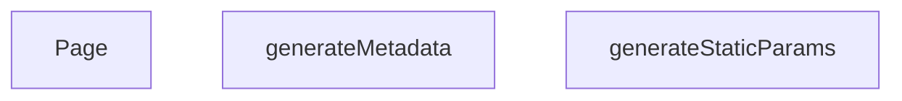

## Genel Bakış
Bu modül, Next.js App Router yapısında dinamik kategori sayfalarını sunmakla sorumludur. URL'deki `categorySlug` parametresine göre sayfa içeriğini, SEO meta bilgilerini ve statik üretim parametrelerini yönetir. Hem derleme zamanında önceden üretim yapılandırmasını hem de çalışma zamanında sayfa arayüzünü oluşturur.

## Fonksiyon Grupları

### Statik Üretim Yapılandırması
Derleme aşamasında hangi kategori sayfalarının önceden üretileceğini belirleyerek statik site oluşturma sürecini yönetir.
- `generateStaticParams`

### SEO Meta Bilgisi Oluşturma
Her kategori sayfası için tarayıcı ve arama motorlarına sunulacak başlık, açıklama gibi meta verilerini dinamik olarak üretir.
- `generateMetadata`

### Sayfa Bileşeni
Kullanıcının tarayıcıda gördüğü kategori sayfasının ana arayüzünü oluşturur ve içeriği render eder.
- `Page`

---

## AXIOMS – Mimari Varsayımlar

Bu modül, Next.js App Router yapısında dinamik kategori sayfaları için params tabanlı veri getirme ve statik üretim yapılandırması üzerine kurulmuştur.

**[Aksiyom 1]**: `_getCachedSupabaseData` çağrılamaz veya geçerli bir veri dönmezse, sayfa içeriği boş/eksik render edilir.

**[Aksiyom 2]**: `generateStaticParams()` geçerli bir `categorySlug` ve `lang` değerleri içeren dizi dönmezse, derleme zamanında hiçbir kategori sayfası önceden üretilmez.

**[Aksiyom 3]**: `generateMetadata`'ya aktarılan `params` Promise'i `{ categorySlug: string, lang: string }` yapısına çözülmezse, SEO meta bilgileri hata ile oluşturulur.

**[Aksiyom 4]**: `Page` bileşenine aktarılan `params` Promise'i `{ categorySlug: string, lang: string }` yapısına çözülmezse, sayfa render edilemez.

**[Aksiyom 5]**: `lang` parametresi geçerli bir dil kodu (locale) içermiyorsa, i18n yönlendirmesi veya içerik dil seçimi hatalı çalışır. (Eşik değerleri: bilinmiyor — fonksiyon gövdesinde tanımlı değil.)

**[Aksiyom 6]**: `categorySlug` parametresi veritabanında karşılığı olmayan bir değer içeriyorsa, `_getCachedSupabaseData` sonucu boş dizi veya null döner ve sayfa "bulunamadı" durumuna geçer. (Kabul kriterleri: bilinmiyor — fonksiyon gövdesinde tanımlı değil.)

---

## FONKSİYON DETAYLARI

### generateStaticParams
**Ne yapar**: Bu fonksiyon, Next.js'in statik site oluşturma (SSG) süreci için dinamik rotaların önceden oluşturulacak tüm olası parametrelerinin listesini üretir. Temel amacı, derleme zamanında (build time) hangi dil ve kategori kombinasyonları için HTML dosyası oluşturulacağını belirlemektir.
**Nasıl yapar**: Fonksiyon, Supabase veritabanından aktif (`is_active` alanı true olan) tüm kategorilerin `slug` alanını çeker. Gelen her bir kategori nesnesi için, varsayılan olarak Türkçe (`tr`) ve İngilizce (`en`) olmak üzere iki ayrı dil parametresi oluşturur. Bu sayede her kategori slug'ı için iki farklı URL yolu (örn: `/tr/category/xxx` ve `/en/category/xxx`) önceden derlenebilir hale gelir.
**Parametreler**:
- Fonksiyon parametre almaz.
**Dönüş**: `{ lang: string, categorySlug: string }` nesnelerinden oluşan bir dizi. Her bir nesne, oluşturulacak bir sayfanın dinamik parametrelerini temsil eder.

### generateMetadata
**Ne yapar**: Kategori sayfası için SEO uyumlu meta verileri (sayfa başlığı, açıklama, kanonik URL ve OpenGraph bilgileri) oluşturur ve Next.js'e iletir.
**Nasıl yapar**: URL parametrelerinden kategori slug'ı ve dil kodunu çıkarır. Kategori verisini önbellekten çeker (`getCachedCategoryData`). Kategori bulunamadığında dil bazlı "Bulunamadı" başlığı döner. Bulunduğunda kategori adına göre dinamik başlık, açıklama, kanonik URL ve OpenGraph nesnesi (başlık, açıklama, görsel, locale, site adı) oluşturur. Görsel olarak kategorinin `image_url` değeri tercih edilir, yoksa varsayılan bir görsel kullanılır.
**Parametreler**:
- `params`: `Promise<{ categorySlug: string, lang: string }>` — URL segmentlerinden gelen ve asenkron olarak çözülmesi gereken parametreler nesnesi. `categorySlug` kategorinin URL'deki belirleyicisini, `lang` ise içeriğin dilini (`en` veya `tr`) temsil eder.
**Dönüş**: Next.js'in `generateMetadata` fonksiyonundan beklediği `Metadata` nesnesi. İçeriğinde `title` (sayfa başlığı), `description` (meta açıklama), `alternates` (kanonik URL) ve `openGraph` (sosyal medya paylaşım bilgileri: başlık, açıklama, URL, site adı, görsel, dil, tür) alanları bulunur. Kategori bulunamadığında sadece `title` alanını içeren bir nesne döner.

### Page
**Ne yapar**: Kategori sayfasının sunucu tarafında (SSR) oluşturulan ana React bileşenini render eder; kategori verilerini, alt kategorileri, ürünleri ve SEO için yapılandırılmış veriyi (JSON-LD) sayfaya dahil eder.
**Nasıl yapar**: URL parametrelerini çözerek kategori bilgisini ve dil sözlüğünü yükler. Kategori mevcutsa Supabase veritabanından aktif ve sıralı alt kategorileri çeker, her birini `mapDatabaseCategoryToDomain` ile domain modeline dönüştürür. Kategori ve alt kategori ID'lerini birleştirerek `getProductsEnriched` fonksiyonuyla zenginleştirilmiş ürün listesini getirir. Sayfa başına JSON-LD CollectionPage yapısını (`<script type="application/ld+json">`) enjekte eder. Ana içerik olarak `React.Suspense` ile sarmalanmış `PageComponent` bileşenini, ilk verileri (kategori, ürünler, alt kategoriler) prop olarak geçirerek render eder.
**Parametreler**:
- `params`: `Promise<{ categorySlug: string, lang: string }>` — URL parametrelerinden gelen ve asenkron olarak çözülmesi gereken nesne. `categorySlug` sayfanın hangi kategoriye ait olduğunu belirtirken, `lang` içeriğin dilini (`en` veya `tr`) tanımlar.
**Dönüş**: JSX (`React.ReactNode`). Dönen yapı, JSON-LD verisini içeren bir `<script>` etiketi ve asenkron veri yüklemeyi beklerken bir fallback (yükleniyor mesajı) gösteren `React.Suspense` ile sarılmış `PageComponent` bileşeninden oluşur. `PageComponent`, başlangıç verileri olarak `initialCategory`, `initialProducts` ve `initialSubCategories` prop'larını alır.

---

## SABİTLER
- **_getCachedSupabaseData** (call) — `cache((id: string) => {

  return supabase.from('categories').select('*').eq(...`

---

## AST POINTERS

### [N1_NASIL] AST Pointer: generateStaticParams
- **params**: parametre yok
- **ic_degiskenler**:
  - `data` — supabase'den aktif kategorilerin slug'larını çeken sorgu sonucu
  - `categoriesList` — data'nın null-safe array dönüşümü, her biri `slug` alanı içeren nesne dizisi
- **Dönüş**: `Array<{lang: string, categorySlug: string}>` — her kategori için tr ve en dillerinde parametre nesneleri

### [N2_NASIL] AST Pointer: generateMetadata
- **params**: `{ params: Promise<{ categorySlug: string, lang: string }> }` — URL parametreleri
- **ic_degiskenler**:
  - `categorySlug` — params'tan çözülen kategori slug'ı
  - `lang` — params'tan çözülen dil kodu (tr/en)
  - `category` — getCachedCategoryData ile çekilen kategori verisi (null olabilir)
  - `desc` — dil bazlı OpenGraph meta açıklaması
- **Dönüş**: Next.js metadata nesnesi — title, description, alternates, openGraph alanları

### [N3_NASIL] AST Pointer: Page
- **params**: `{ params: Promise<{ categorySlug: string, lang: string }> }` — URL parametreleri
- **ic_degiskenler**:
  - `categorySlug` — params'tan çözülen kategori slug'ı
  - `lang` — params'tan çözülen dil kodu (tr/en)
  - `category` — getCachedCategoryData ile çekilen kategori verisi (null olabilir)
  - `dict` — lang koduna göre sözlük (en veya tr)
  - `products` — DomainProduct[] türünde ürün dizisi, varsayılan boş dizi
  - `subCategories` — DomainCategory[] türünde alt kategori dizisi, varsayılan boş dizi
  - `subsData` — supabase'den çekilen alt kategori verisi (data ve error alanı içeren supabase sonucu)
  - `categoriesArray` — subsData'nın null-safe array dönüşümü, DbCategory[] türünde
  - `categoryIds` — ana kategori ID'si ve alt kategori ID'lerinin birleşimi
  - `jsonLd` — Schema.org CollectionPage JSON-LD yapısı
- **Dönüş**: React.ReactNode — JSON-LD script'i ve Suspense ile sarılmış PageComponent

---

## MERMAID CALL GRAPH

## NODE ID STANDARD

  file: src\app\[lang]\category\[categorySlug]\page.tsx
  function: src\app\[lang]\category\[categorySlug]\page.tsx::generateStaticParams
  function: src\app\[lang]\category\[categorySlug]\page.tsx::generateMetadata
  function: src\app\[lang]\category\[categorySlug]\page.tsx::Page

---

## DISA AKTARILANLAR (EXPORTS)
  export: Page
  export: generateMetadata
  export: generateStaticParams

---

## STİL TOKENLERİ

### Arbitrary Değerler (token'a geçirilmemiş)
Yok — tüm stiller token'a geçirilmiş. ✅

### Kullanılan Token'lar (zaten token'a geçirilmiş)
- (yok)

### Tailwind Sınıf Özeti
- **Renkler:** `text-center`, `text-slate-500`
- **Layout:** (yok)
- **Varyant/Responsive:** (yok)
- **Yardımcı Sınıflar:** `container`, `mx-auto`, `px-4`, `py-12`