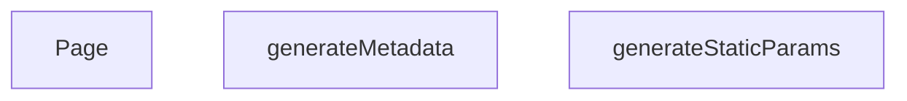

## Genel Bakış
Bu modül, Next.js App Router yapısında dinamik kategori sayfalarını sunar. URL'deki `categorySlug` parametresine göre sayfa içeriğini, SEO meta bilgilerini ve statik üretim parametrelerini yönetir.

## Fonksiyon Grupları
### Statik Üretim Yapılandırması
Uygulama derleme sırasında hangi kategori slug'larının önceden üretileceğini belirler.
- generateStaticParams

### SEO Meta Bilgisi Oluşturma
Dinamik kategori sayfasının tarayıcı ve arama motorları için başlık, açıklama gibi meta bilgilerini üretir.
- generateMetadata

### Sayfa Bileşeni
Kategori sayfasının ana React bileşenini oluşturur ve kullanıcının gördüğü arayüzü render eder.
- Page

---

## AXIOMS – Mimari Varsayımlar
Bu modül, Next.js'in dinamik segmentler kullanılarak oluşturulan, bir kategorinin tüm detaylarını sunan ana sayfasıdır. Aşağıda, modülün doğru çalışması için gerekli olan mimari varsayımlar listelenmiştir.

[Aksiyom 1]: Eğer `categorySlug` parametresi, geçerli bir kategorinin URL dostu temsili (slug) değilse veya bu slug'a karşılık gelen kategori verisi sunucuda (örn. `getCategoryData` fonksiyonunun çektiği kaynak) mevcut değilse, hem `generateMetadata` hem de `Page` bileşeni düzgün bir meta bilgi veya içerik üretemez ve kullanıcıya hata durumu veya boş/eksik bir sayfa sunulur.
[Aksiyom 2]: Eğer `generateStaticParams` fonksiyonu, statik site oluşturma (build) aşamasında çağrıldığında, ilgili kategorilerin geçerli `categorySlug` değerlerini içeren bir dizi döndürmezse, o kategorilere ait sayfalar build sırasında oluşturulamaz ve 404 (bulunamadı) hatası ile karşılaşılır.
[Aksiyom 3]: Eğer `generateMetadata` fonksiyonu, `params` nesnesi içinden `categorySlug` değerini alıp `getCategoryData` gibi bir veri çekme fonksiyonuna iletemezse (örn. params nesnesi beklenen yapıda değilse), SEO için gerekli olan dinamik sayfa başlığı, açıklaması ve diğer meta etiketleri boş veya varsayılan değerlerle oluşturulur, bu da arama motoru optimizasyonunu olumsuz etkiler.
[Aksiyom 4]: Eğer `Page` bileşeni, `params` nesnesi içinden `categorySlug` değerini alıp veri çekme işlemi için kullanamazsa (örn. params bir Promise ise ve çözümlenemiyorsa), bileşen ilgili kategorinin ürünlerini veya içeriğini listeleyemez ve kullanıcıya boş veya hatalı bir arayüz sunulur.

---

## FONKSİYON DETAYLARI

### generateStaticParams
**Ne yapar**: Bu fonksiyon, Next.js'in statik site oluşturma (SSG) süreci için dinamik rotaların önceden oluşturulacak tüm olası parametrelerinin listesini üretir. Temel amacı, derleme zamanında (build time) hangi dil ve kategori kombinasyonları için HTML dosyası oluşturulacağını belirlemektir.
**Nasıl yapar**: Fonksiyon, Supabase veritabanından aktif (`is_active` alanı true olan) tüm kategorilerin `slug` alanını çeker. Gelen her bir kategori nesnesi için, varsayılan olarak Türkçe (`tr`) ve İngilizce (`en`) olmak üzere iki ayrı dil parametresi oluşturur. Bu sayede her kategori slug'ı için iki farklı URL yolu (örn: `/tr/category/xxx` ve `/en/category/xxx`) önceden derlenebilir hale gelir.
**Parametreler**:
- Fonksiyon parametre almaz.
**Dönüş**: `{ lang: string, categorySlug: string }` nesnelerinden oluşan bir dizi. Her bir nesne, oluşturulacak bir sayfanın dinamik parametrelerini temsil eder.

### generateMetadata
**Ne yapar**: Bu fonksiyon, belirli bir kategori sayfası için SEO (Arama Motoru Optimizasyonu) ve sosyal paylaşım (Open Graph) amaçlı HTML `<head>` bölümündeki meta etiketlerinin dinamik içeriğini üretir. Sayfanın arama motorlarındaki görünürlüğünü ve sosyal medyada paylaşım appearance'ını belirler.
**Nasıl yapar**: Fonksiyon, URL'den gelen `categorySlug` parametresini alır ve önbelleklenmiş bir veri çekme fonksiyonu olan `getCachedCategoryData` ile ilgili kategori verisini sunucu tarafında (SSR) getirir. Kategori bulunamazsa, varsayılan bir "Kategori Bulunamadı" başlığı döndürür. Kategori mevcutsa, kategori adını ve açıklamasını kullanarak dinamik bir `title`, `description`, `canonical` URL ve `openGraph` nesnesi (başlık, açıklama, URL, site adı, görsel, dil, tür bilgileri dahil) oluşturur. Görsel için öncelikle kategorinin kendi `image_url` alanını, eğer bu boşsa varsayılan bir görsel yolunu kullanır.
**Parametreler**:
- name: params — Sayfanın dinamik parametrelerini içeren bir nesne.
- type: `Promise<{ categorySlug: string }>` — Parametreler asenkron olarak çözümlenir, bu yüzden bir Promise'tır.
- description: URL yolundan gelen `categorySlug` bilgisini taşır. Bu değer, kategori verisini çekmek ve SEO etiketlerini buna göre oluşturmak için kullanılır.
**Dönüş**: `Metadata` tipinde bir nesne. Bu nesne, Next.js tarafından otomatik olarak HTML `<head>` bölümüne meta etiketleri olarak enjekte edilir.

### Page
**Ne yapar**: Bu fonksiyon, bir kategori sayfasının ana React bileşenidir. Sunucu tarafında (SSR) tüm gerekli verileri çeker, yapılandırılmış veri (JSON-LD) oluşturur ve istemci tarafına (client) bir React bileşeni ile birlikte gönderilmek üzere sayfa içeriğini render eder.
**Nasıl yapar**: Fonksiyon, `categorySlug` parametresini alır ve önbellek mekanizmasıyla kategori verisini çeker. Kategori mevcutsa, o kategorinin alt kategorilerini (`parent_id` eşleşmesi ile) ve ardından bu kategori ile tüm alt kategorilerine ait ürünleri `getProductsEnriched` fonksiyonu ile çeker. Verileri, Google'ın zengin sonuçlar için tanımladığı `CollectionPage` tipinde bir JSON-LD yapısına dönüştürerek sayfaya ekler. Son olarak, verileri `PageComponent` bileşenine başlangıç (initial) prop'ları olarak aktarır ve bir `React.Suspense` sınırı içinde render eder; böylece veri yüklenirken bir fallback UI gösterilir.
**Parametreler**:
- name: params — Sayfanın dinamik parametrelerini içeren bir nesne.
- type: `Promise<{ categorySlug: string }>` — Parametreler asenkron olarak çözümlenir.
- description: URL yolundan gelen `categorySlug` bilgisini taşır. Bu değer, kategori verisi, alt kategoriler ve ürünlerin çekilmesi için temel giriş parametresidir.
**Dönüş**: JSX elemanı (React.ReactNode). Sayfanın render edilecek tam HTML yapısını temsil eder. İçeriğinde bir `<script>` etiketi (JSON-LD için) ve bir Suspense içinde sarmalanmış ana sayfa bileşeni (`PageComponent`) bulunur.

---

## AST POINTERS

### [N1_NASIL] AST Pointer: src/app/[lang]/category/[categorySlug]/page.tsx::generateStaticParams
- **params**: (parametre yok)
- **ic_degiskenler**:
  - `data` — `supabase.from('categories').select('slug').eq('is_active', true)` sorgusunun döndürdüğüham veri
  - `categoriesList` — `data`'nın `{ slug: string | null }[]` tipine cast edilmiş hali; her biri bir kategori slug'ı tutar
- **Dönüş**: `{ lang: string, categorySlug: string }[]` — her kategori için `tr` ve `en` dilleri için static param nesneleri dizisi

---

## MERMAID CALL GRAPH

## NODE ID STANDARD

  file: src\app\[lang]\category\[categorySlug]\page.tsx
  function: src\app\[lang]\category\[categorySlug]\page.tsx::generateStaticParams
  function: src\app\[lang]\category\[categorySlug]\page.tsx::generateMetadata
  function: src\app\[lang]\category\[categorySlug]\page.tsx::Page

---

## DISA AKTARILANLAR (EXPORTS)
  export: Page
  export: generateMetadata
  export: generateStaticParams

---

## STİL TOKENLERİ

### Arbitrary Değerler (token'a geçirilmemiş)
Yok — tüm stiller token'a geçirilmiş. ✅

### Kullanılan Token'lar (zaten token'a geçirilmiş)
- (yok)

### Tailwind Sınıf Özeti
- **Renkler:** `text-center`, `text-slate-500`
- **Layout:** (yok)
- **Varyant/Responsive:** (yok)
- **Yardımcı Sınıflar:** `container`, `mx-auto`, `px-4`, `py-12`