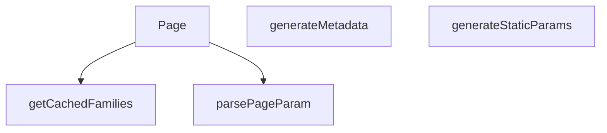

## Genel Bakış
Bu modül, Next.js App Router yapısında dinamik kategori sayfalarını sunmakla sorumludur. URL'deki `categorySlug` ve `lang` parametrelerine göre sayfa içeriğini, SEO meta bilgilerini ve statik üretim parametrelerini yönetir. Hem derleme zamanında önceden üretim yapılandırmasını hem de çalışma zamanında sayfa arayüzünü oluşturur.

## Fonksiyon Grupları
### Veri Getirme ve Önbellekleme
Kategori sayfası için gerekli aile (ürün) verilerini getirir ve önbellekte tutarak performansı artırır.
- `getCachedFamilies`

### Parametre İşleme
URL'deki sayfa parametresini (page) ayrıştırarak sayısal bir değere dönüştürür.
- `parsePageParam`

### Statik Üretim Yapılandırması
Derleme aşamasında hangi kategori sayfalarının önceden üretileceğini belirleyerek statik site oluşturma sürecini yönetir.
- `generateStaticParams`

### SEO Meta Bilgisi Oluşturma
Her kategori sayfası için tarayıcı ve arama motorlarına sunulacak başlık, açıklama gibi meta verilerini dinamik olarak üretir.
- `generateMetadata`

### Sayfa Bileşeni
Kullanıcının tarayıcıda gördüğü kategori sayfasının ana arayüzünü oluşturur ve içeriği render eder.
- `Page`

---

## AXIOMS – Mimari Varsayımlar

Bu modül için temel mimari varsayımlar, fonksiyon imzalarında belirtilen parametre türleri ve bağımlılıklar üzerinden tanımlanmıştır.

[Aksiyom 1]: Eğer `lang` parametresi geçerli bir dil kodu değilse, `getCachedFamilies` fonksiyonu doğru veri dönemeyebilir veya hata üretebilir.

[Aksiyom 2]: Eğer `tenantId` parametresi geçerli bir kiracı (tenant) tanımlayıcısı değilse, `getCachedFamilies` fonksiyonu ilgili kiracıya ait aileleri getiremez.

[Aksiyom 3]: Eğer `categoryId` parametresi veritabanında var olmayan bir kategoriye aitse, `getCachedFamilies` fonksiyonu boş bir sonuç kümesi döndürebilir veya hata üretebilir.

[Aksiyom 4]: Eğer `page` parametresi pozitif bir tamsayı değilse (örn: 0 veya negatif), `getCachedFamilies` fonksiyonu geçersiz sayfalama yapabilir.

[Aksiyom 5]: Eğer `categoryIds` boş bir dizi ise, `getCachedFamilies` fonksiyonunun davranışı bilinmiyor (belgelenmemiş).

[Aksiyom 6]: Eğer `parsePageParam` fonksiyonuna `undefined` veya geçersiz bir string dizisi girilirse, varsayılan bir sayfa numarası döndürmelidir; ancak bu varsayılan değerin ne olduğu fonksiyon gövdesinden çıkarılamadığından bilinmiyor.

[Aksiyom 7]: Eğer `generateStaticParams` fonksiyonu çalıştırıldığında veritabanı bağlantısı kesikse veya `_getCachedSupabaseData` işlevi hata döndürürse, derleme zamanı statik üretim başarısız olabilir.

[Aksiyom 8]: Eğer `generateMetadata` fonksiyonuna geçersiz `categorySlug` veya `lang` parametresi verilirse, SEO meta bilgileri eksik veya hatalı üretilebilir.

[Aksiyom 9]: Eğer `Page` bileşeninin `searchParams.page` değeri geçersiz bir string veya string dizisi ise, `parsePageParam` aracılığıyla işlenmeli ve geçerli bir sayfa numarasına dönüştürülmelidir; aksi halde sayfa hatalı içerik gösterebilir.

[Aksiyom 10]: Eğer `_getCachedSupabaseData` işlevi (modül sabiti olarak tanımlanan) doğru yapılandırılmamışsa veya Supabase bağlantısı yoksa, bu modülün tüm veri getirme işlemleri başarısız olur.

---

## FONKSİYON DETAYLARI

### getCachedFamilies
**Ne yapar**: Belirli bir dil, kiracı, kategori ve sayfa için ürün ailelerinin (families) önbelleğe alınmış listesini getirir.
**Nasıl yapar**: Fonksiyon, anahtar olarak hem dil (`lang`) hem de kiracı (`tenantId`) hem de kategori ve sayfa numarasını içeren bir SaaS kuralına uygun şekilde verileri önbelleğe alır ve getirir. Keşif (discovery) alanına ait olduğu için, stok hareketleri bu önbelleği etkilemez (PS-042).
**Parametreler**:
- `lang`: `string` — Verilerin dil kodu (ör. 'tr', 'en').
- `tenantId`: `string` — Kiracının (tenant) benzersiz kimliği.
- `categoryId`: `string` — İstenen ürün ailelerinin ait olduğu kategorinin kimliği.
- `page`: `number` — İstenen sayfa numarası.
- `categoryIds`: `string[]` — Alt kategoriler dahil, tarama yapılacak tüm kategorilerin kimlikleri listesi.
**Dönüş**: Belirtilmemiş (docstring ve kodda dönüş tipi net değil).

### parsePageParam
**Ne yapar**: URL'deki `?page=` parametresini, 1-tabanlı ve geçerli bir tam sayıya dönüştürür; geçersiz veya tanımsız değerleri 1 olarak varsayar.
**Nasıl yapar**: Girdi `raw` bir dizi ise ilk elemanını, değilse doğrudan kendisini alır. Alınan değeri `10` tabanında bir tam sayıya (`parseInt`) dönüştürmeye çalışır. Eğer sonuç sonsuz bir sayıya veya 1'den küçük bir değere eşitse, 1 döndürür; aksi halde bulunan geçerli sayıyı döndürür.
**Parametreler**:
- `raw`: `string | string[] | undefined` — URL search parametresinden gelen ham sayfa değeri.
**Dönüş**: `number` — Geçerli, 1'den büyük bir tam sayı; aksi halde 1.

### generateStaticParams
**Ne yapar**: Next.js için tüm aktif kategorilerin ve her biri için İngilizce ve Türkçe dil varyantlarının statik sayfa parametrelerini oluşturur.
**Nasıl yapar**: Supabase veritabanından `is_active` durumu `true` olan tüm kategorileri (sadece `slug` ve `metadata` alanlarını) çeker. Ardından, her kategoriyi `flatMap` ile iki elemanlı bir diziye dönüştürür: biri `lang: 'tr'` için, diğeri `lang: 'en'` için. Her durumda, dilin görünen (localized) slug'ı `getLocalizedCategorySlug` fonksiyonu ile hesaplanır.
**Parametreler**: Yok.
**Dönüş**: Belirtilmemiş (docstring ve kodda dönüş tipi net değil; Next.js formatında `{ lang: string, categorySlug: string }[]` döndürür).

### generateMetadata
**Ne yapar**: Belirli bir dilde ve kategorideki sayfa için SEO odaklı metadata (başlık, açıklama, kanonik URL, Open Graph vb.) nesnesini oluşturur.
**Nasıl yapar**: Parametrelerden `categorySlug` ve `lang` değerlerini `await` ile çıkarır. Kategoriyi önceden yükler (`preloadCategory`) ve önbellekten verisini çeker (`getCachedCategoryData`). Bulunamazsa dil bazlı "Kategori Bulunamadı" başlığı döner. Bulunursa, kategorinin display adını (`getCategoryDisplayName`) sözlük (`dict`) ve `t` fonksiyonu ile hesaplar. Açıklama ve URL'leri (kanonik, hreflang) dile göre hazırlar. Son olarak, title, description, alternates (canonical, languages) ve openGraph alanlarını içeren bir nesne döner.
**Parametreler**:
- `{ params }`: `{ params: Promise<{ categorySlug: string, lang: string }> }` — Next.js'ten gelen, slug ve dil bilgisini içeren asenkron parametreler nesnesi.
**Dönüş**: Belirtilmemiş (docstring ve kodda dönüş tipi net değil; `{ title: string; description: string; alternates: {...}; openGraph: {...} }` benzeri bir nesne döndürür).

### Page
**Ne yapar**: Kategori sayfasının ana React bileşenidir; verileri getirir, yönlendirme yapar, SEO verilerini (JSON-LD) oluşturur ve sayfayı render eder.
**Nasıl yapar**: `params` ve `searchParams`'ı `await` ile çözer. `parsePageParam` ile sayfayı alır. Kategoriyi önceden yükler ve verisini çeker. Eğer gelen slug, dilin beklenen lokalize slug'ı ile uyuşmuyorsa (`getLocalizedCategorySlug` ile hesaplanan), `permanentRedirect` ile 308 kalıcı yönlendirme yapar. Kategori varsa, alt kategorilerini (çocukları) ve ürünlerin sayısını (`get_category_counts` RPC) çeker. Ürünü olmayan alt kategorileri filtreler. `getCachedFamilies` ile istenen sayfadaki ürün ailelerini getirir. `buildCategoryJsonLd` ile JSON-LD yapılandırmasını oluşturur ve `assertNoUuid` ile doğrular. Son olarak, JSON-LD'yi `<script>` etiketi ile ve `PageComponent`'i bir `React.Suspense` içinde render eden JSX döner.
**Parametreler**:
- `{ params, searchParams }`: `{ params: Promise<{ categorySlug: string, lang: string }>, searchParams: Promise<{ page?: string | string[] }> }` — Next.js'ten gelen, kategori slug'ı, dil ve sayfa parametrelerini içeren asenktron nesneler.
**Dönüş**: Belirtilmemiş (docstring ve kodda dönüş tipi net değil; JSX döndürür).

---

## İTHALATLAR (IMPORTS)
- import: ../../../../config/siteUrl::SITE_URL
- import: ../../../../lib/cache/tags::PRODUCTS_DISCOVERY_TAG
- import: ../../../../lib/cache/tags::discoveryTag
- import: ../../../../lib/data/preload::getCachedCategoryData
- import: ../../../../lib/data/preload::preloadCategory
- import: ../../../../lib/type-converters::mapDatabaseCategoryToDomain
- import: ../../../../lib/type-converters::type { DomainCategory }
- import: ../../../../types/db-rows::type { AuthorityContent,CategoryMetadata, DbCategory }
- import: ../../../../types/ui-models::type { FamilyListItem }
- import: ../../../../utils/tenantServer::getTenantConfig
- import: ../../../../views/CategoryPage::PageComponent
- import: @/i18n/dictionaries/en::en
- import: @/i18n/dictionaries/tr::tr
- import: @/i18n/getDictValue::getDictValue
- import: @/lib/seo/jsonld::assertNoUuid
- import: @/lib/seo/jsonld::buildCategoryJsonLd
- import: @/lib/services/family.service::getFamiliesEnriched
- import: @/lib/supabase/static::supabaseStaticClient
- import: @/utils/categoryHelpers::getCategoryDisplayName
- import: @/utils/categoryHelpers::getLocalizedCategorySlug
- import: next/cache::unstable_cache
- import: next/navigation::permanentRedirect
- import: react::React
- import: react::cache

---

## SABİTLER
- **_getCachedSupabaseData** (call) — `cache((id: string) => {
  return supabase.from('categories').select('*').eq(...`

---

## AST POINTERS

### [N1_NASIL] AST Pointer: `[lang]/category/[categorySlug]/page.tsx`::getCachedFamilies
- **params**: `lang: string`, `tenantId: string`, `categoryId: string`, `page: number`, `categoryIds: string[]`
- **ic_degiskenler**: (yerel değişken yok — parametreler doğrudan kullanılır)
- **Kullanilan dis kaynaklar**:
  - `unstable_cache` — Next.js cache wrapper; inner async callback sonucunu cache'ler
  - `getFamiliesEnriched(supabase, {...})` — supabase client ve filtre parametreleriyle enriched ürün listesini çeker
  - `PAGE_SIZE` — sayfa başına öğe sayısı sabiti (offset ve limit hesaplamasında)
  - `PRODUCTS_DISCOVERY_TAG` — cache tag sabiti
  - `discoveryTag(tenantId)` — tenant'a özel cache tag üreteci
- **Cache parametreleri**:
  - key: `['category-families', lang, tenantId, categoryId, String(page)]`
  - tags: `[PRODUCTS_DISCOVERY_TAG, discoveryTag(tenantId)]`
  - revalidate: `3600`
- **Dönüş**: `Promise<{ items: FamilyListItem[], total: number }>`

---

## MERMAID CALL GRAPH

## NODE ID STANDARD

  file: src\app\[lang]\category\[categorySlug]\page.tsx
  function: src\app\[lang]\category\[categorySlug]\page.tsx::getCachedFamilies
  function: src\app\[lang]\category\[categorySlug]\page.tsx::parsePageParam
  function: src\app\[lang]\category\[categorySlug]\page.tsx::generateStaticParams
  function: src\app\[lang]\category\[categorySlug]\page.tsx::generateMetadata
  function: src\app\[lang]\category\[categorySlug]\page.tsx::Page

---

## DISA AKTARILANLAR (EXPORTS)
  export: Page
  export: generateMetadata
  export: generateStaticParams
  export: getCachedFamilies
  export: parsePageParam

---

## STİL TOKENLERİ

### Arbitrary Değerler (token'a geçirilmemiş)
Yok — tüm stiller token'a geçirilmiş. ✅

### Kullanılan Token'lar (zaten token'a geçirilmiş)
- (yok)

### Tailwind Sınıf Özeti
- **Renkler:** `text-center`, `text-slate-500`
- **Layout:** (yok)
- **Varyant/Responsive:** (yok)
- **Yardımcı Sınıflar:** `container`, `mx-auto`, `px-4`, `py-12`