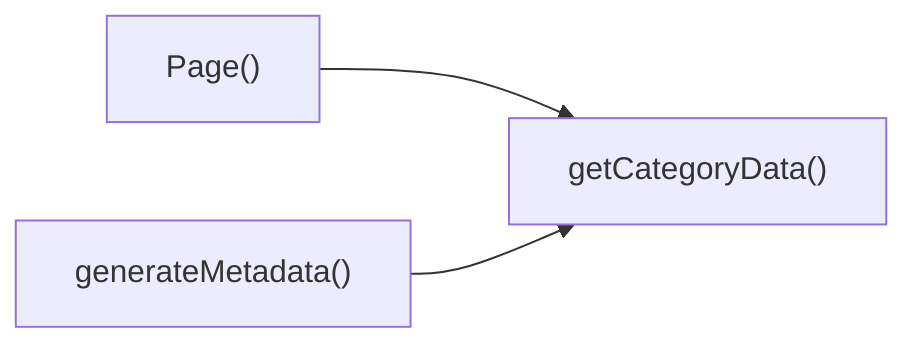

## Genel Bakış
Bu modül, dinamik kategori sayfalarının sunulmasından sorumludur. URL'deki `categorySlug` değerine göre kategori verisini çeker, sayfa başlık ve SEO meta bilgilerini oluşturur ve nihai React bileşenini render eder.

## Fonksiyon Grupları
### Veri Çekme
Kategori kimliğine (slug) dayalı olarak sunucudan gerekli kategori bilgilerini alır.
- getCategoryData

### Meta Bilgisi Oluşturma
Sayfanın SEO meta etiketlerini (başlık, açıklama vb.) dinamik olarak üretir; bu işlem sırasında veri çekme fonksiyonundan yararlanır.
- generateMetadata

### Sayfa Renderı
React bileşeni olarak kategori sayfasını oluşturur; parametrelerden slug alır, veri çekme fonksiyonunu çağırarak elde edilen veriyi UI'ye aktarır.
- Page

---

## AXIOMS – Mimari Varsayımlar
Bu modül için özel aksiyom tanımlanmamıştır.

---

---

## FONKSIYON DETAYLARI

### getCategoryData
**Ne yapar**: Parametre olarak alınan kategori slug'ını kullanarak ilgili kategorinin verilerini getiren yardımcı bir fonksiyondur. Sayfanın içerik katmanını besleyen temel veri kaynağını hazırlar.
**Nasıl yapar**: Sağlanan `slug` değerini bir API çağrısına veya yerel bir veri deposuna (statik dizi, veritabanı sorgusu) parametre olarak geçirir. Gelen yanıtı işleyerek kullanıma hazır bir formata dönüştürür ve bu veriyi çağıran bileşene iletir.
**Parametreler**:
- `slug`: `string` — Verisi getirilecek olan kategorinin benzersiz URL dostu tanımlayıcısıdır. Örneğin, "hvac-systems" ya da "ventilation" gibi bir değer alabilir.
**Dönüş**: `void` veya belirtilmemiş (Kod parçacığında dönüş tipi açıkça tanımlanmamıştır, bu nedenle kesin bir ifade kullanılamaz).

### generateMetadata
**Ne yapar**: Dinamik rota parametresine (`categorySlug`) dayanarak sayfanın HTML `<head>` alanında yer alacak meta verilerini (başlık, açıklama, anahtar kelimeler, Open Graph etiketleri) oluşturan Next.js özel fonksiyonudur. Bu sayede her kategori sayfası kendine özgü SEO meta verilerine sahip olur.
**Nasıl yapar**: `params` prop'u içerisinden `categorySlug` değerini asenkron olarak alır. Bu slug'ı kullanarak kategori verisini çeker ve gelen veriye göre bir `Metadata` nesnesi yapılandırarak döndürür. Fonksiyon asenkron (Promise) olarak çalışır.
**Parametreler**:
- `params`: `Promise<{ categorySlug: string }>` — Next.js App Router tarafından otomatik olarak enjekte edilen, sayfanın dinamik yol parametrelerini içeren asenkron bir Promise objesidir. `categorySlug` özelliği mevcut sayfanın hangi kategoriyi temsil ettiğini belirtir.
**Dönüş**: `void` veya belirtilmemiş. Standart Next.js uygulamalarında `Metadata` objesi döndürmesi beklenir, ancak mevcut kod parçacığı bu tipi açıkça belirtmemektedir.

### Page
**Ne yapar**: `/category/[categorySlug]` yolundaki sayfanın ana React bileşenidir. Kullanıcıya belirli bir kategorideki ürünleri, yazıları veya içerikleri listeleyen arayüzü sunar ve uygulamanın görsel katmanını oluşturur.
**Nasıl yapar**: Bileşen render edilirken `params` içerisinden `categorySlug` değerini alır. Bu değer ile `getCategoryData` fonksiyonunu çağırarak gerekli veriyi çeker. Çekilen veri ile uygun JSX elementlerini (kategori başlığı, ürün kartları, içerik listesi) oluşturur ve ekrana basar.
**Parametreler**:
- `params`: `Promise<{ categorySlug: string }>` — Next.js App Router tarafından sağlanan, sayfanın yol parametrelerini içeren Promise objesidir. `categorySlug` değeri hangi kategorinin görüntüleneceğini belirler.
**Dönüş**: `void` veya belirtilmemiş. Bir React bileşeni olduğu için teori de `React.ReactNode` veya `JSX.Element` döndürmesi

---

## AST POINTERS

### [N1_NASIL] AST Pointer: src/app/category/[categorySlug]/page.tsx::getCategoryData
- **params**: (slug: string)
- **ic_degiskenler**:
  - `data` — supabase sorgusundan dönen kategori satırını içeren obje (id, name, parent_id, slug, is_active, sort_order, level, image_url, seo_title, seo_desc, created_at, updated_at, description, display_mode, is_featured, marketing_title, menu_label, metadata, translation_key, authority_content)
  - `error` — supabase sorgusundan dönen hata nesnesi; hata varsa veya data yoksa fonksiyon null döner
- **Dönüş**: DomainCategory | null (kategori verisi domain nesnesi veya bulunamazsa null)

### [N2_NASIL] AST Pointer: src/app/category/[categorySlug]/page.tsx::generateMetadata
- **params**: ({ params }: { params: Promise<{ categorySlug: string }> })
- **ic_degiskenler**:
  - `categorySlug` — await params ile çözülen route parametresi (string)
  - `category` — getCategoryData(categorySlug) çağrısından dönen DomainCategory nesnesi; yoksa null
- **Dönüş**: metadata objesi (title, description, alternates.canonical, openGraph içeriği) – sayfa için SEO ve sosyal medya etiketlerini sağlar

### [N3_NASIL] AST Pointer: src/app/category/[categorySlug]/page.tsx::Page
- **params**: ({ params }: { params: Promise<{ categorySlug: string }> })
- **ic_degiskenler**:
  - `categorySlug` — await params ile çözülen route parametresi (string)
  - `category` — getCategoryData(categorySlug) çağrısından dönen DomainCategory nesnesi (null olabilir)
  - `products` — DomainProduct[] dizisi; kategori ve alt kategorilerle ilgili ürünleri getProductsEnriched ile doldurur
  - `subCategories` — DomainCategory[] dizisi; kategori.id’ye sahip aktif alt kategorileri içerir
  - `subsData` — supabase sorgusundan gelen ham kategori satırları dizisi (veya null); subCategories oluşturmak için kullanılır
  - `jsonLd` — Schema.org CollectionPage türünde JSON‑LD objesi; sayfa için yapılandırılmış veri sağlar
- **Dönüş**: JSX.Element (React.Fragment) – <script type="application/ld+json"> ile JSON‑LD ve <PageComponent> bileşeni render edilir

---

---

## ÇAĞRI HARİTASI

### Disariya Cagrilar (Outgoing)
- `generateMetadata()`: Meta veri üretmek için `getCategoryData` fonksiyonunu çağırır.
- `Page()`: Sayfa verisini almak için `getCategoryData` fonksiyonunu çağırır.

### Disaridan Cagrilanlar (Incoming)
Yok (dosya içi çağrılar haricinde dış modül tarafından kullanılmıyor).

### Ic Ice Fonksiyonlar (Nested)
Yok

---

## DOSYA-İÇİ ÇAĞRI GRAFİĞİ
  Page() → getCategoryData()
  generateMetadata() → getCategoryData()

---

## NODE ID STANDARD

  file: src\app\category\[categorySlug]\page.tsx
  function: src\app\category\[categorySlug]\page.tsx::getCategoryData
  function: src\app\category\[categorySlug]\page.tsx::generateMetadata
  function: src\app\category\[categorySlug]\page.tsx::Page

---

## DISA AKTARILANLAR (EXPORTS)
  export: Page
  export: generateMetadata
  export: getCategoryData