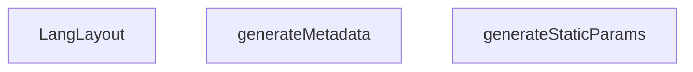

## Genel Bakış
Bu modül, Next.js App Router yapısında çok dilli (i18n) uygulama için dil bazlı kök layout bileşenini tanımlar. `[lang]` dynamic segment üzerinden `tr` ve `en` dilleri için statik yol üretimi, sayfa metadata yönetimi ve dil duyarlı layout sarmalama işlevlerini üstlenir.

## Fonksiyon Grupları

### Statik Yol Üretimi
Build aşamasında Next.js'in önceden oluşturacağı dil varyantlarını belirler. `generateStaticParams` fonksiyonu, desteklenen dilleri (`tr`, `en`) içeren bir dizi döndürerek statik site oluşturma sürecini yapılandırır.
- generateStaticParams

### Metadata ve SEO Yönetimi
Sayfanın dil bazlı metadata bilgilerini (title, description vb.) asenkron olarak üretir. `generateMetadata` fonksiyonu, `params` üzerinden gelen dil bilgisine göre uygun metadata nesnesi döndürür.
- generateMetadata

### Layout Sarmalama
Dil bazlı sayfa düzenini sağlayan ana layout bileşenidir. `LangLayout` fonksiyonu, `children` içeriğini dil duyarlı bir yapı içinde sarar ve alt bileşenlere sunar.
- LangLayout

## Bağımlılıklar ve Mimari Notlar
- **Dış bağımlılıklar**: Next.js'in yerleşik `Metadata` tipi ve React'ın `React.ReactNode` tipi kullanılır.
- **Dinamik segment**: `[lang]` yapısı sayesinde her dil için ayrı statik sayfa üretilir.
- **Parametre yapısı**: `params` bir Promise olarak tanımlanmıştır; bu, Next.js'in asenkron parametre çözümleme modeline uyumluluğu gösterir.
- **Dışa aktarılanlar**: `LangLayout` ve `generateStaticParams` dışa aktarılır; `generateMetadata` ise Next.js tarafından otomatik olarak tanınır.

---

## AXIOMS – Mimari Varsayımlar
Bu modül için fonksiyon gövdeleri sağlanmadığından, yalnızca imzalara dayalı aksiyom üretilemez. Mimari varsayımlar belirlenememiştir.

---

## FONKSİYON DETAYLARI

### generateStaticParams

**Ne yapar**: Next.js uygulamasının statik olarak oluşturulabilecek dil yollarını belirler. Bu fonksiyon, build aşamasında hangi dil varyantları için sayfaların önceden oluşturulacağını tanımlar.

**Nasıl yapar**: Fonksiyon, desteklenen dil kodlarından oluşan bir dizi döndürür. Bu sayede Next.js, `tr` ve `en` dilleri için gerekli statik yolları önceden oluşturabilir ve statik site oluşturma (SSG) süreçlerinde kullanabilir.

**Parametreler**:
- Bu fonksiyon herhangi bir parametre almaz.

**Dönüş**: Array<{ lang: string }> — Desteklenen dil kodlarını içeren nesne dizisi. Her nesne bir `lang` özelliği taşır ve değer olarak `'tr'` veya `'en'` bulunur.

### generateMetadata
**Ne yapar**: Site genelinde kullanılacak metadata bilgilerini dile göre dinamik olarak oluşturur. Next.js'in segment ağacı yapısında, kök layout (`src/app/layout.tsx`) `[lang]` segmentinin üstünde yer aldığı için rota parametresini göremez ve metadata'sını Türkçe sabit değerlerle başlatmak zorunda kalır. Bu nedenle, dil bazlı metadata üretimi bu alt layout dosyasında gerçekleştirilir. Next.js metadata'yı segment ağacında birleştirir ve DERIN olan kazanır; bu layout kökten derin olduğu için buradaki metadata geçerli olur.

**Nasıl yapar**: Fonksiyon önce `params` nesnesini `await` ederek `lang` değerini elde eder. Ardından `lang` değerine göre uygun sözlük dosyasını (`en` veya `tr`) seçer. Seçilen sözlükten `dict.meta.siteTitle` ve `dict.meta.siteDesc` değerlerini okuyarak `title`, `description`, `alternates.languages` ve `openGraph` alanlarını yapılandırır. `openGraph.locale` alanı da dile göre `en_US` veya `tr_TR` olarak ayarlanır. `SITE_URL` sabiti kullanılarak her iki dil için alternatif URL'ler (`/tr`, `/en`) tanımlanır.

**Parametreler**:
- `params`: `{ params: Promise<{ lang: string }> }` — Next.js'in dinamik rota parametrelerini içeren nesne. `params` özelliği bir `Promise` olarak tanımlanmış olup çözümlemesi `lang` (string) değerini verir. Bu `lang` değeri URL segmentinden gelir ve hangi dil sözlüğünün kullanılacağını belirler.

**Dönüş**: `Promise<Metadata>` — Next.js'in `Metadata` tipinde bir nesne döndürür. Dönen nesne şu alanları içerir:
- `title`: Sözlükten alınan site başlığı (`dict.meta.siteTitle`)
- `description`: Sözlükten alınan site açıklaması (`dict.meta.siteDesc`)
- `alternates.languages`: `tr-TR` ve `en-US` anahtarlarıyla dillere göre URL'ler (`${SITE_URL}/tr`, `${SITE_URL}/en`)
- `openGraph.title`: Sözlükten alınan site başlığı
- `openGraph.description`: Sözlükten alınan site açıklaması
- `openGraph.siteName`: Sabit değer `'VentHub'`
- `openGraph.type`: Sabit değer `'website'`
- `openGraph.locale`: Dile göre `'en_US'` veya `'tr_TR'`

### LangLayout
**Ne yapar**: Geliştirildi ancak detay üretilemedi.

---

## İTHALATLAR (IMPORTS)
- import: ../../i18n/I18nContext::type { AppDictionary, Lang }
- import: ../../i18n/I18nProvider::I18nProvider
- import: ../../i18n/dictionaries/en::en
- import: ../../i18n/dictionaries/tr::tr
- import: @/config/siteUrl::SITE_URL
- import: next::type { Metadata }
- import: react::React

---

## TYPE ALIASES

### Props
```typescript
type Props = {
  children: React.ReactNode
  params: Promise<{ lang: string }>
}
```

---

## AST POINTERS

### [N1_NASIL] AST Pointer: src/app/[lang]/layout.tsx::generateStaticParams
- **params**: yok
- **ic_degiskenler**: yok
- **Dönüş**: `Array<{ lang: string }>` — desteklenen dillerin listesi (`'tr'` ve `'en'` değerlerini içeren nesne dizisi)

### [N2_NASIL] AST Pointer: src/app/[lang]/layout.tsx::generateMetadata
- **params**: `{ params: Promise<{ lang: string }> }` — Next.js route params promise'ı
- **ic_degiskenler**:
  - `lang` — `await params` ile çözümlenen dil kodu (string); `'en'` veya `'tr'`
  - `dict` — `lang === 'en'` koşuluna göre `en` veya `tr` sözlük nesnesi; `dict.meta.siteTitle` ve `dict.meta.siteDesc` alanlarına erişilir
- **Dönüş**: `Promise<Metadata>` — `title`, `description`, `alternates.languages` (`'tr-TR'` ve `'en-US'` anahtarlarıyla `SITE_URL` tabanlı URL'ler), `openGraph` (`title`, `description`, `siteName: 'VentHub'`, `type: 'website'`, `locale`) alanlarını içeren Next.js Metadata nesnesi

### [N3_NASIL] AST Pointer: src/app/[lang]/layout.tsx::LangLayout
- **params**: `{ children, params }: Props` — `children` (React çocuk elemanları) ve `params` (Promise<{ lang: string }>)
- **ic_degiskenler**:
  - `lang` — `await params` ile çözümlenen dil kodu (string); `as Lang` ile tipe dönüştürülerek `I18nProvider`'a aktarılır
  - `dictionary` — `lang === 'en'` koşuluna göre `en` veya `tr` sözlük nesnesi; `as AppDictionary` ile tipe dönüştürülerek `I18nProvider`'a aktarılır
- **Dönüş**: JSX elementi — `<I18nProvider lang={lang} dictionary={dictionary}>` ile sarılmış `{children}` içeriği

---


## MERMAID CALL GRAPH


## NODE ID STANDARD

  file: src\app\[lang]\layout.tsx
  function: src\app\[lang]\layout.tsx::generateStaticParams
  function: src\app\[lang]\layout.tsx::generateMetadata
  function: src\app\[lang]\layout.tsx::LangLayout

---

## DISA AKTARILANLAR (EXPORTS)
  export: LangLayout
  export: generateMetadata
  export: generateStaticParams

---

## STİL TOKENLERİ

### Arbitrary Değerler (token'a geçirilmemiş)
Yok — tüm stiller token'a geçirilmiş. ✅

### Kullanılan Token'lar (zaten token'a geçirilmiş)
- (yok)

### Tailwind Sınıf Özeti
- **Renkler:** (yok)
- **Layout:** (yok)
- **Varyant/Responsive:** (yok)
- **Yardımcı Sınıflar:** (yok)