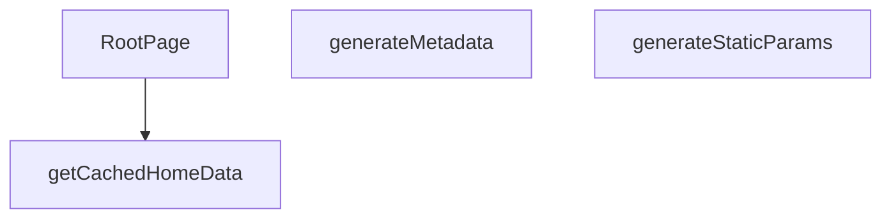

## Genel Bakış
Bu modül, Next.js App Router yapısında dil destekli ana sayfanın temelini oluşturur. Modül, sayfanın statik üretim parametrelerini belirleyerek, arama motorları için dinamik meta veriler üreterek ve önbellekten aldığı verilerle ana bileşeni render ederek tüm sayfa oluşturma sürecini yönetir. Ana sorumluluğu, kullanıcının diline göre kişiselleştirilmiş, SEO uyumlu ve performanslı bir ana sayfa sunmaktır.

## Fonksiyon Grupları
### Statik Üretim ve SEO Yönetimi
Bu grup, sayfanın hangi diller için önceden oluşturulacağını tanımlar ve arama motoru optimizasyonu için gerekli başlık, açıklama ve Open Graph bilgilerini sayfanın diline göre otomatik olarak üretir.
- generateStaticParams, generateMetadata

### Veri Sağlama ve Bileşen Oluşturma
Bu grup, dil ve kiracıya özel ana sayfa verilerini verimli bir şekilde önbellekten alır ve bu verileri kullanarak ana React bileşeninin son halini oluşturur.
- getCachedHomeData, RootPage

---

## AXIOMS – Mimari Varsayımlar

Bu modül, dil parametresine bağlı olarak statik sayfa üretiminde ve SEO meta verilerinin dinamik oluşturulmasında çalışır.

[Aksiyom 1]: Eğer `generateStaticParams()` tarafından döndürülen `lang` değerleri desteklenen diller listesiyle eşleşmiyorsa, `generateMetadata` ve `RootPage` fonksiyonlarına geçersiz bir dil parametresi iletilir ve sayfa renderı beklenmeyen davranış gösterir.

[Aksiyom 2]: Eğer `getCachedHomeData` fonksiyonuna iletilen `tenantId` geçerli bir tenant'a ait değilse veya önbellekte böyle bir veri yoksa, `RootPage` bileşeni veri olmadan render edilmeye çalışılır ve boş/hatalı sayfa oluşur.

[Aksiyom 3]: Eğer `generateMetadata` fonksiyonuna iletilen `params` objesi içinde `lang` alanı eksikse, SEO için gerekli meta veriler (başlık, açıklama, Open Graph bilgileri) oluşturulamaz ve varsayılan/meta verisiz bir sayfa çıktısı üretilir.

[Aksiyom 4]: Eğer `getCachedHomeData` fonksiyonu senkron çalışıyorsa ve asenkron veri kaynağına erişim sırasında bir kesinti oluşursa, önbellek verisi dönemeyeceği için `RootPage` bileşeni veri eksikliği ile karşılaşır.

[Aksiyom 5]: Eğer `generateStaticParams` tarafından döndürülen params listesi boşsa, hiçbir dil için statik sayfa üretilmez ve deploy sonrası ana sayfa erişilemez hale gelir.

---

## FONKSİYON DETAYLARI

### generateStaticParams
**Ne yapar**: Uygulamanın desteklediği dil parametrelerini statik olarak üretir ve Next.js’in statik sayfa oluşturma sürecine sağlar.  
**Nasıl yapar**: Asenkron bir fonksiyon olarak tanımlanmış, sabit bir dizi içinde iki nesne döndürür; biri `'tr'` diğeri `'en'` dil kodunu içerir.  
**Parametreler**:  
- *Yok*  
**Dönüş**: `Array<{ lang: string }>` – `{ lang: 'tr' }` ve `{ lang: 'en' }` öğelerinden oluşan dizi.

### generateMetadata
**Ne yapar**: Sayfa için dinamik SEO meta verilerini, Open Graph ve Twitter kartı bilgilerini, ayrıca robots yönergelerini oluşturur.  
**Nasıl yapar**: `params` nesnesinden gelen `lang` değerini alır, ilgili dil sözlüğünü (`en` veya `tr`) seçer. Site URL’si temel alınarak kanonik URL ve dil‑spesifik URL’ler hazırlanır. Meta başlık, açıklama, Open Graph ve Twitter alanları sözlükten alınan SEO metinleriyle doldurulur; ayrıca site şeması ve organizasyon bilgileri JSON‑LD formatında hazırlanır.  
**Parametreler**:  
- `params`: `Props` – Sayfa parametrelerini içeren nesne; içinde `lang` özelliği bulunur.  
**Dönüş**: `Promise<Metadata>` – SEO, Open Graph, Twitter ve robots ayarlarını içeren `Metadata` nesnesi.

### getCachedHomeData
**Ne yapar**: Belirli bir dil ve kiracı (tenant) için ana sayfada görüntülenecek kategori ve ürün verilerini önbellekten getirir.

**Nasıl yapar**: Fonksiyon, sunucu tarafı veri işleme (SSR) sırasında çağrılarak belirli bir `lang` ve `tenantId` çifti için depolanmış ana sayfa verilerini (kategori ve ürün listesi) alır. Bu veriler önbelleğe alındığı için yüksek performanslı veri erişimi sağlar ve veritabanı veya harici API çağrılarını tekrarlamaz. Fonksiyonun dönüş tipi, `RootPage` içindeki `try...catch` bloğunda `catData` ve `prodData` alanlarına ayrılarak kullanıldığı için bir nesne yapısı döndürür.

**Parametreler**:
- lang: string — İçerik dilini belirten kod (ör. 'tr', 'en').
- tenantId: string — Kiracıyı (tenant) tanımlayan benzersiz tanımlayıcı.

**Dönüş**: Promise<{ catData: DomainCategory[], prodData: Product[] }> — Kategori verilerini (`catData`) ve ürün verilerini (`prodData`) içeren asenkron bir nesne döndürür.

### RootPage

**Ne yapar**: Uygulamanın dil parametresine göre (tr/en) ana sayfayı sunucu tarafında (SSR) oluşturur. Tenant (kiracı) yapılandırmasını, kategorileri ve ürünleri çekerek JSON-LD yapılandırılmış verileri ve işlenmiş kategori listesini `HomePage` bileşenine initial veri olarak iletir.

**Nasıl yapar**: Fonksiyon bir Next.js Server Component'tir ve `async` olarak tanımlanmıştır, bu sayede içinde `await` ile asenkron veri çekme işlemleri yapabilir. Öncelikle `params` içerisinden `lang` (dil kodu) extrakte edilir ve buna göre İngilizce (`en`) veya Türkçe (`tr`) sözlük seçilir. Ardından `getTenantConfig()` ile tenant yapılandırması (ID dahil) sunucu tarafında çekilir. `getCachedHomeData(lang, tenantId)` çağrısı ile önbelleğe alınmış kategori ve ürün verileri eş zamanlı olarak elde edilir; bu veriler bir `try-catch` bloğu içinde sarılmıştır, böylece veri çekme hatası sayfanın tamamen çökmesini engeller ve konsola uyarı yazdırarak boş liste ile devam eder. Kategoriler `toUICategoryList` ile UI formatına dönüştürülür, ardından yalnızca üst seviye kategoriler (`parent_id` olmayanlar) alfabetik sıraya göre filtrelenir ve `getCategoryDisplayName` üzerinden çok dilli gösterim adları çözümlenir. Sayfa render aşamasında JSON-LD verileri (`WebSite` ve `Organization` tipleri) SEO amaçlı `<script type="application/ld+json">` etiketleri内ine `dangerouslySetInnerHTML` kullanılarak enjekte edilir — XSS saldırılarını önlemek için `<` ve `>` karakterleri Unicode escape sekanslarına dönüştürülür. Son olarak `TenantProvider` sarmalayıcı bileşeni içinde `HomePage` bileşeni, işlenmiş kategori listesi (`displayCategories`), ham kategoriler, ürünler ve sözlük verisi ile render edilir.

**Parametreler**:
- `params`: `Promise<{ lang: string }>` — Next.js App Router tarafından sağlanan dinamik URL parametreleri. İçerisinde `lang` alanı bulunur; bu alan hangi dilin aktif olduğunu belirtir (`'tr'` veya `'en'`). Parametre bir `Promise` olarak gelir ve `await` ile çözümlenmelidir.

**Dönüş**: `JSX.Element` — JSX formatında bir React bileşeni döndürür. Bileşen yapısı sırasıyla şu katmanlardan oluşur:
- `TenantProvider` (sarmalayıcı, `tenantConfig` value prop'u ile)
- JSON-LD `<script>` etiketleri (SEO yapılandırılmış verileri)
- `HomePage` bileşeni (`initialCategories`, `rawCategories`, `initialProducts`, `dictionary` prop'ları ile)

---

## İTHALATLAR (IMPORTS)
- import: ../../components/home/GuidedCategoryDiscovery::CategoryViewModelLite
- import: ../../config/siteUrl::SITE_URL
- import: ../../hooks/useTenant::TenantProvider
- import: ../../i18n/dictionaries/en::en
- import: ../../i18n/dictionaries/tr::tr
- import: ../../i18n/getDictValue::getDictValue
- import: ../../lib/type-converters::DomainCategory
- import: ../../lib/type-converters::toUICategoryList
- import: ../../utils/categoryHelpers::getCategoryDisplayName
- import: ../../utils/tenantServer::getTenantConfig
- import: ../../views/HomePage::HomePage
- import: @/lib/services/category.service::getCategories
- import: @/lib/services/product.service::getProducts
- import: @/lib/supabase/static::supabaseStaticClient
- import: @/types/ui-models::type { Product }
- import: next/cache::unstable_cache
- import: next::type { Metadata }
- import: react::React

---

## TYPE ALIASES

### Props
```typescript
type Props = {
  params: Promise<{ lang: string }>
}
```

---

## AST POINTERS

### [N1_NASIL] AST Pointer: src/app/[lang]/page.tsx::generateStaticParams
- **params**: (parametre yok)
- **ic_degiskenler**: (yok)
- **Dönüş**: Array<{ lang: string }> — Sadece 'tr' ve 'en' dil değerlerini içeren static parametre listesi döndürür

### [N2_NASIL] AST Pointer: src/app/[lang]/page.tsx::generateMetadata
- **params**: `{ params }: Props` — params propertisi (Promise<Params>), lang bilgisini içerir
- **ic_degiskenler**:
  - `lang` — await ile çözülen dil parametresi, URL'den gelen aktif dil kodu
  - `dict` — lang değerine göre ('en' veya 'tr') sözlük nesnesi, SEO metinleri için kullanılır
  - `siteUrl` — SITE_URL sabitinden gelen site adresi, canonical ve OG URL'leri için
  - `canonical` — siteUrl ve lang birleştirilerek oluşturulan canonical URL, SEO canonical linki için
- **Dönüş**: Promise<Metadata> — Sayfanın SEO metadata bilgileri (title, description, alternates, openGraph, twitter, robots)

### [N3_NASIL] AST Pointer: src/app/[lang]/page.tsx::getCachedHomeData
- **params**: `(lang: string, tenantId: string)` — Dil kodu ve tenant ID parametreleri
- **ic_degiskenler**: (yok, higher-order fonksiyon)
- **Dönüş**: unstable_cache ile sarılmış fonksiyon, `{ catData, prodData }` döndürür

### [N4_NASIL] AST Pointer: src/app/[lang]/page.tsx::RootPage
- **params**: `{ params }: Props` — params propertisi (Promise<Params>), lang bilgisini içerir
- **ic_degiskenler**:
  - `lang` — await ile çözülen dil parametresi, URL'den gelen aktif dil kodu
  - `dict` — lang değerine göre ('en' veya 'tr') sözlük nesnesi, çeviriler ve SEO metinleri için
  - `tenantConfig` — await getTenantConfig() ile gelen tenant konfigürasyon nesnesi, çoklu kiracı ayarları için
  - `tenantId` — tenantConfig.id değerinden gelen benzersiz tenant tanımlayıcısı
  - `categories` — DomainCategory[] tipinde boş dizi ile başlatılan kategori listesi, sayfada gösterilecek kategoriler
  - `products` — Product[] tipinde boş dizi ile başlatılan ürün listesi, sayfada gösterilecek ürünler
  - `error` — try-catch bloğunda yakalanan hata nesnesi, veri çekme hataları için
  - `catData` — await getCachedHomeData() ile gelen ham kategori verisi, UI formatına dönüştürülecek
  - `prodData` — await getCachedHomeData() ile gelen ham ürün verisi, Product[] formatında kullanılacak
  - `t` — Anonim fonksiyon, dict nesnesinden çeviri değerlerini getirir, getCategoryDisplayName için gerekli
  - `displayCategories` — categories dizisinden filtrelenmiş ve dönüştürülmüş CategoryViewModelLite[] listesi, üst seviye kategoriler için
  - `siteUrl` — SITE_URL sabitinden gelen site adresi, JSON-LD yapılandırmaları için
  - `jsonLds` — WebSite ve Organization schema.org yapılandırmalarını içeren dizi, SEO için structured data
- **Dönüş**: JSX — TenantProvider içinde HomePage component'ini render eder, JSON-LD scriptlerini ve başlangıç verilerini iletir

---


## MERMAID CALL GRAPH


## NODE ID STANDARD

  file: src\app\[lang]\page.tsx
  function: src\app\[lang]\page.tsx::generateStaticParams
  function: src\app\[lang]\page.tsx::generateMetadata
  function: src\app\[lang]\page.tsx::getCachedHomeData
  function: src\app\[lang]\page.tsx::RootPage

---

## DISA AKTARILANLAR (EXPORTS)
  export: RootPage
  export: generateMetadata
  export: generateStaticParams
  export: getCachedHomeData

---

## STİL TOKENLERİ

### Arbitrary Değerler (token'a geçirilmemiş)
Yok — tüm stiller token'a geçirilmiş. ✅

### Kullanılan Token'lar (zaten token'a geçirilmiş)
- (yok)

### Tailwind Sınıf Özeti
- **Renkler:** (yok)
- **Layout:** (yok)
- **Varyant/Responsive:** (yok)
- **Yardımcı Sınıflar:** (yok)