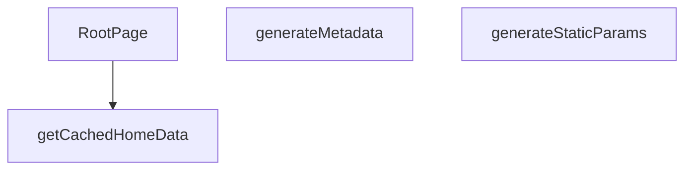

## Genel Bakış
Bu modül, uygulamanın dinamik dil destekli ana sayfasını yönetir. Next.js App Router yapısıyla entegre çalışarak, statik sayfa üretimini, SEO için gerekli meta verileri ve önbelleklenmiş verileri kullanarak sayfa renderlama süreçlerini koordine eder.

## Fonksiyon Grupları
### Sayfa Yapısı ve Meta Veri Yönetimi
Bu grup, sayfanın hangi dillerde statik olarak oluşturulacağını belirler ve her dil için arama motoru optimizasyonunu sağlayan başlık, açıklama gibi meta bilgileri otomatik olarak üretir.
- `generateStaticParams`, `generateMetadata`

### Veri Yönetimi ve Sayfa Bileşeni
Bu grup, dil ve kiracı bazlı ana sayfa verilerini önbellekten alarak ana React bileşeninin çalışmasını ve kullanıcıya dinamik bir sayfa sunulmasını sağlar.
- `getCachedHomeData`, `RootPage`

---

## AXIOMS – Mimari Varsayımlar

Bu modül, Next.js App Router'ın dinamik `[lang]` segmentli ana sayfa yapısına dayanır. Mimari varsayımlar, fonksiyon imzalarından çıkarılmıştır.

---

**[Aksiyom 1]:** Eğer `Props` tipi `params.lang` alanı içermiyorsa, `RootPage` ve `generateMetadata` fonksiyonları doğru çalışamaz.

**[Aksiyom 2]:** Eğer `lang` parametresi desteklenen diller listesinde yer almıyorsa, `generateStaticParams` tarafından geçerli statik parametreler üretilmez.

**[Aksiyom 3]:** Eğer `getCachedHomeData` fonksiyonuna geçerli bir `tenantId` sağlanmıyorsa, veri çekme işlemi başarısız olur veya eksik çalışır.

**[Aksiyom 4]:** Eğer `getCachedHomeData` fonksiyonuna geçerli bir `lang` sağlanmıyorsa, dil-bilinçli veri içeriği dönüştürülemez.

**[Aksiyom 5]:** Eğer `generateStaticParams` tarafından döndürülen `lang` değerleri `generateMetadata` ve `RootPage` tarafından kabul edilmiyorsa, build zamanında hata oluşur.

**[Aksiyom 6]:** Eğer `getCachedHomeData` için önbellekleme mekanizması çalışmıyorsa, her istekte ana sayfa verileri yeniden çekilir (performans düşer, fonksiyonel hata değil).

---

## FONKSİYON DETAYLARI

### generateStaticParams
**Ne yapar**: Uygulamanın desteklediği dil parametrelerini statik olarak üretir ve Next.js’in statik sayfa oluşturma sürecine sağlar.  
**Nasıl yapar**: Asenkron bir fonksiyon olarak tanımlanmış, sabit bir dizi içinde iki nesne döndürür; biri `'tr'` diğeri `'en'` dil kodunu içerir.  
**Parametreler**:  
- *Yok*  
**Dönüş**: `Array<{ lang: string }>` – `{ lang: 'tr' }` ve `{ lang: 'en' }` öğelerinden oluşan dizi.

### generateMetadata
**Ne yapar**: Sayfa için dinamik SEO meta verilerini, Open Graph ve Twitter kartı bilgilerini, ayrıca robots yönergelerini oluşturur.  
**Nasıl yapar**: `params` nesnesinden gelen `lang` değerini alır, ilgili dil sözlüğünü (`en` veya `tr`) seçer. Site URL’si temel alınarak kanonik URL ve dil‑spesifik URL’ler hazırlanır. Meta başlık, açıklama, Open Graph ve Twitter alanları sözlükten alınan SEO metinleriyle doldurulur; ayrıca site şeması ve organizasyon bilgileri JSON‑LD formatında hazırlanır.  
**Parametreler**:  
- `params`: `Props` – Sayfa parametrelerini içeren nesne; içinde `lang` özelliği bulunur.  
**Dönüş**: `Promise<Metadata>` – SEO, Open Graph, Twitter ve robots ayarlarını içeren `Metadata` nesnesi.

### getCachedHomeData
**Ne yapar**: Belirli bir dil ve kiracı (tenant) için ana sayfada görüntülenecek kategori ve ürün verilerini önbellekten getirir.

**Nasıl yapar**: Fonksiyon, sunucu tarafı veri işleme (SSR) sırasında çağrılarak belirli bir `lang` ve `tenantId` çifti için depolanmış ana sayfa verilerini (kategori ve ürün listesi) alır. Bu veriler önbelleğe alındığı için yüksek performanslı veri erişimi sağlar ve veritabanı veya harici API çağrılarını tekrarlamaz. Fonksiyonun dönüş tipi, `RootPage` içindeki `try...catch` bloğunda `catData` ve `prodData` alanlarına ayrılarak kullanıldığı için bir nesne yapısı döndürür.

**Parametreler**:
- lang: string — İçerik dilini belirten kod (ör. 'tr', 'en').
- tenantId: string — Kiracıyı (tenant) tanımlayan benzersiz tanımlayıcı.

**Dönüş**: Promise<{ catData: DomainCategory[], prodData: Product[] }> — Kategori verilerini (`catData`) ve ürün verilerini (`prodData`) içeren asenkron bir nesne döndürür.

### RootPage
**Ne yapar**: Ana sayfanın sunucu tarafı React bileşenini (sayfasını) oluşturur, verileri hazırlar ve istemciye JSX olarak döndürür.

**Nasıl yapar**: Fonksiyon, bir `Params` nesnesi alır ve dil (`lang`) bilgisini çıkarır. Ardından, ilgili dil sözlüğünü (`dict`) ve kiracı yapılandırmasını (`tenantConfig`) getirir. `getCachedHomeData` fonksiyonunu çağırarak kategori ve ürün verilerini alır; hata oluşursa bu verileri boş dizilerle başlatır. Kategorileri filtreleyerek, sıralayarak ve sözlükten çevirileri eşleştirerek `displayCategories` adlı bir视图 modeli listesi oluşturur. Sayfanın SEO için gerekli JSON-LD yapılandırmalarını (WebSite ve Organization) oluşturur. Son olarak, `TenantProvider` sağlayıcısı içinde, JSON-LD script etiketlerini ve `HomePage` bileşenini döndürür.

**Parametreler**:
- params: Props — Next.js tarafından sağlanan sayfa parametrelerini içeren nesne. `params.lang` alanı asenkron olarak çözümlenir.

**Dönüş**: JSX.Element — `TenantProvider` ile sarılmış, JSON-LD scriptleri ve `HomePage` bileşenini içeren React elemanı.

---

## TYPE ALIASES

### Props
```typescript
type Props = {

  params: Promise<{ lang: string }>

}
```

---

## AST POINTERS

### [N1_NASIL] AST Pointer: `C:\Users\alize\venthub-hvac\src\app\[lang]\page.tsx`::generateStaticParams
- **params**: (parametre yok)
- **ic_degiskenler**: (değişken yok)
- **Dönüş**: `{ lang: string }[]` — Statik sayfa parametrelerini (tr, en) döndürür

### [N2_NASIL] AST Pointer: `C:\Users\alize\venthub-hvac\src\app\[lang]\page.tsx`::generateMetadata
- **params**: `{ params: Promise<{ lang: string }> }`
- **ic_degiskenler**:
  - `lang` — URL'den gelen dil parametresi (tr/en)
  - `dict` — Seçilen dile karşılık gelen sözlük nesnesi
  - `siteUrl` — Sitenin ana URL'si
  - `canonical` — Canonical URL
- **Dönüş**: `Promise<Metadata>` — SEO metadata bilgisi

### [N3_NASIL] AST Pointer: `C:\Users\alize\venthub-hvac\src\app\[lang]\page.tsx`::getCachedHomeData
- **params**: `(lang: string, tenantId: string)`
- **ic_degiskenler**: (değişken yok — fonksiyon bir cache wrapper döndürür)
- **Dönüş**: `Promise<{ catData: DomainCategory[], prodData: Product[] }>` — Önbelleğe alınmış kategori ve ürün verisi

### [N4_NASIL] AST Pointer: `C:\Users\alize\venthub-hvac\src\app\[lang]\page.tsx`::getRootPage (async callback)
- **params**: (parametre yok)
- **ic_degiskenler**:
  - `catData` — `getCategories()` API çağrısından gelen hammadde kategori verisi
  - `prodData` — `getProducts(12)` API çağrısından gelen ilk 12 ürün verisi
- **Dönüş**: `{ catData, prodData }` — API verilerini döndürür

### [N5_NASIL] AST Pointer: `C:\Users\alize\venthub-hvac\src\app\[lang]\page.tsx`::RootPage
- **params**: `{ params: Promise<{ lang: string }> }`
- **ic_degiskenler**:
  - `lang` — URL'den gelen dil parametresi
  - `dict` — Seçilen dile karşılık gelen sözlük nesnesi
  - `tenantConfig` — `getTenantConfig()` API çağrısından gelen tenant yapılandırması
  - `tenantId` — Tenant kimlik numarası
  - `categories` — Kategori listesi (başlangıçta boş dizi)
  - `products` — Ürün listesi (başlangıçta boş dizi)
  - `catData` — Cache'den alınan ham kategori verisi (try bloğu içinde)
  - `prodData` — Cache'den alınan ham ürün verisi (try bloğu içinde)
  - `error` — Veri çekme hatalarını yakalar (catch bloğu içinde)
  - `displayCategories` — UI'a dönüştürülmüş filtrelenmiş ve sıralanmış kategori listesi
  - `siteUrl` — Sitenin ana URL'si
  - `jsonLds` — Structured data (JSON-LD) nesneleri dizisi
- **Dönüş**: `JSX.Element` — Ana sayfa bileşenini döndürür

### [N6_NASIL] AST Pointer: `C:\Users\alize\venthub-hvac\src\app\[lang]\page.tsx`::categoryMap (arrow function)
- **params**: `c: DomainCategory`
- **ic_degiskenler**:
  - `categoryListDict` — Sözlükteki kategori listesi (CategoryDict tipinde)
  - `subListDict` — Sözlükteki alt kategori listesi
  - `translatedName` — Kategorinin çevrilmiş adı (önce dictionary'den, sonra fallback değer)
- **Dönüş**: `CategoryViewModelLite` — UI için hazırlanmış kategori nesnesi

### [N7_NASIL] AST Pointer: `C:\Users\alize\venthub-hvac\src\app\[lang]\page.tsx`::scriptTagRenderer (arrow function)
- **params**: `(ld: object, i: number)`
- **ic_degiskenler**: (değişken yok)
- **Dönüş**: `JSX.Element` — JSON-LD script etiketi döndürür

---


## MERMAID CALL GRAPH


## NODE ID STANDARD

  file: src\app\[lang]\page.tsx
  function: src\app\[lang]\page.tsx::generateStaticParams
  function: src\app\[lang]\page.tsx::generateMetadata
  function: src\app\[lang]\page.tsx::getCachedHomeData
  function: src\app\[lang]\page.tsx::RootPage

---

## DISA AKTARILANLAR (EXPORTS)
  export: RootPage
  export: generateMetadata
  export: generateStaticParams
  export: getCachedHomeData

---

## STİL TOKENLERİ

### Arbitrary Değerler (token'a geçirilmemiş)
Yok — tüm stiller token'a geçirilmiş. ✅

### Kullanılan Token'lar (zaten token'a geçirilmiş)
- (yok)

### Tailwind Sınıf Özeti
- **Renkler:** (yok)
- **Layout:** (yok)
- **Varyant/Responsive:** (yok)
- **Yardımcı Sınıflar:** (yok)