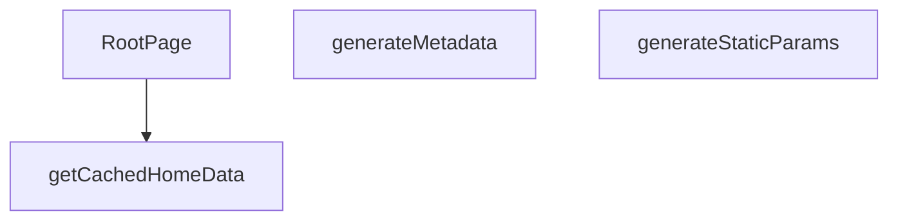

## Genel Bakış
Bu modül, uygulamanın çok dilli ana sayfasını oluşturur. Next.js App Router’ın dinamik `[lang]` parametresiyle yapılandırılmış olup; statik sayfa üretimi, meta veri yönetimi ve önbelleklenmiş veri kullanımıyla sayfa renderlama işlemlerini bir araya getirir.

## Fonksiyon Grupları

### Statik Parametre ve Meta Veri Yönetimi
Bu grup, sayfanın hangi dillerde statik olarak oluşturulacağını belirler ve her dil için sayfa meta bilgilerini (başlık, açıklama vb.) hazırlar.
- generateStaticParams, generateMetadata

### Veri Çekme ve Sayfa Renderlama
Bu grup, dil bazlı ana sayfa verilerini önbellekten alarak React bileşeninin çalıştırılmasını ve kullanıcıya sunulmasını sağlar.
- getCachedHomeData, RootPage

---

## AXIOMS – Mimari Varsayımlar
Bu modül için özel aksiyom tanımlanmamıştır.  

**Ancak** fonksiyon imzalarından çıkarılabilecek zorunlu koşullar aşağıdaki gibi tanımlanmıştır:

**Aksiyom 1**: Eğer `generateStaticParams()` fonksiyonu tanımlı değilse, Next.js uygulaması **statik yolları otomatik olarak keşfedemez** ve `/[lang]/page` rotası için **404** hatası oluşur.  

**Aksiyom 2**: Eğer `generateMetadata({ params }: Props)` fonksiyonu eksik ya da `params` nesnesi sağlanmazsa, sayfa **varsayılan meta‑veri** (başlık, açıklama vb.) kullanır ve **SEO** beklentileri karşılanmayabilir.  

**Aksiyom 3**: Eğer `getCachedHomeData(lang: string)` fonksiyonu çağrıldığında `lang` parametresi geçerli bir dil kodu (ör. `"en"`, `"tr"` vb.) değilse, **önbellek anahtarı hatalı olur** ve **veri bulunamaz**; bu durumda fonksiyon **boş** ya da **hata** döndürür.  

**Aksiyom 4**: Eğer `RootPage({ params }: Props)` bileşeni `params` içinde beklenen `lang` anahtarı yoksa, bileşen **render** aşamasında **runtime error** (ör. `undefined` erişimi) verir ve sayfa **çökebilir**.  

**Domain‑specific kural**:  
- `lang` parametresi için kabul edilen değerler proje içinde tanımlı dil kodlarıdır; bu kodlar dışındaki bir değer **bilinmiyor** ve davranış tanımlı değildir.  

Bu varsayımlar, modülün Next.js‑tabanlı çok‑dilli bir uygulamada doğru çalışması için gerekli temel koşulları özetler.

---

## FONKSİYON DETAYLARI

### generateStaticParams
**Ne yapar**: Uygulamanın desteklediği dil parametrelerini statik olarak üretir ve Next.js’in statik sayfa oluşturma sürecine sağlar.  
**Nasıl yapar**: Asenkron bir fonksiyon olarak tanımlanmış, sabit bir dizi içinde iki nesne döndürür; biri `'tr'` diğeri `'en'` dil kodunu içerir.  
**Parametreler**:  
- *Yok*  
**Dönüş**: `Array<{ lang: string }>` – `{ lang: 'tr' }` ve `{ lang: 'en' }` öğelerinden oluşan dizi.

### generateMetadata
**Ne yapar**: Sayfa için dinamik SEO meta verilerini, Open Graph ve Twitter kartı bilgilerini, ayrıca robots yönergelerini oluşturur.  
**Nasıl yapar**: `params` nesnesinden gelen `lang` değerini alır, ilgili dil sözlüğünü (`en` veya `tr`) seçer. Site URL’si temel alınarak kanonik URL ve dil‑spesifik URL’ler hazırlanır. Meta başlık, açıklama, Open Graph ve Twitter alanları sözlükten alınan SEO metinleriyle doldurulur; ayrıca site şeması ve organizasyon bilgileri JSON‑LD formatında hazırlanır.  
**Parametreler**:  
- `params`: `Props` – Sayfa parametrelerini içeren nesne; içinde `lang` özelliği bulunur.  
**Dönüş**: `Promise<Metadata>` – SEO, Open Graph, Twitter ve robots ayarlarını içeren `Metadata` nesnesi.

### getCachedHomeData
**Ne yapar**: Belirtilen dil için önbelleğe alınmış ana sayfa verilerini (kategori ve ürün listeleri) getirir.  
**Nasıl yapar**: Fonksiyonun gövdesi verilmemiştir; ancak adı ve parametresi göz önüne alındığında, `lang` parametresiyle ilişkili veri kaynağından önbellek kontrolü yaparak gerekli verileri döndürmesi beklenir.  
**Parametreler**:  
- `lang`: `string` – Veri çekilecek dil kodu (`'tr'` veya `'en'`).  
**Dönüş**: Belirtilmemiş; tipik olarak `{ catData, prodData }` şeklinde bir nesne döndürmesi muhtemeldir.

### RootPage
**Ne yapar**: Ana sayfa bileşenini oluşturur; dil parametresine göre sözlük, kategori ve ürün verilerini alır, bunları UI‑uyumlu modellere dönüştürür ve sayfada gerekli JSON‑LD scriptlerini ekleyerek `HomePage` bileşenine aktarır.  
**Nasıl yapar**:  
1. `params` içinden `lang` alınır ve ilgili dil sözlüğü (`en` veya `tr`) seçilir.  
2. `getCachedHomeData` çağrısıyla kategori ve ürün verileri çekilir; hatalar yakalanıp konsola uyarı verilir.  
3. Kategoriler, üst‑seviye (parent_id olmayan) öğeler filtrelenir, isimleri sözlükten çevirilerek `displayCategories` listesi oluşturulur.  
4. Site URL’si temel alınarak iki JSON‑LD nesnesi (WebSite ve Organization) hazırlanır ve `<script type="application/ld+json">` etiketiyle sayfaya eklenir.  
5. `HomePage` bileşeni, hazırlanmış kategori, ürün ve sözlük verileriyle render edilir.  
**Parametreler**:  
- `params`: `Props` – Sayfa parametrelerini içeren nesne; içinde `lang` özelliği bulunur.  
**Dönüş**: JSX element – JSON‑LD scriptleri ve `HomePage` bileşenini içeren React fragment (`<>...</>`).

---

## TYPE ALIASES

### Props
```typescript
type Props = {

  params: Promise<{ lang: string }>

}
```

---

## AST POINTERS

### [N1_NASIL] AST Pointer: C:\Users\alize\venthub-hvac\src\app\[lang]\page.tsx::generateStaticParams
- **params**: (none)
- **ic_degiskenler**:
  - `none` — fonksiyon içinde tanımlı değişken yok
- **Dönüş**: `Array<{ lang: string }>` – sabit iki öğeli dizi döner

### [N2_NASIL] AST Pointer: C:\Users\alize\venthub-hvac\src\app\[lang]\page.tsx::generateMetadata
- **params**: `{ params }: Props`
- **ic_degiskenler**:
  - `lang` — `await params` ifadesinden elde edilen dil kodu (`'tr'` veya `'en'`)
  - `dict` — seçilen dil sözlüğü (`en` veya `tr`)  
  - `siteUrl` — `SITE_URL` sabitinden alınan site temel URL’si
  - `canonical` — `${siteUrl}/${lang}` biçiminde oluşturulan kanonik URL
- **Dönüş**: `Promise<Metadata>` – SEO ve OpenGraph bilgilerini içeren `Metadata` nesnesi

### [N3_NASIL] AST Pointer: C:\Users\alize\venthub-hvac\src\app\[lang]\page.tsx::getCachedHomeData
- **params**: `lang: string`
- **ic_degiskenler**:
  - `catData` — `getCategories()` çağrısından dönen kategori verisi (array)
  - `prodData` — `getProducts(12)` çağrısından dönen ürün verisi (array)
- **Dönüş**: `yok` – fonksiyon bir `unstable_cache` sarmalayıcısı içinde tanımlanmış ve doğrudan bir nesne `{ catData, prodData }` döndürür; dışarıdan çağrıldığında cache‑lenmiş aynı nesneyi alır.

### [N4_NASIL] AST Pointer: C:\Users\alize\venthub-hvac\src\app\[lang]\page.tsx::RootPage
- **params**: `{ params }: Props`
- **ic_degiskenler**:
  - `lang` — `await params` ifadesinden elde edilen dil kodu
  - `dict` — `lang` değerine göre seçilen sözlük (`en` veya `tr`)
  - `categories` — `DomainCategory[]` tipinde, başlangıçta boş dizi; cache’den gelen `catData` işlendikten sonra doldurulur
  - `products` — `Product[]` tipinde, başlangıçta boş dizi; cache’den gelen `prodData` işlendikten sonra doldurulur
  - `catData` — `getCachedHomeData(lang)` sonucundan alınan kategori ham verisi
  - `prodData` — `getCachedHomeData(lang)` sonucundan alınan ürün ham verisi
  - `displayCategories` — `categories` dizisinden filtrelenip, sıralanıp, `dict` üzerinden çeviriler eklenerek oluşturulan `CategoryViewModelLite[]`
  - `categoryListDict` — `dict.common?.categoryList` tipinde sözlük, kategori isim çevirileri için kullanılır
  - `subListDict` — `categoryListDict?.sub` içinde alt kategori çevirileri
  - `translatedName` — mevcut kategori slug’ı için bulunan çevirilmiş isim; bulunamazsa `c.menu_label` veya `c.name` kullanılır
  - `siteUrl` — `SITE_URL` sabiti
  - `jsonLds` — yapılandırılmış JSON‑LD nesnelerinin listesi (WebSite ve Organization)
  - `ld` — `jsonLds` içinde döngüyle işlenen tek bir JSON‑LD nesnesi
  - `i` — `jsonLds.map` içinde kullanılan indeks
- **Dönüş**: `yok` – React bileşeni JSX döndürür; yan etkileri arasında `<script type="application/ld+json">` eklenmesi ve `HomePage` bileşenine veri aktarımı bulunur.

---


## MERMAID CALL GRAPH


## NODE ID STANDARD

  file: src\app\[lang]\page.tsx
  function: src\app\[lang]\page.tsx::generateStaticParams
  function: src\app\[lang]\page.tsx::generateMetadata
  function: src\app\[lang]\page.tsx::getCachedHomeData
  function: src\app\[lang]\page.tsx::RootPage

---

## DISA AKTARILANLAR (EXPORTS)
  export: RootPage
  export: generateMetadata
  export: generateStaticParams
  export: getCachedHomeData

---

## STİL TOKENLERİ

### Arbitrary Değerler (token'a geçirilmemiş)
Yok — tüm stiller token'a geçirilmiş. ✅

### Kullanılan Token'lar (zaten token'a geçirilmiş)
- (yok)

### Tailwind Sınıf Özeti
- **Renkler:** (yok)
- **Layout:** (yok)
- **Varyant/Responsive:** (yok)
- **Yardımcı Sınıflar:** (yok)