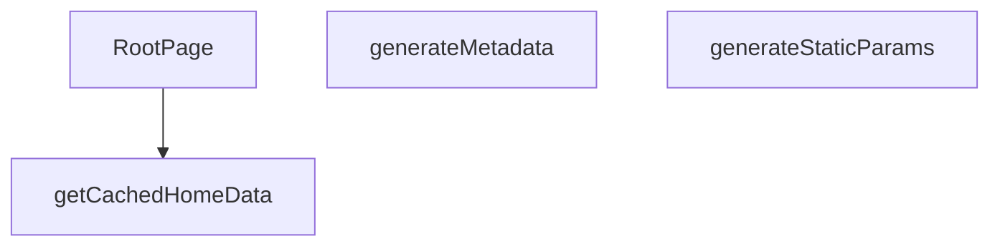

## Genel Bakış
Bu modül, Next.js App Router yapısında dil destekli ana sayfanın temelini oluşturur. Modül, sayfanın statik üretim parametrelerini belirleyerek, arama motorları için dinamik meta veriler üreterek ve önbellekten aldığı verilerle ana bileşeni render ederek tüm sayfa oluşturma sürecini yönetir. Ana sorumluluğu, kullanıcının diline göre kişiselleştirilmiş, SEO uyumlu ve performanslı bir ana sayfa sunmaktır.

## Fonksiyon Grupları
### Statik Üretim ve SEO Yönetimi
Bu grup, sayfanın hangi diller için önceden oluşturulacağını tanımlar ve arama motoru optimizasyonu için gerekli başlık, açıklama ve Open Graph bilgilerini sayfanın diline göre otomatik olarak üretir.
- generateStaticParams, generateMetadata

### Veri Sağlama ve Bileşen Oluşturma
Bu grup, dil ve kiracıya özel ana sayfa verilerini verimli bir şekilde önbellekten alır ve bu verileri kullanarak ana React bileşeninin son halini oluşturur.
- getCachedHomeData, RootPage

### AXIOMS – Mimari Varsayımlar

Bu modül, dil parametresine bağlı olarak statik sayfa üretiminde ve SEO meta verilerinin dinamik oluşturulmasında çalışır.

**[Aksiyom 1]:** Eğer `generateStaticParams()` tarafından döndürülen `lang` değerleri desteklenen diller listesiyle eşleşmiyorsa, `generateMetadata` ve `RootPage` fonksiyonlarına geçersiz bir dil parametresi iletilir ve sayfa renderı beklenmeyen davranış gösterir.

**[Aksiyom 2]:** Eğer `getCachedHomeData` fonksiyonuna iletilen `tenantId` geçerli bir tenant'a ait değilse veya önbellekte böyle bir veri yoksa, `RootPage` bileşeni veri olmadan render edilmeye çalışır ve olası bir hata durumuyla karşılaşılır.

---

## AXIOMS – Mimari Varsayımlar

Bu modül, Next.js App Router yapısında dil parametreli bir ana sayfa modülüdür.

**[Aksiyom 1]:** Eğer `params.lang` geçerli bir dil kodu (string) olarak sağlanmazsa, `generateMetadata`, `getCachedHomeData` ve `RootPage` fonksiyonları doğru çalışamaz.

**[Aksiyom 2]:** Eğer `getCachedHomeData` çağrısında `tenantId` parametresi geçerli bir string olarak sağlanmazsa, önbellek lookup işlemi başarısız olur veya geçersiz veri döner.

**[Aksiyom 3]:** Eğer `params` yapısı `lang` alanını içermiyorsa (Next.js `[lang]` dynamic segment'ten gelmediği durumda), `generateMetadata` ve `RootPage` fonksiyonları çalışırken hata oluşur.

**[Aksiyom 4]:** Eğer `generateStaticParams()` tarafından döndürülen dil listesi boşsa, hiçbir sayfa istatik olarak üretilmez ve sadece runtime'da render edilir.

**[Aksiyom 5]:** Eğer `getCachedHomeData` önbellekte ilgili `lang` + `tenantId` kombinasyonu için veri bulamazsa, `RootPage` bileşeni verisiz (fallback/empty state) render edilmelidir — bu durum fonksiyon imzasında garanti altına alınmamıştır, uygulama tarafında ele alınmalıdır.

**[Aksiyom 6]:** Eğer `tenantId` değeri uygulama yapılandırmasından (örn: environment variable veya config) sağlanmıyorsa, `getCachedHomeData` çağrısı için gerekli parametre eksik kalır. `tenantId`'nin nereden geldiği fonksiyon imzasından çıkarılamaz — **bilinmiyor**.

---

## FONKSİYON DETAYLARI

### generateStaticParams
**Ne yapar**: Uygulamanın desteklediği dil parametrelerini statik olarak üretir ve Next.js’in statik sayfa oluşturma sürecine sağlar.  
**Nasıl yapar**: Asenkron bir fonksiyon olarak tanımlanmış, sabit bir dizi içinde iki nesne döndürür; biri `'tr'` diğeri `'en'` dil kodunu içerir.  
**Parametreler**:  
- *Yok*  
**Dönüş**: `Array<{ lang: string }>` – `{ lang: 'tr' }` ve `{ lang: 'en' }` öğelerinden oluşan dizi.

### generateMetadata
**Ne yapar**: Sayfa için dinamik SEO meta verilerini, Open Graph ve Twitter kartı bilgilerini, ayrıca robots yönergelerini oluşturur.  
**Nasıl yapar**: `params` nesnesinden gelen `lang` değerini alır, ilgili dil sözlüğünü (`en` veya `tr`) seçer. Site URL’si temel alınarak kanonik URL ve dil‑spesifik URL’ler hazırlanır. Meta başlık, açıklama, Open Graph ve Twitter alanları sözlükten alınan SEO metinleriyle doldurulur; ayrıca site şeması ve organizasyon bilgileri JSON‑LD formatında hazırlanır.  
**Parametreler**:  
- `params`: `Props` – Sayfa parametrelerini içeren nesne; içinde `lang` özelliği bulunur.  
**Dönüş**: `Promise<Metadata>` – SEO, Open Graph, Twitter ve robots ayarlarını içeren `Metadata` nesnesi.

### getCachedHomeData
**Ne yapar**: Belirli bir dil ve kiracı (tenant) için ana sayfada görüntülenecek kategori ve ürün verilerini önbellekten getirir.

**Nasıl yapar**: Fonksiyon, sunucu tarafı veri işleme (SSR) sırasında çağrılarak belirli bir `lang` ve `tenantId` çifti için depolanmış ana sayfa verilerini (kategori ve ürün listesi) alır. Bu veriler önbelleğe alındığı için yüksek performanslı veri erişimi sağlar ve veritabanı veya harici API çağrılarını tekrarlamaz. Fonksiyonun dönüş tipi, `RootPage` içindeki `try...catch` bloğunda `catData` ve `prodData` alanlarına ayrılarak kullanıldığı için bir nesne yapısı döndürür.

**Parametreler**:
- lang: string — İçerik dilini belirten kod (ör. 'tr', 'en').
- tenantId: string — Kiracıyı (tenant) tanımlayan benzersiz tanımlayıcı.

**Dönüş**: Promise<{ catData: DomainCategory[], prodData: Product[] }> — Kategori verilerini (`catData`) ve ürün verilerini (`prodData`) içeren asenkron bir nesne döndürür.

### RootPage

**Ne yapar**: Uygulamanın kök sayfasını (anasayfa) sunucu tarafında render eden asenkron React Server Component'tir. Tenant (kiracı) yapılandırmasına göre veri çeker, kategori ve ürün listelerini hazırlar, SEO için JSON-LD yapılandırılmış veri üretir ve `HomePage` bileşenini sunucuda oluşturarak istemciye gönderir.

**Nasıl yapar**:
Next.js'in parametre destructuring mekanizması ile URL'den `lang` parametesini çıkarır. Ardından `getTenantConfig()` ile aktif tenant yapılandırmasını, `getCachedHomeData()` ile önbelleğe alınmış kategori/ürün verilerini asenkron olarak çeker. `getCachedHomeData` başarısız olursa `try-catch` bloğu sayesinde uygulama çökmez, sadece boş listelerle devam eder. Çekilen ham kategori verisi `toUICategoryList` ile UI modeline dönüştürülür, ardından filtreleme ve sıralama uygulanarak `displayCategories` oluşturulur. Kategori adlarının çözümlemesi `getCategoryDisplayName` fonksiyonu üzerinden gerçekleştirilir; bu fonksiyon `translation_key` → `menu_label` → `name` öncelik sırasıyla çalışır. Doğrudan `categoryList[slug]` indekslemesi yapılmaz çünkü bu yaklaşım `translation_key` alanını atlar ve yanlış dilde karışık sonuçlar üretir. Dil-sensitive slug'lar `getLocalizedCategorySlug` ile, sözlük çevirileri ise `getDictValue` ile çözülür. Sayfa son olarak iki JSON-LD bloğu (WebSite ve Organization) ve `HomePage` bileşenini `TenantProvider` içinde render eder.

**Parametreler**:
- `params` : `Promise<{ lang: string }>` — Next.js'in dinamik route parametrelerini içeren asenkron nesne. `lang` alanı sayfanın aktif dilini (`'en'` veya `'tr'`) belirtir. `await` ile çözümlenerek değeri alınır.

**Dönüş**: JSX yapısı döndürür. Döndürülen JSX, iki adet `<script type="application/ld+json">` JSON-LD bloğu ve `TenantProvider` içinde sarılmış `<HomePage>` bileşeninden oluşur. `HomePage` bileşenine şu props'lar iletilir: `initialCategories` (filtrelenmiş ve dönüştürülmüş kategori listesi), `rawCategories` (ham kategori verisi), `initialProducts` (ürün listesi), `dictionary` (sözlük alt nesnesi), `lang` (aktif dil kodu). Return type React'in `JSX.Element` türündedir.

**İç Bağımlılıklar**:
- `getTenantConfig()` — Tenant yapılandırmasını asenkron olarak getirir.
- `getCachedHomeData(lang, tenantId)` — Önbelleğe alınmış kategori verisi (`catData`), ürün verisi (`prodData`) ve ürün sayılarını (`productCounts`) döndürür.
- `toUICategoryList()` — Domain modeli `DomainCategory[]` dizisini UI uyumlu forma dönüştürür.
- `getCategoryDisplayName(category, t)` — Kategorinin görnen adını `translation_key` → `menu_label` → `name` önceliğiyle çözer.
- `getLocalizedCategorySlug(category, lang)` — Dil duyarlı kanonik slug üretir.
- `getDictValue(dict, key)` — Sözlük nesnesinden iç içe anahtar ile değer çeker; `t()` fonksiyonu olarak sarılır.
- `SITE` — Site kök URL sabiti, JSON-LD ve arama aksiyonu URL'lerinde kullanılır.

---

---

## İTHALATLAR (IMPORTS)
- import: ../../components/home/GuidedCategoryDiscovery::CategoryViewModelLite
- import: ../../config/siteUrl::SITE_URL
- import: ../../hooks/useTenant::TenantProvider
- import: ../../i18n/dictionaries/en::en
- import: ../../i18n/dictionaries/tr::tr
- import: ../../i18n/getDictValue::getDictValue
- import: ../../lib/cache/tags::HOME_DATA_TAG
- import: ../../lib/cache/tags::homeDataTag
- import: ../../lib/type-converters::DomainCategory
- import: ../../lib/type-converters::toUICategoryList
- import: ../../utils/categoryHelpers::getCategoryDisplayName
- import: ../../utils/categoryHelpers::getLocalizedCategorySlug
- import: ../../utils/tenantServer::getTenantConfig
- import: ../../views/HomePage::HomePage
- import: @/lib/services/category.service::getCategories
- import: @/lib/services/product.service::getProducts
- import: @/lib/supabase/static::supabaseStaticClient
- import: @/types/ui-models::type { Product }
- import: next/cache::unstable_cache
- import: next::type { Metadata }
- import: react::React

---

## TYPE ALIASES

### Props
```typescript
type Props = {
  params: Promise<{ lang: string }>
}
```

---

## AST POINTERS

### [N1_NASIL] AST Pointer: [lang]/page.tsx::generateStaticParams
- **params**: (parametre yok)
- **ic_degiskenler**: (yok — sadece sabit array döner)
- **Dönüş**: `Array<{ lang: 'tr' } | { lang: 'en' }>` — Önceden tanımlı statik parametreler (dil seçenekleri)

### [N2_NASIL] AST Pointer: [lang]/page.tsx::generateMetadata
- **params**: `({ params }: Props)` — Props nesnesinden params alır
- **ic_degiskenler**:
  - `lang` — params'tan destructured dil kodu (tr veya en)
  - `dict` — Seçilen dile göre sözlük nesnesi (en veya tr)
  - `siteUrl` — SITE_URL sabitinden gelen temel URL
  - `canonical` — Sayfanın kanonik URL'i (siteUrl + lang)
- **Dönüş**: `Promise<Metadata>` — SEO ve sosyal paylaşım metrikleri

### [N3_NASIL] AST Pointer: [lang]/page.tsx::getCachedHomeData
- **params**: `(lang: string, tenantId: string)`
- **ic_degiskenler**:
  - `catData` — Kategori listesi (getCategories API çağrısı)
  - `prodData` — Ürün listesi (getProducts API çağrısı)
  - `countRes` — Kategori başı ürün sayıları (supabaseStaticClient.rpc çağrısı)
  - `productCounts` — Kategori ID'lerini ürün sayılarına eşleyen Record nesnesi
  - `row` — countRes.data dizisindeki her satır (category_id ve product_count alanları)
  - `row.category_id` — Her satırdaki kategori ID'si (productCounts Record'una anahtar olarak kullanılır)
  - `row.product_count` — Her satırdaki ürün sayısı (0 veya pozitif tamsayı)
- **Dönüş**: `{ catData, prodData, productCounts }` — Ana sayfa verileri nesnesi

### [N4_NASIL] AST Pointer: [lang]/page.tsx::RootPage
- **params**: `({ params }: Props)` — Props nesnesinden params alır
- **ic_degiskenler**:
  - `lang` — params'tan destructured dil kodu
  - `dict` — Seçilen dile göre sözlük nesnesi
  - `tenantConfig` — getTenantConfig() API çağrısı ile alınan konfigürasyon
  - `tenantId` — tenantConfig.id'den gelen kiracı ID'si
  - `categories` — Başlangıçta boş dizi, data.catData'dan dönüştürülmüş UI kategorileri
  - `products` — Başlangıçta boş dizi, data.prodData'dan Product[] tipine dönüştürülmüş ürünler
  - `productCounts` — Başlangıçta boş Record, data.productCounts'tan gelen kategori ürün sayıları
  - `error` — try-catch bloğunda yakalanan hata nesnesi (SSR Data Fetch Error loglanır)
  - `t` — Aktif dilin sözlüğünden çeviri değerini getiren fonksiyon (getDictValue kullanır)
  - `displayCategories` — Filtrelenmiş ve dönüştürülmüş kategori listesi (CategoryViewModelLite[])
    - `c` — categories dizisindeki her bir kategori nesnesi
    - `c.parent_id` — Üst kategori ID'si (null ise kök kategoridir)
    - `c.id` — Kategorinin benzersiz ID'si
    - `c.description` — Kategori açıklaması (boş string fallback)
    - `c.image_url` — Kategori görsel URL'i
  - `siteUrl` — SITE_URL sabitinden gelen temel URL
  - `jsonLds` — JSON-LD yapılandırılmış veri nesneleri dizisi
    - `ld` — Her JSON-LD nesnesi (WebSite veya Organization)
    - `i` — Dizideki indeks numarası (key için kullanılır)
- **Dönüş**: `<TenantProvider>` JSX bileşeni — Ana sayfa içeriği ve JSON-LD scriptleri

---


## MERMAID CALL GRAPH


## NODE ID STANDARD

  file: src\app\[lang]\page.tsx
  function: src\app\[lang]\page.tsx::generateStaticParams
  function: src\app\[lang]\page.tsx::generateMetadata
  function: src\app\[lang]\page.tsx::getCachedHomeData
  function: src\app\[lang]\page.tsx::RootPage

---

## DISA AKTARILANLAR (EXPORTS)
  export: RootPage
  export: generateMetadata
  export: generateStaticParams
  export: getCachedHomeData

---

## STİL TOKENLERİ

### Arbitrary Değerler (token'a geçirilmemiş)
Yok — tüm stiller token'a geçirilmiş. ✅

### Kullanılan Token'lar (zaten token'a geçirilmiş)
- (yok)

### Tailwind Sınıf Özeti
- **Renkler:** (yok)
- **Layout:** (yok)
- **Varyant/Responsive:** (yok)
- **Yardımcı Sınıflar:** (yok)