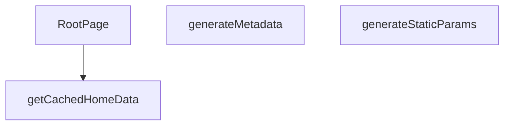

## Genel Bakış
Bu modül, Next.js App Router yapısında dil destekli ana sayfanın temelini oluşturur. Modül, sayfanın statik üretim parametrelerini belirleyerek, arama motorları için dinamik meta veriler üreterek ve önbellekten aldığı verilerle ana bileşeni render ederek tüm sayfa oluşturma sürecini yönetir. Ana sorumluluğu, kullanıcının diline göre kişiselleştirilmiş, SEO uyumlu ve performanslı bir ana sayfa sunmaktır.

## Fonksiyon Grupları
### Statik Üretim ve SEO Yönetimi
Bu grup, sayfanın hangi diller için önceden oluşturulacağını tanımlar ve arama motoru optimizasyonu için gerekli başlık, açıklama ve Open Graph bilgilerini sayfanın diline göre otomatik olarak üretir.
- generateStaticParams, generateMetadata

### Veri Sağlama ve Bileşen Oluşturma
Bu grup, dil ve kiracıya özel ana sayfa verilerini verimli bir şekilde önbellekten alır ve bu verileri kullanarak ana React bileşeninin son halini oluşturur.
- getCachedHomeData, RootPage

---

## AXIOMS – Mimari Varsayımlar

Bu modül, dil parametresine bağlı olarak statik sayfa üretiminde ve SEO meta verilerinin dinamik oluşturulmasında çalışır.

[Aksiyom 1]: Eğer `generateStaticParams()` tarafından döndürülen `lang` değerleri desteklenen diller listesiyle eşleşmiyorsa, `generateMetadata` ve `RootPage` fonksiyonlarına geçersiz bir dil parametresi iletilir ve sayfa renderı beklenmeyen davranış gösterir.

[Aksiyom 2]: Eğer `getCachedHomeData` fonksiyonuna iletilen `tenantId` geçerli bir tenant'a ait değilse veya önbellekte böyle bir veri yoksa, `RootPage` bileşeni veri olmadan render edilmeye çalışılır ve boş/hatalı sayfa oluşur.

[Aksiyom 3]: Eğer `generateMetadata` fonksiyonuna iletilen `params` objesi içinde `lang` alanı eksikse, SEO için gerekli meta veriler (başlık, açıklama, Open Graph bilgileri) oluşturulamaz ve varsayılan/meta verisiz bir sayfa çıktısı üretilir.

[Aksiyom 4]: Eğer `getCachedHomeData` fonksiyonu senkron çalışıyorsa ve asenkron veri kaynağına erişim sırasında bir kesinti oluşursa, önbellek verisi dönemeyeceği için `RootPage` bileşeni veri eksikliği ile karşılaşır.

[Aksiyom 5]: Eğer `generateStaticParams` tarafından döndürülen params listesi boşsa, hiçbir dil için statik sayfa üretilmez ve deploy sonrası ana sayfa erişilemez hale gelir.

---

## FONKSİYON DETAYLARI

### generateStaticParams
**Ne yapar**: Uygulamanın desteklediği dil parametrelerini statik olarak üretir ve Next.js’in statik sayfa oluşturma sürecine sağlar.  
**Nasıl yapar**: Asenkron bir fonksiyon olarak tanımlanmış, sabit bir dizi içinde iki nesne döndürür; biri `'tr'` diğeri `'en'` dil kodunu içerir.  
**Parametreler**:  
- *Yok*  
**Dönüş**: `Array<{ lang: string }>` – `{ lang: 'tr' }` ve `{ lang: 'en' }` öğelerinden oluşan dizi.

### generateMetadata
**Ne yapar**: Sayfa için dinamik SEO meta verilerini, Open Graph ve Twitter kartı bilgilerini, ayrıca robots yönergelerini oluşturur.  
**Nasıl yapar**: `params` nesnesinden gelen `lang` değerini alır, ilgili dil sözlüğünü (`en` veya `tr`) seçer. Site URL’si temel alınarak kanonik URL ve dil‑spesifik URL’ler hazırlanır. Meta başlık, açıklama, Open Graph ve Twitter alanları sözlükten alınan SEO metinleriyle doldurulur; ayrıca site şeması ve organizasyon bilgileri JSON‑LD formatında hazırlanır.  
**Parametreler**:  
- `params`: `Props` – Sayfa parametrelerini içeren nesne; içinde `lang` özelliği bulunur.  
**Dönüş**: `Promise<Metadata>` – SEO, Open Graph, Twitter ve robots ayarlarını içeren `Metadata` nesnesi.

### getCachedHomeData
**Ne yapar**: Belirli bir dil ve kiracı (tenant) için ana sayfada görüntülenecek kategori ve ürün verilerini önbellekten getirir.

**Nasıl yapar**: Fonksiyon, sunucu tarafı veri işleme (SSR) sırasında çağrılarak belirli bir `lang` ve `tenantId` çifti için depolanmış ana sayfa verilerini (kategori ve ürün listesi) alır. Bu veriler önbelleğe alındığı için yüksek performanslı veri erişimi sağlar ve veritabanı veya harici API çağrılarını tekrarlamaz. Fonksiyonun dönüş tipi, `RootPage` içindeki `try...catch` bloğunda `catData` ve `prodData` alanlarına ayrılarak kullanıldığı için bir nesne yapısı döndürür.

**Parametreler**:
- lang: string — İçerik dilini belirten kod (ör. 'tr', 'en').
- tenantId: string — Kiracıyı (tenant) tanımlayan benzersiz tanımlayıcı.

**Dönüş**: Promise<{ catData: DomainCategory[], prodData: Product[] }> — Kategori verilerini (`catData`) ve ürün verilerini (`prodData`) içeren asenkron bir nesne döndürür.

### RootPage
**Ne yapar**: Bu asenkron fonksiyon, uygulamanın dil destekli ve kiracı (tenant) bazlı ana sayfasını sunucu tarafında (SSR) oluşturur. Fonksiyon, dil ayarına göre sözlüğü, kiracı yapılandırmasını ve ana sayfa için gerekli kategori/ürün verilerini getirip `HomePage` bileşenine hazırlar. Ayrıca, arama motoru optimizasyonu (SEO) için Schema.org formatında JSON-LD yapılandırılmış verileri sayfaya enjekte eder.

**Nasıl yapar**: Fonksiyon, `params` prop'undan dil kodunu (`lang`) çıkarır. Ardından ilgili dile ait sözlük yapısını (`dict`) seçer. `getTenantConfig` asenkron fonksiyonunu kullanarak kiracının kimliğini ve yapılandırmasını alır. `getCachedHomeData` ile belirli bir dil ve kiracıya ait önbelleklenmiş kategori ve ürün verilerini getirir; hata oluşursa konsola uyarı yazdırarak devam eder. Gelen ham kategori verilerini (`catData`) UI'da gösterilecek forma (`displayCategories`) dönüştürürken, `parent_id`'si olmayan (üst seviye) kategorileri filtreler, alfabetik sıralar ve `getCategoryDisplayName` ile çok dilli görünür isimlerini hesaplar. `getDictValue` kullanarak oluşturduğu `t` fonksiyonu, translation_key bazlı çeviri çözümlemesini sağlar. Son olarak,`TenantProvider` ile kiracı bağlamını sararak `HomePage` bileşenini ve SEO verilerini render eder.

**Parametreler**:
- `{ params }: Props` — Next.js dinamik rotadan gelen parametreleri içeren nesne. İçerisinde `lang: string` (ör. 'tr', 'en') ve olası其他 kiracı parametreleri bulunur.
  - `params.lang`: `string` — Sayfanın görüntüleneceği dil kodu. Fonksiyon bu değere göre sözlük ve içerik dilini belirler.

**Dönüş**: Fonksiyon, `JSX.Element` tipinde bir React bileşen döndürür. Dönen bileşen, `TenantProvider` ile sarılmış, SEO verileri (`script` etiketleri) ve `HomePage` bileşenini içeren bir yapıdır. `HomePage`'e başlangıç verileri (`initialCategories`, `rawCategories`, `initialProducts`), sözlük (`dictionary`) ve dil (`lang`) prop olarak geçilir.

---

## İTHALATLAR (IMPORTS)
- import: ../../components/home/GuidedCategoryDiscovery::CategoryViewModelLite
- import: ../../config/siteUrl::SITE_URL
- import: ../../hooks/useTenant::TenantProvider
- import: ../../i18n/dictionaries/en::en
- import: ../../i18n/dictionaries/tr::tr
- import: ../../i18n/getDictValue::getDictValue
- import: ../../lib/type-converters::DomainCategory
- import: ../../lib/type-converters::toUICategoryList
- import: ../../utils/categoryHelpers::getCategoryDisplayName
- import: ../../utils/tenantServer::getTenantConfig
- import: ../../views/HomePage::HomePage
- import: @/lib/services/category.service::getCategories
- import: @/lib/services/product.service::getProducts
- import: @/lib/supabase/static::supabaseStaticClient
- import: @/types/ui-models::type { Product }
- import: next/cache::unstable_cache
- import: next::type { Metadata }
- import: react::React

---

## TYPE ALIASES

### Props
```typescript
type Props = {
  params: Promise<{ lang: string }>
}
```

---

## AST POINTERS

### [N1_NASIL] AST Pointer: `src/app/[lang]/page.tsx`::generateStaticParams
- **params**: yok
- **ic_degiskenler**: (yok — sadece literal array döner)
- **Dönüş**: `Array<{ lang: string }>` — statik olarak `tr` ve `en` dil parametrelerini döner; Next.js build'te iki dil için sayfa üretir

---

### [N2_NASIL] AST Pointer: `src/app/[lang]/page.tsx`::generateMetadata
- **params**: `{ params }: Props` — `params` bir Promise'tir; `await` ile çözülür
- **ic_degiskenler**:
  - `lang` — `await params` sonucu elde edilen dil kodu (`'tr'` veya `'en'`); sözlük seçiminde ve URL'lerde kullanılır
  - `dict` — `lang === 'en'` koşuluna göre `en` veya `tr` sözlük nesnesi; SEO başlık/açıklama değerlerini sağlar
  - `siteUrl` — `SITE_URL` sabitinden gelen site kök URL'i; canonical, OG ve Twitter URL'lerinde kullanılır
  - `canonical` — Sayfanın canonical URL'i; `${siteUrl}/${lang}` formatında oluşturulur
- **Dönüş**: `Promise<Metadata>` — Next.js metadata nesnesi (title, description, alternates, openGraph, twitter, robots)

---

### [N3_NASIL] AST Pointer: `src/app/[lang]/page.tsx`::getCachedHomeData
- **params**: `(lang: string, tenantId: string)` — dil kodu ve kiracı ID'si; cache key bileşenleri olarak kullanılır
- **ic_degiskenler**:
  - `catData` — `Promise.all` ile `getCategories(supabaseStaticClient)` çağrısından dönen kategori verisi; `Promise.all` destructuring'inin ilk elemanı
  - `prodData` — `Promise.all` ile `getProducts(supabaseStaticClient, 12)` çağrısından dönen ürün verisi (maksimum 12 ürün); `Promise.all` destructuring'inin ikinci elemanı
- **Dönüş**: `{ catData, prodData }` — `unstable_cache` ile sarılmış; `['home-page-data', lang, tenantId]` key'inde, `['home-data', 'home-data-${tenantId}']` tag'leri ile cache'lenir; `revalidate: false` ile stale-while-revalidate kapatılmıştır

---

### [N4_NASIL] AST Pointer: `src/app/[lang]/page.tsx`::RootPage
- **params**: `{ params }: Props` — `params` bir Promise'tir; `await` ile çözülür
- **ic_degiskenler**:
  - `lang` — `await params` sonucu elde edilen dil kodu; sözlük seçiminde, URL'lerde ve bileşen prop'unda kullanılır
  - `dict` — `lang === 'en'` koşuluna göre `en` veya `tr` sözlük nesnesi; SEO değerleri, `dict.home` alt yapısı ve `t()` fonksiyonu için kaynaktır
  - `tenantConfig` — `await getTenantConfig()` ile çekilen kiracı konfigürasyon nesnesi; `.id` alanı `tenantId` olarak, kendisi `TenantProvider` value prop'u olarak kullanılır
  - `tenantId` — `tenantConfig.id`; cache key bileşeni olarak `getCachedHomeData`'ya passed edilir
  - `categories` — `DomainCategory[]` tipinde başlangıçta boş array; `getCachedHomeData`'dan gelen `catData` → `toUICategoryList(catData)` dönüşümüyle doldurulur; hata durumunda boş kalır
  - `products` — `Product[]` tipinde başlangıçta boş array; `getCachedHomeData`'dan gelen `prodData` dökülür; `as Product[]` ile tip dönüşümü yapılır; hata durumunda boş kalır
  - `error` — `try/catch` bloğu yakaladığında `console.warn('SSR Data Fetch Error:', error)` ile loglanan hata nesnesi
  - `t` — `(key: string) => getDictValue(dict, key)` imzasıyla arrow function; çeviri key'lerini sözlükten çözer, `getCategoryDisplayName`'e passed edilir (SSOT: translation_key → menu_label → name zinciri)
  - `displayCategories` — `CategoryViewModelLite[]` tipinde; `categories` → `.filter((c) => !c.parent_id)` ile üst seviye kategoriler seçilir → `.sort((a, b) => a.name.localeCompare(b.name))` ile alfabetik sıralanır → `.map(c => ({...}))` ile dönüştürülür; her eleman `c.id`, `c.slug`, `getCategoryDisplayName(c, t)`, `c.description || ''`, `c.image_url` alanlarını içerir
  - `siteUrl` — `SITE_URL` sabitinden gelen site kök URL'i; JSON-LD yapılandırmalarında ve `jsonLds` içinde kullanılır
  - `jsonLds` — JSON-LD schema.org yapılandırmaları dizisi; iki eleman içerir: (1) `"@type": "WebSite"` — site adı, URL, SearchAction potansiyel eylemi; (2) `"@type": "Organization"` — site adı, URL, logo, contactPoint telefon bilgisi
- **Dönüş**: JSX — `<TenantProvider>` sarmalayıcısı içinde JSON-LD scriptleri ve `<HomePage>` bileşeni; `initialCategories`, `rawCategories`, `initialProducts`, `dictionary`, `lang` prop'ları ile

---

### [N5_NASIL] AST Pointer: `src/app/[lang]/page.tsx`::displayCategories_map_callback (inline arrow)
- **params**: `c` — `DomainCategory` tipinde tek bir kategori nesnesi; `.map()` iterasyonuyla her üst seviye kategori için çağrılır
- **ic_degiskenler**:
  - `c` — filtreleme ve sıralama sonrası kalan üst seviye kategori nesnesi; `.id`, `.slug`, `.name`, `.description`, `.image_url` alanları erişilir
- **Dönüş**: `CategoryViewModelLite` nesnesi — `{ id, slug, displayName, description, image_url }` yapısında

---

### [N6_NASIL] AST Pointer: `src/app/[lang]/page.tsx`::jsonLds_script_callback (inline arrow)
- **params**: `(ld, i)` — `ld` JSON-LD nesnesi, `i` dizi indeksi
- **ic_degiskenler**: (yok — parametreler dışında ek değişken yok; `ld` doğrudan `JSON.stringify(ld)` içinde kullanılır, `i` `key={i}` prop'unda kullanılır)
- **Dönüş**: JSX `<script>` elementi — `type="application/ld+json"`, `dangerouslySetInnerHTML` ile XSS koruması amacıyla `<` ve `>` karakterleri escape edilmiş JSON-LD içeriği

---


## MERMAID CALL GRAPH


## NODE ID STANDARD

  file: src\app\[lang]\page.tsx
  function: src\app\[lang]\page.tsx::generateStaticParams
  function: src\app\[lang]\page.tsx::generateMetadata
  function: src\app\[lang]\page.tsx::getCachedHomeData
  function: src\app\[lang]\page.tsx::RootPage

---

## DISA AKTARILANLAR (EXPORTS)
  export: RootPage
  export: generateMetadata
  export: generateStaticParams
  export: getCachedHomeData

---

## STİL TOKENLERİ

### Arbitrary Değerler (token'a geçirilmemiş)
Yok — tüm stiller token'a geçirilmiş. ✅

### Kullanılan Token'lar (zaten token'a geçirilmiş)
- (yok)

### Tailwind Sınıf Özeti
- **Renkler:** (yok)
- **Layout:** (yok)
- **Varyant/Responsive:** (yok)
- **Yardımcı Sınıflar:** (yok)