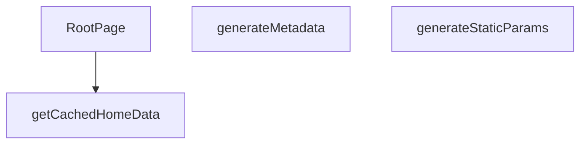

## Genel Bakış
Bu modül, Next.js App Router yapısında çok dilli ana sayfanın oluşturulmasından sorumludur. Sayfanın hangi diller için statik olarak üretileceğini belirler, arama motoru optimizasyonu için dinamik meta veriler oluşturur ve önbellekten alınan verilerle ana bileşeni render eder. Modülün ana amacı, kullanıcının diline göre kişiselleştirilmiş, SEO uyumlu ve performanslı bir ana sayfa sunmaktır.

## Fonksiyon Grupları
### Statik Üretim ve

---

## AXIOMS – Mimari Varsayımlar

Bu modül için fonksiyon gövdeleri verilmediğinden, yalnızca imzalardan ve genel bakıştan çıkarım yapılabilecek varsayımlar aşağıdadır.

[Aksiyom 1]: Eğer `generateStaticParams` fonksiyonu çalıştırılmazsa, Next.js hangi `[lang]` rotalarının statik olarak üretileceğini bilemez ve dil destekli sayfalar oluşturulamaz.

[Aksiyom 2]: Eğer `generateMetadata` fonksiyonuna geçerli `params` sağlanmazsa, arama motorları için dinamik meta veriler üretilemez ve SEO uyumluluğu sağlanamaz.

[Aksiyom 3]: Eğer `getCachedHomeData` fonksiyonuna `lang` parametresi sağlanmazsa, kullanıcının diline göre kişiselleştirilmiş veri çekilemez.

[Aksiyom 4]: Eğer `getCachedHomeData` fonksiyonuna `tenantId` parametresi sağlanmazsa, kiracıya özgü veriler önbellekten alınamaz.

[Aksiyom 5]: Eğer `RootPage` fonksiyonuna geçerli `params` sağlanmazsa, ana bileşen doğru dilde render edilemez.

[Aksiyom 6]: Eğer `getCachedHomeData` fonksiyonu düzgün çalışmazsa, `RootPage` bileşeni render için gerekli verileri alamaz ve ana sayfa gösterilemez.

---

## FONKSİYON DETAYLARI

### generateStaticParams
**Ne yapar**: Uygulamanın desteklediği dil parametrelerini statik olarak üretir ve Next.js’in statik sayfa oluşturma sürecine sağlar.  
**Nasıl yapar**: Asenkron bir fonksiyon olarak tanımlanmış, sabit bir dizi içinde iki nesne döndürür; biri `'tr'` diğeri `'en'` dil kodunu içerir.  
**Parametreler**:  
- *Yok*  
**Dönüş**: `Array<{ lang: string }>` – `{ lang: 'tr' }` ve `{ lang: 'en' }` öğelerinden oluşan dizi.

### generateMetadata
**Ne yapar**: Sayfa için dinamik SEO meta verilerini, Open Graph ve Twitter kartı bilgilerini, ayrıca robots yönergelerini oluşturur.  
**Nasıl yapar**: `params` nesnesinden gelen `lang` değerini alır, ilgili dil sözlüğünü (`en` veya `tr`) seçer. Site URL’si temel alınarak kanonik URL ve dil‑spesifik URL’ler hazırlanır. Meta başlık, açıklama, Open Graph ve Twitter alanları sözlükten alınan SEO metinleriyle doldurulur; ayrıca site şeması ve organizasyon bilgileri JSON‑LD formatında hazırlanır.  
**Parametreler**:  
- `params`: `Props` – Sayfa parametrelerini içeren nesne; içinde `lang` özelliği bulunur.  
**Dönüş**: `Promise<Metadata>` – SEO, Open Graph, Twitter ve robots ayarlarını içeren `Metadata` nesnesi.

### getCachedHomeData
**Ne yapar**: Belirli bir dil ve kiracı (tenant) için ana sayfada görüntülenecek kategori ve ürün verilerini önbellekten getirir.

**Nasıl yapar**: Fonksiyon, sunucu tarafı veri işleme (SSR) sırasında çağrılarak belirli bir `lang` ve `tenantId` çifti için depolanmış ana sayfa verilerini (kategori ve ürün listesi) alır. Bu veriler önbelleğe alındığı için yüksek performanslı veri erişimi sağlar ve veritabanı veya harici API çağrılarını tekrarlamaz. Fonksiyonun dönüş tipi, `RootPage` içindeki `try...catch` bloğunda `catData` ve `prodData` alanlarına ayrılarak kullanıldığı için bir nesne yapısı döndürür.

**Parametreler**:
- lang: string — İçerik dilini belirten kod (ör. 'tr', 'en').
- tenantId: string — Kiracıyı (tenant) tanımlayan benzersiz tanımlayıcı.

**Dönüş**: Promise<{ catData: DomainCategory[], prodData: Product[] }> — Kategori verilerini (`catData`) ve ürün verilerini (`prodData`) içeren asenkron bir nesne döndürür.

### RootPage
**Ne yapar**: Ana sayfa (anasayfa) için sunucu tarafı render edilen bir React bileşenidir. Dil parametresine göre uygun sözlüğü seçer, tenant yapılandırmasını alır, kategori ve ürün verilerini önbellekten çeker, kategorileri filtreleyip sıralayarak görüntüleme modeline dönüştürür, SEO amaçlı JSON-LD yapılandırılmış verileri oluşturur ve son olarak `HomePage` bileşenini `TenantProvider` içinde render eder.

**Nasıl yapar**: Fonksiyon öncelikle `params` nesnesinden dili (`lang`) çıkarır ve dile göre Türkçe veya İngilizce sözlük seçer. Ardından `getTenantConfig` ile tenant yapılandırmasını alır ve `getCachedHomeData` ile kategori, ürün ve ürün sayılarını çeker. Bu işlem try-catch bloğuna alınmıştır; hata durumunda kategoriler, ürünler ve ürün sayıları boş olarak kalır ve hata konsola yazdırılır. `t` fonksiyonu, Server Component olduğundan `useI18n` kullanılamayacağı için aktif dilin sözlüğünden `getDictValue` ile oluşturulur. Kategoriler önce üst kategori olmayan (`parent_id` yok) ve ürün sayısı sıfırdan büyük olanlar filtrelere tabi tutulur, ardından dile göre sıralanır ve `CategoryViewModelLite` modeline dönüştürülür; bu dönüşümde slug dile göre yerelleştirilir ve görünen ad `getCategoryDisplayName` üzerinden çözülür. Son olarak `WebSite` ve `Organization` tipinde iki JSON-LD nesnesi oluşturulur ve XSS koruması için HTML karakterleri escape edilerek script etiketleri olarak render edilir. Tüm çıktı `TenantProvider` içinde `HomePage` bileşenine prop olarak aktarılır.

**Parametreler**:
- params: `{ lang: string }` (Props tipinden türetilmiş) — URL'den gelen dil parametresini içerir. Async olarak await edilir ve `lang` değeri çıkarılır.

**Dönüş**: Belirtilmemiş. JSX yapısı döndürür; içinde JSON-LD script etiketleri ve `HomePage` bileşeni bulunan bir `TenantProvider` sarmalayıcısı render eder.

---

## İTHALATLAR (IMPORTS)
- import: ../../components/home/GuidedCategoryDiscovery::CategoryViewModelLite
- import: ../../config/siteUrl::SITE_URL
- import: ../../hooks/useTenant::TenantProvider
- import: ../../i18n/dictionaries/en::en
- import: ../../i18n/dictionaries/tr::tr
- import: ../../i18n/getDictValue::getDictValue
- import: ../../i18n/sort::compareText
- import: ../../lib/cache/tags::HOME_DATA_TAG
- import: ../../lib/cache/tags::homeDataTag
- import: ../../lib/type-converters::DomainCategory
- import: ../../lib/type-converters::toUICategoryList
- import: ../../utils/categoryHelpers::getCategoryDisplayName
- import: ../../utils/categoryHelpers::getLocalizedCategorySlug
- import: ../../utils/tenantServer::getTenantConfig
- import: ../../views/HomePage::HomePage
- import: @/lib/services/category.service::getCategories
- import: @/lib/services/product.service::getProducts
- import: @/lib/supabase/static::supabaseStaticClient
- import: @/types/ui-models::type { Product }
- import: next/cache::unstable_cache
- import: next::type { Metadata }
- import: react::React

---

## TYPE ALIASES

### Props
```typescript
type Props = {
  params: Promise<{ lang: string }>
}
```

---

## AST POINTERS

### [N1_NASIL] AST Pointer: src/app/[lang]/page.tsx::generateStaticParams
- **params**: yok
- **ic_degiskenler**: yok
- **Dönüş**: `Array<{ lang: string }>` — `'tr'` ve `'en'` değerlerini içeren statik yol parametreleri dizisi

---


## MERMAID CALL GRAPH


## NODE ID STANDARD

  file: src\app\[lang]\page.tsx
  function: src\app\[lang]\page.tsx::generateStaticParams
  function: src\app\[lang]\page.tsx::generateMetadata
  function: src\app\[lang]\page.tsx::getCachedHomeData
  function: src\app\[lang]\page.tsx::RootPage

---

## DISA AKTARILANLAR (EXPORTS)
  export: RootPage
  export: generateMetadata
  export: generateStaticParams
  export: getCachedHomeData

---

## STİL TOKENLERİ

### Arbitrary Değerler (token'a geçirilmemiş)
Yok — tüm stiller token'a geçirilmiş. ✅

### Kullanılan Token'lar (zaten token'a geçirilmiş)
- (yok)

### Tailwind Sınıf Özeti
- **Renkler:** (yok)
- **Layout:** (yok)
- **Varyant/Responsive:** (yok)
- **Yardımcı Sınıflar:** (yok)