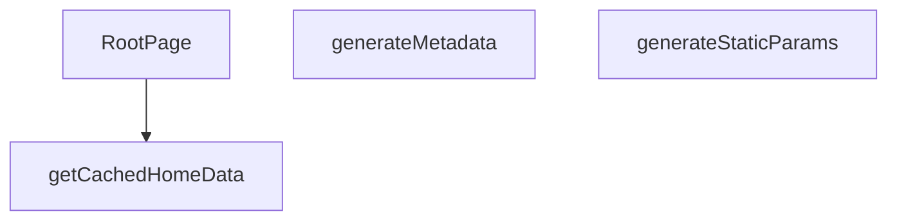

## Genel Bakış
Bu modül, Next.js App Router yapısıyla entegre çalışan, dil destekli ana sayfanın (homepage) temel iskeletini oluşturur. Statik sayfa üretim parametrelerini belirleyerek, SEO için gerekli meta verileri dinamik olarak üreterek ve önbelleklenmiş verilerle ana bileşeni render ederek sayfanın oluşturulma sürecini koordine eder.

## Fonksiyon Grupları
### Sayfa Yapısı ve Meta Veri Yönetimi
Bu grup, sayfanın hangi diller için statik olarak oluşturulacağını tanımlar ve arama motoru optimizasyonunu sağlamak için gerekli başlık, açıklama ve Open Graph bilgilerini otomatik olarak üretir.
- generateStaticParams, generateMetadata

### Veri Yönetimi ve Sayfa Bileşeni
Bu grup, dil ve kiracı bazlı ana sayfa verilerini önbellekten alarak ana React bileşeninin çalışmasını ve kullanıcıya dinamik, kişiselleştirilmiş bir ana sayfa sunulmasını sağlar.
- getCachedHomeData, RootPage

---


---

## FONKSİYON DETAYLARI

### generateStaticParams
**Ne yapar**: Uygulamanın desteklediği dil parametrelerini statik olarak üretir ve Next.js’in statik sayfa oluşturma sürecine sağlar.  
**Nasıl yapar**: Asenkron bir fonksiyon olarak tanımlanmış, sabit bir dizi içinde iki nesne döndürür; biri `'tr'` diğeri `'en'` dil kodunu içerir.  
**Parametreler**:  
- *Yok*  
**Dönüş**: `Array<{ lang: string }>` – `{ lang: 'tr' }` ve `{ lang: 'en' }` öğelerinden oluşan dizi.

### generateMetadata
**Ne yapar**: Sayfa için dinamik SEO meta verilerini, Open Graph ve Twitter kartı bilgilerini, ayrıca robots yönergelerini oluşturur.  
**Nasıl yapar**: `params` nesnesinden gelen `lang` değerini alır, ilgili dil sözlüğünü (`en` veya `tr`) seçer. Site URL’si temel alınarak kanonik URL ve dil‑spesifik URL’ler hazırlanır. Meta başlık, açıklama, Open Graph ve Twitter alanları sözlükten alınan SEO metinleriyle doldurulur; ayrıca site şeması ve organizasyon bilgileri JSON‑LD formatında hazırlanır.  
**Parametreler**:  
- `params`: `Props` – Sayfa parametrelerini içeren nesne; içinde `lang` özelliği bulunur.  
**Dönüş**: `Promise<Metadata>` – SEO, Open Graph, Twitter ve robots ayarlarını içeren `Metadata` nesnesi.

### getCachedHomeData
**Ne yapar**: Belirli bir dil ve kiracı (tenant) için ana sayfada görüntülenecek kategori ve ürün verilerini önbellekten getirir.

**Nasıl yapar**: Fonksiyon, sunucu tarafı veri işleme (SSR) sırasında çağrılarak belirli bir `lang` ve `tenantId` çifti için depolanmış ana sayfa verilerini (kategori ve ürün listesi) alır. Bu veriler önbelleğe alındığı için yüksek performanslı veri erişimi sağlar ve veritabanı veya harici API çağrılarını tekrarlamaz. Fonksiyonun dönüş tipi, `RootPage` içindeki `try...catch` bloğunda `catData` ve `prodData` alanlarına ayrılarak kullanıldığı için bir nesne yapısı döndürür.

**Parametreler**:
- lang: string — İçerik dilini belirten kod (ör. 'tr', 'en').
- tenantId: string — Kiracıyı (tenant) tanımlayan benzersiz tanımlayıcı.

**Dönüş**: Promise<{ catData: DomainCategory[], prodData: Product[] }> — Kategori verilerini (`catData`) ve ürün verilerini (`prodData`) içeren asenkron bir nesne döndürür.

### RootPage
**Ne yapar**: Ana sayfanın sunucu tarafı React bileşenini (sayfasını) oluşturur, verileri hazırlar ve istemciye JSX olarak döndürür.

**Nasıl yapar**: Fonksiyon, bir `Params` nesnesi alır ve dil (`lang`) bilgisini çıkarır. Ardından, ilgili dil sözlüğünü (`dict`) ve kiracı yapılandırmasını (`tenantConfig`) getirir. `getCachedHomeData` fonksiyonunu çağırarak kategori ve ürün verilerini alır; hata oluşursa bu verileri boş dizilerle başlatır. Kategorileri filtreleyerek, sıralayarak ve sözlükten çevirileri eşleştirerek `displayCategories` adlı bir视图 modeli listesi oluşturur. Sayfanın SEO için gerekli JSON-LD yapılandırmalarını (WebSite ve Organization) oluşturur. Son olarak, `TenantProvider` sağlayıcısı içinde, JSON-LD script etiketlerini ve `HomePage` bileşenini döndürür.

**Parametreler**:
- params: Props — Next.js tarafından sağlanan sayfa parametrelerini içeren nesne. `params.lang` alanı asenkron olarak çözümlenir.

**Dönüş**: JSX.Element — `TenantProvider` ile sarılmış, JSON-LD scriptleri ve `HomePage` bileşenini içeren React elemanı.

---

## TYPE ALIASES

### Props
```typescript
type Props = {

  params: Promise<{ lang: string }>

}
```

---

## AST POINTERS

### [N1_NASIL] AST Pointer: C:\Users\alize\venthub-hvac\src\app\[lang]\page.tsx::generateStaticParams
- **params**: parametre yok
- **ic_degiskenler**: (değişken yok)
- **Dönüş**: Static dil parametrelerini içeren dizi: `{ lang: 'tr' }` ve `{ lang: 'en' }` objeleri

### [N2_NASIL] AST Pointer: C:\Users\alize\venthub-hvac\src\app\[lang]\page.tsx::generateMetadata
- **params**: `{ params }: Props` — Sayfa parametrelerini içeren Props objesi
- **ic_degiskenler**:
  - `lang` — `await params` ile elde edilen dil kodu ('tr' veya 'en')
  - `dict` — Diline göre sözlük nesnesi (`en` veya `tr`)
  - `siteUrl` — SITE_URL sabitinden gelen site adresi
  - `canonical` — Canonical URL, `${siteUrl}/${lang}` formatında
- **Dönüş**: Metadata objesi (title, description, alternates, openGraph, twitter, robots alanlarını içerir)

### [N3_NASIL] AST Pointer: C:\Users\alize\venthub-hvac\src\app\[lang]\page.tsx::getCachedHomeData
- **params**: `(lang: string, tenantId: string)` — Dil kodu ve kiracı ID'si
- **ic_degiskenler**: (değişken yok — fonksiyon doğrudan unstable_cache çağrısını döndürür)
- **Dönüş**: `unstable_cache` ile sarılmış async fonksiyonun sonucu: `{ catData, prodData }` objesi

### [N4_NASIL] AST Pointer: C:\Users\alize\venthub-hvac\src\app\[lang]\page.tsx::RootPage
- **params**: `{ params }: Props` — Sayfa parametrelerini içeren Props objesi
- **ic_degiskenler**:
  - `lang` — `await params` ile elde edilen dil kodu
  - `dict` — Diline göre sözlük nesnesi (`en` veya `tr`)
  - `tenantConfig` — `await getTenantConfig()` ile elde edilen kiracı yapılandırma bilgisi
  - `tenantId` — `tenantConfig.id` ile elde edilen kiracı ID'si
  - `categories` — DomainCategory tipinde dizi, varsayılan olarak boş dizi
  - `products` — Product tipinde dizi, varsayılan olarak boş dizi
  - `catData` — `getCachedHomeData` fonksiyonundan gelen ham kategori verileri
  - `prodData` — `getCachedHomeData` fonksiyonundan gelen ham ürün verileri
  - `displayCategories` — `CategoryViewModelLite` tipinde dizi, filtrelenmiş ve çevrilmiş kategoriler
  - `siteUrl` — SITE_URL sabitinden gelen site adresi
  - `jsonLds` — JSON-LD yapılandırma dizisi (WebSite ve Organization şemaları)
- **Dönüş**: JSX içeriği (TenantProvider ile sarılmış script etiketleri ve HomePage bileşeni)

---


## MERMAID CALL GRAPH


## NODE ID STANDARD

  file: src\app\[lang]\page.tsx
  function: src\app\[lang]\page.tsx::generateStaticParams
  function: src\app\[lang]\page.tsx::generateMetadata
  function: src\app\[lang]\page.tsx::getCachedHomeData
  function: src\app\[lang]\page.tsx::RootPage

---

## DISA AKTARILANLAR (EXPORTS)
  export: RootPage
  export: generateMetadata
  export: generateStaticParams
  export: getCachedHomeData

---

## STİL TOKENLERİ

### Arbitrary Değerler (token'a geçirilmemiş)
Yok — tüm stiller token'a geçirilmiş. ✅

### Kullanılan Token'lar (zaten token'a geçirilmiş)
- (yok)

### Tailwind Sınıf Özeti
- **Renkler:** (yok)
- **Layout:** (yok)
- **Varyant/Responsive:** (yok)
- **Yardımcı Sınıflar:** (yok)