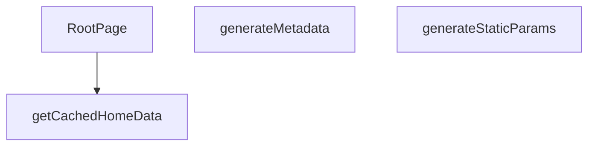

## Genel Bakış
Bu modül, Next.js App Router yapısıyla entegre çalışan, dil destekli ana sayfanın temel iskeletini oluşturur. Statik sayfa üretim parametrelerini belirleyerek, SEO için gerekli meta verileri dinamik olarak üreterek ve önbelleklenmiş verilerle ana bileşeni render ederek sayfanın oluşturulma sürecini koordine eder.

## Fonksiyon Grupları
### Sayfa Yapısı ve Meta Veri Yönetimi
Bu grup, sayfanın hangi diller için statik olarak oluşturulacağını tanımlar ve arama motoru optimizasyonunu sağlamak için gerekli başlık, açıklama ve Open Graph bilgilerini otomatik olarak üretir.
- generateStaticParams, generateMetadata

### Veri Yönetimi ve Sayfa Bileşeni
Bu grup, dil ve kiracı bazlı ana sayfa verilerini önbellekten alarak ana React bileşeninin çalışmasını ve kullanıcıya dinamik, kişiselleştirilmiş bir ana sayfa sunulmasını sağlar.
- getCachedHomeData, RootPage

---

## AXIOMS – Mimari Varsayımlar
Bu modül, bir Next.js App Router yapısında dil destekli ana sayfayı render eder. Doğru çalışması için aşağıdaki mimari varsayımlar geçerlidir.

**[Aksiyom 1]:** Eğer `generateStaticParams` fonksiyonu, geçerli bir dil listesi (örn. `["tr", "en"]`) döndürmüyorsa, istatik sayfa üretim süreci başarısız olur veya yalnızca varsayılan dil için sayfa oluşturulur.

**[Aksiyom 2]:** Eğer `generateMetadata` fonksiyonuna传递 edilen `params` nesnesinde geçerli bir `lang` özelliği yoksa, SEO için gerekli meta veriler (başlık, açıklama vb.) dil bağımsız veya varsayılan bir dil ile oluşturulur, bu da hedef kitlenin diline göre optimize edilmemiş bir sayfa sonucu doğurur.

**[Aksiyom 3]:** Eğer `getCachedHomeData` fonksiyonuna传递 edilen `lang` parametresi, uygulama tarafından desteklenmeyen bir dil kodu ise, ilgili dil için önbelleklenmiş veri bulunamaz ve fonksiyon hata döndürür veya boş bir veri yapısı ile cevap verir.

**[Aksiyom 4]:** Eğer `getCachedHomeData` fonksiyonuna传递 edilen `tenantId` parametresi, geçerli veya aktif bir kiracı (tenant) identifier'ı değilse, ilgili kiracının verileri retrieve edilemez ve fonksiyon hata veya boş veri döndürür.

**[Aksiyom 5]:** Eğer `RootPage` bileşeninin render edeceği `params` nesnesinde geçerli bir `lang` özelliği yoksa, bileşen dil-aware (dil duyarlı) bir şekilde render edilemez ve sayfa yanlış bir dilde veya eksik içerikle görüntülenebilir.

**[Aksiyom 6]:** Eğer `getCachedHomeData` fonksiyonu tarafından döndürülen veri yapısı, `RootPage` bileşeninin beklediği shape'e (yapıya) uymuyorsa, bileşen render aşamasında hata verir veya eksik kısımlarla çalışır.

---

## FONKSİYON DETAYLARI

### generateStaticParams
**Ne yapar**: Uygulamanın desteklediği dil parametrelerini statik olarak üretir ve Next.js’in statik sayfa oluşturma sürecine sağlar.  
**Nasıl yapar**: Asenkron bir fonksiyon olarak tanımlanmış, sabit bir dizi içinde iki nesne döndürür; biri `'tr'` diğeri `'en'` dil kodunu içerir.  
**Parametreler**:  
- *Yok*  
**Dönüş**: `Array<{ lang: string }>` – `{ lang: 'tr' }` ve `{ lang: 'en' }` öğelerinden oluşan dizi.

### generateMetadata
**Ne yapar**: Sayfa için dinamik SEO meta verilerini, Open Graph ve Twitter kartı bilgilerini, ayrıca robots yönergelerini oluşturur.  
**Nasıl yapar**: `params` nesnesinden gelen `lang` değerini alır, ilgili dil sözlüğünü (`en` veya `tr`) seçer. Site URL’si temel alınarak kanonik URL ve dil‑spesifik URL’ler hazırlanır. Meta başlık, açıklama, Open Graph ve Twitter alanları sözlükten alınan SEO metinleriyle doldurulur; ayrıca site şeması ve organizasyon bilgileri JSON‑LD formatında hazırlanır.  
**Parametreler**:  
- `params`: `Props` – Sayfa parametrelerini içeren nesne; içinde `lang` özelliği bulunur.  
**Dönüş**: `Promise<Metadata>` – SEO, Open Graph, Twitter ve robots ayarlarını içeren `Metadata` nesnesi.

### getCachedHomeData
**Ne yapar**: Belirli bir dil ve kiracı (tenant) için ana sayfada görüntülenecek kategori ve ürün verilerini önbellekten getirir.

**Nasıl yapar**: Fonksiyon, sunucu tarafı veri işleme (SSR) sırasında çağrılarak belirli bir `lang` ve `tenantId` çifti için depolanmış ana sayfa verilerini (kategori ve ürün listesi) alır. Bu veriler önbelleğe alındığı için yüksek performanslı veri erişimi sağlar ve veritabanı veya harici API çağrılarını tekrarlamaz. Fonksiyonun dönüş tipi, `RootPage` içindeki `try...catch` bloğunda `catData` ve `prodData` alanlarına ayrılarak kullanıldığı için bir nesne yapısı döndürür.

**Parametreler**:
- lang: string — İçerik dilini belirten kod (ör. 'tr', 'en').
- tenantId: string — Kiracıyı (tenant) tanımlayan benzersiz tanımlayıcı.

**Dönüş**: Promise<{ catData: DomainCategory[], prodData: Product[] }> — Kategori verilerini (`catData`) ve ürün verilerini (`prodData`) içeren asenkron bir nesne döndürür.

### RootPage
**Ne yapar**: Ana sayfanın sunucu tarafı React bileşenini (sayfasını) oluşturur, verileri hazırlar ve istemciye JSX olarak döndürür.

**Nasıl yapar**: Fonksiyon, bir `Params` nesnesi alır ve dil (`lang`) bilgisini çıkarır. Ardından, ilgili dil sözlüğünü (`dict`) ve kiracı yapılandırmasını (`tenantConfig`) getirir. `getCachedHomeData` fonksiyonunu çağırarak kategori ve ürün verilerini alır; hata oluşursa bu verileri boş dizilerle başlatır. Kategorileri filtreleyerek, sıralayarak ve sözlükten çevirileri eşleştirerek `displayCategories` adlı bir视图 modeli listesi oluşturur. Sayfanın SEO için gerekli JSON-LD yapılandırmalarını (WebSite ve Organization) oluşturur. Son olarak, `TenantProvider` sağlayıcısı içinde, JSON-LD script etiketlerini ve `HomePage` bileşenini döndürür.

**Parametreler**:
- params: Props — Next.js tarafından sağlanan sayfa parametrelerini içeren nesne. `params.lang` alanı asenkron olarak çözümlenir.

**Dönüş**: JSX.Element — `TenantProvider` ile sarılmış, JSON-LD scriptleri ve `HomePage` bileşenini içeren React elemanı.

---

## TYPE ALIASES

### Props
```typescript
type Props = {

  params: Promise<{ lang: string }>

}
```

---

## AST POINTERS

### [N1_NASIL] AST Pointer: `C:\Users\alize\venthub-hvac\src\app\[lang]\page.tsx`::generateStaticParams
- **params**: yok
- **ic_degiskenler**:
  - (iç değişken yok — doğrudan sabit dizi döner)
- **Dönüş**: `{ lang: 'tr' } | { lang: 'en' }` dizisi

### [N2_NASIL] AST Pointer: `C:\Users\alize\venthub-hvac\src\app\[lang]\page.tsx`::generateMetadata
- **params**: `{ params }: Props` — Next.js tarafından verilen URL parametreleri
- **ic_degiskenler**:
  - `lang` — `await params` ile elde edilen dil kodu (`'tr'` veya `'en'`)
  - `dict` — `lang` değerine göre seçilen sözlük nesnesi (`en` veya `tr`); SEO başlıkları ve açıklamaları buradan okunur
  - `siteUrl` — `SITE_URL` sabit import'undan gelen site kök adresi
  - `canonical` — `siteUrl` ve `lang` birleştirilerek oluşturulan canonical URL
- **Dönüş**: `Promise<Metadata>` — title, description, alternates, openGraph, twitter, robots alanlarını içeren Metadata nesnesi

### [N3_NASIL] AST Pointer: `C:\Users\alize\venthub-hvac\src\app\[lang]\page.tsx`::getCachedHomeData
- **params**: `lang: string` — dil kodu, cache key bileşeni; `tenantId: string` — kiracı ID'si, cache key bileşeni
- **ic_degiskenler**:
  - `catData` — `getCategories(supabaseStaticClient)` asenkron çağrısıyla çekilen kategori ham verisi
  - `prodData` — `getProducts(supabaseStaticClient, 12)` asenkron çağrısıyla çekilen ilk 12 ürün ham verisi
  - `Promise.all` ile eşzamanlı olarak çekilir; `unstable_cache` ile `['home-page-data', lang, tenantId]` key'i ile önbelleğe alınır, `revalidate: false` ile sonsuz cache süresi tanılır
- **Dönüş**: `{ catData, prodData }` — kategori ve ürün verilerini içeren nesne

### [N4_NASIL] AST Pointer: `C:\Users\alize\venthub-hvac\src\app\[lang]\page.tsx`::RootPage
- **params**: `{ params }: Props` — Next.js page bileşen parametreleri
- **ic_degiskenler**:
  - `lang` — `await params` ile elde edilen dil kodu
  - `dict` — `lang` değerine göre seçilen sözlük (`en` veya `tr`); çeviri metinleri için kullanılır
  - `tenantConfig` — `await getTenantConfig()` ile çekilen kiracı yapılandırma nesnesi
  - `tenantId` — `tenantConfig.id`; cache key ve kiracı tanımlayıcısı olarak kullanılır
  - `categories` — `DomainCategory[]` tipinde kategori listesi; başlangıçta boş dizi, `getCachedHomeData` başarısız olursa boş kalır
  - `products` — `Product[]` tipinde ürün listesi; başlangıçta boş dizi
  - `catData` — `getCachedHomeData` sonucundan destructure edilen kategori ham verisi
  - `prodData` — `getCachedHomeData` sonucundan destructure edilen ürün ham verisi
  - `error` — `catch` bloğu yakaladığı hata nesnesi; `console.warn` ile loglanır
  - `displayCategories` — `CategoryViewModelLite[]` tipinde; `categories` dizisinden `parent_id` olmayanlar filtrelenip `name` göre sıralanır, ardından `map` ile her kategori `dict.common.categoryList` içinden çevrilmiş isimle dönüştürülür; fallback olarak `menu_label` veya `name` kullanılır
  - `siteUrl` — `SITE_URL` sabit import'undan gelen site kök adresi; JSON-LD ve URL oluşturma için kullanılır
  - `jsonLds` — JSON-LD yapılandırması dizisi; `WebSite` (arama eylemi) ve `Organization` (iletişim) tiplerinde iki nesne içerir
- **Dönüş**: JSX — `<TenantProvider>` sarmalayıcısı içinde JSON-LD scriptleri ve `<HomePage>` bileşeni döner; `<HomePage>`'e `initialCategories`, `rawCategories`, `initialProducts`, `dictionary` prop'ları geçirilir

### [N5_NASIL] AST Pointer: `C:\Users\alize\venthub-hvac\src\app\[lang]\page.tsx`::map callback (displayCategories oluşturma)
- **params**: `c` — `DomainCategory` tipinde mevcut kategori nesnesi (`.map()` iterasyonu)
- **ic_degiskenler**:
  - `categoryListDict` — `dict.common?.categoryList` erişiminden elde edilen `CategoryDict` tipinde çeviri sözlüğü; üst seviye kategori slug'larını çeviri isimlerine eşler
  - `subListDict` — `categoryListDict?.sub` erişiminden elde edilen `Record<string, string>` tipinde alt kategori çeviri sözlüğü; üst seviyede bulunamayan slug'lar için fallback aranır
  - `translatedName` — `c.slug` anahtarıyla `categoryListDict`'den veya `subListDict`'den aranan çevrilmiş kategori adı; bulunamazsa `menu_label` veya `name` kullanılır
- **Dönüş**: `{ id, slug, displayName, description, image_url }` — `CategoryViewModelLite` nesnesi

### [N6_NASIL] AST Pointer: `C:\Users\alize\venthub-hvac\src\app\[lang]\page.tsx`::jsonLd map callback (script oluşturma)
- **params**: `ld` — JSON-LD yapılandırma nesnesi (WebSite veya Organization); `i` — dizi indeks anahtarı olarak kullanılır
- **ic_degiskenler**: yok
- **Dönüş**: JSX `<script>` elementi; `type="application/ld+json"`, `key={i}`, `dangerouslySetInnerHTML` ile `JSON.stringify(ld)` çıktısı `<` ve `>` karakterleri escape edilerek içeriğe yerleştirilir

---


## MERMAID CALL GRAPH


## NODE ID STANDARD

  file: src\app\[lang]\page.tsx
  function: src\app\[lang]\page.tsx::generateStaticParams
  function: src\app\[lang]\page.tsx::generateMetadata
  function: src\app\[lang]\page.tsx::getCachedHomeData
  function: src\app\[lang]\page.tsx::RootPage

---

## DISA AKTARILANLAR (EXPORTS)
  export: RootPage
  export: generateMetadata
  export: generateStaticParams
  export: getCachedHomeData

---

## STİL TOKENLERİ

### Arbitrary Değerler (token'a geçirilmemiş)
Yok — tüm stiller token'a geçirilmiş. ✅

### Kullanılan Token'lar (zaten token'a geçirilmiş)
- (yok)

### Tailwind Sınıf Özeti
- **Renkler:** (yok)
- **Layout:** (yok)
- **Varyant/Responsive:** (yok)
- **Yardımcı Sınıflar:** (yok)