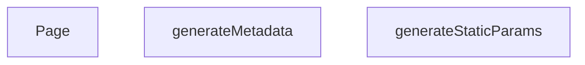

## Genel Bakış
Bu modül, Next.js uygulamasında dinamik ürün sayfalarının (slug temelli) oluşturulmasından sorumludur. Framework tarafından sırasıyla çağrılan üç asenkron fonksiyon sayesinde statik ön üretim, sayfa meta bilgileri ve nihai kullanıcı arayüzü sağlanır.

## Fonksiyon Grupları
### Statik Parametre Üretimi
Hangi slug değerleri için sayfaların derleme zamanında önceden oluşturulacağını belirler.  
- generateStaticParams

### Meta Veri Oluşturma
Her ürün sayfasına özgü başlık, açıklama gibi SEO meta verilerini üretir.  
- generateMetadata

### Sayfa Renderi
Verilen slug parametresine göre ilgili ürün verisini çekip sayfa bileşenini döndürür.  
- Page

---

## AXIOMS – Mimari Varsayımlar
Bu modül için özel aksiyom tanımlanmamıştır.

---

---

## FONKSIYON DETAYLARI

### generateStaticParams
**Ne yapar**: Bu fonksiyon, dinamik rota segmenti `[slug]` için statik olarak oluşturulacak sayfaların parametrelerini tanımlar. Next.js'in statik sayfa üretimi (SSG) için gerekli olan yol listesini sağlar.
**Nasıl yapar**: Kod içeriği verilmediğinden iç mantığı hakkında bilgi bulunmamaktadır. Genellikle projede tanımlı ürünlerin slug değerlerini içeren bir dizi döndürerek çalışır.
**Parametreler**: Parametre almaz.
**Dönüş**: Dönüş tipi kaynakta belirtilmemiştir. Next.js'de beklenen dönüş, `{ slug: string }[]` formatında bir dizidir ancak bu projede tam olarak nasıl uygulandığı bilinmemektedir.

### generateMetadata
**Ne yapar**: Bu fonksiyon, ürün detay sayfası için HTML meta etiketlerinde kullanılacak başlık ve açıklama bilgilerini üretir. Sayfanın arama motoru optimizasyonu (SEO) ve sosyal medya paylaşımları için gerekli metadata’yı sağlar.
**Nasıl yapar**: Verilen parametrelerden `params` nesnesini alır ancak mevcut kod parçasında slug değeri kullanılmamış, sabit bir başlık ve açıklama döndürülmüştür. Açıklama metni kesildiğinden tam içerik bilinmemektedir.
**Parametreler**:
- `params`: `Promise<{ slug: string }>` — Sayfa parametrelerini içeren bir Promise nesnesi. `slug` alanı ile ilgili ürünün benzersiz tanımlayıcısını taşır.
**Dönüş**: `{ title: string, description: string }` şeklinde bir obje. `title` değeri `'Ürün Detayı | VentHub'`; `description` değeri ise `'VentHub Endüstriyel Havalandırma Sistemler...'` (kesilmiş) olarak döndürülmektedir.

### Page
**Ne yapar**: Bu, Next.js App Router yapısında `products/[slug]` yoluna karşılık gelen sayfa bileşenidir. Kullanıcıya ürün detayını gösteren arayüzü render eder.
**Nasıl yapar**: İç mantığı verilmemiştir. Tipik bir React bileşeni olarak, `params` üzerinden alınan slug değerini kullanarak ilgili ürün verisini getirir ve JSX döndürür. Ancak bu projedeki özel uygulama bilinmemektedir.
**Parametreler**:
- `params`: `Promise<{ slug: string }>` — Sayfa parametrelerini içeren bir Promise nesnesi. `slug` alanı ile görüntülenecek ürünü belirler.
**Dönüş**: Dönüş tipi kaynakta `void` veya bilinmiyor olarak işaretlenmiştir. Bir React bileşeni olduğundan JSX (veya `null`) döndürmesi beklenir, ancak kesin tip belirtilmemiştir.

---

## AST POINTERS

### [N1_NASIL] AST Pointer: src/app/products/[slug]/page.tsx::generateStaticParams
- **params**: yok
- **ic_degiskenler**:
  - `products` — `supabase.from('products').select('slug').eq('status', 'active').not('slug', 'is', null)` API çağrısından dönen data dilimine atanan veri (dizi veya null)
  - `paths` — `products` dizisinden filtrelenip `p.slug` değerini `{slug: p.slug!}` nesnesine dönüştüren map işleminin çıktısı; slug değeri boş olmayan ürünlerin slug listesi
  - `p` — `products` dizisindeki her bir öğeyi temsil eden iterasyon değişkeni; `.slug` propertysi üzerinden slug değeri alınır
  - `e` — catch bloğunda yakalanan hata
- **Dönüş**: `{ slug: string }[]` — boş dizi veya slug nesnelerinden oluşan dizi; başarısız durumda `[]`

### [N2_NASIL] AST Pointer: src/app/products/[slug]/page.tsx::(p) => { return { slug: p.slug! } }
- **params**: `p` — `generateStaticParams` içindeki products dizisinin bir elemanı
- **ic_degiskenler**:
  - `p.slug` — p nesnesinin slug propertysi, non-null assertion ile işaretlenmiş
- **Dönüş**: `{ slug: string }` — slug propertysi doldurulmuş bir nesne

### [N3_NASIL] AST Pointer: src/app/products/[slug]/page.tsx::generateMetadata
- **params**: `{ params: Promise<{ slug: string }> }` — `params` asenkron nesnesinden `slug` string değeri await ile alınır
- **ic_degiskenler**:
  - `slug` — `await params` ile elde edilen `params.slug` değeri
  - `product` — `getProductBySlug(slug)` API çağrısından dönen ürün verisi (null olabilir)
  - `canonicalPath` — `product.slug` değeri (varsa); URL'de kullanılacak kanonik yol
  - `e` — catch bloğunda yakalanan hata
- **Dönüş**: Metadata nesnesi (title, description, alternates, openGraph ile) veya hata durumunda varsayılan title/description içeren nesne; eğer product yoksa veya hata varsa fallback döndürülür

### [N4_NASIL] AST Pointer: src/app/products/[slug]/page.tsx::Page
- **params**: `{ params: Promise<{ slug: string }> }` — `params` asenkron nesnesinden `slug` string değeri await ile alınır
- **ic_degiskenler**:
  - `slug` — `await params` ile elde edilen `params.slug` değeri
  - `productData` — `Product | null` tipinde; `getProductBySlug(slug)` ile doldurulur, hata durumunda null kalır
  - `errorMsg` — catch bloğunda `err` nesnesi string'e dönüştürülür; hata mesajı kontrolü için kullanılır
  - `err` — catch bloğunda yakalanan hata (unknown tipinde)
  - `canonicalPath` — `productData?.slug || 'generic'` ifadesiyle hesaplanır; JSON-LD ve URL'de kanonik yol olarak kullanılır
  - `jsonLd` — schema.org Product tipinde JSON-LD nesnesi; productData alanları ile doldurulur, stock_qty kontrolü yapılır, brand koşullu eklenir
  - `productData.name` — JSON-LD içinde ürün adı (varsa)
  - `productData.description` — JSON-LD içinde ürün açıklaması (varsa)
  - `productData.image_url` — JSON-LD içinde görsel URL (varsa spread edilir)
  - `productData.brand` — JSON-LD içinde marka (varsa spread edilir)
  - `productData.stock_qty` — stok miktarı; `?? 0` ile varsayılan 0 atanır, >0 ise InStock
  - `productData.price` — fiyat bilgisi; `|| "0.00"` ile fallback
  - `SITE_URL` — config'den alınan site URL sabiti; JSON-LD ve canonical URL oluşturmada kullanılır
- **Dönüş**: JSX element — `<script>` (JSON-LD içeren) ve `<PageComponent initialProduct={productData} />` bileşenlerinden oluşan React Fragment (`<>...</>`)

---

## MERMAID CALL GRAPH

## NODE ID STANDARD

  file: src\app\products\[slug]\page.tsx
  function: src\app\products\[slug]\page.tsx::generateStaticParams
  function: src\app\products\[slug]\page.tsx::generateMetadata
  function: src\app\products\[slug]\page.tsx::Page

---

## DISA AKTARILANLAR (EXPORTS)
  export: Page
  export: generateMetadata
  export: generateStaticParams