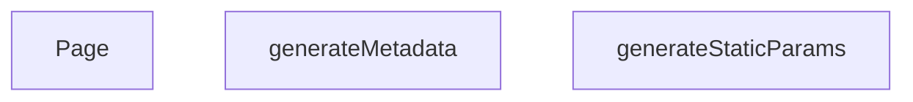

## Genel Bakış
Bu modül, Next.js uygulamasında çok dilli (Türkçe/İngilizce) ürün detay sayfalarını oluşturma ve sunma sorumluluğunu taşır. Modül, statik site oluşturma sürecini planlayarak hangi sayfaların derleneceğini belirler, her bir sayfa için arama motoru optimizasyonu (SEO) meta verilerini dinamik olarak üretir ve son olarak ilgili dil ve ürün adresine (slug) uygun içeriği kullanıcıya sunar.

## Fonksiyon Grupları
### Derleme Zamanı Sayfa Planlaması
Modül, uygulamanın derleme (build) aşamasında hangi dil ve ürün kombinasyonları için sayfaların önceden oluşturulacağını (statik olarak üretileceğini) belirler. Bu, uygulamanın verimli çalışmasını ve ilgili sayfaların istek üzerine değil, derleme zamanında hazır olmasını sağlar.
- `generateStaticParams`

### Dinamik SEO Meta Verisi Üretimi
Her bir ürün detay sayfası için arama motorları ve sosyal paylaşım platformları tarafından okunabilecek dinamik meta bilgiler (başlık, açıklama, vb.) oluşturur. Bu sayede sayfalar arama sonuçlarında doğru ve çekici bir şekilde listelenir.
- `generateMetadata`

### Ürün Sayfası Sunumu
Kullanıcı tarafından ziyaret edildiğinde, ilgili dil ve ürün adresine (slug) karşılık gelen asıl sayfa içeriğini render ederek tarayıcıda gösterir. Bu fonksiyon, sayfanın görünür kısmını oluşturan ana bileşendir.
- `Page`

---

## AXIOMS – Mimari Varsayımlar

Bu modül, Next.js App Router yapısında çok dilli ürün detay sayfalarını yöneten bir sayfa bileşenidir.

[Aksiyom 1]: Eğer `generateStaticParams` fonksiyonu geçerli bir parametre nesneleri dizisi döndürmüyorsa, Next.js derleme aşamasında hangi sayfaları statik olarak üreteceğini bilemez ve build süreci başarısız olur veya eksik sayfalar oluşur.

[Aksiyom 2]: Eğer `generateMetadata` fonksiyonuna iletilen `params.lang` değeri 'tr' veya 'en' dışında bir değerse, modül için tanımlanmamış bir dilde meta veri üretilemez ve SEO verileri eksik veya hatalı olur.

[Aksiyom 3]: Eğer `params.slug` değerine karşılık gelen ürün verisi (örn: bir API veya veritabanı sorgusu ile) mevcut değilse, `Page` bileşeni geçerli bir ürün içeriği render edemez ve sayfa hata durumuna düşer veya boş görünür.

[Aksiyom 4]: Eğer `Page` bileşeninin props olarak aldığı `params.lang` geçerli bir dil kodu değilse (örn: desteklenmeyen bir dil), modül doğru dilde içerik sunamaz ve olası bir hata yönetim mekanizması devreye girmezse sayfa bozuk görünebilir.

[Aksiyom 5]: Eğer `generateStaticParams` ve/veya `generateMetadata` fonksiyonları, modülün çalışması için gerekli olan (örn: ürün listesini çeken) harici bir veri kaynağına erişemiyorsa, derleme zamanı planlama ve SEO verisi üretimi tamamlanamaz.

---

## FONKSİYON DETAYLARI

### generateStaticParams
**Ne yapar**: Bu fonksiyon, ürünler için statik yolları (path) oluşturur. Yalnızca veritabanında durumu 'active' olan ve slug değeri dolu olan ürünler için, her biri için Türkçe ('tr') ve İngilizce ('en') olmak üzere iki adet farklı dilde yol parametresi üretir. Bu sayede Next.js, build aşamasında bu sayfaları önceden oluşturabilir.

**Nasıl yapar**: Fonksiyon, `supabase` istemcisi kullanarak 'products' tablosundan sadece 'slug' sütununu çeker. Gelen verilerde `slug` alanı dolu olanları filtreler. Ardından her geçerli slug için `{ lang: 'tr', slug: ... }` ve `{ lang: 'en', slug: ... }` olmak üzere iki nesne içeren bir dizi oluşturur. Eğer hiç geçerli yol üretilemezse boş bir dizi döner. Hata oluşursa bir uyarı yazdırır ve yine boş dizi ile çıkar.

**Parametreler**:
- Fonksiyonun herhangi bir parametresi yoktur.

**Dönüş**: `Promise<Array<{ lang: string; slug: string }>>` veya bir hata/boş durum için `Promise<[]>`. Fonksiyon asenkron çalışır ve statik yolların listesini döner.

### generateMetadata
**Ne yapar**: Belirli bir ürün sayfası için SEO (Arama Motoru Optimizasyonu) meta verilerini ve Open Graph verilerini dinamik olarak üretir. Bu sayede ürün adı, açıklaması, kanonik URL'i ve paylaşım görseli gibi bilgiler doğru şekilde tarayıcılara ve sosyal medya platformlarına iletilir.

**Nasıl yapar**: Fonksiyon, URL parametrelerinden `slug` değerini alır. Hemen ardından o ürünün verilerini önbellekten veya veritabanından çekmek için `preloadProduct` ve `getCachedProductBySlug` işlevlerini çağırarak verileri erkenden yükler. Eğer ürün verisi başarıyla çekilip geçerliyse, `product.name` ve `product.description` alanlarını kullanarak dinamik bir `title` ve `description` oluşturur. Ayrıca `alternates.canonical` ve Open Graph için gerekli tüm alanları (title, description, url, images vb.) ayarlar. Ürün verisi alınamazsa veya bir hata oluşursa, varsayılan bir "Ürün Detayı | VentHub" başlığı ve açıklaması ile döner.

**Parametreler**:
- `params`: `{ lang: string; slug: string }` — Sayfaya ait URL parametrelerini içeren bir nesne. `slug` alanı, görüntülenecek ürünün benzersiz tanımlayıcısıdır.

**Dönüş**: `Promise<{ title: string; description: string; alternates?: object; openGraph?: object }>`. Asenkron olarak resolve olan bir meta nesnesi döner.

### Page
**Ne yapar**: Bu bileşen, bir ürünün detay sayfasını render eder. Sayfaya JSON-LD yapılandırılmış veri (SEO için zengin sonuçlar) ekler ve asıl sayfa içeriğini `PageComponent` aracılığıyla gösterir. Ürün verilerini sayfaya ilk yükleme verisi (initial prop) olarak aktarır.

**Nasıl yapar**: Fonksiyon, URL'den `slug` parametresini alır. `preloadProduct` ile veriyi erkenden yüklemeye başlar. Ardından, `slug` 'generic' değilse, `getCachedProductBySlug` ile ürün verisini çekmeye çalışır. Herhangi bir ağ hatası veya veritabanı hatası durumunda bunu yakalar ve bir uyarı yazdırır, sayfanın kırılmasını engeller. Çekilen ürün verisine (`productData`) dayanarak, Schema.org standardında bir JSON-LD nesnesi oluşturur. Bu nesne ürünün adını, açıklamasını, resmini, markasını, fiyatını ve stok durumunu içerir. Oluşturulan JSON-LD, `<script type="application/ld+json">` etiketi ile HTML'e enjekte edilir. Son olarak, tüm sayfa içeriğinin bulunduğu `PageComponent` bileşenini, `initialProduct` prop'u ile birlikte döndürür.

**Parametreler**:
- `params`: `{ lang: string; slug: string }` — Sayfaya ait URL parametrelerini içeren bir nesne. `slug` alanı, gösterilecek ürünün benzersiz tanımlayıcısıdır.

**Dönüş**: `JSX.Element`. Sayfanın HTML yapısını temsil eden bir React elemanı döner. İçeriğinde bir JSON-LD `<script>` etiketi ve `PageComponent` bileşeni bulunur.

---

## İTHALATLAR (IMPORTS)
- import: ../../../../config/siteUrl::SITE_URL
- import: ../../../../lib/data/preload::getCachedProductBySlug
- import: ../../../../lib/data/preload::preloadProduct
- import: ../../../_components/ProductDetailPageView::ProductDetailPage
- import: @/lib/supabase/static::supabaseStaticClient
- import: @/types/ui-models::type { Product }

---

## AST POINTERS

### [N1_NASIL] AST Pointer: `src/app/[lang]/products/[slug]/page.tsx`::generateStaticParams
- **params**: (yok)
- **ic_degiskenler**:
  - `products` — Supabase'den çekilen aktif ve slug değeri null olmayan ürünlerin listesi
  - `paths` — Her ürün için `tr` ve `en` dillerinde olmak üzere oluşturulan statik parametre yolları dizisi
- **Dönüş**: `Array<{ lang: string, slug: string }>` (yollar) veya boş dizi `[]`

### [N2_NASIL] AST Pointer: `src/app/[lang]/products/[slug]/page.tsx`::generateMetadata
- **params**: `{ params: Promise<{ lang: string, slug: string }> }` — URL parametreleri (asenkron çözümlenir)
- **ic_degiskenler**:
  - `slug` — params promise'ından çözümlenen ürün slug değeri
  - `product` — `getCachedProductBySlug(slug)` ile önbellekten getirilen ürün nesnesi
  - `canonicalPath` — product.slug değerinden türetilen kanonik URL yolu
- **Dönüş**: SEO metadata nesnesi (title, description, alternates, openGraph alanları) veya varsayılan fallback metadata

### [N3_NASIL] AST Pointer: `src/app/[lang]/products/[slug]/page.tsx`::Page
- **params**: `{ params: Promise<{ lang: string, slug: string }> }` — URL parametreleri (asenkron çözümlenir)
- **ic_degiskenler**:
  - `slug` — params promise'ından çözümlenen ürün slug değeri
  - `productData` — `getCachedProductBySlug(slug)` ile getirilen Product tipinde ürün nesnesi veya null
  - `canonicalPath` — productData.slug değerinden türetilen kanonik URL yolu; yoksa `'generic'`
  - `jsonLd` — Schema.org Product tipinde yapılandırılmış JSON-LD verisi (SEO için schema markup)
- **Dönüş**: JSX Fragment — JSON-LD script etiketi ve `PageComponent` bileşeninin render edildiği React fragment

---

## MERMAID CALL GRAPH

## NODE ID STANDARD

  file: src\app\[lang]\products\[slug]\page.tsx
  function: src\app\[lang]\products\[slug]\page.tsx::generateStaticParams
  function: src\app\[lang]\products\[slug]\page.tsx::generateMetadata
  function: src\app\[lang]\products\[slug]\page.tsx::Page

---

## DISA AKTARILANLAR (EXPORTS)
  export: Page
  export: generateMetadata
  export: generateStaticParams

---

## STİL TOKENLERİ

### Arbitrary Değerler (token'a geçirilmemiş)
Yok — tüm stiller token'a geçirilmiş. ✅

### Kullanılan Token'lar (zaten token'a geçirilmiş)
- (yok)

### Tailwind Sınıf Özeti
- **Renkler:** (yok)
- **Layout:** (yok)
- **Varyant/Responsive:** (yok)
- **Yardımcı Sınıflar:** (yok)