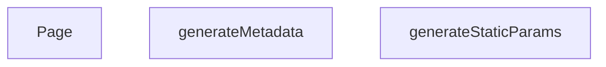

## Genel Bakış
Bu modül, Next.js App Router yapısında çok dilli (dil ve ürün slug'ı tabanlı) ürün detay sayfalarını yönetir. Modül, derleme zamanında hangi sayfaların önceden oluşturulacağını belirler, her sayfa için SEO uyumlu meta verileri üretir ve son olarak ilgili ürün içeriğini kullanıcıya sunar.

## Fonksiyon Grupları

### Derleme Zamanı Planlama
Hangi dil-ürün kombinasyonları için sayfaların statik olarak üretileceğini belirleyerek build sürecini yönlendirir.
- generateStaticParams

### Arama Motoru Optimizasyonu
Her ürün sayfasına özel olarak başlık, açıklama ve OpenGraph gibi meta bilgilerini dinamik şekilde oluşturur.
- generateMetadata

### Sayfa Sunumu
Dil ve slug parametrelerine göre ürün verisini çekerek, kullanıcının göreceği sayfa içeriğini render eder.
- Page

---

---

## FONKSİYON DETAYLARI

### generateStaticParams
**Ne yapar**: Bu fonksiyon, ürünler için statik yolları (path) oluşturur. Yalnızca veritabanında durumu 'active' olan ve slug değeri dolu olan ürünler için, her biri için Türkçe ('tr') ve İngilizce ('en') olmak üzere iki adet farklı dilde yol parametresi üretir. Bu sayede Next.js, build aşamasında bu sayfaları önceden oluşturabilir.

**Nasıl yapar**: Fonksiyon, `supabase` istemcisi kullanarak 'products' tablosundan sadece 'slug' sütununu çeker. Gelen verilerde `slug` alanı dolu olanları filtreler. Ardından her geçerli slug için `{ lang: 'tr', slug: ... }` ve `{ lang: 'en', slug: ... }` olmak üzere iki nesne içeren bir dizi oluşturur. Eğer hiç geçerli yol üretilemezse boş bir dizi döner. Hata oluşursa bir uyarı yazdırır ve yine boş dizi ile çıkar.

**Parametreler**:
- Fonksiyonun herhangi bir parametresi yoktur.

**Dönüş**: `Promise<Array<{ lang: string; slug: string }>>` veya bir hata/boş durum için `Promise<[]>`. Fonksiyon asenkron çalışır ve statik yolların listesini döner.

### generateMetadata
**Ne yapar**: Belirli bir ürün sayfası için SEO (Arama Motoru Optimizasyonu) meta verilerini ve Open Graph verilerini dinamik olarak üretir. Bu sayede ürün adı, açıklaması, kanonik URL'i ve paylaşım görseli gibi bilgiler doğru şekilde tarayıcılara ve sosyal medya platformlarına iletilir.

**Nasıl yapar**: Fonksiyon, URL parametrelerinden `slug` değerini alır. Hemen ardından o ürünün verilerini önbellekten veya veritabanından çekmek için `preloadProduct` ve `getCachedProductBySlug` işlevlerini çağırarak verileri erkenden yükler. Eğer ürün verisi başarıyla çekilip geçerliyse, `product.name` ve `product.description` alanlarını kullanarak dinamik bir `title` ve `description` oluşturur. Ayrıca `alternates.canonical` ve Open Graph için gerekli tüm alanları (title, description, url, images vb.) ayarlar. Ürün verisi alınamazsa veya bir hata oluşursa, varsayılan bir "Ürün Detayı | VentHub" başlığı ve açıklaması ile döner.

**Parametreler**:
- `params`: `{ lang: string; slug: string }` — Sayfaya ait URL parametrelerini içeren bir nesne. `slug` alanı, görüntülenecek ürünün benzersiz tanımlayıcısıdır.

**Dönüş**: `Promise<{ title: string; description: string; alternates?: object; openGraph?: object }>`. Asenkron olarak resolve olan bir meta nesnesi döner.

### Page
**Ne yapar**: Bu bileşen, bir ürünün detay sayfasını render eder. Sayfaya JSON-LD yapılandırılmış veri (SEO için zengin sonuçlar) ekler ve asıl sayfa içeriğini `PageComponent` aracılığıyla gösterir. Ürün verilerini sayfaya ilk yükleme verisi (initial prop) olarak aktarır.

**Nasıl yapar**: Fonksiyon, URL'den `slug` parametresini alır. `preloadProduct` ile veriyi erkenden yüklemeye başlar. Ardından, `slug` 'generic' değilse, `getCachedProductBySlug` ile ürün verisini çekmeye çalışır. Herhangi bir ağ hatası veya veritabanı hatası durumunda bunu yakalar ve bir uyarı yazdırır, sayfanın kırılmasını engeller. Çekilen ürün verisine (`productData`) dayanarak, Schema.org standardında bir JSON-LD nesnesi oluşturur. Bu nesne ürünün adını, açıklamasını, resmini, markasını, fiyatını ve stok durumunu içerir. Oluşturulan JSON-LD, `<script type="application/ld+json">` etiketi ile HTML'e enjekte edilir. Son olarak, tüm sayfa içeriğinin bulunduğu `PageComponent` bileşenini, `initialProduct` prop'u ile birlikte döndürür.

**Parametreler**:
- `params`: `{ lang: string; slug: string }` — Sayfaya ait URL parametrelerini içeren bir nesne. `slug` alanı, gösterilecek ürünün benzersiz tanımlayıcısıdır.

**Dönüş**: `JSX.Element`. Sayfanın HTML yapısını temsil eden bir React elemanı döner. İçeriğinde bir JSON-LD `<script>` etiketi ve `PageComponent` bileşeni bulunur.

---

## AST POINTERS

### [N1_NASIL] AST Pointer: `src/app/[lang]/products/[slug]/page.tsx`::generateStaticParams
- **params**: (parametre yok)
- **ic_degiskenler**:
  - `products` — Supabase'den gelen aktif ürün listesi, `select('slug')` ile sadece slug alanlarını içerir; `data` destructuring ile alınır
  - `paths` — `products` array'inden türetilen `{ lang, slug }` çiftlerinin flat listesi; her ürün hem `'tr'` hem `'en'` dili için bir entry oluşturur; `filter` ile slug'ı null olanlar elenir, `flatMap` ile dil çiftleri genişletilir
  - `e` — `try/catch` bloğundaki yakalanan hata nesnesi, `console.warn` ile loglanır
- **Dönüş**: `{ lang: string, slug: string }[]` — statik olarak oluşturulacak rotaların listesi; hata durumunda boş dizi `[]`

---

### [N2_NASIL] AST Pointer: `src/app/[lang]/products/[slug]/page.tsx`::generateMetadata
- **params**: `{ params: Promise<{ lang: string, slug: string }> }` — Promise olarak gelen dinamik rota parametreleri
- **ic_degiskenler**:
  - `slug` — `await params` ile çözümlenen ürün slug değeri, URL'den gelen benzersiz ürün tanımlayıcısı
  - `product` — `getCachedProductBySlug(slug)` ile önbellekten getirilen ürün verisi (`Product` tipi); `preloadProduct(slug)` ile preload tetiklenir
  - `canonicalPath` — `product.slug` değerinden elde edilen kanonik URL yolu, SEO canonical linki için kullanılır
  - `e` — `try/catch` bloğundaki yakalanan hata nesnesi
- **Dönüş**: `Metadata` nesnesi — `title`, `description`, `alternates.canonical`, ve `openGraph` alanlarını içerir; ürün bulunamazsa (`product` falsy veya `product.slug` yoksa) `try` bloğu içinde dönüş yapılmaz, fonksiyon sonunda varsayılan fallback metadata döner

---

### [N3_NASIL] AST Pointer: `src/app/[lang]/products/[slug]/page.tsx`::Page
- **params**: `{ params: Promise<{ lang: string, slug: string }> }` — Promise olarak gelen dinamik rota parametreleri
- **ic_degiskenler**:
  - `slug` — `await params` ile çözümlenen ürün slug değeri, veri getirme ve JSON-LD oluşturma için kullanılır
  - `productData` — `getCachedProductBySlug(slug)` ile getirilen ürün verisi; `Product | null` tipinde; `slug !== 'generic'` koşulu sağlanmazsa `null` kalır; `PageComponent`'e `initialProduct` prop olarak geçirilir
  - `err` — `try/catch` bloğundaki yakalanan hata, `unknown` tipinde
  - `errorMsg` — `err`'ın string karşılığı; `Error` instance ise `err.message`, değilse `String(err)` kullanılır; `'fetch failed'` içeriği kontrol edilerek Supabase env eksikliği durumu ayrıştırılır
  - `canonicalPath` — `productData?.slug` değerinin fallback'idir; ürün slug'ı mevcutsa onu, değilse `'generic'` döner; JSON-LD `productID`, `url` ve `Brand` alanlarında kullanılır
  - `jsonLd` — Schema.org uyumlu `Product` tipinde JSON-LD objesi; `@context`, `@type`, `productID`, `name`, `description`, `url`, `image`, `brand` ve `offers` alanlarını içerir; `productData` alanlarından spread operatörü ile koşullu olarak doldurulur; `stock_qty > 0` kontrolü ile `availability` belirlenir
- **Dönüş**: JSX — `<script type="application/ld+json">` ile JSON-LD yerleştirilir (`dangerouslySetInnerHTML` ile, `<` ve `>` karakterleri escape edilmiş); ardından `<PageComponent initialProduct={productData} />` render edilir

---

## MERMAID CALL GRAPH

## NODE ID STANDARD

  file: src\app\[lang]\products\[slug]\page.tsx
  function: src\app\[lang]\products\[slug]\page.tsx::generateStaticParams
  function: src\app\[lang]\products\[slug]\page.tsx::generateMetadata
  function: src\app\[lang]\products\[slug]\page.tsx::Page

---

## DISA AKTARILANLAR (EXPORTS)
  export: Page
  export: generateMetadata
  export: generateStaticParams

---

## STİL TOKENLERİ

### Arbitrary Değerler (token'a geçirilmemiş)
Yok — tüm stiller token'a geçirilmiş. ✅

### Kullanılan Token'lar (zaten token'a geçirilmiş)
- (yok)

### Tailwind Sınıf Özeti
- **Renkler:** (yok)
- **Layout:** (yok)
- **Varyant/Responsive:** (yok)
- **Yardımcı Sınıflar:** (yok)