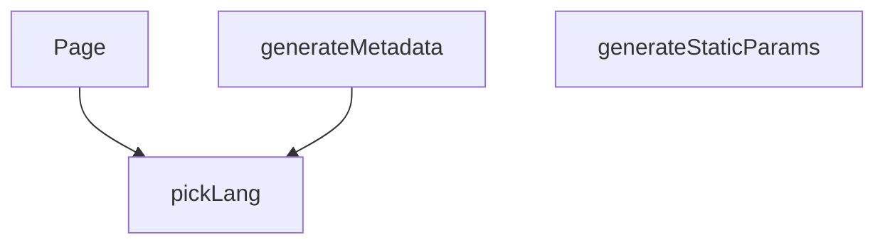

## Genel Bakış
Bu modül, Next.js uygulamasında çok dilli (örneğin Türkçe ve İngilizce) ürün detay sayfalarını oluşturma ve sunma sorumluluğunu üstlenir. Derleme zamanında hangi sayfaların statik olarak üretileceğini belirler, her sayfa için arama motoru optimizasyonu (SEO) meta verilerini dinamik olarak oluşturur ve kullanıcıya ilgili dil ve ürün adresine uygun içeriği sunar.

## Fonksiyon Grupları
### Statik Sayfa Oluşturma
Derleme aşamasında hangi dil ve ürün kombinasyonları için sayfaların önceden oluşturulacağını belirler. Bu, uygulamanın verimli çalışmasını ve sayfaların istek üzerine değil, derleme zamanında hazır olmasını sağlar.
- generateStaticParams

### SEO Meta Verisi Üretimi
Her bir ürün detay sayfası için arama motorları ve sosyal paylaşım platformları tarafından okunabilecek dinamik meta bilgiler (başlık, açıklama, vb.) oluşturur. Bu sayede sayfalar arama sonuçlarında doğru ve çekici bir şekilde listelenir.
- generateMetadata

### Sayfa Sunumu
Kullanıcı tarafından ziyaret edildiğinde, ilgili dil ve ürün adresine (slug) karşılık gelen ürün detay sayfasını render eder. Sayfanın ana içeriğini ve düzenini oluşturur.
- Page

### Yardımcı Dil Seçimi
Çok dilli metinlerden (LocalizedText) istenen dile uygun metni seçen yardımcı bir fonksiyondur. Sayfa sunumu ve meta veri üretimi sırasında kullanılabilir.
- pickLang

---

## AXIOMS – Mimari Varsayımlar

[Aksiyom 1]: Eğer `LocalizedText` tipi modül kapsamına erişilebilir değilse, `pickLang` fonksiyonu derleme hatası verir.

[Aksiyom 2]: Eğer `pickLang` fonksiyonuna verilen `lang` değeri, `LocalizedText` yapısı içinde karşılık gelen bir anahtar içermiyorsa, fonksiyon `null` döndürür.

[Aksiyom 3]: Eğer `generateStaticParams` fonksiyonu geçerli `{lang, slug}` çiftlerini döndürmezse, derleme aşamasında hiçbir statik sayfa üretilmez.

[Aksiyom 4]: Eğer `generateMetadata` fonksiyonuna gelen `params` Promise'i çözümlenemezse, sayfa için SEO meta verileri üretilemez.

[Aksiyom 5]: Eğer `Page` fonksiyonuna gelen `params` Promise'i çözümlenemezse, sayfa içeriği kullanıcıya sunulamaz.

[Aksiyom 6]: Eğer `lang` parametresi desteklenen diller arasında yoksa, sayfa düzgün görüntülenemez (desteklenen diller bilinmiyor).

[Aksiyom 7]: Eğer `slug` parametresi mevcut ürünlerle eşleşmiyorsa, sayfa bulunamaz durumu oluşur (404 davranışı bilinmiyor).

---

## FONKSİYON DETAYLARI

### pickLang
**Ne yapar**: Verilen LocalizedText nesnesinden, belirli bir dil için metin içeriğini seçer ve döndürür.
**Nasıl yapar**: Fonksiyon, `value` parametresinin varlığını kontrol eder. Eğer değer yoksa `null` döner. Ardından, `lang` parametresinin `'en'` olup olmadığına bakarak `value.en` veya `value.tr` değerini tercih eder. Tercih edilen değer boş (null/undefined/boş string) ise, sırasıyla `value.tr`, `value.en` ve son olarak `null` değerlerini fallback olarak döndürür. Bu mantık, birincil dil tercih edilmeyen içerik varsa bile sayfada bir metin gösterilmesini sağlar.
**Parametreler**:
- value: `LocalizedText` — `en` ve `tr` anahtarlarına sahip, iki dildeki metinleri tutan nesne. Nullable olabilir.
- lang: `string` — İstenen dil kodu (örn. `'tr'`, `'en'`). Mevcut mantıkta sadece `'en'` değeri doğrudan işlenir, diğer tüm değerler `'tr'` tercihini tetikler.
**Dönüş**: `string | null` — Seçilen dildeki metin döner. Uygun dil veya içerik bulunamazsa `null` döner.

### generateStaticParams
**Ne yapar**: Uygulama derleme zamanında (build time) önceden render edilecek (prerender) tüm ürün ailesi (family) sayfaları için dinamik parametrelerin listesini üretir.
**Nasıl yapar**: Fonksiyon, `getAllFamilySlugs` fonksiyonunu kullanarak Supabase veritabanından tüm ürün ailesi slug'larını (`slug`) çeker. Bu işlem `try-catch` bloğu ile sarılmıştır; bir hata oluşursa konsola uyarı yazdırır ve boş bir dizi döner. Çekilen ailelerden `slug` değeri olan (`!!f.slug`) tüm elemanları filtreler. Her geçerli aile için, hem Türkçe (`'tr'`) hem İngilizce (`'en'`) dil kodlarıyla birlikte birer parametre nesnesi oluşturur. `flatMap` kullanarak bu nesneleri tek bir düz diziye dönüştürür. Bu sayede, her ürün ailesi için iki dilde de `/products/[lang]/[slug]` yolları statik olarak oluşturulur.
**Parametreler**: Yok.
**Dönüş**: `Array<{ lang: string; slug: string }>` — Statik olarak oluşturulacak sayfaların parametrelerini içeren dizi. Hata durumunda boş dizi döner.

### generateMetadata
**Ne yapar**: Ürün ailesi sayfası için Next.js App Router uyumlu SEO metadata üretir. Sayfa başlığı, açıklama, canonical URL, dil alternatifleri ve OpenGraph etiketlerini oluşturarak arama motoru optimizasyonunu sağlar. Veri çekilemezse varsayılan statik metadata döndürür.

**Nasıl yapar**: Önce `preloadFamily` ile veriyi ön yükler, ardından `getCachedFamilyDetail` ile ürün ailesi detayını getirir. Detay mevcutsa canonical URL'i dil önekli olarak hesaplar (`/tr/...` veya `/en/...`); bu tercih `middleware.ts`'deki 307 yönlendirmesiyle tutarlı olmak zorundadır. `pickLang` ile dile uygun meta başlık ve açıklama seçer; bulunamazsa son çare olarak statik Türkçe/İngilizce metinler kullanır. Varyantlardan ilk görsel kapak resmi olarak seçilir. `try-catch` bloğu içinde çalışır; hata durumunda konsola uyarı basar ve varsayılan metadata döndürür.

**Parametreler**:
- params: `{ params: Promise<{ lang: string, slug: string }> }` — Next.js App Router'dan gelen dinamik rota parametreleri. `lang` sayfanın dil kodunu (`tr` veya `en`), `slug` ürün ailesi slug'ını içerir. Promise olarak gelir ve `await` ile çözülür.

**Dönüş**: Next.js `Metadata` tipinde nesne döndürür. Başarılı durumda şu alanları içerir: `title` (string), `description` (string), `alternates` (canonical URL ve dil varyantları: `tr`, `en`, `x-default`), `openGraph` (title, description, url, siteName, images dizisi 1200x630 boyutunda, locale, type). Hata veya veri bulunamama durumunda statik başlık ve açıklama döndürür.

### Page
**Ne yapar**: Ürün ailesi detay sayfasının (React bileşeni) asenkron ana bileşenidir. Sayfa verilerini çeker, yönlendirme (redirect) mantığını yönetir, JSON-LD (yapılandırılmış veri) oluşturur ve arayüzü render eder.
**Nasıl yapar**: Fonksiyon, `params` promise'ını çözerek `lang` ve `slug` değerlerini alır. `preloadFamily` ile veri yüklemeyi başlatır.
1.  `slug` `'generic'` değilse, `getCachedFamilyDetail` ile aile bilgisini çekmeyi dener.
2.  Eğer aile bulunamazsa (`detail` null ise), `getCachedProductBySlug` ile `slug`'ın bir varyant slug'ı olup olmadığını kontrol eder. Eğer bir varyant ise ve bu varyantın ailesi (`family_id`) varsa, ailenin kendi slug'ını (`getCachedFamilySlugById`) çeker. Eğer aile slug'ı mevcut slug'dan farklıysa, kalıcı bir 308 yönlendirmesi (`permanentRedirect`) için hedef URL oluşturur.
3.  `permanentRedirect` bir istisna fırlatacağı için, potansiyel bir yönlendirme (`redirectTo`) varsa `try-catch` bloğu dışında çağrılır.
4.  Yönlendirme yoksa veya hata oluştuysa, mevcut aile (`family`) ve varyantlar (`variants`) bilgileri alınır. Aile bulunuyorsa, `buildProductGroupJsonLd` kullanılarak arama motorları için yapılandırılmış veri (JSON-LD) üretilir ve `dangerouslySetInnerHTML` ile sayfaya eklenir.
5.  Son olarak, `PageComponent`'e gerekli veriler (`family`, `variants`, `priceTaxIncluded`) prop olarak geçirilerek ana arayüz render edilir.
**Parametreler**:
- params: `Promise<{ lang: string; slug: string }>` — Sayfa parametrelerini içeren promise. `lang` dil kodunu, `slug` ise ürün ailesi veya varyant tanımıcısını tutar.
**Dönüş**: `Promise<JSX.Element>` — Render edilmiş React JSX içeriğini döndürür. İçerik, opsiyonel bir JSON-LD script etiketi ve ana `PageComponent`'ten oluşur.

---

## İTHALATLAR (IMPORTS)
- import: ../../../../config/siteUrl::SITE_URL
- import: ../../../../lib/data/productRoute::resolveProductRoute
- import: ../../../../lib/data/productRoute::type { ProductRouteResolution }
- import: ../../../../utils/routes::Routes
- import: ../../../_components/ProductDetailPageView::ProductDetailPage
- import: @/i18n/dictionaries/en::en
- import: @/i18n/dictionaries/tr::tr
- import: @/i18n/getDictValue::getDictValue
- import: @/lib/images/productImage::storagePathToUrl
- import: @/lib/services/family.service::getAllFamilySlugs
- import: @/lib/supabase/static::supabaseStaticClient
- import: @/utils/categoryHelpers::getCategoryDisplayName
- import: @/utils/categoryHelpers::getLocalizedCategorySlug
- import: @/views/category/SeriesLandingView::SeriesLandingView
- import: next/navigation::notFound
- import: next/navigation::permanentRedirect
- import: next::type { Route }

---

## TYPE ALIASES

### LocalizedText
F5-B W2.2 — PDP artık AİLE (product_families) kanoniktir. `/[lang]/products/[slug]` slug'ı bir AİLE slug'ıdır; belirli varyant `?sku=` ile ön-seçilir (canonical/metadata URL'lerine GİRMEZ). Eski varyant slug'ları 308 (permanentRedirect) ile aile URL'ine taşınır.
```typescript
type LocalizedText = { tr?: string | null; en?: string | null } | null
```

---

## AST POINTERS

### [N1_NASIL] AST Pointer: src/app/[lang]/products/[slug]/page.tsx::pickLang
- **params**: `value` (LocalizedText), `lang` (string)
- **ic_degiskenler**:
  - `preferred` — lang 'en' ise `value.en`, değilse `value.tr` değeri atanır
- **Dönüş**: string | null — tercih edilen dil metni, bulunamazsa `value.tr`, o da yoksa `value.en`, hiçbiri yoksa null

### [N2_NASIL] AST Pointer: src/app/[lang]/products/[slug]/page.tsx::generateStaticParams
- **params**: yok
- **ic_degiskenler**:
  - `families` — `getAllFamilySlugs(supabase)` sonucu, tüm aile slug'larının listesi
  - `f` — `filter` ve `flatMap` içindeki her aile nesnesi; `f.slug` kullanılarak her aile için 'tr' ve 'en' dillerinde statik yol üretilir
  - `e` — `catch` bloğundaki hata nesnesi, `console.warn` ile loglanır
- **Dönüş**: `{ lang: string, slug: string }[]` — her aile slug'ı için 'tr' ve 'en' dillerinde ikişer param nesnesi; hata durumunda boş dizi

### [N3_NASIL] AST Pointer: src/app/[lang]/products/[slug]/page.tsx::generateMetadata
- **params**: `params` (Promise<{ lang: string, slug: string }>)
- **ic_degiskenler**:
  - `lang` — `await params` sonucu dil kodu ('tr' veya 'en')
  - `slug` — `await params` sonucu ürün ailesi slug'ı
  - `detail` — `getCachedFamilyDetail(slug, lang)` sonucu, aile detay bilgisi (family + variants)
  - `family` — `detail.family`, aile nesnesi (meta_title, meta_description, description, name, slug alanlarına erişilir)
  - `variants` — `detail.variants`, varyantlar dizisi; `v.images` ve `v.images[0].path` erişimi yapılır
  - `trUrl` — `${SITE_URL}/tr${Routes.product(family.slug)}` ifadesi, Türkçe canonical URL
  - `enUrl` — `${SITE_URL}/en${Routes.product(family.slug)}` ifadesi, İngilizce canonical URL
  - `canonicalUrl` — lang 'en' ise `enUrl`, değilse `trUrl`
  - `title` — `pickLang(family.meta_title, lang)` sonucu veya `${family.name} | VentHub` varsayılanı
  - `description` — `pickLang(family.meta_description, lang)` sonucu, yoksa `pickLang(family.description, lang)?.substring(0, 160)`, o da yoksa dile göre varsayılan metin
  - `coverPath` — `variants.find((v) => v.images.length > 0)?.images[0]?.path`, ilk görseli olan varyantın ilk görselinin depolama yolu
  - `e` — `catch` bloğundaki hata nesnesi, `console.warn` ile loglanır
- **Dönüş**: Metadata nesnesi — `title`, `description`, `alternates` (canonical, languages), `openGraph` (title, description, url, siteName, images, locale, type) alanlarını içerir; hata veya veri yoksa varsayılan başlık ve açıklama döner

### [N4_NASIL] AST Pointer: src/app/[lang]/products/[slug]/page.tsx::Page
- **params**: `params` (Promise<{ lang: string, slug: string }>)
- **ic_degiskenler**:
  - `lang` — `await params` sonucu dil kodu ('tr' veya 'en')
  - `slug` — `await params` sonucu slug değeri
  - `resolution` — `resolveProductRoute(slug, lang, {...})` sonucu, rota çözümleme nesnesi; slug 'generic' ise `{ kind: 'unavailable' }` atanır. `kind` alanı 'redirect', 'series', 'not-found', 'family', 'unavailable' değerlerinden birini alır
  - `detail` — `resolution.kind === 'family'` ise `resolution.detail`, aksi halde null; aile ve varyant bilgisi içerir
  - `family` — `detail?.family`, aile nesnesi (name, category, subcategory, slug, description alanlarına erişilir) veya null
  - `variants` — `detail?.variants`, varyantlar dizisi veya boş dizi
  - `jsonLd` — `family` varsa `buildProductGroupJsonLd({ family, variants, lang, baseUrl: SITE_URL })` sonucu JSON-LD nesnesi, yoksa null
  - `dict` — lang 'en' ise `en` sözlüğü, değilse `tr` sözlüğü
  - `t` — `(key: string) => getDictValue(dict, key)` fonksiyonu, sözlükten değer almak için kullanılır
  - `mainCategory` — `family?.category`, ana kategori nesnesi veya null
  - `subCategory` — `family?.subcategory`, alt kategori nesnesi veya null
  - `mainName` — `mainCategory` varsa `getCategoryDisplayName(mainCategory, t)` sonucu, yoksa boş string
  - `mainSlug` — `mainCategory` varsa `getLocalizedCategorySlug(mainCategory, lang)` sonucu, yoksa boş string
  - `subName` — `subCategory` varsa `getCategoryDisplayName(subCategory, t)` sonucu, yoksa boş string
  - `subSlug` — `subCategory` varsa `getLocalizedCategorySlug(subCategory, lang)` sonucu, yoksa boş string
  - `breadcrumbJsonLd` — `family` ve `family.name.trim()` varsa `buildBreadcrumbJsonLd({ lang, baseUrl: SITE_URL, steps: [...] })` sonucu JSON-LD nesnesi, yoksa null. `steps` dizisi: ana sayfa, ana kategori (mainName/mainSlug varsa), alt kategori (subName/subSlug/mainSlug varsa ve subSlug !== mainSlug ise), mevcut sayfa (path: null)
  - `series` — `resolution.kind === 'series'` dalında `resolution.landing.series`, seri nesnesi (name, slug, description)
  - `models` — `resolution.kind === 'series'` dalında `resolution.landing.models`, modeller dizisi
  - `description` (seri dalı) — `pickLang(series.description, lang)` sonucu veya dile göre varsayılan metin
  - `seriesJsonLd` — `buildSeriesLandingJsonLd({ lang, baseUrl: SITE_URL, seriesSlug: series.slug, name: series.name, description, models })` sonucu seri JSON-LD nesnesi
- **Dönüş**: JSX — `resolution.kind === 'series'` ise `<SeriesLandingView>` ve seri JSON-LD script etiketi; `resolution.kind === 'not-found'` ise `notFound()` çağrısı (istisna fırlatır); `resolution.kind === 'redirect'` ise `permanentRedirect(resolution.to)` çağrısı (istisna fırlatır); diğer durumlarda JSON-LD script etiketleri (varsa) ve `<PageComponent family={family} variants={variants} priceTaxIncluded={detail?.price_tax_included ?? null} />`

---


## MERMAID CALL GRAPH


## NODE ID STANDARD

  file: src\app\[lang]\products\[slug]\page.tsx
  function: src\app\[lang]\products\[slug]\page.tsx::pickLang
  function: src\app\[lang]\products\[slug]\page.tsx::generateStaticParams
  function: src\app\[lang]\products\[slug]\page.tsx::generateMetadata
  function: src\app\[lang]\products\[slug]\page.tsx::Page

---

## DISA AKTARILANLAR (EXPORTS)
  export: Page
  export: generateMetadata
  export: generateStaticParams
  export: pickLang

---

## STİL TOKENLERİ

### Arbitrary Değerler (token'a geçirilmemiş)
Yok — tüm stiller token'a geçirilmiş. ✅

### Kullanılan Token'lar (zaten token'a geçirilmiş)
- (yok)

### Tailwind Sınıf Özeti
- **Renkler:** (yok)
- **Layout:** (yok)
- **Varyant/Responsive:** (yok)
- **Yardımcı Sınıflar:** (yok)