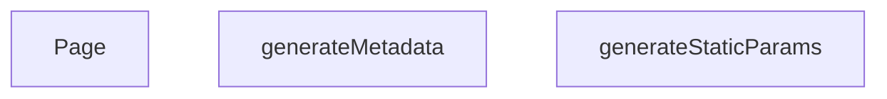

## Genel Bakış
Bu modül, Next.js uygulamasında dinamik ve çok dilli ürün sayfalarının (hem `lang` hem `slug` temelli) yönetiminden sorumludur. Üç asenkron fonksiyon, framework tarafından sırasıyla çağrılarak sayfanın derleme zamanında hangi dillerde ve ürünler için oluşturulacağını, SEO uyumlu meta bilgilerini ve nihai kullanıcı arayüzünü sağlar.

## Fonksiyon Grupları
### Statik Parametre Üretimi
Hangi dil-slug kombinasyonları için sayfaların derleme zamanında önceden oluşturulacağını belirler.
- generateStaticParams

### Meta Veri Oluşturma
Her ürün sayfasına özgü ve dile göre başlık, açıklama gibi SEO meta bilgilerini üretir.
- generateMetadata

### Sayfa Renderi
Verilen dil ve slug parametrelerine göre ilgili ürün verisini çekip, dil destekli sayfa bileşenini döndürür.
- Page

---

## AXIOMS – Mimari Varsayımlar

Bu modül için fonksiyon imzalarından çıkarılabilen temel mimari varsayımlar aşağıdadır.

[Aksiyom 1]: Eğer `lang` parametresi bir string değilse veya geçerli bir dil kodu içermiyorsa, `generateMetadata` ve `Page` fonksiyonları doğru çalışamaz.

[Aksiyom 2]: Eğer `slug` parametresi bir string değilse veya sistema tanımlı bir ürün referansı içermiyorsa, `generateMetadata` ve `Page` fonksiyonları ilgili ürün verisini bulamaz.

[Aksiyom 3]: Eğer `generateStaticParams()` fonksiyonu geçerli `{lang, slug}` kombinasyonları döndürmüyorsa, statik ön üretim sırasında ilgili sayfalar oluşturulamaz.

[Aksiyom 4]: Eğer `params` prop'u `Promise<{lang: string, slug: string}>` yapısına uymuyorsa (örneğin `lang` veya `slug` alanları eksikse), hem `generateMetadata` hem `Page` fonksiyonları hata ile karşılaşır.

[Aksiyom 5]: Eğer `generateStaticParams()` tarafından döndürülen slug değerleri ile `generateMetadata`/`Page`'in beklediği slug değerleri tutarsızsa, bazı sayfalar derleme zamanında üretilmez veya çalışma zamanında hata oluşur.

---

## FONKSİYON DETAYLARI

### generateStaticParams
**Ne yapar**: Bu fonksiyon, ürünler için statik yolları (path) oluşturur. Yalnızca veritabanında durumu 'active' olan ve slug değeri dolu olan ürünler için, her biri için Türkçe ('tr') ve İngilizce ('en') olmak üzere iki adet farklı dilde yol parametresi üretir. Bu sayede Next.js, build aşamasında bu sayfaları önceden oluşturabilir.

**Nasıl yapar**: Fonksiyon, `supabase` istemcisi kullanarak 'products' tablosundan sadece 'slug' sütununu çeker. Gelen verilerde `slug` alanı dolu olanları filtreler. Ardından her geçerli slug için `{ lang: 'tr', slug: ... }` ve `{ lang: 'en', slug: ... }` olmak üzere iki nesne içeren bir dizi oluşturur. Eğer hiç geçerli yol üretilemezse boş bir dizi döner. Hata oluşursa bir uyarı yazdırır ve yine boş dizi ile çıkar.

**Parametreler**:
- Fonksiyonun herhangi bir parametresi yoktur.

**Dönüş**: `Promise<Array<{ lang: string; slug: string }>>` veya bir hata/boş durum için `Promise<[]>`. Fonksiyon asenkron çalışır ve statik yolların listesini döner.

### generateMetadata
**Ne yapar**: Belirli bir ürün sayfası için SEO (Arama Motoru Optimizasyonu) meta verilerini ve Open Graph verilerini dinamik olarak üretir. Bu sayede ürün adı, açıklaması, kanonik URL'i ve paylaşım görseli gibi bilgiler doğru şekilde tarayıcılara ve sosyal medya platformlarına iletilir.

**Nasıl yapar**: Fonksiyon, URL parametrelerinden `slug` değerini alır. Hemen ardından o ürünün verilerini önbellekten veya veritabanından çekmek için `preloadProduct` ve `getCachedProductBySlug` işlevlerini çağırarak verileri erkenden yükler. Eğer ürün verisi başarıyla çekilip geçerliyse, `product.name` ve `product.description` alanlarını kullanarak dinamik bir `title` ve `description` oluşturur. Ayrıca `alternates.canonical` ve Open Graph için gerekli tüm alanları (title, description, url, images vb.) ayarlar. Ürün verisi alınamazsa veya bir hata oluşursa, varsayılan bir "Ürün Detayı | VentHub" başlığı ve açıklaması ile döner.

**Parametreler**:
- `params`: `{ lang: string; slug: string }` — Sayfaya ait URL parametrelerini içeren bir nesne. `slug` alanı, görüntülenecek ürünün benzersiz tanımlayıcısıdır.

**Dönüş**: `Promise<{ title: string; description: string; alternates?: object; openGraph?: object }>`. Asenkron olarak resolve olan bir meta nesnesi döner.

### Page
**Ne yapar**: Bu bileşen, bir ürünün detay sayfasını render eder. Sayfaya JSON-LD yapılandırılmış veri (SEO için zengin sonuçlar) ekler ve asıl sayfa içeriğini `PageComponent` aracılığıyla gösterir. Ürün verilerini sayfaya ilk yükleme verisi (initial prop) olarak aktarır.

**Nasıl yapar**: Fonksiyon, URL'den `slug` parametresini alır. `preloadProduct` ile veriyi erkenden yüklemeye başlar. Ardından, `slug` 'generic' değilse, `getCachedProductBySlug` ile ürün verisini çekmeye çalışır. Herhangi bir ağ hatası veya veritabanı hatası durumunda bunu yakalar ve bir uyarı yazdırır, sayfanın kırılmasını engeller. Çekilen ürün verisine (`productData`) dayanarak, Schema.org standardında bir JSON-LD nesnesi oluşturur. Bu nesne ürünün adını, açıklamasını, resmini, markasını, fiyatını ve stok durumunu içerir. Oluşturulan JSON-LD, `<script type="application/ld+json">` etiketi ile HTML'e enjekte edilir. Son olarak, tüm sayfa içeriğinin bulunduğu `PageComponent` bileşenini, `initialProduct` prop'u ile birlikte döndürür.

**Parametreler**:
- `params`: `{ lang: string; slug: string }` — Sayfaya ait URL parametrelerini içeren bir nesne. `slug` alanı, gösterilecek ürünün benzersiz tanımlayıcısıdır.

**Dönüş**: `JSX.Element`. Sayfanın HTML yapısını temsil eden bir React elemanı döner. İçeriğinde bir JSON-LD `<script>` etiketi ve `PageComponent` bileşeni bulunur.

---

## AST POINTERS

### [N1_NASIL] AST Pointer: `src/app/[lang]/products/[slug]/page.tsx`::generateStaticParams
- **params**: (parametre yok)
- **ic_degiskenler**:
  - `products` — supabase'den aktif ve slug'ı null olmayan tüm ürünlerin sadece `slug` alanını içeren sorgu sonucu
  - `paths` — Her geçerli ürün için `tr` ve `en` dillerinde olmak üzere iki adet `{ lang, slug }` nesnesi oluşturan flatMap sonucu array
  - `p` — `filter` ve `flatMap` callback'inde her bir ürün nesnesini temsil eder; `p.slug` erişimi yapılır, `p.slug!` non-null assertion ile kullanılır
  - `e` — try-catch yakalanan hata nesnesi; `console.warn` ile loglanır
- **Dönüş**: `{ lang: string, slug: string }[]` array'i veya boş `[]`

### [N2_NASIL] AST Pointer: `src/app/[lang]/products/[slug]/page.tsx`::generateMetadata
- **params**: `{ params }: { params: Promise<{ lang: string, slug: string }> }` — sayfa route parametrelerini içeren Promise
- **ic_degiskenler**:
  - `slug` — `await params` ile çözümlenen ürün slug değeri
  - `product` — `getCachedProductBySlug(slug)` çağrısıyla önbellekten veya veritabanından çekilen `Product` nesnesi
  - `canonicalPath` — `product.slug` değerinden alınan kanonik URL yolu
  - `product.description?.substring(0, 160)` — ürün açıklamasının ilk 160 karakteri, null ise fallback string kullanılır
  - `product.image_url` — ürün görseli URL'i, `||` ile varsayılan `/images/og-default.jpg` fallback'i var
  - `e` — try-catch yakalanan hata nesnesi; `console.warn` ile loglanır
- **Dönüş**: OpenGraph ve alternates bilgileri içeren metadata object veya fallback title/description object

### [N3_NASIL] AST Pointer: `src/app/[lang]/products/[slug]/page.tsx`::Page
- **params**: `{ params }: { params: Promise<{ lang: string, slug: string }> }` — sayfa route parametrelerini içeren Promise
- **ic_degiskenler**:
  - `slug` — `await params` ile çözümlenen ürün slug değeri
  - `productData` — `Product | null` tipinde; `getCachedProductBySlug(slug)` ile çekilen ürün verisi, `slug !== 'generic'` koşulu sağlanmazsa null kalır
  - `err` — catch bloğunda yakalanan hata nesnesi; `unknown` tipinde
  - `errorMsg` — `err` bir `Error` instance ise `err.message`, değilse `String(err)` ile elde edilen hata metni stringi; `'fetch failed'` içeriği kontrol edilir
  - `canonicalPath` — `productData?.slug` varsa onu, yoksa `'generic'` stringini alan kanonik URL yolu
  - `jsonLd` — Schema.org uyumlu LD+JSON nesnesi; `productData?.stock_qty ?? 0` stok kontrolü, `productData?.brand` optional chaining, `productData?.image_url` conditional spread ile oluşturulur
- **Dönüş**: `<script type="application/ld+json">` ve `<PageComponent initialProduct={productData} />` içeren JSX fragmenti

---

## MERMAID CALL GRAPH

## NODE ID STANDARD

  file: src\app\[lang]\products\[slug]\page.tsx
  function: src\app\[lang]\products\[slug]\page.tsx::generateStaticParams
  function: src\app\[lang]\products\[slug]\page.tsx::generateMetadata
  function: src\app\[lang]\products\[slug]\page.tsx::Page

---

## DISA AKTARILANLAR (EXPORTS)
  export: Page
  export: generateMetadata
  export: generateStaticParams

---

## STİL TOKENLERİ

### Arbitrary Değerler (token'a geçirilmemiş)
Yok — tüm stiller token'a geçirilmiş. ✅

### Kullanılan Token'lar (zaten token'a geçirilmiş)
- (yok)

### Tailwind Sınıf Özeti
- **Renkler:** (yok)
- **Layout:** (yok)
- **Varyant/Responsive:** (yok)
- **Yardımcı Sınıflar:** (yok)