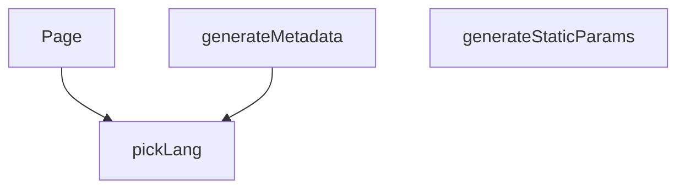

## Genel Bakış

Bu modül, Next.js uygulamasında çok dilli (Türkçe/İngilizce) ürün detay sayfalarını oluşturma ve sunma sorumluluğunu taşır. Modül, statik site oluşturma sürecini planlayarak hangi sayfaların derleneceğini belirler, her bir sayfa için arama motoru optimizasyonu (SEO) meta verilerini dinamik olarak üretir ve son olarak ilgili dil ve ürün adresine (slug) uygun içeriği kullanıcıya sunar.

## Fonksiyon Grupları

### Derleme Zamanı Sayfa Planlaması
Modül, uygulamanın derleme (build) aşamasında hangi dil ve ürün kombinasyonları için sayfaların önceden oluşturulacağını belirler. Bu, uygulamanın verimli çalışmasını ve ilgili sayfaların istek üzerine değil, derleme zamanında hazır olmasını sağlar.
- generateStaticParams

### Dinamik SEO Meta Verisi Üretimi
Her bir ürün detay sayfası için arama motorları ve sosyal paylaşım platformları tarafından okunabilecek dinamik meta bilgiler (başlık, açıklama, vb.) oluşturur. Bu sayede sayfalar arama sonuçlarında doğru ve çekici bir şekilde listelenir.
- generateMetadata

### Ürün Sayfası Sunumu
Kullanıcı tarafından ziyaret edildiğinde, ilgili dil ve ürün adresine (slug) karşılık gelen ürün detay içeriğini render eder. Sayfanın ana bileşeni olarak kullanıcıya nihai HTML çıktısını sunar.
- Page

### Dil Seçimi Yardımcısı
Çok dilli metin nesnelerinden (LocalizedText) istenen dile ait değeri seçen yardımcı fonksiyondur. Diğer fonksiyonlar tarafından çağrılarak sayfa içeriğinin ve meta verilerinin doğru dilde üretilmesini sağlar.
- pickLang

---

## AXIOMS – Mimari Varsayımlar
- Bu modül davranışsal mantık içermez (salt veri / konfigürasyon / tip tanımı).
- [Aksiyom 1]: Modülün dışa açtığı yapı (anahtar kümesi / şema) bir sözleşmedir; tüketiciler bu sabit yapıya bağlıdır — kırıcı değişiklik tüm tüketicileri etkiler.
- [Aksiyom 2]: Bir öğe ekleme/çıkarma yapısal-uyumlu olmalı; ilgili tipler ve seçiciler aynı commit'te güncel tutulmalıdır.

---

## FONKSİYON DETAYLARI

### pickLang
**Ne yapar**: Verilen LocalizedText nesnesinden, belirli bir dil için metin içeriğini seçer ve döndürür.
**Nasıl yapar**: Fonksiyon, `value` parametresinin varlığını kontrol eder. Eğer değer yoksa `null` döner. Ardından, `lang` parametresinin `'en'` olup olmadığına bakarak `value.en` veya `value.tr` değerini tercih eder. Tercih edilen değer boş (null/undefined/boş string) ise, sırasıyla `value.tr`, `value.en` ve son olarak `null` değerlerini fallback olarak döndürür. Bu mantık, birincil dil tercih edilmeyen içerik varsa bile sayfada bir metin gösterilmesini sağlar.
**Parametreler**:
- value: `LocalizedText` — `en` ve `tr` anahtarlarına sahip, iki dildeki metinleri tutan nesne. Nullable olabilir.
- lang: `string` — İstenen dil kodu (örn. `'tr'`, `'en'`). Mevcut mantıkta sadece `'en'` değeri doğrudan işlenir, diğer tüm değerler `'tr'` tercihini tetikler.
**Dönüş**: `string | null` — Seçilen dildeki metin döner. Uygun dil veya içerik bulunamazsa `null` döner.

### generateStaticParams
**Ne yapar**: Uygulama derleme zamanında (build time) önceden render edilecek (prerender) tüm ürün ailesi (family) sayfaları için dinamik parametrelerin listesini üretir.
**Nasıl yapar**: Fonksiyon, `getAllFamilySlugs` fonksiyonunu kullanarak Supabase veritabanından tüm ürün ailesi slug'larını (`slug`) çeker. Bu işlem `try-catch` bloğu ile sarılmıştır; bir hata oluşursa konsola uyarı yazdırır ve boş bir dizi döner. Çekilen ailelerden `slug` değeri olan (`!!f.slug`) tüm elemanları filtreler. Her geçerli aile için, hem Türkçe (`'tr'`) hem İngilizce (`'en'`) dil kodlarıyla birlikte birer parametre nesnesi oluşturur. `flatMap` kullanarak bu nesneleri tek bir düz diziye dönüştürür. Bu sayede, her ürün ailesi için iki dilde de `/products/[lang]/[slug]` yolları statik olarak oluşturulur.
**Parametreler**: Yok.
**Dönüş**: `Array<{ lang: string; slug: string }>` — Statik olarak oluşturulacak sayfaların parametrelerini içeren dizi. Hata durumunda boş dizi döner.

### generateMetadata
**Ne yapar**: Ürün ailesi sayfası için Next.js metadata nesnesi oluşturur. Sayfa başlığı, açıklama, canonical URL, dil alternatifleri ve OpenGraph etiketlerini içeren SEO odaklı bir yapı döndürür. Veri alınamazsa varsayılan ("Ürün Detayı | VentHub") metadata ile düşer.

**Nasıl yapar**: Önce `preloadFamily` ile veriyi ısıtır, ardından `getCachedFamilyDetail` ile ürün ailesi detayını ve varyantlarını çeker. Canonical URL hesaplamasında dil öneki kasıtlı olarak eklenir — `middleware.ts` dil öneksiz rotaları 307 ile yönlendirdiği için öneksiz canonical, yönlendirmeyi gösteren bir URL olurdu; ayrıca `/tr/...` ve `/en/...` sayfaları aynı canonical'ı bildirerek arama motorunun bir dili indeksten düşürmesine yol açabilirdi. `Routes.product` + dil öneki bileşimi `sitemap.ts` ile aynı kaynaktan üretilir. `pickLang` ile dile göre `meta_title` ve `meta_description` seçilir; bulunamazsa `family.description`'ın ilk 160 karakteri, o da yoksa dile göre sabit bir son çare açıklaması kullanılır. Varyantlardan ilk görsel yolu (`coverPath`) bulunur; yoksa `/images/og-default.jpg` kullanılır. Hata yakalanırsa `console.warn` ile loglanır ve varsayılan metadata döndürülür.

**Parametreler**:
- params: Promise<{ lang: string, slug: string }> — Dil kodu (`lang`) ve ürün ailesi slug'ı (`slug`) içeren, Promise olarak gelen route parametreleri.

**Dönüş**: `{ title: string, description: string, alternates: { canonical: string, languages: { tr: string, en: string, 'x-default': string } }, openGraph: { title: string, description: string, url: string, siteName: string, images: Array<{ url: string, width: number, height: number }>, locale: string, type: string } }` — SEO ve sosyal paylaşım için gerekli tüm metadata alanlarını içeren nesne. Veri bulunamazsa veya hata oluşursa `title: 'Ürün Detayı | VentHub'` ve `description: 'VentHub Endüstriyel Havalandırma Sistemleri Ürün Detayı'` içeren basitleştirilmiş nesne döner.

### Page
**Ne yapar**: Ürün ailesi detay sayfasının (React bileşeni) asenkron ana bileşenidir. Sayfa verilerini çeker, yönlendirme (redirect) mantığını yönetir, JSON-LD (yapılandırılmış veri) oluşturur ve arayüzü render eder.
**Nasıl yapar**: Fonksiyon, `params` promise'ını çözerek `lang` ve `slug` değerlerini alır. `preloadFamily` ile veri yüklemeyi başlatır.
1.  `slug` `'generic'` değilse, `getCachedFamilyDetail` ile aile bilgisini çekmeyi dener.
2.  Eğer aile bulunamazsa (`detail` null ise), `getCachedProductBySlug` ile `slug`'ın bir varyant slug'ı olup olmadığını kontrol eder. Eğer bir varyant ise ve bu varyantın ailesi (`family_id`) varsa, ailenin kendi slug'ını (`getCachedFamilySlugById`) çeker. Eğer aile slug'ı mevcut slug'dan farklıysa, kalıcı bir 308 yönlendirmesi (`permanentRedirect`) için hedef URL oluşturur.
3.  `permanentRedirect` bir istisna fırlatacağı için, potansiyel bir yönlendirme (`redirectTo`) varsa `try-catch` bloğu dışında çağrılır.
4.  Yönlendirme yoksa veya hata oluştuysa, mevcut aile (`family`) ve varyantlar (`variants`) bilgileri alınır. Aile bulunuyorsa, `buildProductGroupJsonLd` kullanılarak arama motorları için yapılandırılmış veri (JSON-LD) üretilir ve `dangerouslySetInnerHTML` ile sayfaya eklenir.
5.  Son olarak, `PageComponent`'e gerekli veriler (`family`, `variants`, `priceTaxIncluded`) prop olarak geçirilerek ana arayüz render edilir.
**Parametreler**:
- params: `Promise<{ lang: string; slug: string }>` — Sayfa parametrelerini içeren promise. `lang` dil kodunu, `slug` ise ürün ailesi veya varyant tanımıcısını tutar.
**Dönüş**: `Promise<JSX.Element>` — Render edilmiş React JSX içeriğini döndürür. İçerik, opsiyonel bir JSON-LD script etiketi ve ana `PageComponent`'ten oluşur.

---

## İTHALATLAR (IMPORTS)
- import: ../../../../config/siteUrl::SITE_URL
- import: ../../../../lib/data/productRoute::resolveProductRoute
- import: ../../../../lib/data/productRoute::type { ProductRouteResolution }
- import: ../../../../utils/routes::Routes
- import: ../../../_components/ProductDetailPageView::ProductDetailPage
- import: @/i18n/dictionaries/en::en
- import: @/i18n/dictionaries/tr::tr
- import: @/i18n/getDictValue::getDictValue
- import: @/lib/images/productImage::storagePathToUrl
- import: @/lib/services/family.service::getAllFamilySlugs
- import: @/lib/supabase/static::supabaseStaticClient
- import: @/utils/categoryHelpers::getCategoryDisplayName
- import: @/utils/categoryHelpers::getLocalizedCategorySlug
- import: @/views/category/SeriesLandingView::SeriesLandingView
- import: next/navigation::notFound
- import: next/navigation::permanentRedirect
- import: next::type { Route }

---

## TYPE ALIASES

### LocalizedText
F5-B W2.2 — PDP artık AİLE (product_families) kanoniktir. `/[lang]/products/[slug]` slug'ı bir AİLE slug'ıdır; belirli varyant `?sku=` ile ön-seçilir (canonical/metadata URL'lerine GİRMEZ). Eski varyant slug'ları 308 (permanentRedirect) ile aile URL'ine taşınır.
```typescript
type LocalizedText = { tr?: string | null; en?: string | null } | null
```

---

## AST POINTERS

### [N1_NASIL] AST Pointer: src/app/[lang]/products/[slug]/page.tsx::pickLang
- **params**: `value` (LocalizedText), `lang` (string)
- **ic_degiskenler**:
  - `preferred` — lang değerine göre tercih edilen dil metni; lang 'en' ise `value.en`, değilse `value.tr`
- **Dönüş**: string | null

### [N2_NASIL] AST Pointer: src/app/[lang]/products/[slug]/page.tsx::generateStaticParams
- **params**: yok
- **ic_degiskenler**:
  - `families` — `getAllFamilySlugs(supabase)` çağrısından dönen aile slug listesi
  - `f` — `.filter()` ve `.flatMap()` içinde kullanılan her bir aile objesi; `f.slug` alanına erişilir
  - `e` — catch bloğunda yakalanan hata objesi; `console.warn` ile loglanır
- **Dönüş**: `{ lang: string, slug: string }[]` (hata durumunda boş dizi)

### [N3_NASIL] AST Pointer: src/app/[lang]/products/[slug]/page.tsx::generateMetadata
- **params**: `params` (Promise<{ lang: string, slug: string }>)
- **ic_degiskenler**:
  - `lang` — `await params` sonucu elde edilen dil kodu
  - `slug` — `await params` sonucu elde edilen aile slug'ı
  - `detail` — `getCachedFamilyDetail(slug, lang)` çağrısından dönen aile detayı; null olabilir
  - `family` — `detail` objesinden çıkarılan aile bilgisi; `family.slug`, `family.meta_title`, `family.meta_description`, `family.name`, `family.description` alanlarına erişilir
  - `variants` — `detail` objesinden çıkarılan varyantlar dizisi; her varyantın `v.images` alanına erişilir
  - `trUrl` — Türkçe kanonik URL; `${SITE_URL}/tr${Routes.product(family.slug)}` ifadesiyle oluşturulur
  - `enUrl` — İngilizce kanonik URL; `${SITE_URL}/en${Routes.product(family.slug)}` ifadesiyle oluşturulur
  - `canonicalUrl` — lang değerine göre seçilen kanonik URL; lang 'en' ise `enUrl`, değilse `trUrl`
  - `title` — meta başlığı; `pickLang(family.meta_title, lang)` sonucu, null ise `${family.name} | VentHub` kullanılır
  - `description` — meta açıklaması; `pickLang(family.meta_description, lang)` veya `pickLang(family.description, lang)?.substring(0, 160)` veya dil koşullu son çare metni
  - `coverPath` — varyantlar içinde görseli olan ilk varyantın ilk görselinin yolu; `variants.find((v) => v.images.length > 0)?.images[0]?.path`
  - `e` — catch bloğunda yakalanan hata objesi; `console.warn` ile loglanır
- **Dönüş**: Metadata objesi (title, description, alternates, openGraph alanlarını içerir) veya hata/bulunamama durumunda varsayılan Metadata objesi

### [N4_NASIL] AST Pointer: src/app/[lang]/products/[slug]/page.tsx::Page
- **params**: `params` (Promise<{ lang: string, slug: string }>)
- **ic_degiskenler**:
  - `lang` — `await params` sonucu elde edilen dil kodu
  - `slug` — `await params` sonucu elde edilen slug; 'generic' ise `unavailable` çözüme düşer
  - `resolution` — `resolveProductRoute(slug, lang, {...})` çağrısından dönen rota çözümü; `kind` alanı 'redirect', 'series', 'not-found', 'family' veya 'unavailable' olabilir
  - `detail` — `resolution.kind === 'family'` ise `resolution.detail`, değilse null
  - `family` — `detail?.family`; null olabilir; `family.category`, `family.subcategory`, `family.name` alanlarına erişilir
  - `variants` — `detail?.variants`; boş dizi olabilir
  - `jsonLd` — `family` varsa `buildProductGroupJsonLd({ family, variants, lang, baseUrl: SITE_URL })` çağrısından dönen JSON-LD verisi, yoksa null
  - `dict` — lang 'en' ise `en` sözlüğü, değilse `tr` sözlüğü
  - `t` — `(key: string) => getDictValue(dict, key)` fonksiyonu; sözlükten değer almak için kullanılır
  - `mainCategory` — `family?.category`; null olabilir
  - `subCategory` — `family?.subcategory`; null olabilir
  - `mainName` — `mainCategory` varsa `getCategoryDisplayName(mainCategory, t)` sonucu, yoksa boş string
  - `mainSlug` — `mainCategory` varsa `getLocalizedCategorySlug(mainCategory, lang)` sonucu, yoksa boş string
  - `subName` — `subCategory` varsa `getCategoryDisplayName(subCategory, t)` sonucu, yoksa boş string
  - `subSlug` — `subCategory` varsa `getLocalizedCategorySlug(subCategory, lang)` sonucu, yoksa boş string
  - `breadcrumbJsonLd` — `family` varsa ve `family.name.trim()` truthy ise `buildBreadcrumbJsonLd({ lang, baseUrl: SITE_URL, steps: [...] })` çağrısından dönen JSON-LD verisi, yoksa null
  - `series` — `resolution.kind === 'series'` durumunda `resolution.landing`'den çıkarılan seri bilgisi; `series.description`, `series.name`, `series.slug` alanlarına erişilir
  - `models` — `resolution.kind === 'series'` durumunda `resolution.landing`'den çıkarılan modeller dizisi
  - `description` (seri dalı) — `pickLang(series.description, lang)` sonucu veya dil koşullu fallback metin
  - `seriesJsonLd` — `buildSeriesLandingJsonLd({ lang, baseUrl: SITE_URL, seriesSlug: series.slug, name: series.name, description, models })` çağrısından dönen JSON-LD verisi
- **Dönüş**: JSX elementi — `resolution.kind === 'series'` ise `<SeriesLandingView>` içeren fragment, `resolution.kind === 'not-found'` ise `notFound()` exception fırlatır, `resolution.kind === 'redirect'` ise `permanentRedirect()` exception fırlatır, diğer durumlarda `<PageComponent>` ve JSON-LD script'leri içeren fragment

---


## MERMAID CALL GRAPH


## NODE ID STANDARD

  file: src\app\[lang]\products\[slug]\page.tsx
  function: src\app\[lang]\products\[slug]\page.tsx::pickLang
  function: src\app\[lang]\products\[slug]\page.tsx::generateStaticParams
  function: src\app\[lang]\products\[slug]\page.tsx::generateMetadata
  function: src\app\[lang]\products\[slug]\page.tsx::Page

---

## DISA AKTARILANLAR (EXPORTS)
  export: Page
  export: generateMetadata
  export: generateStaticParams
  export: pickLang

---

## STİL TOKENLERİ

### Arbitrary Değerler (token'a geçirilmemiş)
Yok — tüm stiller token'a geçirilmiş. ✅

### Kullanılan Token'lar (zaten token'a geçirilmiş)
- (yok)

### Tailwind Sınıf Özeti
- **Renkler:** (yok)
- **Layout:** (yok)
- **Varyant/Responsive:** (yok)
- **Yardımcı Sınıflar:** (yok)