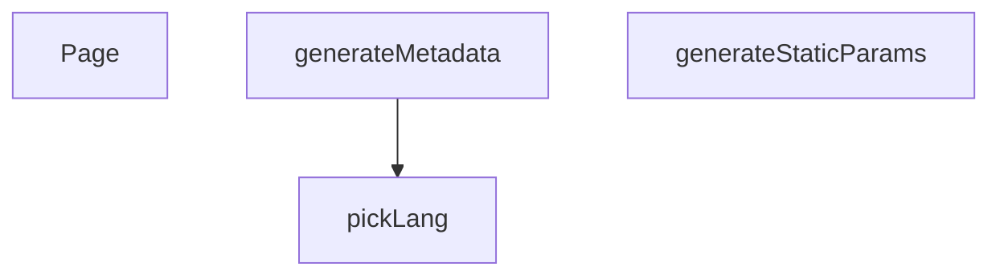

## Genel Bakış
Bu modül, Next.js uygulamasında çok dilli (Türkçe/İngilizce) ürün detay sayfalarını oluşturma ve sunma sorumluluğunu taşır. Modül, statik site oluşturma sürecini planlayarak hangi sayfaların derleneceğini belirler, her bir sayfa için arama motoru optimizasyonu (SEO) meta verilerini dinamik olarak üretir ve son olarak ilgili dil ve ürün adresine (slug) uygun içeriği kullanıcıya sunar.

## Fonksiyon Grupları
### Derleme Zamanı Sayfa Planlaması
Modül, uygulamanın derleme (build) aşamasında hangi dil ve ürün kombinasyonları için sayfaların önceden oluşturulacağını (statik olarak üretileceğini) belirler. Bu, uygulamanın verimli çalışmasını ve ilgili sayfaların istek üzerine değil, derleme zamanında hazır olmasını sağlar.
- generateStaticParams

### Dinamik SEO Meta Verisi Üretimi
Her bir ürün detay sayfası için arama motorları ve sosyal paylaşım platformları tarafından okunabilecek dinamik meta bilgiler (başlık, açıklama, vb.) oluşturur. Bu sayede sayfalar arama sonuçlarında doğru ve çekici bir şekilde listelenir.
- generateMetadata

### Ürün Sayfası Sunumu
Kullanıcı tarafından ziyaret edildiğinde, ilgili dil ve ürün adresine (slug) karşılık g

---

## AXIOMS – Mimari Varsayımlar
- Bu modül davranışsal mantık içermez (salt veri / konfigürasyon / tip tanımı).
- [Aksiyom 1]: Modülün dışa açtığı yapı (anahtar kümesi / şema) bir sözleşmedir; tüketiciler bu sabit yapıya bağlıdır — kırıcı değişiklik tüm tüketicileri etkiler.
- [Aksiyom 2]: Bir öğe ekleme/çıkarma yapısal-uyumlu olmalı; ilgili tipler ve seçiciler aynı commit'te güncel tutulmalıdır.

---

## FONKSİYON DETAYLARI

### pickLang
**Ne yapar**: Verilen LocalizedText nesnesinden, belirli bir dil için metin içeriğini seçer ve döndürür.
**Nasıl yapar**: Fonksiyon, `value` parametresinin varlığını kontrol eder. Eğer değer yoksa `null` döner. Ardından, `lang` parametresinin `'en'` olup olmadığına bakarak `value.en` veya `value.tr` değerini tercih eder. Tercih edilen değer boş (null/undefined/boş string) ise, sırasıyla `value.tr`, `value.en` ve son olarak `null` değerlerini fallback olarak döndürür. Bu mantık, birincil dil tercih edilmeyen içerik varsa bile sayfada bir metin gösterilmesini sağlar.
**Parametreler**:
- value: `LocalizedText` — `en` ve `tr` anahtarlarına sahip, iki dildeki metinleri tutan nesne. Nullable olabilir.
- lang: `string` — İstenen dil kodu (örn. `'tr'`, `'en'`). Mevcut mantıkta sadece `'en'` değeri doğrudan işlenir, diğer tüm değerler `'tr'` tercihini tetikler.
**Dönüş**: `string | null` — Seçilen dildeki metin döner. Uygun dil veya içerik bulunamazsa `null` döner.

### generateStaticParams
**Ne yapar**: Uygulama derleme zamanında (build time) önceden render edilecek (prerender) tüm ürün ailesi (family) sayfaları için dinamik parametrelerin listesini üretir.
**Nasıl yapar**: Fonksiyon, `getAllFamilySlugs` fonksiyonunu kullanarak Supabase veritabanından tüm ürün ailesi slug'larını (`slug`) çeker. Bu işlem `try-catch` bloğu ile sarılmıştır; bir hata oluşursa konsola uyarı yazdırır ve boş bir dizi döner. Çekilen ailelerden `slug` değeri olan (`!!f.slug`) tüm elemanları filtreler. Her geçerli aile için, hem Türkçe (`'tr'`) hem İngilizce (`'en'`) dil kodlarıyla birlikte birer parametre nesnesi oluşturur. `flatMap` kullanarak bu nesneleri tek bir düz diziye dönüştürür. Bu sayede, her ürün ailesi için iki dilde de `/products/[lang]/[slug]` yolları statik olarak oluşturulur.
**Parametreler**: Yok.
**Dönüş**: `Array<{ lang: string; slug: string }>` — Statik olarak oluşturulacak sayfaların parametrelerini içeren dizi. Hata durumunda boş dizi döner.

### generateMetadata
**Ne yapar**: Belirli bir ürün ailesi sayfası için, SEO ve OpenGraph (sosyal paylaşım) amacıyla kullanılacak olan sayfa başlığını, açıklamasını, kanonik URL'ini ve görsel bilgilerini üretir.
**Nasıl yapar**: Fonksiyon, `params` promise'ını çözerek `lang` ve `slug` değerlerini alır. Ardından `preloadFamily` ile ilgili aile verisinin arka planda yüklenmesini tetikler. `getCachedFamilyDetail` kullanarak ailenin ve varyantlarının detaylı bilgisini çekmeyi dener. Bilgi başarıyla çekildiğinde:
1.  Kanonik URL, dil kodu içermeyen sadece aile slug'ından oluşur (`/products/${family.slug}`).
2.  Başlık ve açıklama, `pickLang` kullanılarak ilgili dilden seçilir; uygun dil yoksa fallback değerler veya aile adı kullanılır.
3.  Görsel (cover) olarak, varyantlar arasında ilk bulunan görselin yolu kullanılır; görsel yoksa varsayılan bir görsel belirlenir.
4.  Tüm bu bilgilerle, standart bir OpenGraph yapısı (`title`, `description`, `url`, `images`, `locale`, vb.) oluşturulur.
Bilgi çekme sırasında bir hata oluşursa konsola uyarı yazdırır ve varsayılan bir başlık/açıklama ile basit bir metadata nesnesi döner.
**Parametreler**:
- params: `Promise<{ lang: string; slug: string }>` — Sayfa parametrelerini içeren promise. `lang` dil kodunu, `slug` ise ürün ailesi tanımıcısını tutar.
**Dönüş**: `Promise<{ title: string; description: string; alternates?: { canonical: string }; openGraph?: {...} }>` — Sayfa metadata bilgilerini içeren nesne. Hata veya veri bulunamama durumunda, sadece `title` ve `description` alanlarını içeren basit bir nesne döner.

### Page
**Ne yapar**: Ürün ailesi detay sayfasının (React bileşeni) asenkron ana bileşenidir. Sayfa verilerini çeker, yönlendirme (redirect) mantığını yönetir, JSON-LD (yapılandırılmış veri) oluşturur ve arayüzü render eder.
**Nasıl yapar**: Fonksiyon, `params` promise'ını çözerek `lang` ve `slug` değerlerini alır. `preloadFamily` ile veri yüklemeyi başlatır.
1.  `slug` `'generic'` değilse, `getCachedFamilyDetail` ile aile bilgisini çekmeyi dener.
2.  Eğer aile bulunamazsa (`detail` null ise), `getCachedProductBySlug` ile `slug`'ın bir varyant slug'ı olup olmadığını kontrol eder. Eğer bir varyant ise ve bu varyantın ailesi (`family_id`) varsa, ailenin kendi slug'ını (`getCachedFamilySlugById`) çeker. Eğer aile slug'ı mevcut slug'dan farklıysa, kalıcı bir 308 yönlendirmesi (`permanentRedirect`) için hedef URL oluşturur.
3.  `permanentRedirect` bir istisna fırlatacağı için, potansiyel bir yönlendirme (`redirectTo`) varsa `try-catch` bloğu dışında çağrılır.
4.  Yönlendirme yoksa veya hata oluştuysa, mevcut aile (`family`) ve varyantlar (`variants`) bilgileri alınır. Aile bulunuyorsa, `buildProductGroupJsonLd` kullanılarak arama motorları için yapılandırılmış veri (JSON-LD) üretilir ve `dangerouslySetInnerHTML` ile sayfaya eklenir.
5.  Son olarak, `PageComponent`'e gerekli veriler (`family`, `variants`, `priceTaxIncluded`) prop olarak geçirilerek ana arayüz render edilir.
**Parametreler**:
- params: `Promise<{ lang: string; slug: string }>` — Sayfa parametrelerini içeren promise. `lang` dil kodunu, `slug` ise ürün ailesi veya varyant tanımıcısını tutar.
**Dönüş**: `Promise<JSX.Element>` — Render edilmiş React JSX içeriğini döndürür. İçerik, opsiyonel bir JSON-LD script etiketi ve ana `PageComponent`'ten oluşur.

---

## İTHALATLAR (IMPORTS)
- import: ../../../../config/siteUrl::SITE_URL
- import: ../../../_components/ProductDetailPageView::ProductDetailPage
- import: @/lib/images/productImage::storagePathToUrl
- import: @/lib/seo/jsonld::assertNoUuid
- import: @/lib/seo/jsonld::buildProductGroupJsonLd
- import: @/lib/services/family.service::getAllFamilySlugs
- import: @/lib/supabase/static::supabaseStaticClient
- import: next/navigation::permanentRedirect
- import: next::type { Route }

---

## TYPE ALIASES

### LocalizedText
F5-B W2.2 — PDP artık AİLE (product_families) kanoniktir. `/[lang]/products/[slug]` slug'ı bir AİLE slug'ıdır; belirli varyant `?sku=` ile ön-seçilir (canonical/metadata URL'lerine GİRMEZ). Eski varyant slug'ları 308 (permanentRedirect) ile aile URL'ine taşınır.
```typescript
type LocalizedText = { tr?: string | null; en?: string | null } | null
```

---

## AST POINTERS

### [N1_NASIL] AST Pointer: [lang]/products/[slug]/page.tsx::pickLang
- **params**: `value: LocalizedText, lang: string`
- **ic_degiskenler**:
  - `preferred` — `lang` değerine göre `value.en` veya `value.tr` tercih edilen metni tutar
- **Dönüş**: `string | null` — yerelleştirilmiş metni veya `null` döner

### [N2_NASIL] AST Pointer: [lang]/products/[slug]/page.tsx::generateStaticParams
- **params**: (yok)
- **ic_degiskenler**:
  - `families` — `getAllFamilySlugs(supabase)` ile tüm aile slug'larının listesi; her biri `slug` alanı içerir
- **Dönüş**: `{ lang: string, slug: string }[]` — her aile için `'tr'` ve `'en'` olmak üzere iki statik parametre çifti döner; hata durumunda boş dizi döner

### [N3_NASIL] AST Pointer: [lang]/products/[slug]/page.tsx::generateMetadata
- **params**: `{ params: Promise<{ lang: string, slug: string }> }`
- **ic_degiskenler**:
  - `lang` — params'tan çözülen dil kodu (`'tr'` veya `'en'`)
  - `slug` — params'tan çözülen ürün ailesi slug'ı
  - `detail` — `getCachedFamilyDetail(slug, lang)` ile getirilen önbelleklenmiş aile detayı (`{ family, variants }` veya `null`)
  - `family` — `detail.family` objesi; `name`, `meta_title`, `meta_description`, `description`, `slug` alanlarını içerir
  - `variants` — `detail.variants` dizisi; her biri `images` alanını içerir
  - `canonicalUrl` — kanonik URL dizgesi; `${SITE_URL}/products/${family.slug}` formatında
  - `title` — SEO başlığı; `pickLang(family.meta_title, lang)` veya fallback olarak `${family.name} | VentHub`
  - `description` — SEO açıklaması; `pickLang(family.meta_description, lang)` veya `pickLang(family.description, lang)?.substring(0, 160)` veya sabit fallback
  - `coverPath` — OG görseli için kapak görseli path'i; varyantlardaki ilk görselin `path` alanı
- **Dönüş**: Next.js metadata objesi (`title`, `description`, `alternates`,`, `openGraph` alanları) veya hata/fallback durumunda sabit `{ title, description }` objesi

### [N4_NASIL] AST Pointer: [lang]/products/[slug]/page.tsx::Page
- **params**: `{ params: Promise<{ lang: string, slug: string }> }`
- **ic_degiskenler**:
  - `lang` — params'tan çözülen dil kodu (`'tr'` veya `'en'`)
  - `slug` — params'tan çözülen URL slug'ı
  - `detail` — `getCachedFamilyDetail(slug, lang)` ile getirilen aile detayı; `{ family, variants, price_tax_included }` veya `null`
  - `redirectTo` — varyant slug'ı tespit edildiğinde kanonik aile URL'ine yönlendirme rotası (`Route` veya `null`)
  - `variant` — `getCachedProductBySlug(slug)` ile getirilen tekil ürün/varyant objesi; `family_id` ve `sku` alanlarını içerir
  - `familySlug` — `getCachedFamilySlugById(variant.family_id)` ile varyantın ait olduğu aile slug'ı
  - `errorMsg` — yakalanan hatanın mesaj dizgesi
  - `family` — `detail?.family ?? null` — ürün ailesi objesi veya `null`
  - `variants` — `detail?.variants ?? []` — varyantlar dizisi
  - `jsonLd` — `buildProductGroupJsonLd({ family, variants, lang, baseUrl: SITE_URL })` ile üretilen JSON-LD objesi veya `null`
- **Dönüş**: JSX — `PageComponent`'e `family`, `variants`, `priceTaxIncluded` props'ları ile render edilmiş React elemanı; opsiyonel JSON-LD script bloğu

---


## MERMAID CALL GRAPH


## NODE ID STANDARD

  file: src\app\[lang]\products\[slug]\page.tsx
  function: src\app\[lang]\products\[slug]\page.tsx::pickLang
  function: src\app\[lang]\products\[slug]\page.tsx::generateStaticParams
  function: src\app\[lang]\products\[slug]\page.tsx::generateMetadata
  function: src\app\[lang]\products\[slug]\page.tsx::Page

---

## DISA AKTARILANLAR (EXPORTS)
  export: Page
  export: generateMetadata
  export: generateStaticParams
  export: pickLang

---

## STİL TOKENLERİ

### Arbitrary Değerler (token'a geçirilmemiş)
Yok — tüm stiller token'a geçirilmiş. ✅

### Kullanılan Token'lar (zaten token'a geçirilmiş)
- (yok)

### Tailwind Sınıf Özeti
- **Renkler:** (yok)
- **Layout:** (yok)
- **Varyant/Responsive:** (yok)
- **Yardımcı Sınıflar:** (yok)