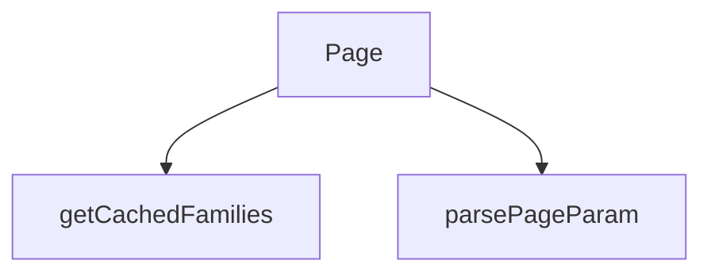

## Genel Bakış

Bu modül, Next.js uygulamasında dil bazlı dinamik bir ürün aileleri listesi sayfasını sunucu tarafında yönetir. Sayfa parametrelerini ayrıştırarak istenen dile ve sayfa numarasına karşılık gelen verileri önbellekten çeker ve sayfanın HTML çıktısını oluşturur.

## Fonksiyon Grupları

### Parametre Ayrıştırma
URL'den gelen ham sayfa parametresini güvenli bir şekilde sayısal değere dönüştürmekten sorumludur. Geçersiz veya eksik değerler için varsayılan davranış sağlar.
- parsePageParam

### Dil-Bazlı Veri Sağlama
Belirli bir dil, kiracı ve sayfa numarasına karşılık gelen ürün ailelerini sunucu tarafında önbellekten almak ve performans sağlamakla sorumludur.
- getCachedFamilies

### Sayfa Oluşturma ve Bileşen Birleştirme
İsteği işleyerek dil ve sayfa parametrelerini çıkarır, gerekli verileri getirir ve sayfanın tüm React bileşenlerini birleştirip son HTML çıktısını üretir. Hem `params` hem de `searchParams` Promise olarak alınır ve resolve edilir.
- Page

---

## AXIOMS – Mimari Varsayımlar

**[Aksiyom 1]:** Eğer `getCachedFamilies` çağrısında `lang` parametresi sağlanmazsa, aile verileri ilgili dil için önbellekten alınamaz ve çağrı başarısız olur.

**[Aksiyom 2]:** Eğer `getCachedFamilies` çağrısında `tenantId` parametresi sağlanmazsa, hangi kiracıya ait ailelerin getirileceği belirsizleşir ve çağrı başarısız olur.

**[Aksiyom 3]:** Eğer `Page` bileşeninin `params` argümanı bir `Promise<{ lang: string }>` olarak resolve olmazsa, sayfa hangi dilde render edileceğini bilemez ve HTML çıktısı oluşturulamaz.

**[Aksiyom 4]:** Eğer `Page` bileşeninin `params` Promise'i içindeki `lang` alanı eksik veya `string` tipinde değilse, dil parametresi `getCachedFamilies` fonksiyonuna geçersiz aktarılır ve sayfa hatalı çalışır.

**[Aksiyom 5]:** Eğer `parsePageParam` fonksiyonuna geçersiz bir ham değer (sayı olmayan string, undefined vb.) aktarılırsa, fonksiyon varsayılan bir sayısal değer döndürerek sayfanın çökmesini engeller.

---

## AXIOMS – Mimari Varsayımlar

[Aksiyom 1]: Eğer `lang` parametresi yoksa, `getCachedFamilies` fonksiyonu çalışamaz; dolayısıyla `Page` bileşeni ürün ailesi verisini gösteremez.

[Aksiyom 2]: Eğer `tenantId` parametresi yoksa, `getCachedFamilies` fonksiyonu hangi kiracıya ait verileri çekeceğini bilemez; veri erişimi gerçekleşmez.

[Aksiyom 3]: Eğer `page` parametresi yoksa, `getCachedFamilies` fonksiyonu hangi sayfayı getireceğini bilemez; sayfalama yapılamaz.

[Aksiyom 4]: Eğer `params` Promise'i çözümlenemezse (resolve olmazsa), `Page` bileşeni `lang` değerine erişemez ve render süreci başlayamaz.

[Aksiyom 5]: Eğer `searchParams` Promise'i çözümlenemezse, `Page` bileşeni `page` sorgu parametresine erişemez; bu durumda `parsePageParam` fonksiyonuna `undefined` değer geçer.

[Aksiyom 6]: Eğer `parsePageParam` fonksiyonuna geçilen `raw` değeri `undefined` ise, fonksiyon bu durumu işleyerek sayısal bir değer döndürmelidir; aksi takdirde `getCachedFamilies`'e geçilecek `page` değeri belirsiz kalır.

[Aksiyom 7]: Eğer `parsePageParam` fonksiyonuna geçilen `raw` değeri bir dizi (`string[]`) ise, fonksiyon bu çoklu değerden tek bir sayısal sayfa numarası çıkarmalıdır; aksi takdirde `getCachedFamilies` beklenen `number` tipinde parametre alamaz.

---

## FONKSİYON DETAYLARI

### getCachedFamilies
**Ne yapar**: Belirtilen dil, kiracı kimliği ve sayfa numarasına göre ürün ailelerini önbellekten getirir. Sayfalama destekli bir veri çekme işlemi gerçekleştirir.
**Nasıl yapar**: Fonksiyonun iç mantığı verilen kaynak kodda mevcut değildir. Üç parametre alır ve çağrıldığı yerden (`Page` fonksiyonu) `items` ve `total` alanlarını içeren bir nesne döndürdüğü anlaşılmaktadır. Önbellekleme mekanizmasının nasıl çalıştığı kaynakta belirtilmemiştir.
**Parametreler**:
- lang: string — İstek yapılan dil kodu (örneğin `'en'`, `'tr'`)
- tenantId: string — Kiracı (tenant) kimlik bilgisi
- page: number — İstenen sayfa numarası
**Dönüş**: Kaynakta dönüş tipi açıkça belirtilmemiştir. `Page` fonksiyonundaki kullanımına bakıldığında `{ items, total }` yapısında bir nesne döndürdüğü görülmektedir; ancak kesin tip tanımı bilinmiyor.

### parsePageParam
**Ne yapar**: Geliştirildi ancak detay üretilemedi.

### Page

**Ne yapar**: /products rotasının ana sayfa bileşenidir. Tenant yapılandırmasını, önbellekten ürünleri ve dil sözlüğünü yükleyerek CategoryMasterView bileşenini render eder. Kategori seçilmediği için sistem otomatik olarak "Discovery" modunda açılır.

**Nasıl yapar**: Fonksiyon asenktron çalışır. Önce params içinden lang değerini çıkarır, ardından getTenantConfig() ile tenant yapılandırmasını, getCachedProducts() ile önbellekten ürün listesini çeker. Dil seçimine göre sözlük (dict) nesnesini belirler. Son olarak TenantProvider sarmalayıcısı içinde initialCategory null olarak CategoryMasterView bileşenini Suspense ile sarmalayarak render eder.

**Parametreler**:
- `params`: `Promise<{ lang: string }>` — URL parametrelerini içeren asenktron nesne. Resolve edildiğinde lang (dil kodu) değerini döndürür.

**Dönüş**: `React.JSX.Element` — CategoryMasterView bileşenini içeren Suspense sarmalı JSX yapısı döndürür.

---

## İTHALATLAR (IMPORTS)
- import: ../../../hooks/useTenant::TenantProvider
- import: ../../../lib/cache/tags::PRODUCTS_DISCOVERY_TAG
- import: ../../../lib/cache/tags::discoveryTag
- import: ../../../utils/tenantServer::getTenantConfig
- import: ../../../views/CategoryMasterView::CategoryMasterView
- import: @/i18n/dictionaries/en::en
- import: @/i18n/dictionaries/tr::tr
- import: @/lib/services/family.service::getFamiliesEnriched
- import: @/lib/supabase/static::supabaseStaticClient
- import: next/cache::unstable_cache
- import: react::React

---

## AST POINTERS

### [N1_NASIL] AST Pointer: src/app/[lang]/products/page.tsx::getCachedFamilies
- **params**: `lang` (string), `tenantId` (string), `page` (number)
- **ic_degiskenler**:
  - `unstable_cache` — next/cache'den import edilen fonksiyon; verilen fonksiyonu önbelleğe alır, `tags` ve `revalidate` seçenekleriyle yapılandırır
  - `getFamiliesEnriched` — family.service'den import edilen fonksiyon; `supabaseStaticClient` ve opsiyon nesnesiyle çağrılır
  - `supabaseStaticClient` — supabase/static'den import edilen Supabase istemcisi; `getFamiliesEnriched`'e birinci argüman olarak geçilir
  - `PAGE_SIZE` — kodda kullanılan sabit; `limit` ve `offset` hesaplamasında kullanılır (kaynakta tanımlı değil)
  - `offset` — `(page - 1) * PAGE_SIZE` formülüyle hesaplanır; sayfalama ofsetini belirtir
  - `PRODUCTS_DISCOVERY_TAG` — cache/tags'den import edilen sabit; önbellek etiketleri dizisinde birinci eleman
  - `discoveryTag` — cache/tags'den import edilen fonksiyon; `tenantId` argümanıyla çağrılır, önbellek etiketleri dizisinde ikinci eleman
  - `revalidate: 3600` — önbelleğin 3600 saniye (1 saat) sonra otomatik yeniden doğrulanması
- **Dönüş**: `unstable_cache(...)(())` çağrısının sonucu (Promise); `getFamiliesEnriched` fonksiyonunun dönüş değerini resolve eder

---

### [N2_NASIL] AST Pointer: src/app/[lang]/products/page.tsx::parsePageParam
- **params**: `raw` (string | string[] | undefined)
- **ic_degiskenler**:
  - `value` — `Array.isArray(raw)` kontrolüyle belirlenir; `raw` dizi ise `raw[0]`, değilse `raw` kendisi atanır
  - `parsed` — `Number.parseInt(value ?? '1', 10)` ile elde edilen tamsayı; `value` undefined/null ise `'1'` varsayılan değeri kullanılır
  - `Number.isFinite(parsed) && parsed > 1` — dönüş kararını belirleyen koşul; `parsed` sonlu ve 1'den büyükse `parsed`, aksi halde `1` döner
- **Dönüş**: number

---

### [N3_NASIL] AST Pointer: src/app/[lang]/products/page.tsx::Page
- **params**: `params` (Promise\<{ lang: string }\>), `searchParams` (Promise\<{ page?: string | string[] }\>)
- **ic_degiskenler**:
  - `lang` — `await params` ile çözümlenen nesneden destructure edilen dil kodu (string)
  - `pageParam` — `await searchParams` ile çözümlenen nesneden destructure edilen ham sayfa parametresi (string | string[] | undefined)
  - `page` — `parsePageParam(pageParam)` çağrısının dönüşü; sayısal sayfa numarası (number)
  - `tenantConfig` — `await getTenantConfig()` çağrısının dönüşü; kiracı yapılandırma nesnesi
  - `tenantId` — `tenantConfig.id`; kiracı kimliği (string)
  - `families` — `await getCachedFamilies(lang, tenantId, page)` çağrısının dönüşünden destructure edilen `items` alanı; aile listesi
  - `total` — `await getCachedFamilies(lang, tenantId, page)` çağrısının dönüşünden destructure edilen `total` alanı; toplam kayıt sayısı
  - `dict` — `lang === 'en' ? en : tr` koşuluyla seçilen sözlük nesnesi; `en` ve `tr` i18n sözlüklerinden import edilir
  - `dict.common.loading` — `React.Suspense`'ın `fallback` prop'unda kullanılan yükleme mesajı
  - `tenantConfig` — `TenantProvider`'ın `value` prop'una geçirilen kiracı yapılandırması
  - `families` — `CategoryMasterView`'ın `families` prop'una geçirilen aile listesi
  - `total` — `CategoryMasterView`'ın `total` prop'una geçirilen toplam sayı
  - `page` — `CategoryMasterView`'ın `page` prop'una geçirilen sayfa numarası
  - `PAGE_SIZE` — `CategoryMasterView`'ın `pageSize` prop'una geçirilen sabit (kaynakta tanımlı değil)
  - `initialCategory={null}` — `CategoryMasterView`'a geçirilen sabit null değer; yorumda belirtildiği gibi Discovery modunu tetikler
- **Dönüş**: JSX (React element); `React.Suspense` ile sarılı `TenantProvider` ve `CategoryMasterView` bileşenlerini içerir

---

## MERMAID CALL GRAPH

## NODE ID STANDARD

  file: src\app\[lang]\products\page.tsx
  function: src\app\[lang]\products\page.tsx::getCachedFamilies
  function: src\app\[lang]\products\page.tsx::parsePageParam
  function: src\app\[lang]\products\page.tsx::Page

---

## DISA AKTARILANLAR (EXPORTS)
  export: Page
  export: getCachedFamilies
  export: parsePageParam

---

## STİL TOKENLERİ

### Arbitrary Değerler (token'a geçirilmemiş)
Yok — tüm stiller token'a geçirilmiş. ✅

### Kullanılan Token'lar (zaten token'a geçirilmiş)
- (yok)

### Tailwind Sınıf Özeti
- **Renkler:** `text-center`, `text-slate-500`
- **Layout:** (yok)
- **Varyant/Responsive:** (yok)
- **Yardımcı Sınıflar:** `container`, `mx-auto`, `px-4`, `py-12`