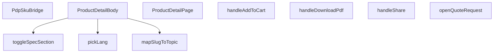

## Genel Bakış
Bu modül, bir e-ticaret uygulamasının ürün detay sayfasının ana görünümünü ve kullanıcı etkileşimlerini yöneten React bileşenlerini içerir. Sayfanın render edilmesi, varyant ve SKU seçimlerinin işlenmesi, sepete ekleme, teklif isteme, PDF indirme ve paylaşma gibi temel kullanıcı aksiyonlarını kapsar. Ayrıca, çok dilli içerik desteği ve teknik özellik bölümlerinin gösterilmesi/gizlenmesi gibi yardımcı işlevler sağlar.

## Fonksiyon Grupları
### Ana Sayfa Bileşenleri
Ürün detay sayfasının ana yapısını oluşturan ve alt bileşenleri bir araya getiren üst düzey bileşenlerdir.
- ProductDetailPage, PdpSkuBridge, ProductDetailBody

### Kullanıcı Etkileşimleri
Kullanıcının ürün sayfasında gerçekleştirebileceği aksiyonları (sepete ekleme, teklif isteme, dosya indirme, paylaşma) ve arayüz durumlarını (bölüm açma/kapama) yönetir.
- handleAddToCart, openQuoteRequest, handleDownloadPdf, handleShare, toggleSpecSection

### Yardımcı ve Dönüştürücü Fonksiyonlar
Çok dilli metin seçimi ve URL slug'larından konu başlıklarına eşleme gibi veri dönüştürme ve yardımcı işlemleri gerçekleştirir.
- pickLang, mapSlugToTopic

---

## AXIOMS – Mimari Varsayımlar
- Bu modül davranışsal mantık içermez (salt veri / konfigürasyon / tip tanımı).
- [Aksiyom 1]: Modülün dışa açtığı yapı (anahtar kümesi / şema) bir sözleşmedir; tüketiciler bu sabit yapıya bağlıdır — kırıcı değişiklik tüm tüketicileri etkiler.
- [Aksiyom 2]: Bir öğe ekleme/çıkarma yapısal-uyumlu olmalı; ilgili tipler ve seçiciler aynı commit'te güncel tutulmalıdır.

---

## FONKSİYON DETAYLARI

### pickLang
**Ne yapar**: Çok dilli metin nesnesinden (`LocalizedText`) istenen dile ait değeri seçer. Dil bulunamadığında Türkçe, o da yoksa İngilizce değere geri döner; hiçbiri yoksa `null` döndürür.

**Nasıl yapar**: Önce `value` falsy ise doğrudan `null` döner. Ardından `lang` parametresi `'en'` ise `value.en`, değilse `value.tr` değerini `preferred` değişkenine atar. Son olarak `preferred || value.tr || value.en || null` zinciriyle tercih edilen değerden null/undefined olmayan ilk değeri döndürür.

**Parametreler**:
- `value`: `LocalizedText` — Çok dilli metin nesnesi. `en` ve `tr` alanlarına sahip nesne tipi.
- `lang`: `string` — İstenen dil kodu. `'en'` veya `'tr'` gibi değerler alır.

**Dönüş**: `string | null` — Seçilen dildeki metin değeri; hiçbir dilde metin bulunamazsa `null`.

### ProductDetailBody
**Ne yapar**: Geliştirildi ancak detay üretilemedi.

### toggleSpecSection
**Ne yapar**: Geliştirildi ancak detay üretilemedi.

### handleAddToCart
**Ne yapar**: Geliştirildi ancak detay üretilemedi.

### openQuoteRequest
**Ne yapar**: Geliştirildi ancak detay üretilemedi.

### handleDownloadPdf
**Ne yapar**: Geliştirildi ancak detay üretilemedi.

### handleShare
**Ne yapar**: Geliştirildi ancak detay üretilemedi.

### mapSlugToTopic
**Ne yapar**: Geliştirildi ancak detay üretilemedi.

### PdpSkuBridge
**Ne yapar**: Geliştirildi ancak detay üretilemedi.

### ProductDetailPage
**Ne yapar**: Geliştirildi ancak detay üretilemedi.

---

## İTHALATLAR (IMPORTS)
- import: ../../components/HVACIcons::BrandIcon
- import: ../../components/ImageGallery::ImageGallery
- import: ../../components/Seo::Seo
- import: ../../components/product/ProductSmartInference::ProductSmartInference
- import: ../../components/products/FamilyCard::FamilyCard
- import: ../../components/products/RichTextRenderer::RichTextRenderer
- import: ../../components/products/VariantSelector::VARIANT_PILL_MAX
- import: ../../components/products/VariantSelector::VariantSelector
- import: ../../components/products::AddToProjectModal
- import: ../../components/quotes/QuoteRequestModal::QuoteRequestModal
- import: ../../config/siteUrl::SITE_URL
- import: ../../contexts/CategoryContext::useCategories
- import: ../../hooks/useAuth::useAuth
- import: ../../hooks/useCartHook::useCart
- import: ../../hooks/useFavorites::useFavorites
- import: ../../hooks/useLocalizedRoutes::useLocalizedRoutes
- import: ../../hooks/useProjectLists::useProjectLists
- import: ../../i18n/I18nProvider::useI18n
- import: ../../i18n/format::formatCurrency
- import: ../../lib/data/selectVariant::selectVariant
- import: ../../lib/images/productImage::resolveProductImageUrl
- import: ../../lib/images/productImage::storagePathToUrl
- import: ../../lib/services/family.service::getFamiliesEnriched
- import: ../../lib/services/family.service::type { FamilyDetail, FamilyVariant }
- import: ../../lib/services/product.service::getProductById
- import: ../../lib/supabase/client::supabaseBrowserClient
- import: ../../types/db-rows::type { CategoryMetadata }
- import: ../../types/ui-models::type { FamilyListItem,Product }
- import: ../../utils/categoryHelpers::getCategoryDisplayName
- import: ../../utils/categoryHelpers::getLocalizedCategorySlug
- import: ../../utils/routes::Routes
- import: ../../utils/routes::localizedHref
- import: ../../utils/specLabel::specFieldLabel
- import: ../../utils/specLabel::specGroupLabel
- import: next/link::Link
- import: next/navigation::usePathname
- import: next/navigation::useRouter
- import: next/navigation::useSearchParams
- import: next::type { Route }
- import: react::React
- import: react::Suspense
- import: react::useCallback
- import: react::useEffect
- import: react::useMemo
- import: react::useRef
- import: react::useState
- import: sonner::toast

---

## INTERFACES

### ProductDetailPageProps
F5-B W2.2 — PDP artık AİLE kanoniktir. Veri modeli: `family` (product_families) + `variants` (aktif varyantlar, get_family_detail RPC'sinden dil çözülmüş olarak gelir). Seçili varyant `?sku=` arama parametresiyle taşınır; yoksa ilk varyant seçilidir. Sepet/PDF/proje gibi EYLEMLER tam `Product` satır
- `family: FamilyDetail['family'] | null`
- `variants: FamilyVariant[]`
- `priceTaxIncluded?: boolean | null`

### ProductDetailBodyProps extends ProductDetailPageProps
- `selectedSku: string | null`

---

## TYPE ALIASES

### LocalizedText
```typescript
type LocalizedText = { tr?: string | null; en?: string | null } | null
```

---

## AST POINTERS

### [N1_NASIL] AST Pointer: ProductDetailPageView.tsx::pickLang
- **params**: `value` (LocalizedText), `lang` (string)
- **ic_degiskenler**:
  - `value` — Çok dilli metin nesnesi (LocalizedText tipinde); null kontrolü yapılır
  - `lang` — Tercih edilen dil kodu ('en' veya 'tr')
  - `preferred` — value.en veya value.tr'den lang parametresine göre seçilen tercih edilen metin
- **Dönüş**: `string | null` — Tercih edilen dilde metin; bulunamazsa tr, o da yoksa en, hiçbiri yoksa null

### [N2_NASIL] AST Pointer: ProductDetailPageView.tsx::ProductDetailBody
- **params**: `family`, `variants`, `selectedSku` (skuParam olarak atanır), `priceTaxIncluded` (varsayılan: null)
- **ic_degiskenler**:
  - `skuParam` — selectedSku parametresinin atanmış hali
  - `variantSelection` — Varyant seçim durumu; kind özelliği 'stale' kontrolü yapılır
  - `openSpecSections` — Açık olan teknik özellik bölümlerinin key'lerini tutan state dizisi
  - `actionProduct` — Seçili varyantın ürün verisi; getProductById ile yüklenir
  - `relatedFamilies` — İlgili ailelerin listesi; getFamiliesEnriched ile yüklenir
  - `isNavSticky` — Sticky navigasyonun aktif olup olmadığını gösteren state
  - `activeSection` — Scroll spy ile belirlenen aktif bölümün id'si
  - `quoteOpen` — Teklif talebi modalının açık olup olmadığını gösteren state
  - `isGeneratingPdf` — PDF oluşturulma sürecinin devam edip etmediğini gösteren state
  - `selectedVariant` — Seçili varyant nesnesi; images, sku, technical_specs, price özellikleri kullanılır
  - `selectedVariantId` — Seçili varyantın id'si; useEffect bağımlılığı
  - `relatedCategoryId` — İlgili kategori id'si; useEffect bağımlılığı
  - `mainCategory` — Ana kategori nesmesi; categories.find ile family.category_id kullanılarak bulunur
  - `subCategory` — Alt kategori nesnesi; categories.find ile family.subcategory_id kullanılarak bulunur
  - `galleryImages` — Galeri görselleri dizisi; selectedVariant.images veya fallback olarak variants'ten alınır
  - `hasMultipleVariants` — Birden fazla varyant olup olmadığını gösteren boolean
  - `variantLabel` — Seçili varyantın etiketi
  - `metaDesc` — Ürün meta açıklaması
  - `categories` — Kategori listesi
  - `supabase` — Supabase istemcisi
  - `router` — Next.js router nesnesi
  - `pathname` — Mevcut URL path'i
  - `t` — Çeviri fonksiyonu
  - `lang` — Mevcut dil kodu
  - `user` — Giriş yapmış kullanıcı nesnesi; null kontrolü yapılır
  - `navTriggerRef` — Sticky nav tetikleme elemanının ref'i
  - `sectionRefs` — Bölüm elemanlarının ref'lerini tutan nesne; current[sectionId] erişimi
  - `quoteMode` — Teklif modu aktif mi
  - `ownFamilyId` — family.id; related families filtrelemesinde kullanılır
  - `cancelled` — useEffect cleanup flag'i; async istek iptali için
  - `next` — URLSearchParams nesnesi; window.location.search'ten oluşturulur
  - `qs` — URLSearchParams.toString() sonucu
  - `triggerTop` — navTriggerRef.current.offsetTop değeri
  - `scrollY` — window.scrollY değeri
  - `navEl` — 'pdp-sticky-nav' id'li DOM elemanı
  - `headerOffset` — navEl.offsetHeight + 120 veya 200 (fallback)
  - `scrollPosition` — window.scrollY + headerOffset
  - `sectionOffsets` — sectionRefs.current'ten hesaplanan bölüm offset'leri dizisi
  - `element` — scrollToSection içinde sectionRefs.current[sectionId]
  - `currentNavHeight` — navEl.offsetHeight veya 0
  - `extraGap` — 84 sabit değeri
  - `y` — scrollTo hedef pozisyonu
  - `source` — Galeri görselleri kaynağı; own.length > 0 kontrolü ile seçilir
  - `coverUrl` — PDF kapağı için görsel URL'si; storagePathToUrl veya resolveProductImageUrl
  - `stack` — sessionStorage'dan okunan navigasyon yığını
  - `lastSafeStop` — stack dizisinin son elemanı
  - `handleScroll` — Scroll event handler'ı; isNavSticky state'ini günceller
  - `handleScrollSpy` — Scroll spy handler'ı; activeSection state'ini günceller
  - `handleSelectVariant` — Varyant seçim handler'ı; URL'deki sku parametresini günceller
  - `scrollToSection` — Belirli bir bölüme smooth scroll yapar
  - `getProductById` — Ürün getirme fonksiyonu; supabase ve selectedVariantId kullanır
  - `getFamiliesEnriched` — Zenginleştirilmiş aile listesi getirme fonksiyonu
  - `storagePathToUrl` — Depolama yolunu URL'ye dönüştürür
  - `resolveProductImageUrl` — Ürün görsel URL'sini çözer
  - `generateProductDatasheet` — PDF veri sayfası oluşturma fonksiyonu (lazy import)
  - `translateSpecKey` — Teknik özellik key çeviri fonksiyonu
  - `groupTechnicalSpecs` — Teknik özellikleri gruplandırır
  - `specGroupLabel` — Grup etiketi oluşturur
  - `specFieldLabel` — Alan etiketi oluşturur
  - `formatSpecValue` — Özellik değerini formatlar
  - `formatCurrency` — Para birimi formatlar
  - `getCategoryDisplayName` — Kategori görünen adını alır
  - `getLocalizedCategorySlug` — Yerelleştirilmiş kategori slug'ını alır
  - `LocalizedRoutes` — Yerelleştirilmiş rotalar nesnesi
  - `Routes` — Rota tanımları nesnesi
  - `localizedHref` — Yerelleştirilmiş href oluşturur
  - `SPEC_SORT_ORDER` — Özellik sıralama sırası sabiti
  - `toast` — Bildirim gösterme fonksiyonu
- **Dönüş**: JSX elementi (React.FC)

### [N3_NASIL] AST Pointer: ProductDetailPageView.tsx::toggleSpecSection
- **params**: `sectionKey` (string)
- **ic_degiskenler**:
  - `sectionKey` — Açılıp kapatılacak teknik özellik bölümünün key değeri
  - `prev` — openSpecSections state'inin önceki değeri (setState callback)
- **Dönüş**: yok — openSpecSections state'ini günceller (yan etki)

### [N4_NASIL] AST Pointer: ProductDetailPageView.tsx::handleAddToCart
- **params**: (parametre yok)
- **ic_degiskenler**: (gövde tanımlanmamış)
- **Dönüş**: yok

### [N5_NASIL] AST Pointer: ProductDetailPageView.tsx::openQuoteRequest
- **params**: (parametre yok)
- **ic_degiskenler**:
  - `user` — Giriş yapmış kullanıcı nesnesi; null kontrolü yapılır
  - `t` — Çeviri fonksiyonu
  - `router` — Next.js router nesnesi
  - `pathname` — Mevcut URL path'i
  - `quoteOpen` — Teklif modalı açık state'i (setQuoteOpen ile güncellenir)
- **Dönüş**: yok — Kullanıcı yoksa login sayfasına yönlendirir, varsa quoteOpen state'ini true yapar

### [N6_NASIL] AST Pointer: ProductDetailPageView.tsx::handleDownloadPdf
- **params**: (parametre yok, async fonksiyon)
- **ic_degiskenler**:
  - `actionProduct` — Ürün verisi nesnesi; null kontrolü yapılır
  - `isGeneratingPdf` — PDF oluşturma durumu; true ise fonksiyon erken döner
  - `setIsGeneratingPdf` — PDF oluşturma state setter'ı
  - `generateProductDatasheet` — Lazy import ile yüklenen PDF oluşturma fonksiyonu
  - `galleryImages` — Galeri görselleri dizisi; [0] indeksi kapağı belirler
  - `storagePathToUrl` — Depolama yolunu URL'ye dönüştüren fonksiyon
  - `resolveProductImageUrl` — Ürün görsel URL'sini çözümleyen fonksiyon
  - `translateSpecKey` — Teknik özellik key çeviri fonksiyonu
  - `lang` — Mevcut dil kodu
  - `t` — Çeviri fonksiyonu
  - `toast` — Bildirim gösterme fonksiyonu
  - `coverUrl` — Kapağı görsel URL'si; galleryImages[0].path veya resolveProductImageUrl
  - `error` — Yakalanan hata nesnesi (catch bloğu)
- **Dönüş**: `Promise<void>` — PDF dosyası üretir (yan etki)

### [N7_NASIL] AST Pointer: ProductDetailPageView.tsx::handleShare
- **params**: (parametre yok, async fonksiyon)
- **ic_degiskenler**:
  - `family` — Ürün ailesi nesnesi; name ve brand_name özellikleri kullanılır
  - `t` — Çeviri fonksiyonu
  - `navigator` — Tarayıcı navigator API'si; share ve clipboard özellikleri kontrol edilir
  - `err` — Yakalanan hata nesnesi (catch bloğu); AbortError kontrolü yapılır
- **Dönüş**: `Promise<void>` — Paylaşım dialogu açar veya linki kopyalar (yan etki)

### [N8_NASIL] AST Pointer: ProductDetailPageView.tsx::mapSlugToTopic
- **params**: `slug` (string | null | undefined, opsiyonel)
- **ic_degiskenler**:
  - `slug` — URL slug değeri; null/undefined kontrolü yapılır
  - `s` — slug.toLowerCase() sonucu; küçük harfe dönüştürülmüş slug
- **Dönüş**: `string | null` — Eşleşen topic string'i ('hava-perdesi', 'jet-fan', 'hrv') veya null

### [N9_NASIL] AST Pointer: ProductDetailPageView.tsx::PdpSkuBridge
- **params**: `props`
- **ic_degiskenler**:
  - `props` — ProductDetailPageProps tipinde bileşen props'ları
  - `searchParams` — useSearchParams hook'undan dönen URL search params nesnesi
- **Dönüş**: JSX elementi — ProductDetailBody bileşeni; selectedSku prop'u searchParams.get('sku') ile sağlanır

### [N10_NASIL] AST Pointer: ProductDetailPageView.tsx::ProductDetailPage
- **params**: `props`
- **ic_degiskenler**:
  - `props` — ProductDetailPageProps tipinde bileşen props'ları
- **Dönüş**: JSX elementi — Suspense boundary içinde PdpSkuBridge bileşeni; fallback olarak selectedSku={null} ile ProductDetailBody render edilir

---


## MERMAID CALL GRAPH


## NODE ID STANDARD

  file: ProductDetailPageView.tsx
  function: ProductDetailPageView.tsx::pickLang
  function: ProductDetailPageView.tsx::ProductDetailBody
  function: ProductDetailPageView.tsx::toggleSpecSection
  function: ProductDetailPageView.tsx::handleAddToCart
  function: ProductDetailPageView.tsx::openQuoteRequest
  function: ProductDetailPageView.tsx::handleDownloadPdf
  function: ProductDetailPageView.tsx::handleShare
  function: ProductDetailPageView.tsx::mapSlugToTopic
  function: ProductDetailPageView.tsx::PdpSkuBridge
  function: ProductDetailPageView.tsx::ProductDetailPage

---

## DISA AKTARILANLAR (EXPORTS)
  export: PdpSkuBridge
  export: ProductDetailBody
  export: ProductDetailPage
  export: ProductDetailPageProps
  export: pickLang

---

## BILEŞIM (CONTAINS)
  contains: ProductDetailPageProps

---

## STİL TOKENLERİ

### Arbitrary Değerler (token'a geçirilmemiş)
Yok — tüm stiller token'a geçirilmiş. ✅

### Kullanılan Token'lar (zaten token'a geçirilmiş)
- `tracking-hvac-normal`, `tracking-hvac-snug`

### Tailwind Sınıf Özeti
- **Renkler:** `bg-air-blue/30`, `bg-gold-accent/10`, `bg-industrial-gray`, `bg-primary-navy`, `bg-red-50`, `bg-secondary-blue`, `bg-slate-100`, `bg-slate-50`, `bg-slate-50/30`, `bg-slate-900`, `bg-success-green`, `bg-success-green/10`, `bg-warning-orange`, `bg-warning-orange/10`, `bg-white`
- **Layout:** `absolute`, `backdrop-blur-2`, `backdrop-blur-md`, `backdrop-blur-xl`, `col-span-full`, `fixed`, `flex`, `flex-1`, `flex-col`, `flex-shrink-0`, `flex-wrap`, `gap-1.5`, `gap-2`, `gap-2.5`, `gap-4`
- **Varyant/Responsive:** `:`, `active:`, `disabled:`, `group-hover:`, `hover:`, `last:`, `lg:`, `md:`, `sm:`, `xl:` önekleri
- **Yardımcı Sınıflar:** `${activeSection`, `${inStock`, `${isNavSticky`, `${isOpen`, `${isWishlisted`, `${section.bgClass`, `:`, `===`, `active:scale-95`, `active:scale-98`, `animate-in`, `animate-ping`, `animate-pulse`, `animate-pulse-subtle`, `animate-spin`