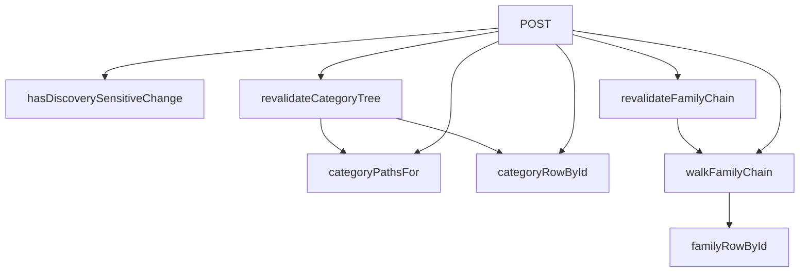

## Genel Bakış

Bu modül, Supabase veritabanından gelen webhook isteklerini işleyen bir Next.js API route'u olarak çalışır. Veritabanında gerçekleşen değişiklikleri dinler ve bu değişikliklerin "keşif" (discovery) sayfalarını etkileyip etkilemediğini tespit ederek ilgili sayfaların ve tag'lerin önbelleğini yeniden doğrular. Aile zincirleri ve kategori ağaçları olmak üzere iki ana veri yapısı üzerinde revalidasyon işlemleri gerçekleştirir.

## Fonksiyon Grupları

### Webhook İşleme
Supabase'den gelen POST isteklerini yakalar, payload'u ayrıştırır ve değişiklik türüne göre uygun revalidasyon akışını tetikler.
- POST

### Değişiklik Algılama
Yeni ve eski kayıt değerlerini karşılaştırarak keşif sayfalarını etkileyen bir değişiklik olup olmadığını belirler. Bu kontrol, gereksiz revalidasyon işlemlerinin önüne geçer.
- hasDiscoverySensitiveChange

### Aile Zinciri Yönetimi
Aile kayıtlarını ve bunların atasal zincirini takip ederek ilgili tüm sayfa yollarını ve tag'leri toplar. Zincir boyunca yürüyerek slug listesi oluşturur ve bu yolların önbelleğini yeniden doğrular.
- familyRowById, walkFamilyChain, revalidateFamilyChain

### Kategori Ağacı Yönetimi
Kategori kayıtlarını ve üst kategorileri takip ederek URL yollarını üretir. Kategori ağacını aşağı doğru yürüyerek tüm ilgili sayfaların önbelleğini yeniden doğrular.
- categoryRowById, categoryPathsFor, revalidateCategoryTree

---

## AXIOMS – Mimari Varsayımlar

[Aksiyom 1]: Eğer `PRODUCT_DISCOVERY_SENSITIVE_FIELDS` sabiti tanımlı değilse, `hasDiscoverySensitiveChange` fonksiyonu hangi alanların "keşif hassası" olduğunu belirleyemez ve değişiklik tespiti yapılamaz.

[Aksiyom 2]: Eğer `familyId` undefined ise, `familyRowById` null döndürür; `walkFamilyChain` ve `revalidateFamilyChain` fonksiyonları da bu undefined değeri zincir yürümesinde başlangıç noktası olarak kullanamaz.

[Aksiyom 3]: Eğer `walkFamilyChain` fonksiyonunda truncation gerçekleşirse, döndürülen `slugs` dizisi eksik olur ve `revalidateFamilyChain` tarafından üretilen `paths` ile `tags` listesi tam olmayabilir.

[Aksiyom 4]: Eğer `categoryRowById` belirtilen `id` için null döndürürse, `revalidateCategoryTree` fonksiyonu geçerli bir kategori ağacı üzerinde çalışamaz.

[Aksiyom 5]: Eğer `categoryPathsFor` fonksiyonuna `parent` null olarak verilirse, bu kök kategori durumunu temsil eder ve yollar buna göre üretilir.

[Aksiyom 6]: Eğer `POST` fonksiyonuna gelen `request` geçerli bir Supabase webhook payload'ı içermiyorsa, webhook işleme gerçekleştirilemez.

---

## FONKSİYON DETAYLARI

### hasDiscoverySensitiveChange
**Ne yapar**: İki kayıt arasındaki keşif (discovery) hassas alanlardaki değişiklikleri kontrol ederek, ürünün keşif yüzeyinde görünürlüğünü etkileyip etkilemediğini belirler. Boolean değer döndürür; true ise keşif önbelleğinin tazelenmesi gerektiğini gösterir.

**Nasıl yapar**: `PRODUCT_DISCOVERY_SENSITIVE_FIELDS` sabitinde tanımlı alan listesi üzerinde `Array.some()` ile döner. Her alan için `record[field]` ile `oldRecord[field]` değerlerini strict eşitsizlik (`!==`) ile karşılaştırır. Herhangi birinde fark varsa true döner; tümü aynıysa false döner.

**Parametreler**:
- `record`: `Record<string, unknown>` — Güncel kayıt (yeni durum). Alan adları anahtar, değerler unknown tipindedir.
- `oldRecord`: `Record<string, unknown>` — Eski kayıt (önceki durum). Alan adları anahtar, değerler unknown tipindedir.

**Dönüş**: `boolean` — Keşif hassas alanlarından herhangi birinde değişiklik varsa `true`, yoksa `false`.

### familyRowById
**Ne yapar**: Geliştirildi ancak detay üretilemedi.

### walkFamilyChain
**Ne yapar**: Geliştirildi ancak detay üretilemedi.

### revalidateFamilyChain
**Ne yapar**: Geliştirildi ancak detay üretilemedi.

### categoryPathsFor
**Ne yapar**: Geliştirildi ancak detay üretilemedi.

### categoryRowById
**Ne yapar**: Geliştirildi ancak detay üretilemedi.

### revalidateCategoryTree
**Ne yapar**: Geliştirildi ancak detay üretilemedi.

### POST
**Ne yapar**: Geliştirildi ancak detay üretilemedi.

---

## İTHALATLAR (IMPORTS)
- import: @/lib/supabase/static::supabaseStaticClient
- import: @/utils/categoryHelpers::getLocalizedCategorySlug
- import: next/cache::revalidatePath
- import: next/cache::revalidateTag
- import: next/server::NextRequest
- import: next/server::NextResponse

---

## INTERFACES

### SupabaseWebhookPayload
- `type: 'INSERT' | 'UPDATE' | 'DELETE'`
- `table: string`
- `schema: string`
- `record: Record<string, unknown> | null`
- `old_record: Record<string, unknown> | null`

### FamilyChainRow
- `id: string`
- `slug: string | null`
- `parent_family_id: string | null`

---

## TYPE ALIASES

### CategoryRow
Kategori yolu çözmek için gereken minimum satır (slug + metadata).
```typescript
type CategoryRow = { id?: string; slug: string | null; metadata?: unknown; parent_id?: string | null }
```

---

## SABİTLER
- **PRODUCT_DISCOVERY_SENSITIVE_FIELDS** (as_expression) — `[
  'status',
  'family_id',
  'category_id',
  'subcategory_id',
  'del...`

---

## AST POINTERS

### [N1_NASIL] AST Pointer: src/app/api/webhook/supabase/route.ts::hasDiscoverySensitiveChange
- **params**: `record` (Record<string, unknown>), `oldRecord` (Record<string, unknown>)
- **ic_degiskenler**:
  - `PRODUCT_DISCOVERY_SENSITIVE_FIELDS` — modül seviyesinde tanımlı sabit dizi; `.some()` ile her elemanı (`field`) iterasyona sokar
  - `field` — `.some()` callback parametresi; `record[field]` ile `oldRecord[field]` değerlerini karşılaştırır
- **Dönüş**: boolean — hassas alanlardan herhangi birinde `record` ile `oldRecord` arasında fark varsa `true`

### [N2_NASIL] AST Pointer: src/app/api/webhook/supabase/route.ts::familyRowById
- **params**: `familyId` (string | undefined)
- **ic_degiskenler**:
  - `data` — `supabase.from('product_families').select('id, slug, parent_family_id').eq('id', familyId).single()` sorgusunun dönüşünden destructure edilen alan; tek satır `FamilyChainRow` veya `null`
- **Dönüş**: FamilyChainRow | null — `familyId` falsy ise doğrudan `null`, sorgu sonucu yoksa `null`, aksi hâlde `data`

### [N3_NASIL] AST Pointer: src/app/api/webhook/supabase/route.ts::walkFamilyChain
- **params**: `startId` (string | undefined)
- **ic_degiskenler**:
  - `slugs` — toplanan slug'ları tutan `string[]`; döngü içinde `row.slug` truthy ise push edilir
  - `seen` — ziyaret edilen id'leri takip eden `Set<string>`; döngü tespiti için kullanılır
  - `currentId` — döngüde yürünmekte olan aile id'si; her iterasyonda `row.parent_family_id ?? undefined` ile güncellenir
  - `hops` — gerçekleştirilen adım sayısı; `MAX_FAMILY_CHAIN_HOPS` değerine ulaşıldığında döngü kırılır
  - `truncated` — `hops` sınırına ulaşma veya döngü tespiti durumunda `true` yapılır
  - `row` — `familyRowById(currentId)` çağrısının sonucu; `null` ise döngü kırılır
  - `MAX_FAMILY_CHAIN_HOPS` — modül seviyesinde tanımlı sabit; `hops >= MAX_FAMILY_CHAIN_HOPS` kontrolünde kullanılır
- **Dönüş**: `{ slugs: string[]; truncated: boolean }` — `slugs` içindeki tekrarlar `new Set` ile elenir

### [N4_NASIL] AST Pointer: src/app/api/webhook/supabase/route.ts::revalidateFamilyChain
- **params**: `familyId` (string | undefined)
- **ic_degiskenler**:
  - `slugs` — `walkFamilyChain(familyId)` dönüşünden destructure edilen slug dizisi
  - `truncated` — `walkFamilyChain(familyId)` dönüşünden destructure edilen kesilme bayrağı
  - `paths` — `revalidatePath` çağrılan yolları toplayan `string[]`
  - `tags` — `revalidateTag` çağrılan etiketleri toplayan `string[]`
  - `slug` — dış `for` döngüsü iteratörü; `slugs` dizisinin her elemanı
  - `lang` — iç `for` döngüsü iteratörü; `['tr', 'en']` sabit dizisi üzerinde yürür
  - `p` — her `(slug, lang)` çifti için oluşturulan yol string'i: `` `/${lang}/products/${slug}` ``
  - `familyTag` — modül seviyesinde tanımlı fonksiyon; `familyTag(slug)` ile tag üretir
- **Dönüş**: `{ paths: string[]; tags: string[]; truncated: boolean }`

### [N5_NASIL] AST Pointer: src/app/api/webhook/supabase/route.ts::categoryPathsFor
- **params**: `category` (CategoryRow), `parent` (CategoryRow | null)
- **ic_degiskenler**:
  - `paths` — oluşturulan yolları toplayan `Set<string>`
  - `canonical` — `category.slug ?? ''`; slug yoksa boş string
  - `lang` — `for` döngüsü iteratörü; `['tr', 'en']` sabit dizisi üzerinde yürür
  - `own` — `getLocalizedCategorySlug(category, lang) || canonical`; localize edilmiş slug, yoksa kanonik slug
  - `parentSlug` — `parent` truthy olduğunda `getLocalizedCategorySlug(parent, lang) || parent.slug || ''`; üst kategorinin localize edilmiş slug'ı
- **Dönüş**: string[] — `paths` Set'inden spread ile diziye dönüştürülür; kanonik slug varsa `/tr/category/{canonical}` ve `/en/category/{canonical}` her hâlükârda eklenir

### [N6_NASIL] AST Pointer: src/app/api/webhook/supabase/route.ts::categoryRowById
- **params**: `id` (string | undefined)
- **ic_degiskenler**:
  - `data` — `supabase.from('categories').select('id, slug, metadata, parent_id').eq('id', id).single()` sorgusunun dönüşünden destructure edilen alan; tek satır `CategoryRow` veya `null`
- **Dönüş**: CategoryRow | null — `id` falsy ise doğrudan `null`, sorgu sonucu yoksa `null`, aksi hâlde `data`

### [N7_NASIL] AST Pointer: src/app/api/webhook/supabase/route.ts::revalidateCategoryTree
- **params**: `category` (CategoryRow)
- **ic_degiskenler**:
  - `parent` — `categoryRowById(category.parent_id ?? undefined)` çağrısının sonucu; üst kategori satırı veya `null`
  - `paths` — `categoryPathsFor(category, parent)` çağrısının sonucu; oluşturulmuş yol dizisi
  - `p` — `for` döngüsü iteratörü; `paths` dizisinin her elemanı üzerinde `revalidatePath(p)` çağrılır
- **Dönüş**: string[] — `paths` dizisi; revalidate edilen tüm yolları içerir

### [N8_NASIL] AST Pointer: src/app/api/webhook/supabase/route.ts::POST
- **params**: `request` (NextRequest)
- **ic_degiskenler**: Gövde verilmemiş; analiz edilecek değişken yok
- **Dönüş**: yok (imzada dönüş tipi belirtilmemiş)

---


## MERMAID CALL GRAPH


## NODE ID STANDARD

  file: route.ts
  function: route.ts::hasDiscoverySensitiveChange
  function: route.ts::familyRowById
  function: route.ts::walkFamilyChain
  function: route.ts::revalidateFamilyChain
  function: route.ts::categoryPathsFor
  function: route.ts::categoryRowById
  function: route.ts::revalidateCategoryTree
  function: route.ts::POST

---

## DISA AKTARILANLAR (EXPORTS)
  export: POST
  export: categoryPathsFor
  export: categoryRowById
  export: familyRowById
  export: hasDiscoverySensitiveChange
  export: revalidateCategoryTree
  export: revalidateFamilyChain
  export: walkFamilyChain