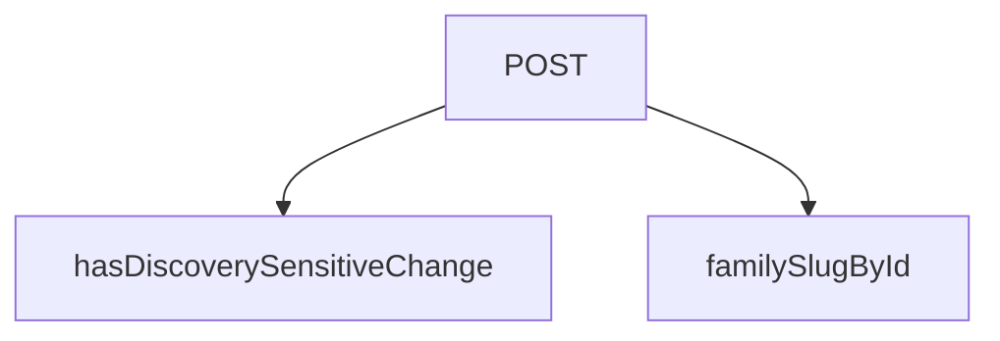

## Genel Bakış

Bu modül, Supabase veritabanında gerçekleşen veri değişimlerini (INSERT, UPDATE, DELETE) yakalayan bir webhook API noktasıdır. Gelen istekleri HMAC-SHA256 imza ile doğruladıktan sonra, olay türünü ve etkilenen kaydı analiz ederek Next.js uygulamasının ilgili sayfa önbelleklerini yenilemesini tetikler. Böylece veritabanındaki değişikliklerin kullanıcı arayüzüne anlık olarak yansımasını sağlar.

## Fonksiyon Grupları

### Webhook API Giriş Noktası
Modülün tek dışa açık HTTP endpoint'idir. Supabase'den gelen POST isteklerini alır, HMAC-SHA256 imza doğrulamasını gerçekleştirir, payload'daki veri değişimini analiz eder ve Next.js revalidation mekanizmasını tetikleyerek önbellek yenileme sürecini başlatır.

- POST

### Değişim Analizi Yardımcı Fonksiyonları
POST işleyicisi tarafından iç çağrım yoluyla kullanılan yardımcı fonksiyonlardır. Bir kaydın keşif (discovery) süreçlerini etkileyip etkilemediğini belirlemek ve aile slug'ını çözümlemek gibi destekleyici analiz işlemlerini yürütürler.

- hasDiscoverySensitiveChange, familySlugById

---

## AXIOMS – Mimari Varsayımlar
- Bu modül davranışsal mantık içermez (salt veri / konfigürasyon / tip tanımı).
- [Aksiyom 1]: Modülün dışa açtığı yapı (anahtar kümesi / şema) bir sözleşmedir; tüketiciler bu sabit yapıya bağlıdır — kırıcı değişiklik tüm tüketicileri etkiler.
- [Aksiyom 2]: Bir öğe ekleme/çıkarma yapısal-uyumlu olmalı; ilgili tipler ve seçiciler aynı commit'te güncel tutulmalıdır.

---

## FONKSİYON DETAYLARI

### hasDiscoverySensitiveChange
**Ne yapar**: Verilen bir ürün kaydının (`record`) ve eski hali (`oldRecord`) karşılaştırılarak, keşif (discovery) süreçlerini etkileyebilecek duyarlı alanların (örn: status, family_id, category_id) değişip değişmediğini kontrol eder.
**Nasıl yapar**: `PRODUCT_DISCOVERY_SENSITIVE_FIELDS` adlı sabit bir alan listesi üzerinde `Array.some()` metodunu kullanarak, herhangi bir duyarlı alanın yeni ve eski kayıt arasındaki değerinin farklı olup olmadığını (değişim olup olmadığını) belirler. Herhangi bir fark bulunursa `true` döner.
**Parametreler**:
- `record`: `Record<string, unknown>` — Karşılaştırmaya tabi tutulacak güncel (yeni) ürün kaydı.
- `oldRecord`: `Record<string, unknown>` — Karşılaştırma için kullanılacak önceki (eski) ürün kaydı.
**Dönüş**: `boolean` — Duyarlı herhangi bir alanda fark varsa `true`, aksi halde `false`.

### familySlugById

**Ne yapar**: Verilen `familyId` ile `product_families` tablosundan ilgili ürün ailesinin slug'ını getirir. Bu slug, ürün detay sayfasının (PDP) kanonik URL yolunu (`/[lang]/products/[family-slug]`) oluşturmak için kullanılır. Üç farklı tablodaki (`products`, `inventory_movements`, `product_prices`) yenileme mantığı aynı slug çözümlemesini gerektirdiğinden, çözüm tek bir fonksiyonda merkezileştirilmiştir.

**Nasıl yapar**: Fonksiyon önce `familyId` parametresinin tanımlı olup olmadığını kontrol eder; tanımlı değilse doğrudan `null` döner. Tanımlıysa Supabase istemcisi (`supabase`) üzerinden `product_families` tablosuna bir `select('slug')` sorgusu gönderir, `eq('id', familyId)` ile filtreleme yapar ve `.single()` ile tek bir satır bekler. Dönen `data` nesnesinden `slug` alanı çıkarılır; eğer `data`本身`null`/`undefined` ise veya `slug` alanı mevcut değilse `null` döner. Bu tekil sorgulama yaklaşımı, aile slug'ının her zaman benzersiz ve tek olduğunu garantiler.

**Parametreler**:
- `familyId`: `string | undefined` — Ürün ailesinin benzersiz tanımlayıcısı. `undefined` geldiğinde fonksiyon erken dönüş yapar ve veritabanı sorgusu gönderilmez.

**Dönüş**: `Promise<string | null>` — Aile slug'ı başarıyla bulunursa ilgili string değeri, bulunamazsa veya parametre geçersizse `null` değeri döner.

### POST
**Ne yapar**: Supabase veritabanından gelen webhook isteklerini alır, tablo bazlı mantıkla ilgili sayfaları ve önbellek tag'lerini yeniden doğrulama (revalidation) işlemine tabi tutar. Bu sayede veritabanındaki değişikliklerin Next.js uygulamasına anlık olarak yansımasını sağlar.

**Nasıl yapar**: Fonksiyon, gelen HTTP POST isteğinin JSON gövdesini `SupabaseWebhookPayload` tipine dönüştürür. Önce `x-webhook-secret` başlığını kontrol ederek HMAC/Token doğrulaması yapar; eşleşmezse 401 Unauthorized yanıtı döner. Ardından payload'daki `table`, `type`, `record` ve `old_record` alanlarını çıkarır. `record` veya `old_record` mevcutsa `activeRecord` olarak kullanılır; ikisi de yoksa revalidation yapmadan yanıt döner. PS-042 kararı gereği, `inventory_movements` ve `product_prices` tablolarındaki değişimler keşif (discovery) tag'lerini tetiklemez. `products` tablosunda UPDATE işlemi yapılıyorsa ve hem `record` hem `old_record` mevcutsa `hasDiscoverySensitiveChange` fonksiyonuyla alan-bazlı karşılaştırma yapılarak sadece duyarlı alanlardaki (status, family_id, category_id, subcategory_id, deleted_at) değişikliklerde keşif tag'leri tetiklenir. Tablo tipine göre `revalidatePath` ve `revalidateTag` çağrıları yapılarak ilgili sayfa yolları ve önbellek etiketleri yeniden doğrulanır. Her tablo için farklı mantık uygulanır: `products` tablosunda ürün sayfası, kategori sayfası ve keşif tag'leri; `categories` tablosunda kategori sayfası ve keşif tag'leri; `inventory_movements` tablosunda ürün ve kategori sayfaları ile `variantStockTag` etiketi; `product_families` tablosunda aile etiketi ve keşif tag'leri; `product_prices` tablosunda ise aile kanonik PDP yolu yeniden doğrulanır. İşlem sonunda yeniden doğrulanan yolları, tag'leri ve zaman damgasını içeren JSON yanıtı döner.

**Parametreler**:
- request: NextRequest — Gelen webhook HTTP istek nesnesi. Gövdesinde Supabase'den gelen `SupabaseWebhookPayload` yapısında veri taşır ve `x-webhook-secret` başlığını içerir.

**Dönüş**: NextResponse — Başarılı olduğunda `{ revalidated: boolean, event: { table: string, type: string }, revalidatedPaths: string[], revalidatedTags: string[], discoveryComparisonSkipped: boolean, timestamp: string }` yapısında JSON yanıtı döner. Doğrulama hatası durumunda 401, sunucu hatası durumunda 500 HTTP durum koduyla hata yanıtı döner.

---

## İTHALATLAR (IMPORTS)
- import: @/lib/supabase/static::supabaseStaticClient
- import: next/cache::revalidatePath
- import: next/cache::revalidateTag
- import: next/server::NextRequest
- import: next/server::NextResponse

---

## INTERFACES

### SupabaseWebhookPayload
- `type: 'INSERT' | 'UPDATE' | 'DELETE'`
- `table: string`
- `schema: string`
- `record: Record<string, unknown> | null`
- `old_record: Record<string, unknown> | null`

---

## SABİTLER
- **PRODUCT_DISCOVERY_SENSITIVE_FIELDS** (as_expression) — `[
  'status',
  'family_id',
  'category_id',
  'subcategory_id',
  'del...`

---

## AST POINTERS

### [N1_NASIL] AST Pointer: src\app\api\webhook\supabase\route.ts::hasDiscoverySensitiveChange
- **params**: (record: Record<string, unknown>, oldRecord: Record<string, unknown>)
- **ic_degiskenler**: 
  - `PRODUCT_DISCOVERY_SENSITIVE_FIELDS` — keşif duyarlı alanların listesini tutan sabit, some() ile döngüde kullanılır
- **Dönüş**: boolean (değişiklik varsa true)

### [N2_NASIL] AST Pointer: src\app\api\webhook\supabase\route.ts::familySlugById
- **params**: (familyId: string | undefined)
- **ic_degiskenler**: 
  - `data` — supabase sorgusundan dönen product_families kaydı, `data?.slug` olarak erişilir
- **Dönüş**: Promise<string | null> (aile slug'ı veya null)

### [N3_NASIL] AST Pointer: src\app\api\webhook\supabase\route.ts::POST
- **params**: (request: NextRequest)
- **ic_degiskenler**: 
  - `payload` — request.json() ile parse edilen SupabaseWebhookPayload nesnesi
  - `webhookSecret` — request.headers.get('x-webhook-secret') ile alınan HMAC token
  - `expectedSecret` — process.env.SUPABASE_WEBHOOK_SECRET ile doğrulanan beklenen secret
  - `table` — payload.table (hangi tablo)
  - `type` — payload.type (INSERT/UPDATE/DELETE)
  - `record` — payload.record (yeni/şu anki kayıt)
  - `old_record` — payload.old_record (eski kayıt, UPDATE'lerde gelir)
  - `activeRecord` — record || old_record (var olan aktif kayıt)
  - `tenantId` — activeRecord.tenant_id (kiracının ID'si)
  - `revalidatedPaths` — tazelenen path'lerin string array'i, yanıta eklenir
  - `revalidatedTags` — tazelenen tag'lerin string array'i, yanıta eklenir
  - `discoveryComparisonSkipped` — products UPDATE'inde alan-bazlı karşılaştırmanın atlanıp atlanmadığını gösterir boolean
  - `shouldRevalidateDiscovery` — keşif tag'lerinin tetiklenip tetiklenmeyeceğini belirleyen boolean
  - `familySlug` — familySlugById() çağrısıyla elde edilen ürün ailesinin slug'ı (products/inventory_movements/product_families/Product_prices bloklarında kullanılır)
  - `categoryId` — activeRecord.category_id (ürünün kategori ID'si, products bloğunda kullanılır)
  - `category` — supabase.from('categories').select('slug')...single() ile getirilen kategori nesnesi
  - `categorySlug` — activeRecord.slug (categories tablosunda update edilen kategorinin slug'ı)
  - `productId` — activeRecord.product_id (inventory_movements ve product_prices tablolarında kullanılır)
  - `product` — supabase.from('products').select('family_id, category_id')...single() ile getirilen ürün nesnesi
- **Dönüş**: NextResponse (yanıt JSON'u includes: revalidated, event, revalidatedPaths, revalidatedTags, discoveryComparisonSkipped, timestamp)

---

## MERMAID CALL GRAPH

## NODE ID STANDARD

  file: src\app\api\webhook\supabase\route.ts
  function: src\app\api\webhook\supabase\route.ts::hasDiscoverySensitiveChange
  function: src\app\api\webhook\supabase\route.ts::familySlugById
  function: src\app\api\webhook\supabase\route.ts::POST

---

## DISA AKTARILANLAR (EXPORTS)
  export: POST
  export: familySlugById
  export: hasDiscoverySensitiveChange