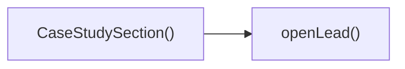

## Genel Bakış
Bu modül, bir case study (örnek çalışma) bölümünü render eden bir React bileşeni ve bu bölümdeki kullanıcı etkileşimlerini yöneten bir yardımcı fonksiyondan oluşur. Bileşen, ilgili içeriği görüntülerken, kullanıcı bir eylem tetiklediğinde openLead fonksiyonunu çağırarak iş akışını devam ettirir.

## Fonksiyon Grupları
### Görüntüleme ve Yerleşim
Bileşenin ana görevi, case study içeriğini sayfada düzenli bir şekilde göstermek ve kullanıcıya sunmaktır.
- CaseStudySection

### Kullanıcı Etkileşimi
Kullanıcı tarafından başlatılan eylemleri yakalayıp gerekli işlemleri gerçekleştiren fonksiyondur; genellikle bir form açma veya yönlendirme gibi işlemleri içerir.
- openLead

---

## AXIOMS – Mimari Varsayımlar
Bu modülün doğru çalışması için React ortamı ve ilgili UI bağımlılıklarının mevcut olması gerekir.

[Aksiyom 1]: Eğer React kütüphanesi yüklü değilse, `CaseStudySection` bileşeni render edilerek hata fırlatır veya boş görüntülenir.  
[Aksiyom 2]: Eğer `CaseStudySection` içindeki case study verileri (örneğin bir context veya prop üzerinden) sağlanmazsa, bileşen boş liste veya hata mesajı gösterir.  
[Aksiyom 3]: Eğer `CaseStudySection` tarafından kullanılan CSS sınıfları veya stiller (module.css, styled-components vb.) bulunamazsa, bileşenin görsel tasarımı bozulur veya eksik görünür.  
[Aksiyom 4]: Eğer `openLead` fonksiyonu çağrıldığında lead modalı veya formunu açacak bir state yönetimi mekanizması (useState, Redux vb.) veya ilgili UI elementi mevcut değilse, fonksiyon hiçbir etkisi üretmez veya çalışma zamanında hata verir.  
[Aksiyom 5]: Eğer `openLead` fonksiyonu tarafından kullanılan dış bağımlılık (örneğin bir modal kütüphanesi veya `window.open` çağrısı) ortamda tanımlı değilse, fonksiyon beklenildiği gibi çalışmaz ve hata fırlatabilir.

---

## FONKSIYON DETAYLARI

### CaseStudySection
**Ne yapar**: Fonksiyonun amacı belgelenmemiştir.  
**Nasıl yapar**: İç mantığı belgelenmemiştir.  
**Parametreler**: Yok  
**Dönüş**: React.FC türünde bir fonksiyonel bileşen döndürür.

### openLead
**Ne yapar**: Fonksiyonun amacı belgelenmemiştir.  
**Nasıl yapar**: İç mantığı belgelenmemiştir.  
**Parametreler**: Yok  
**Dönüş**: Dönüş tipi void veya bilinmiyor; fonksiyon bir değer döndürmez.

---

## AST POINTERS

### [N1_NASIL] AST Pointer: src/components/CaseStudySection.tsx::CaseStudySection
- **params**: (parametre yok)
- **ic_degiskenler**: 
  - `t` — localization function from `useI18n()`, used to translate UI strings.
  - `items` — array of case study objects; each object contains `title`, `summary`, and `metrics`.
  - `openLead` — inner function that triggers the lead modal when invoked.
- **Dönüş**: React.FC (JSX element representing the section)

### [N2_NASIL] AST Pointer: src/components/CaseStudySection.tsx::openLead
- **params**: (parametre yok)
- **ic_degiskenler**: (yok)
- **Dönüş**: yok

### [N3_NASIL] AST Pointer: src/components/CaseStudySection.tsx::items.map callback
- **params**: cs
- **ic_degiskenler**: 
  - `cs` — case study object with fields `title` (string), `summary` (string), and `metrics` (array of metric objects).
- **Dönüş**: JSX element (a `
` rendering a case study card)

### [N4_NASIL] AST Pointer: src/components/CaseStudySection.tsx::cs.metrics.map callback
- **params**: m
- **ic_degiskenler**: 
  - `m` — metric object with `label` (string) and `value` (string) describing a quantitative result.
- **Dönüş**: JSX element (a `` displaying the metric label and value)

---

## ÇAĞRI HARİTASI

### Disariya Cagrilar (Outgoing)
CaseStudySection() fonksiyonu, bir lead kaydını açmak için openLead() fonksiyonunu çağırır.

### Disaridan Cagrilanlar (Incoming)
Verilen dosya-ici çağrı verisinde dışarıdan bu modülü kullanan fonksiyon veya dosya belirtilmedi; bu yüzden dışarıdan çağrılan yok.

### Ic Ice Fonksiyonlar (Nested)
Yok

---

## DOSYA-İÇİ ÇAĞRI GRAFİĞİ
  CaseStudySection() → openLead()

---

## NODE ID STANDARD

  file: src\components\CaseStudySection.tsx
  function: src\components\CaseStudySection.tsx::CaseStudySection
  function: src\components\CaseStudySection.tsx::openLead

---

## DISA AKTARILANLAR (EXPORTS)
  export: CaseStudySection