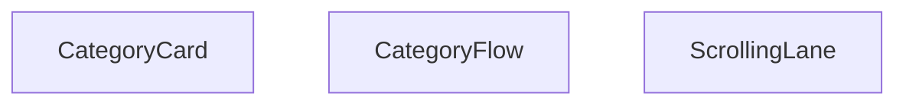

## Genel Bakış
Bu modül, havalandırma ürün kategorilerini görsel olarak göstermek için kullanılan bir React bileşen setidir. Tek bir kategori kartı, bu kartların kaydırılabilir şeritlerde sıralanması ve başlık‑alt başlık ile birlikte sunulan ana akış bileşeni işlevlerini yerine getirir.

## Fonksiyon Grupları
### Kategori Kartı
Tek bir kategori için görsel ve metin bilgilerini gösteren basit bir kart bileşeni sağlar.
- CategoryCard

### Kaydırma Şeritleri
Birden fazla kategori kartını yatay olarak kaydırılabilir bir şerit içinde düzenler; yön ve hız gibi görüntüleme ayarlarını parametre olarak alır.
- ScrollingLane

### Ana Akış Bileşeni
Başlık ve alt başlık ile birlikte bir veya daha fazla kaydırma şeridini birleştirerek tüm kategori akışını renderlar; varsayılan başlık ve alt başlık değerleri sunar.
- CategoryFlow

---

## AXIOMS – Mimari Varsayımlar
Bu modül için özel aksiyomlar fonksiyon imzalarından ve modül sabitlerinden türetilmiştir.

[Aksiyom 1]: Eğer **CategoryCard** componentine `category` prop'u verilmezse, component `undefined` bir category ile render edilmeye çalışacak ve bu durumda veri eksikliği veya hata oluşabilir.  

[Aksiyom 2]: Eğer **ScrollingLane** componentine `categories` prop'u boş bir dizi verilirse, kaydırma şeridinde görüntülenebilecek öğe bulunamayacağından hiçbir hareket gözlemlenemez.  

[Aksiyom 3]: Eğer **ScrollingLane** componentine `direction` prop'u `'left'` veya `'right'` dışında bir değer verilirse (TypeScript tarafından sınırlansa da çalışma zamanında geçersiz bir string geçilebilir), scroll yönü beklenmeyen şekilde belirlenebilir.  

[Aksiyom 4]: Eğer **ScrollingLane** componentine `speed` prop'u sayısal olmayan bir değer verilirse, animasyon hızı `NaN` veya geçersiz bir değer olarak yorumlanabilir ve beklenen hızda kaydırma sağlanmayabilir.  

[Aksiyom 5]: Eğer **CategoryFlow** componentine `title` prop'u verilmezse, fonksiyon imzasında belirtilen default değer kullanılacaktır.  

[Aksiyom 6]: Eğer **CategoryFlow** componentine `subtitle` prop'u verilmezse, fonksiyon imzasında belirtilen default değer kullanılacaktır.  

[Aksiyom 7]: Eğer **CATEGORY_ICONS** nesnesinde bir `DomainCategory` için anahtar eksikse, ilgili **CategoryCard**'da ikon gösterilemeyecek veya `undefined` değeriyle render edilmeye çalışılacak.  

[Aksiyom 8]: Eğer **CATEGORY_COLORS** nesnesinde bir `DomainCategory` için anahtar eksikse, ilgili **CategoryCard**'da renk tanımlanmayacak ve stil varsayılan veya olmayan bir renk uygulanabilir.

---

## FONKSİYON DETAYLARI

### CategoryCard
**Ne yapar**: Verilen bir kategori için bir kart bileşeni renderlar.  
**Nasıl yapar**: CategoryCard fonksiyonu, `DomainCategory` tipindeki `category` props'unu alır ve onu kullanarak kategori adı, görsel ve diğer bilgileri gösteren bir JSX döndürür.  
**Parametreler**:  
- category: DomainCategory — Gösterilecek kategori verisi  
**Dönüş**: void (JSX elementi döndürür, React bileşeni olarak kullanılır)

### ScrollingLane
**Ne yapar**: Bir kategori listesini belirli bir yönde ve hızla kaydırarak gösterir.  
**Nasıl yapar**: ScrollingLane, `categories` dizisini alır, `direction` ve `speed` opsiyonlarını kullanarak bir kaydırma animasyonu (CSS transform veya scroll‑left/right) uygular ve her bir kategori için `CategoryCard` renderlar.  
**Parametreler**:  
- categories: DomainCategory[] — Kaydırılacak kategori listesi  
- direction?: 'left' | 'right' — Kaydırma yönü, varsayılan 'left'  
- speed?: number — Kaydırma hızı (piksel/saniye), varsayılan 30  
**Dönüş**: void (JSX elementi döndürür)

### CategoryFlow
**Ne yapar**: Başlık, alt başlık ve bir veya daha fazla `ScrollingLane` içeren ana kategori akışı bileşenini renderlar.  
**Nasıl yapar**: CategoryFlow, `title` ve `subtitle` props'larını alır, varsayılan değerlerle birlikte gösterir ve içeriği bir veya daha fazla `ScrollingLane` ile doldurarak kategori kartlarını sunar.  
**Parametreler**:  
- title: string — Bölüm başlığı, varsayılan 'Ürün Kategorilerimiz'  
- subtitle: string — Bölüm alt başlığı, varsayılan 'Havalandırma çözümlerind...' (kesilmiş)  
**Dönüş**: React.FC<CategoryFlowProps> — Bir fonksiyonel React bileşeni

---

## INTERFACES

### CategoryFlowProps
- `title?: string`
- `subtitle?: string`

---

## SABİTLER
- **CATEGORY_ICONS** (object) — `{

    'hava-perdesi': Wind,

    'fans': Fan,

    'dehumidifiers': Droplet,...`
- **CATEGORY_COLORS** (object) — `{

    'hava-perdesi': 'from-blue-500 to-blue-700',

    'fans': 'from-emeral...`

---

## AST POINTERS

### [N1_NASIL] AST Pointer: src/components/CategoryFlow.tsx::CategoryCard
- **params**: category: DomainCategory
- **ic_degiskenler**:
  - `Icon` — component retrieved from CATEGORY_ICONS[category.slug] or fallback to Package
  - `gradient` — CSS gradient string from CATEGORY_COLORS[category.slug] or fallback 'from-gray-500 to-gray-700'
- **Dönüş**: JSX.Element

### [N2_NASIL] AST Pointer: src/components/CategoryFlow.tsx::ScrollingLane
- **params**: categories: DomainCategory[], direction?: 'left' | 'right' (default 'left'), speed?: number (default 30)
- **ic_degiskenler**:
  - `items` — concatenated array [...categories, ...categories, ...categories] for seamless scrolling loop
  - `cat` — each category element from items during map iteration
  - `idx` — index of each category in items
- **Dönüş**: JSX.Element

### [N3_NASIL] AST Pointer: src/components/CategoryFlow.tsx::CategoryFlow
- **params**: { title?: string (default 'Ürün Kategorilerimiz'), subtitle?: string (default 'Havalandırma çözümlerinde tüm ihtiyaçlarınız için') }
- **ic_degiskenler**:
  - `allCategories` — array of DomainCategory objects returned by useCategories()
  - `loading` — boolean indicating categories fetch status from useCategories()
  - `mainCategories` — filtered top-level categories (where parent_id is falsy) derived from allCategories
  - `lane1` — even-indexed mainCategories (i % 2 === 0) for left lane
  - `lane2` — odd-indexed mainCategories (i % 2 === 1) for right lane
- **Dönüş**: JSX.Element | null

---

## MERMAID CALL GRAPH

## NODE ID STANDARD

  file: src\components\CategoryFlow.tsx
  function: src\components\CategoryFlow.tsx::CategoryCard
  function: src\components\CategoryFlow.tsx::ScrollingLane
  function: src\components\CategoryFlow.tsx::CategoryFlow

---

## DISA AKTARILANLAR (EXPORTS)
  export: CategoryCard
  export: CategoryFlow
  export: ScrollingLane

---

## STİL TOKENLERİ

### Arbitrary Değerler (token'a geçirilmemiş)
Yok — tüm stiller token'a geçirilmiş. ✅

### Kullanılan Token'lar (zaten token'a geçirilmiş)
- (yok)

### Tailwind Sınıf Özeti
- **Renkler:** `bg-gradient-to-b`, `bg-gradient-to-br`, `bg-gradient-to-l`, `bg-gradient-to-r`, `bg-gray-100`, `bg-white/10`, `bg-white/20`, `from-gray-50`, `sm:text-3xl`, `sm:text-lg`, `sm:text-sm`, `text-2xl`, `text-base`, `text-center`, `text-gray-600`
- **Layout:** `-bottom-4`, `-left-4`, `-right-4`, `-top-4`, `absolute`, `bottom-4`, `flex`, `flex-shrink-0`, `from-gray-50`, `gap-4`, `h-24`, `h-32`, `h-40`, `hover:shadow-xl`, `left-0`
- **Varyant/Responsive:** `:`, `group-hover:`, `hover:`, `lg:`, `md:`, `sm:` önekleri
- **Yardımcı Sınıflar:** `${direction`, `${gradient`, `-translate-x-1/2`, `:`, `===`, `animate-category-scroll-left`, `animate-category-scroll-right`, `animate-pulse`, `duration-300`, `font-bold`, `group`, `group-hover:opacity-100`, `group-hover:scale-110`, `hover:-translate-y-1`, `hover:scale-105`