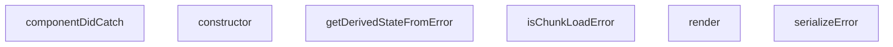

## Genel Bakış
Bu modül, React uygulamalarında beklenmeyen hataları yakalayan bir ErrorBoundary bileşenidir. Uygulamanın tamamen çökmesini önleyerek kullanıcıya uygun bir hata arayüzü sunar ve hataları loglama veya raporlama için işler.

## Fonksiyon Grupları
### Hata Sınırı Yaşam Döngüsü
React hata sınırı mekanizmasının temel metotlarını implement eder. Bileşenin hata durumunu yönetir, hata yakalandığında state'i günceller ve hata arayüzünü render eder.
- constructor, getDerivedStateFromError, componentDidCatch, render

### Hata İşleme Yardımcıları
Yakalanan hataları yapılandırılmış formata dönüştürür ve belirli hata türlerini (örn: dinamik modül yükleme hataları) tanımlar. Bu fonksiyonlar hata sınırı metotları tarafından çağrılarak hata yönetimini destekler.
- serializeError, isChunkLoadError

---

## AXIOMS – Mimari Varsayımlar

Bu modül, React ErrorBoundary deseni temelinde çalışır ve hata yakalama yaşam döngüsüne bağlıdır.

[Aksiyom 1]: Eğer `getDerivedStateFromError` methodu bir `State` nesnesi döndürmezse, bileşen hata durumunu doğru temsil edemez ve render döngüsü hata durumunu bilemez.

[Aksiyom 2]: Eğer `componentDidCatch` çağrıldığında `errorInfo` parametresi `ErrorInfo` formatında değilse, hata stack trace bilgisi kaybolur ve hata kaynağını tespit etmek mümkün olmaz.

[Aksiyom 3]: Eğer `render` methodu çağrılmadan önce bileşen state'inde `hasError` alanı true olarak ayarlanmamışsa, hata arayüzü kullanıcıya gösterilmez.

[Aksiyom 4]: Eğer `serializeError` fonksiyonu `unknown` tipli bir girdi aldığında Promise veya circular reference içeren bir nesne verilirse ve bunu handle etmezse, serileştirme başarısız olur.

[Aksiyom 5]: Eğer `isChunkLoadError` fonksiyonu dinamik modül yükleme hatası içermeyen bir error nesnesi alırsa, `false` döndürmelidir; aksi halde chunk load hataları yanlış sınıflandırılır.

[Aksiyom 6]: Eğer `ErrorBoundary.constructor` çağrıldığında `props` parametresi `children` içermiyorsa, bileşen render edilecek içerik bulamaz.

[Aksiyom 7]: Eğer `getDerivedStateFromError` static methodu constructor çağrılmadan önce React tarafından tetiklenirse, bileşenin state'i henüz başlatılmamış olabilir ve hata durumu işlenemez.

---

## FONKSİYON DETAYLARI

### serializeError
**Ne yapar**: Hata nesnesini okunabilir bir biçime dönüştürerek geliştirici konsolunda veya UI’da gösterilmesini sağlar.  
**Nasıl yapar**: Fonksiyonun iç mantığı kodda verilmemiştir; yalnızca `ErrorBoundary` içinde `serializeError(this.state.error)` şeklinde çağrılır ve dönen değer `<pre>` içinde gösterilir.  
**Parametreler**:
- `error`: unknown — Serileştirilecek hata nesnesi.  
**Dönüş**: Belirtilmemiş (kod içinde dönüş değeri kullanılmaz, muhtemelen string veya nesne).

### isChunkLoadError
**Ne yapar**: Bir hatanın, dinamik olarak yüklenen kod parçacıklarından (chunk) kaynaklanıp kaynaklanmadığını tespit eder.  
**Nasıl yapar**: Fonksiyonun içeriği verilmemiştir; `ErrorBoundary` içinde `isChunkLoadError(error)` çağrılarıyla hem UI’da hem de hata izleme mantığında kullanılır.  
**Parametreler**:
- `error`: unknown — Kontrol edilecek hata nesnesi.  
**Dönüş**: `boolean` — Hata bir chunk yükleme hatasıysa `true`, aksi takdirde `false`.

### constructor
**Ne yapar**: `ErrorBoundary` sınıfının yapıcı fonksiyonudur. Bileşen ilk oluşturulduğunda çağrılır ve bileşenin başlangıç durumunu ayarlar.
**Nasıl yapar**: Üst sınıfın (`React.Component`) `constructor` metodunu `super(props)` ile çağırarak başlatma işlemini gerçekleştirir. Bileşenin state nesnesini, bir hata yakalanıp yakalanmadığını takip eden `hasError` değişkenini `false` olarak başlatır.
**Parametreler**:
- props: Props — Bileşene geçirilen özellikleri içerir.
**Dönüş**: Dönüş tipi belirtilmemiştir.

### getDerivedStateFromError
**Ne yapar**: Bir alt bileşende bir hata yakalandığında, `ErrorBoundary` bileşeninin state'ini güncellemek için kullanılan statik bir yaşam döngüsü metodudur. Hata bilgilerini state'e yansıtarak render metodunun hata durumunu gösterebilmesini sağlar.
**Nasıl yapar**: Yakalanan `error` nesnesini parametre olarak alır. State'i, `hasError` alanını `true` yapan, yakalanan `error` nesnesini ve `isChunkLoadError` fonksiyonu ile hesaplanan `isChunkError` bayrağını içeren bir nesneyle günceller.
**Parametreler**:
- error: Error — Yakalanan hata nesnesi.
**Dönüş**: State — Bileşenin güncellenmiş state'ini temsil eden bir nesne döndürür. Döndürülen nesne `hasError`, `error` ve `isChunkError` alanlarını içerir.

### componentDidCatch
**Ne yapar**: Bir alt bileşende bir hata yakalandığında ve hata bilgileri toplandıktan sonra çağrılan bir yaşam döngüsü metodudur. Hataları günlüğe kaydetmek ve harici bir hata raporlama servisine göndermek için kullanılır.
**Nasıl yapar**: Yakalanan hata ve hata hakkında ek bilgileri (bileşen yığını) parametre olarak alır. Öncelikle hatayı `console.error` ile konsola yazar. Ardından, `reportError` fonksiyonunu çağırarak hatayı bir hata raporlama servisine ("log-client-error edge fonksiyonu") gönderir; bu işlem "fire-and-forget" niteliğindedir ve asla fırlatma (throw) yapmaz. Ek olarak, hata bir "chunk yükleme hatası" ise, kullanıcıyı bilgilendirmek için bir uyarı günlüğü (`console.warn`) yazar.
**Parametreler**:
- error: Error — Yakalanan hata nesnesi.
- errorInfo: ErrorInfo — Hata hakkında ek bilgileri (örneğin, bileşen yığını) içerir.
**Dönüş**: Dönüş tipi belirtilmemiştir.

### render
**Ne yapar**: Bileşenin kullanıcı arayüzünü oluşturur. Hata durumuna göre farklı bir arayüz (hata mesajı ve aksiyon butonları) veya normal çocuk bileşenlerini görüntüler.
**Nasıl yapar**: `I18nContext.Consumer` kullanarak bir çeviri fonksiyonuna (`t`) erişir. Eğer `this.state.hasError` true ise, önce `this.props.fallback` prop'unun varlığını kontrol eder; varsa onu döndürür. Fallback yoksa, hata bir "chunk yükleme hatası" (`isChunkError`) olup olmadığına bağlı olarak farklı başlık ve açıklama metinleriyle bir hata arayüzü oluşturur. Chunk hataları için "Sayfayı Yenile" butonu, diğer hatalar için "Tekrar Dene" ve "Sayfayı Yenile" butonları gösterilir. Geliştirme ortamında (`process.env.NODE_ENV === 'development'`) ise hata detaylarını gösteren bir `details` elementi ekler. Hata yoksa, bileşenin `children` prop'unu doğrudan döndürür.
**Parametreler**: Parametre almaz.
**Dönüş**: Dönüş tipi belirtilmemiştir. JSX elementi döndürür.

---

## İTHALATLAR (IMPORTS)
- import: ../i18n/I18nContext::I18nContext
- import: ../lib/errorReporter::reportError
- import: lucide-react::AlertTriangle
- import: lucide-react::RefreshCw
- import: react::Component
- import: react::ErrorInfo
- import: react::React
- import: react::ReactNode

---

## INTERFACES

### Props
- `children: ReactNode`
- `fallback?: ReactNode`

### State
- `hasError: boolean`
- `error?: Error`
- `isChunkError?: boolean`

---

## AST POINTERS

### [N1_NASIL] AST Pointer: C:\tmp\vh-altyapi-t165\src\components\ErrorBoundary.tsx::serializeError
- **params**: `error` — unknown tipinde hata nesnesi
- **ic_degiskenler**: yok
- **Dönüş**: string — hata mesajı ve stack bilgisi veya JSON.stringify veya String(error)

### [N2_NASIL] AST Pointer: C:\tmp\vh-altyapi-t165\src\components\ErrorBoundary.tsx::isChunkLoadError
- **params**: `error` — unknown tipinde hata nesnesi
- **ic_degiskenler**: yok
- **Dönüş**: boolean — hata mesajı "Loading chunk", "ChunkLoadError" veya "Loading CSS chunk" içeriyorsa true, aksi halde false

### [N3_NASIL] AST Pointer: C:\tmp\vh-altyapi-t165\src\components\ErrorBoundary.tsx::ErrorBoundary.constructor
- **params**: `props` — Props tipinde bileşen özellikleri
- **ic_degiskenler**: yok
- **Dönüş**: yok — super(props) çağrısı yapar ve this.state = { hasError: false } atar

### [N4_NASIL] AST Pointer: C:\tmp\vh-altyapi-t165\src\components\ErrorBoundary.tsx::ErrorBoundary.getDerivedStateFromError
- **params**: `error` — Error tipinde hata nesnesi
- **ic_degiskenler**: yok
- **Dönüş**: State nesnesi — { hasError: true, error, isChunkError: isChunkLoadError(error) }

### [N5_NASIL] AST Pointer: C:\tmp\vh-altyapi-t165\src\components\ErrorBoundary.tsx::ErrorBoundary.componentDidCatch
- **params**: `error` — Error tipinde hata nesnesi, `errorInfo` — ErrorInfo tipinde hata bilgisi
- **ic_degiskenler**: yok
- **Dönüş**: yok — console.error ile hata loglar, reportError fonksiyonunu çağırır ve chunk yükleme hatalarını console.warn ile bildirir

### [N6_NASIL] AST Pointer: C:\tmp\vh-altyapi-t165\src\components\ErrorBoundary.tsx::ErrorBoundary.render
- **params**: yok
- **ic_degiskenler**: yok
- **Dönüş**: ReactNode — I18nContext.Consumer içinde ctx parametreli anonim fonksiyon döndürür

### [N7_NASIL] AST Pointer: C:\tmp\vh-altyapi-t165\src\components\ErrorBoundary.tsx::ErrorBoundary.render.anonim
- **params**: `ctx` — I18nContext nesnesi
- **ic_degiskenler**:
  - `t` — ctx?.t veya varsayılan çeviri fonksiyonu (key ve alt parametreleri alır, alt veya key döndürür)
  - `isChunkError` — this.state.isChunkError, chunk yükleme hatası olup olmadığını belirtir
- **Dönüş**: ReactNode — hata durumunda hata UI'ı, aksi halde this.props.children

---

## MERMAID CALL GRAPH

## NODE ID STANDARD

  file: src\components\ErrorBoundary.tsx
  function: src\components\ErrorBoundary.tsx::serializeError
  function: src\components\ErrorBoundary.tsx::isChunkLoadError
  class: src\components\ErrorBoundary.tsx::ErrorBoundary

---

## DISA AKTARILANLAR (EXPORTS)
  export: ErrorBoundary
  export: isChunkLoadError
  export: serializeError

---

## BILEŞIM (CONTAINS)
  contains: Component<Props
  contains: State>

---

## STİL TOKENLERİ

### Arbitrary Değerler (token'a geçirilmemiş)
Yok — tüm stiller token'a geçirilmiş. ✅

### Kullanılan Token'lar (zaten token'a geçirilmiş)
- (yok)

### Tailwind Sınıf Özeti
- **Renkler:** `bg-gray-100`, `bg-primary-navy`, `border-gray-300`, `hover:bg-gray-50`, `hover:bg-secondary-blue`, `hover:text-gray-700`, `text-amber-500`, `text-center`, `text-gray-500`, `text-gray-600`, `text-gray-700`, `text-gray-800`, `text-left`, `text-sm`, `text-white`
- **Layout:** `flex`, `h-16`, `h-4`, `inline-flex`, `items-center`, `justify-center`, `max-h-40`, `max-w-md`, `min-h-400px`, `overflow-auto`, `p-3`, `p-8`, `w-16`, `w-4`
- **Varyant/Responsive:** `hover:` önekleri
- **Yardımcı Sınıflar:** `border`, `cursor-pointer`, `font-semibold`, `mb-2`, `mb-4`, `mb-6`, `mr-2`, `mr-3`, `mt-2`, `mt-6`, `mx-auto`, `px-4`, `px-6`, `py-2`, `rounded`