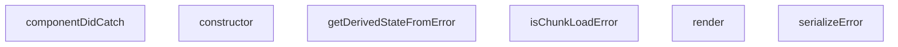

## Genel Bakış
Bu modül, React uygulamalarında beklenmeyen hataları yakalamak için kullanılan bir hata sınırı (ErrorBoundary) bileşeni sunar. Yakalanan hataları işleyerek kullanıcıya anlamlı bir hata arayüzü gösterir; özellikle dinamik modül yükleme hatalarını (chunk load error) ayırt eder ve hata nesnelerini loglama ya da raporlama amacıyla serileştirir.

## Fonksiyon Grupları

### Hata Sınırı Yaşam Döngüsü
ErrorBoundary sınıfının React hata sınırı metotlarını kapsar. Bileşenin hata durumunu başlatır, günceller ve hata yakalandığında yan etkileri (loglama vb.) yönetir.
- constructor, getDerivedStateFromError, componentDidCatch, render

### Hata İşleme Yardımcıları
Hataları serileştirme ve belirli hata türlerini (özellikle chunk yükleme hataları) tanıma işlevlerini içerir. Bu fonksiyonlar, hata sınırı metotları tarafından kullanılarak hataların daha anlaşılır ve işlenebilir olmasını sağlar.
- serializeError, isChunkLoadError

---

## AXIOMS – Mimari Varsayımlar
Bu modül React tabanlı uygulamalarda alt bileşenlerin fırlattığı çalışma zamanı hatalarını yakalayan, uygulamanın tamamen çökmesini önleyen hata sınırı bileşenidir; doğru çalışması için React'in ErrorBoundary yaşam döngülerini desteklemesi ve proje içerisinde hata alabilecek bileşenleri sarmalayacak şekilde konumlandırılması zorunludur.

[Aksiyom 1]: Eğer React kütüphanesi bu modülün kullandığı `getDerivedStateFromError` ve `componentDidCatch` yaşam döngüsü metodlarını desteklemiyorsa, modül hiçbir hatayı yakalayamaz, uygulama beklendiği gibi çöker.
[Aksiyom 2]: Eğer bu modül uygulama içerisinde hata fırlatabilecek tüm alt bileşenleri sarmayacak şekilde yanlış konumlandırılırsa, kapsam dışında kalan bileşenlerde oluşan hatalar yakalanamaz.
[Aksiyom 3]: Eğer `serializeError` fonksiyonu gelen `unknown` tipteki hata nesnesini standart formata dönüştüremiyorsa, hata detayları ne kaydedilebilir ne de kullanıcıya gösterilebilir.
[Aksiyom 4]: Eğer `isChunkLoadError` fonksiyonu kod ayırma (code splitting) sırasında oluşan parça yükleme hatalarını doğru tespit edemiyorsa, bu tür ağa bağlı hatalar için özel kurtarma akışları çalıştırılamaz.
[Aksiyom 5]: Eğer ErrorBoundary'nin constructor'ında tanımlanan temel state yapısı bozulursa, `render()` metodu hata durumunda gösterilecek fallback arayüzünü yükleyemez, kullanıcı hatadan haberdar olamaz.
[Aksiyom 6]: Eğer `componentDidCatch` metodunun eriştiği harici hata loglama servisi entegrasyonu çalışmıyorsa, yakalanan hatalar uzaktan takip edilemez, hata kök nedenleri analiz edilemez.

---

## FONKSİYON DETAYLARI

### serializeError
**Ne yapar**: Hata nesnesini okunabilir bir biçime dönüştürerek geliştirici konsolunda veya UI’da gösterilmesini sağlar.  
**Nasıl yapar**: Fonksiyonun iç mantığı kodda verilmemiştir; yalnızca `ErrorBoundary` içinde `serializeError(this.state.error)` şeklinde çağrılır ve dönen değer `<pre>` içinde gösterilir.  
**Parametreler**:
- `error`: unknown — Serileştirilecek hata nesnesi.  
**Dönüş**: Belirtilmemiş (kod içinde dönüş değeri kullanılmaz, muhtemelen string veya nesne).

### isChunkLoadError
**Ne yapar**: Bir hatanın, dinamik olarak yüklenen kod parçacıklarından (chunk) kaynaklanıp kaynaklanmadığını tespit eder.  
**Nasıl yapar**: Fonksiyonun içeriği verilmemiştir; `ErrorBoundary` içinde `isChunkLoadError(error)` çağrılarıyla hem UI’da hem de hata izleme mantığında kullanılır.  
**Parametreler**:
- `error`: unknown — Kontrol edilecek hata nesnesi.  
**Dönüş**: `boolean` — Hata bir chunk yükleme hatasıysa `true`, aksi takdirde `false`.

### constructor
**Ne yapar**: ErrorBoundary bileşeninin başlatıcı (constructor) metodudur. Bileşeninstanciatedığında ilk durumunu ayarlar ve üst sınıftaki React.Component constructor'ını çağırır.

**Nasıl yapar**: `super(props)` çağrısıyla üst sınıftaki React.Component constructor'ını tetikler ve ardından `this.state` nesnesini `{ hasError: false }` değeri ile başlatır. Bu başlangıç durumu, herhangi bir hata yakalanmadığını gösterir.

**Parametreler**:
- props: Props — Bileşene dışarıdan geçirilen özellikler nesnesi, React bileşeninin standart props yapısını temsil eder

**Dönüş**: void — Constructor metotları herhangi bir değer dönmez

### getDerivedStateFromError
**Ne yapar**: Geliştirildi ancak detay üretilemedi.

### componentDidCatch
**Ne yapar**: Geliştirildi ancak detay üretilemedi.

### render
**Ne yapar**: Geliştirildi ancak detay üretilemedi.

---

## INTERFACES

### Props
- `children: ReactNode`
- `fallback?: ReactNode`

### State
- `hasError: boolean`
- `error?: Error`
- `isChunkError?: boolean`

---

## AST POINTERS

### [N1_NASIL] AST Pointer: src/components/ErrorBoundary.tsx::serializeError
- **params**: `error: unknown` — serialize edilecek hata nesnesi
- **ic_degiskenler**:
  (yok — parametre doğrudan kullanılır)
- **Dönüş**: `string` — hata message+stack veya JSON stringi veya String(error)

---

### [N2_NASIL] AST Pointer: src/components/ErrorBoundary.tsx::isChunkLoadError
- **params**: `error: unknown` — kontrol edilecek hata nesnesi
- **ic_degiskenler**:
  (yok — parametre doğrudan kullanılır)
- **Dönüş**: `boolean` — chunk yükleme hatası ise true

---

### [N3_NASIL] AST Pointer: src/components/ErrorBoundary.tsx::ErrorBoundary.constructor
- **params**: `props: Props` — bileşen props'ları
- **ic_degiskenler**:
  (yok — super çağrısı ve state ataması yapılır)
- **Dönüş**: yok — constructor

---

### [N4_NASIL] AST Pointer: src/components/ErrorBoundary.tsx::ErrorBoundary.getDerivedStateFromError
- **params**: `error: Error` — yakalanan hata nesnesi
- **ic_degiskenler**:
  (yok — return objesi inline oluşturulur)
- **Dönüş**: `State` — `{ hasError, error, isChunkError }` objesi

---

### [N5_NASIL] AST Pointer: src/components/ErrorBoundary.tsx::ErrorBoundary.componentDidCatch
- **params**: `error: Error` — yakalanan hata, `errorInfo: ErrorInfo` — bileşen stack bilgisi
- **ic_degiskenler**:
  (yok — parametreler ve console çağrısı doğrudan kullanılır)
- **Dönüş**: yok — yan etki: console.error ve console.warn çağrısı

---

### [N6_NASIL] AST Pointer: src/components/ErrorBoundary.tsx::ErrorBoundary.handleRetry
- **params**: (yok)
- **ic_degiskenler**:
  (yok — this.setState doğrudan çağrılır)
- **Dönüş**: yok — yan etki: state'i `{ hasError: false, error: undefined, isChunkError: false }` yapar

---

### [N7_NASIL] AST Pointer: src/components/ErrorBoundary.tsx::ErrorBoundary.handleRefresh
- **params**: (yok)
- **ic_degiskenler**:
  (yok — window.location.reload çağrısı yapılır)
- **Dönüş**: yok — yan etki: sayfayı yeniden yükler

---

### [N8_NASIL] AST Pointer: src/components/ErrorBoundary.tsx::ErrorBoundary.render
- **params**: (yok)
- **ic_degiskenler**:
  (yok — ctx I18nContext.Consumer callback içinde gelir)
- **Dönüş**: `ReactNode` — JSX: children veya hata fallback UI

---

### [N9_NASIL] AST Pointer: src/components/ErrorBoundary.tsx::ErrorBoundary.render::(ctx callback)
- **params**: `ctx` — I18nContext değeri, `t` fonksiyonu içerir
- **ic_degiskenler**:
  - `t` — çeviri fonksiyonu; ctx?.t || fallback `(key, alt?) => alt || key`
  - `isChunkError` — destructured `this.state` içindeki chunk hata bayrağı
- **Dönüş**: `ReactNode` — fallback UI JSX'i veya `this.props.children`

---

## MERMAID CALL GRAPH

## NODE ID STANDARD

  file: src\components\ErrorBoundary.tsx
  function: src\components\ErrorBoundary.tsx::serializeError
  function: src\components\ErrorBoundary.tsx::isChunkLoadError
  class: src\components\ErrorBoundary.tsx::ErrorBoundary

---

## DISA AKTARILANLAR (EXPORTS)
  export: ErrorBoundary
  export: isChunkLoadError
  export: serializeError

---

## BILEŞIM (CONTAINS)
  contains: Component<Props
  contains: State>

---

## STİL TOKENLERİ

### Arbitrary Değerler (token'a geçirilmemiş)
Yok — tüm stiller token'a geçirilmiş. ✅

### Kullanılan Token'lar (zaten token'a geçirilmiş)
- (yok)

### Tailwind Sınıf Özeti
- **Renkler:** `bg-gray-100`, `bg-primary-navy`, `border-gray-300`, `hover:bg-gray-50`, `hover:bg-secondary-blue`, `hover:text-gray-700`, `text-amber-500`, `text-center`, `text-gray-500`, `text-gray-600`, `text-gray-700`, `text-gray-800`, `text-left`, `text-sm`, `text-white`
- **Layout:** `flex`, `h-16`, `h-4`, `inline-flex`, `items-center`, `justify-center`, `max-h-40`, `max-w-md`, `min-h-400px`, `overflow-auto`, `p-3`, `p-8`, `w-16`, `w-4`
- **Varyant/Responsive:** `hover:` önekleri
- **Yardımcı Sınıflar:** `border`, `cursor-pointer`, `font-semibold`, `mb-2`, `mb-4`, `mb-6`, `mr-2`, `mr-3`, `mt-2`, `mt-6`, `mx-auto`, `px-4`, `px-6`, `py-2`, `rounded`