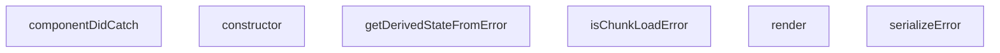

## Genel Bakış
Bu modül, React uygulamalarında beklenmeyen hataları yakalayan bir ErrorBoundary bileşenidir. Uygulamanın tamamen çökmesini önleyerek kullanıcıya uygun bir hata arayüzü sunar ve hataları loglama veya raporlama için işler.

## Fonksiyon Grupları
### Hata Sınırı Yaşam Döngüsü
React hata sınırı mekanizmasının temel metotlarını implement eder. Bileşenin hata durumunu yönetir, hata yakalandığında state'i günceller ve hata arayüzünü render eder.
- constructor, getDerivedStateFromError, componentDidCatch, render

### Hata İşleme Yardımcıları
Yakalanan hataları yapılandırılmış formata dönüştürür ve belirli hata türlerini (örn: dinamik modül yükleme hataları) tanımlar. Bu fonksiyonlar hata sınırı metotları tarafından çağrılarak hata yönetimini destekler.
- serializeError, isChunkLoadError

---

## AXIOMS – Mimari Varsayımlar

Bu modül, React ErrorBoundary deseni temelinde çalışır ve hata yakalama yaşam döngüsüne bağlıdır.

[Aksiyom 1]: Eğer `getDerivedStateFromError` methodu bir `State` nesnesi döndürmezse, bileşen hata durumunu doğru temsil edemez ve render döngüsü hata durumunu bilemez.

[Aksiyom 2]: Eğer `componentDidCatch` çağrıldığında `errorInfo` parametresi `ErrorInfo` formatında değilse, hata stack trace bilgisi kaybolur ve hata kaynağını tespit etmek mümkün olmaz.

[Aksiyom 3]: Eğer `render` methodu çağrılmadan önce bileşen state'inde `hasError` alanı true olarak ayarlanmamışsa, hata arayüzü kullanıcıya gösterilmez.

[Aksiyom 4]: Eğer `serializeError` fonksiyonu `unknown` tipli bir girdi aldığında Promise veya circular reference içeren bir nesne verilirse ve bunu handle etmezse, serileştirme başarısız olur.

[Aksiyom 5]: Eğer `isChunkLoadError` fonksiyonu dinamik modül yükleme hatası içermeyen bir error nesnesi alırsa, `false` döndürmelidir; aksi halde chunk load hataları yanlış sınıflandırılır.

[Aksiyom 6]: Eğer `ErrorBoundary.constructor` çağrıldığında `props` parametresi `children` içermiyorsa, bileşen render edilecek içerik bulamaz.

[Aksiyom 7]: Eğer `getDerivedStateFromError` static methodu constructor çağrılmadan önce React tarafından tetiklenirse, bileşenin state'i henüz başlatılmamış olabilir ve hata durumu işlenemez.

---

## FONKSİYON DETAYLARI

### serializeError
**Ne yapar**: Hata nesnesini okunabilir bir biçime dönüştürerek geliştirici konsolunda veya UI’da gösterilmesini sağlar.  
**Nasıl yapar**: Fonksiyonun iç mantığı kodda verilmemiştir; yalnızca `ErrorBoundary` içinde `serializeError(this.state.error)` şeklinde çağrılır ve dönen değer `<pre>` içinde gösterilir.  
**Parametreler**:
- `error`: unknown — Serileştirilecek hata nesnesi.  
**Dönüş**: Belirtilmemiş (kod içinde dönüş değeri kullanılmaz, muhtemelen string veya nesne).

### isChunkLoadError
**Ne yapar**: Bir hatanın, dinamik olarak yüklenen kod parçacıklarından (chunk) kaynaklanıp kaynaklanmadığını tespit eder.  
**Nasıl yapar**: Fonksiyonun içeriği verilmemiştir; `ErrorBoundary` içinde `isChunkLoadError(error)` çağrılarıyla hem UI’da hem de hata izleme mantığında kullanılır.  
**Parametreler**:
- `error`: unknown — Kontrol edilecek hata nesnesi.  
**Dönüş**: `boolean` — Hata bir chunk yükleme hatasıysa `true`, aksi takdirde `false`.

### constructor
**Ne yapar**: `ErrorBoundary` bileşeninin başlatıcı metodudur ve bileşenin ilk durumunu (state) ayarlar. Bileşenin hata yakalama mekanizmasını devreye sokan temel kurulumu gerçekleştirir.
**Nasıl yapar**: `super(props)` çağrısı ile üst sınıf (React.Component) yapıcısını çağırarak props'ları iletir. Ardından `this.state` nesnesini `{ hasError: false }` olarak başlatır. Bu, bileşenin başlangıçta herhangi bir hata olmadığını belirtir.
**Parametreler**:
- `props: Props` — Bileşene dışarıdan geçirilen özellikler nesnesi. Tipi, bileşenin dışarıdan alabileceği verileri tanımlayan bir arayüzdür.
**Dönüş**: Dönüş tipi `void`'dur; yani herhangi bir değer döndürmez, sadece bileşenin iç durumunu başlatır.

### getDerivedStateFromError
**Ne yapar**: Bir render sırasında ortaya çıkan hataları yakalar ve bileşenin durumunu günceller. Bu, React tarafından çağrılan bir statik metottur ve hata yakalandığında bileşenin yeniden render edilmesini sağlar.
**Nasıl yapar**: Parametre olarak aldığı `error` nesnesini inceler. `isChunkLoadError(error)` yardımcı fonksiyonunu kullanarak hatanın bir "chunk yükleme hatası" (örn: eski bir kod parçasını yüklemeye çalışma) olup olmadığını belirler. Sonra, `hasError: true`, hatanın kendisi ve `isChunkError` durumunu içeren yeni bir durum nesnesi döndürerek bileşenin durumunu günceller.
**Parametreler**:
- `error: Error` — Yakalanan JavaScript hata nesnesi. `Error` sınıfı veya türevlerinden bir instance olmalıdır.
**Dönüş**: `State` tipinde bir nesne döndürür. Bu nesne en azından `hasError` (boolean), `error` (Error) ve `isChunkError` (boolean) alanlarını içerir. React, bu dönen nesneyi `this.state` ile birleştirerek bileşenin durumunu günceller.

### componentDidCatch
**Ne yapar**: Bir render sırasında oluşan ve alt bileşenlerden yükselen hataları yakalar. Hata hakkında bilgi toplar ve hem konsola hem de uzak bir hata raporlama servisine iletir.
**Nasıl yapar**: Öncelikle hata ve hata hakkında bilgi veren `errorInfo` nesnesini konsola `console.error` ile yazdırır. Ardından `reportError` fonksiyonunu çağırarak hatayı, kaynağını (`source: 'ErrorBoundary'`), bileşen yığın izini (`componentStack`) ve chunk hatası olup olmadığını (`isChunkError`) belirterek raporlar. Bu `reportError` çağrısı asenkron ("fire-and-forget") çalışır ve herhangi bir hata fırlatmaz. Eğer hata bir chunk yükleme hatası ise ayrıca bir `console.warn` ile kullanıcıya sayfayı yenilemesi gerektiğini bildirir.
**Parametreler**:
- `error: Error` — Yakalanan JavaScript hata nesnesi.
- `errorInfo: ErrorInfo` — Hatanın oluştuğu yerdeki bileşen yığın izini (`componentStack` property'si) içeren React tarafından sağlanan bilgi nesnesi.
**Dönüş**: Dönüş tipi `void`'dur; yani herhangi bir değer döndürmez, sadece hata raporlama ve loglama yan etkileri gerçekleştirir.

### render
**Ne yapar**: `ErrorBoundary` bileşeninin görünümünü (arayüzünü) belirler. Hata oluşup oluşmadığına göre, ya children'ları olduğu gibi render eder ya da kullanıcıya hata mesajı ve düzeltme seçenekleri sunan bir fallback arayüzü gösterir.
**Nasıl yapar**: `I18nContext.Consumer` kullanarak çoklu dil desteği sağlar. `hasError` durumu `false` ise doğrudan `this.props.children`'ı render eder. `hasError` durumu `true` ise, bir hata arayüzü oluşturur. Eğer `this.props.fallback` prop'u verilmişse onu kullanır. Aksi takdirde, bir `isChunkError` kontrolü yaparak hata türüne göre farklı başlık, açıklama ve butonlar gösterir. Chunk hatası ise sadece "Sayfayı Yenile" butonu, diğer durumlarda "Tekrar Dene" ve "Sayfayı Yenile" butonları sunulur. Geliştirme ortamında (`NODE_ENV === 'development'`) ise, hatanın detaylarını gösteren bir `
` bölümü ekler.
**Parametreler**: Parametre almaz (bir sınıf metodu olarak `this` bağlamı ile çalışır).
**Dönüş**: JSX element döndürür. Hata durumunda bir `div` yapısı, hata yokluğunda ise `this.props.children` (React node) döndürür.

---

## İTHALATLAR (IMPORTS)
- import: ../i18n/I18nContext::I18nContext
- import: ../lib/errorReporter::reportError
- import: lucide-react::AlertTriangle
- import: lucide-react::RefreshCw
- import: react::Component
- import: react::ErrorInfo
- import: react::React
- import: react::ReactNode

---

## INTERFACES

### Props
- `children: ReactNode`
- `fallback?: ReactNode`

### State
- `hasError: boolean`
- `error?: Error`
- `isChunkError?: boolean`

---

## AST POINTERS

### [N1_NASIL] AST Pointer: src/components/ErrorBoundary.tsx::serializeError
- **params**: `(error: unknown)` — Fonksiyona geçirilen hata nesnesi (bilinmeyen tipte olabilir)
- **ic_degiskenler**: 
  - Yok
- **Dönüş**: `string` — Hata bilgisinin string temsili. Error instance ise message ve stack birleştirilir, değilse JSON.stringify ile formatlanır, başarısız olursa String() kullanılır.

### [N2_NASIL] AST Pointer: src/components/ErrorBoundary.tsx::isChunkLoadError
- **params**: `(error: unknown)` — Kontrol edilecek hata nesnesi
- **ic_degiskenler**: 
  - Yok
- **Dönüş**: `boolean` — Hatanın chunk yükleme hatası olup olmadığını belirler. Error instance ise message'ın içeriğini kontrol eder.

### [N3_NASIL] AST Pointer: src/components/ErrorBoundary.tsx::ErrorBoundary.constructor
- **params**: `(props: Props)` — Bileşenin prop'ları
- **ic_degiskenler**: 
  - Yok
- **Dönüş**: `yok` — Sadece super() çağrısı ve state başlangıcı yapar.

### [N4_NASIL] AST Pointer: src/components/ErrorBoundary.tsx::ErrorBoundary.getDerivedStateFromError
- **params**: `(error: Error)` — Yakalanan hata nesnesi
- **ic_degiskenler**: 
  - Yok
- **Dönüş**: `State` — {hasError: true, error, isChunkError} state nesnesi döndürür.

### [N5_NASIL] AST Pointer: src/components/ErrorBoundary.tsx::ErrorBoundary.componentDidCatch
- **params**: `(error: Error, errorInfo: ErrorInfo)` — Yakalanan hata ve bileşen stack bilgisi
- **ic_degiskenler**: 
  - Yok
- **Dönüş**: `yok` — Hata loglama ve raporlama yan etkileri yapar.

### [N6_NASIL] AST Pointer: src/components/ErrorBoundary.tsx::ErrorBoundary.render
- **params**: `(yok)` — Parametre almaz, this.state ve this.props kullanır
- **ic_degiskenler**: 
  - `ctx` — I18nContext.Consumer'dan gelen context nesnesi
  - `t` — Çeviri fonksiyonu, ctx.t veya fallback olarak varsayılan çeviri fonksiyonu
  - `isChunkError` — Bu state'den destructure edilen chunk hatası durumu
- **Dönüş**: `ReactNode` — Hata durumunda hata UI'ı, normal durumda children render edilir.

### [N7_NASIL] AST Pointer: src/components/ErrorBoundary.tsx::ErrorBoundary.handleRetry
- **params**: `(yok)` — Parametresiz arrow fonksiyon
- **ic_degiskenler**: 
  - Yok
- **Dönüş**: `yok` — this.setState ile state'i sıfırlar.

### [N8_NASIL] AST Pointer: src/components/ErrorBoundary.tsx::ErrorBoundary.handleRefresh
- **params**: `(yok)` — Parametresiz arrow fonksiyon
- **ic_degiskenler**: 
  - Yok
- **Dönüş**: `yok` — Sayfayı yeniler (window.location.reload).

---

## MERMAID CALL GRAPH

## NODE ID STANDARD

  file: src\components\ErrorBoundary.tsx
  function: src\components\ErrorBoundary.tsx::serializeError
  function: src\components\ErrorBoundary.tsx::isChunkLoadError
  class: src\components\ErrorBoundary.tsx::ErrorBoundary

---

## DISA AKTARILANLAR (EXPORTS)
  export: ErrorBoundary
  export: isChunkLoadError
  export: serializeError

---

## BILEŞIM (CONTAINS)
  contains: Component<Props
  contains: State>

---

## STİL TOKENLERİ

### Arbitrary Değerler (token'a geçirilmemiş)
Yok — tüm stiller token'a geçirilmiş. ✅

### Kullanılan Token'lar (zaten token'a geçirilmiş)
- (yok)

### Tailwind Sınıf Özeti
- **Renkler:** `bg-gray-100`, `bg-primary-navy`, `border-gray-300`, `hover:bg-gray-50`, `hover:bg-secondary-blue`, `hover:text-gray-700`, `text-amber-500`, `text-center`, `text-gray-500`, `text-gray-600`, `text-gray-700`, `text-gray-800`, `text-left`, `text-sm`, `text-white`
- **Layout:** `flex`, `h-16`, `h-4`, `inline-flex`, `items-center`, `justify-center`, `max-h-40`, `max-w-md`, `min-h-400px`, `overflow-auto`, `p-3`, `p-8`, `w-16`, `w-4`
- **Varyant/Responsive:** `hover:` önekleri
- **Yardımcı Sınıflar:** `border`, `cursor-pointer`, `font-semibold`, `mb-2`, `mb-4`, `mb-6`, `mr-2`, `mr-3`, `mt-2`, `mt-6`, `mx-auto`, `px-4`, `px-6`, `py-2`, `rounded`