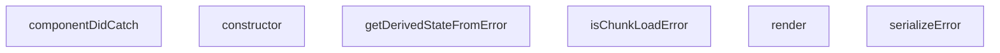

## Genel Bakış
Bu modül, bir React uygulamasındaki beklenmeyen hataları yakalayıp kullanıcıya güvenli bir yedek arayüz sunmak için bir hata sınırı (ErrorBoundary) bileşeni sağlar. Ayrıca, hataların türlerini belirlemek ve hata bilgilerini okunabilir bir formata dönüştürmek için iki yardımcı fonksiyon içerir.

## Fonksiyon Grupları
### Hata İşleme Yardımcıları
Bu fonksiyonlar, yakalanan hataların içeriğini analiz eder ve hata türlerini belirlemek veya hata nesnelerini seri hale getirmek için kullanılır.
- serializeError
- isChunkLoadError

### ErrorBoundary Bileşeni Yaşam Döngüsü Metotları
Bu metotlar, React’in hata sınırı protokolünü uygulayarak bileşen ağacında oluşan hataları yakalar, hata durumunu state’e yansıtır ve yedek bir kullanıcı arayüzü render eder.
- constructor
- getDerivedStateFromError
- componentDidCatch
- render

---

## AXIOMS – Mimari Varsayımlar
[Aksiyom 1]: Eğer `serializeError` fonksiyonuna `error` argümanı geçilmezse, TypeError oluşur.  
[Aksiyom 2]: Eğer `isChunkLoadError` fonksiyonuna `error` argümanı geçilmezse, TypeError oluşur.  
[Aksiyom 3]: Eğer `ErrorBoundary` constructor'ına `props` argümanı geçilmezse, component başlatılamaz (props undefined olur).  
[Aksiyom 4]: Eğer `getDerivedStateFromError` fonksiyonuna `error` parametresi `Error` türünde değilse, hata yakalama mekanizması çalışmayabilir (tip uyuşmazlığı).  
[Aksiyom 5]: Eğer `componentDidCatch` fonksiyonuna `error` veya `errorInfo` argümanlarından biri eksik veya yanlış tipteyse, hata bilgisi güncellenemez.  
[Aksiyom 6]: Eğer `render` metodu çağrıldığında bileşenin gerekli state özellikleri (örneğin `hasError`) tanımlı değilse, render sırasında referans hatası yaşanabilir.

---

## FONKSIYON DETAYLARI

### serializeError
**Ne yapar**: Bilinme tipindeki bir hata değerini güvenli bir şekilde serialize ederek, hata nesnesini saklama veya iletme amaçlı hazırlar.  
**Nasıl yapar**: Gelen `error` argümanını inceler; eğer bir `Error` örneği ise mesajı ve yığın izini çıkarır, değilse değeri stringe dönüştürerek basit bir temsil oluşturur.  
**Parametreler**:  
- error: unknown — Serialize edilecek hata değeri.  
**Dönüş**: Fonksiyonun dönüş tipi belirtilmemiştir; genellikle işlem sonrası bir değer döndürülmediği için void olarak kabul edilir.

### isChunkLoadError
**Ne yapar**: Verilen hatanın kod parçası (chunk) yükleme sırasında oluştuğunu belirleyerek, bu tür hataları ayrı bir şekilde ele almayı sağlar.  
**Nasıl yapar**: Hata nesnesinin `type`, `message` ve diğer özelliklerini kontrol ederek, Webpack veya benzeri bundler tarafından üretilen chunk load error'larına uygun olup olmadığını değerlendirir.  
**Parametreler**:  
- error: unknown — Değerlendirilecek hata nesnesi.  
**Dönüş**: boolean — Hata chunk yükleme hatasıysa `true`, aksi takdirde `false` döner.

### constructor
**Ne yapar**: `ErrorBoundary` bileşeninin yeni bir örneğini oluşturur ve başlangıç state'ini tanımlar.  
**Nasıl yapar**: `props` parametresini alır, `super(props)` ile temel sınıfı başlatır ve hata durumu için state'i (örneğin `{ hasError: false }`) başlangıç değerine ayarlar.  
**Parametreler**:  
- props: Props — Bileşene geçirilen özellikler nesnesi.  
**Dönüş**: Yapıcı fonksiyon genellikle bir değer döndürmez; dönüş tipi void olarak kabul edilir.

### getDerivedStateFromError
**Ne yapar**: Bir hata yakalandığında bileşenin state'ini günceller, hata görüntüleme modunu etkinleştirerek kullanıcıya yedek bir UI gösterilmesini sağlar.  
**Nasıl yapar**: Yakalanan `error` nesnesini alır ve `{ hasError: true }` gibi bir state nesnesi döndürür; React bu state'i kullanarak render sırasında hata sınırı içeriğini değiştirir.  
**Parametreler**:  
- error: Error — Yakalanan hata nesnesi.  
**Dönüş**: State — Bileşenin yeni state'i; genellikle hata bayrağını içerir ve render metodunu tetikler.

### componentDidCatch
**Ne yapar**: Hata yakalandığında ek bilgi toplar, hata raporlama veya loglama işlemlerini gerçekleştirerek geliştiricilere sorunun kaynağını hızlıca belirleme imkanı verir.  
**Nasıl yapar**: `error` ve `errorInfo` parametrelerini alır; hata mesajını, yığın izini ve component stack bilgilerini konsola yazdırır veya hata izleme servisine gönderir.  
**Parametreler**:  
- error: Error — Yakalanan hata nesnesi.  
- errorInfo: ErrorInfo — Hata hakkında ek bileşen yığını bilgisi.  
**Dönüş**: Dönüş tipi belirtilmemiştir; genellikle işlem sonrası bir değer döndürülmediği için void olarak kabul edilir.

### render
**Ne yapar**: Bileşenin mevcut state'ine göre kullanıcıya gösterilecek JSX'i döndürür; hata durumunda yedek bir UI, normal durumda ise içeriği render eder.  
**Nasıl yapar**: State'teki `hasError` bayrağını kontrol eder; `true` ise hata mesajını veya yedek içeriği gösterir, `false` ise `props.children` ile içerik öğelerini doğrudan render eder.  
**Parametreler**: (yok)  
**Dönüş**: Dönüş tipi belirtilmemiştir; genellikle bir React elementi (JSX) döndürür.

---

## INTERFACES

### Props
- `children: ReactNode`
- `fallback?: ReactNode`

### State
- `hasError: boolean`
- `error?: Error`
- `isChunkError?: boolean`

---

## AST POINTERS

### [N1_NASIL] AST Pointer: C:\Users\alize\venthub-hvac\src\components\ErrorBoundary.tsx::serializeError
- **params**: error: unknown
- **ic_degiskenler**: 
  - `error` — the unknown error value passed to the function; used to extract `message` and `stack` when it is an `Error`, otherwise stringified via `JSON.stringify` or `String`
- **Dönüş**: string

### [N2_NASIL] AST Pointer: C:\Users\alize\venthub-hvac\src\components\ErrorBoundary.tsx::isChunkLoadError
- **params**: error: unknown
- **ic_degiskenler**: 
  - `error` — the unknown error value, narrowed to an `Error` instance via `instanceof`; its `message` is checked for chunk‑load related substrings
- **Dönüş**: boolean

### [N3_NASIL] AST Pointer: C:\Users\alize\venthub-hvac\src\components\ErrorBoundary.tsx::constructor
- **params**: props: Props
- **ic_degiskenler**: 
  - `props` — the component’s initial properties, forwarded to `super(props)` to initialize the base class
- **Dönüş**: yok

### [N4_NASIL] AST Pointer: C:\Users\alize\venthub-hvac\src\components\ErrorBoundary.tsx::getDerivedStateFromError
- **params**: error: Error
- **ic_degiskenler**: 
  - `error` — the caught `Error` instance; used to populate state (`hasError`, `error`) and to determine `isChunkError` via `isChunkLoadError`
- **Dönüş**: State

### [N5_NASIL] AST Pointer: C:\Users\alize\venthub-hvac\src\components\ErrorBoundary.tsx::componentDidCatch
- **params**: error: Error, errorInfo: ErrorInfo
- **ic_degiskenler**: 
  - `error` — the `Error` that was thrown; logged and inspected for chunk‑load conditions
  - `errorInfo` — React‑provided `ErrorInfo` containing the component stack; logged alongside the error
- **Dönüş**: yok

### [N6_NASIL] AST Pointer: C:\Users\alize\venthub-hvac\src\components\ErrorBoundary.tsx::render
- **params**: (parametre yok)
- **ic_degiskenler**: 
  - `ctx` — the `I18nContext` object consumed via `I18nContext.Consumer`; supplies the translation function
  - `t` — translation function derived from `ctx` (falls back to identity), used to render localized strings
  - `isChunkError` — boolean destructured from `this.state` indicating whether the error is a chunk‑loading error
- **Dönüş**: JSX.Element

### [N7_NASIL] AST Pointer: C:\Users\alize\venthub-hvac\src\components\ErrorBoundary.tsx::handleRetry
- **params**: (parametre yok)
- **ic_degiskenler**: 
  - (yok)
- **Dönüş**: yok

### [N8_NASIL] AST Pointer: C:\Users\alize\venthub-hvac\src\components\ErrorBoundary.tsx::handleRefresh
- **params**: (parametre yok)
- **ic_degiskenler**: 
  - (yok)
- **Dönüş**: yok

---

## MERMAID CALL GRAPH

## NODE ID STANDARD

  file: src\components\ErrorBoundary.tsx
  function: src\components\ErrorBoundary.tsx::serializeError
  function: src\components\ErrorBoundary.tsx::isChunkLoadError
  class: src\components\ErrorBoundary.tsx::ErrorBoundary

---

## DISA AKTARILANLAR (EXPORTS)
  export: ErrorBoundary
  export: isChunkLoadError
  export: serializeError

---

## BILEŞIM (CONTAINS)
  contains: Component<Props
  contains: State>

---

## STİL TOKENLERİ

### Arbitrary Değerler (token'a geçirilmemiş)
- **shadow:** (yok)
- **height:** `min-h-[400px]`
- **width:** (yok)
- **spacing:** (yok)
- **diğer:** (yok)

### Kullanılan Token'lar (zaten token'a geçirilmiş)
- (yok)

### Tailwind Sınıf Özeti
- **Renkler:** `bg-gray-100`, `bg-primary-navy`, `border-gray-300`, `text-amber-500`, `text-center`, `text-gray-500`, `text-gray-600`, `text-gray-700`, `text-gray-800`, `text-left`, `text-sm`, `text-white`, `text-xl`, `text-xs`
- **Layout:** `flex`, `h-16`, `h-4`, `inline-flex`, `items-center`, `justify-center`, `max-h-40`, `max-w-md`, `overflow-auto`, `p-3`, `p-8`, `w-16`, `w-4`
- **Responsive:** (yok)
