## Genel Bakış
Bu modül, HVAC sistemleriyle ilgili çeşitli ekipmanları ve bazı ortak kullanım amaçlı sembolleri temsil eden SVG tabanlı React ikon bileşenlerini toplar. Her bir fonksiyon, belirtilen boyut ve stil seçenekleriyle özelleştirilebilir bir ikon döndürerek arayüzde görsel eşleştirmeyi kolaylaştırır.

## Fonksiyon Grupları
### HVAC Ekipman İkonları
HVAC sistemlerinin temel bileşenlerini görselleştirmek için kullanılan ikonlar burada yer alır; fan, ısı geri kazanımı, havalama perdeleri, nemlendirici, hava temizleyici, esnek kanal, hız kontrolü ve aksesuar gibi işlevleri temsil eder.
- FanIcon, HeatRecoveryIcon, AirCurtainIcon, DehumidifierIcon, AirPurifierIcon, FlexibleDuctIcon, SpeedControlIcon, AccessoriesIcon

### Ortak Kullanım İkonları
Modülün geri kalan kısmı, sosyal medya bağlantıları ve marka gösterimi gibi genel amaçlı ihtiyaçlara hizmet eden basit ikonları içerir; bu sayede arayüzde tutarlı bir görsel dil sağlanır.
- WhatsAppIcon, BrandIcon

---

## AXIOMS – Mimari Varsayımlar
Bu modül, prop tiplerinin ve varsayılan değerlerinin beklendiği şekilde sağlandığını varsayar.

[Aksiyom 1]: Eğer className prop'ı string değilse, component sınıf adı uygulanamayabilir ve stil hatası oluşabilir.  
[Aksiyom 2]: Eğer size prop'ı sayı değilse, CSS boyutu geçersiz olur ve ikon beklenmedik şekilde render edilebilir.  
[Aksiyom 3]: Eğer WhatsAppIcon'ın size prop'ı sağlanmazsa, varsayılan 24 kullanılır; ancak bu değerin sayı olmaması durumunda yukarıdaki aksiyom geçerlidir.  
[Aksiyom 4]: Eğer BrandIcon'ın brand prop'ı sağlanmazsa veya tanımsız ise, component doğru şekilde render edilemez (brand eksikliği nedeniyle görüntülenemez).

---

## FONKSİYON DETAYLARI

### FanIcon
**Ne yapar**: HVAC sistemlerindeki fan bileşenini temsil eden SVG ikonunu render eder. Fan sembolünü görsel olarak göstermek için kullanılır.

**Nasıl yapar**: className ve size parametrelerini alarak, bir SVG elementi oluşturur ve fan şeklinde bir ikon çizer. Varsayılan olarak 48x48 piksel boyutunda render edilir.

**Parametreler**:
- className: string — İkon üzerine uygulanacak CSS sınıfı. Varsayılan değer boş stringdir.
- size: number — İkonun boyutunu piksel cinsinden belirler. Varsayılan değer 48'dir.

**Dönüş**: React.FC<IconProps> — Render edilmiş SVG ikon bileşeni döndürür.

### HeatRecoveryIcon
**Ne yapar**: Isı geri kazanım sistemini simgeleyen bir ikon bileşeni üretir.  
**Nasıl yapar**: Hazırlanmış SVG içeriği alır, `className` ve `size` prop’larını bu SVG üzerindeki stil ve boyut özelliklerine uygular.  
**Parametreler**:
- className: string — İkona ekstra stil sınıfları eklemek için kullanılır.  
- size: number — İkonun boyutunu piksel cinsinden ayarlar, varsayılan 48.  
**Dönüş**: `React.FC<IconProps>`; render edildiğinde Isı geri kazanım ikonunu gösterir.

### AirCurtainIcon
**Ne yapar**: Hava perdesi (air curtain) cihazını temsil eden bir simge bileşeni oluşturur.  
**Nasıl yapar**: İkonun SVG tanımı alır, dışardan gelen `className` stilini ve `size` boyutunu uygulayarak ekrana basar.  
**Parametreler**:
- className: string — Ekstra CSS sınıfları için kullanılır, görsel özelleştirmeyi mümkün kılar.  
- size: number — İkonun genişlik ve yüksekliğini piksel olarak belirler, varsayılan 48.  
**Dönüş**: `React.FC<IconProps>`; JSX olarak hava perdesi ikonunu döndürür.

### DehumidifierIcon
**Ne yapar**: Nem çekici (dehumidifier) cihazının simgesini render eden bir React bileşeni sağlar.  
**Nasıl yapar**: Önceden tanımlanmış SVG yolunu alır, `className` ve `size` değerlerini bu SVG’nin stil ve boyut özelliklerine uygular.  
**Parametreler**:
- className: string — İkona ekstra stil sınıfları eklemek için kullanılır.  
- size: number — İkonun boyutunu piksel cinsinden belirler, varsayılan değer 48.  
**Dönüş**: `React.FC<IconProps>`; nem çekici ikonunu gösteren fonksiyonel bileşen.

### AirPurifierIcon
**Ne yapar**: Hava temizleyici (air purifier) cihazını simgeleyen bir ikon bileşeni üretir.  
**Nasıl yapar**: SVG içeriği alır, `className` stilini ve `size` boyutunu bu SVG üzerindeki özelliklere uygulayarak ekrana basar.  
**Parametreler**:
- className: string — Ekstra CSS sınıfları için kullanılır, stil özelleştirmeyi sağlar.  
- size: number — İkonun piksel cinsinden genişlik ve yüksekliğini belirler, varsayılan 48.  
**Dönüş**: `React.FC<IconProps>`; hava temizleyici ikonunu döndüren fonksiyonel bileşen.

### FlexibleDuctIcon
**Ne yapar**: Esnek havalandırma kanalı (flexible duct) simgesini render eden bir React bileşeni sağlar.  
**Nasıl yapar**: Hazırlanmış SVG yolunu alır, dışardan gelen `className` stilini ve `size` boyutunu bu SVG’nin özelliklerine uygular.  
**Parametreler**:
- className: string — Ekstra stil sınıfları eklemek için kullanılır.  
- size: number — İkonun boyutunu piksel cinsinden belirler, varsayılan 48.  
**Dönüş**: `React.FC<IconProps>`; esnek kanal ikonunu gösteren fonksiyonel bileşen.

### SpeedControlIcon
**Ne yapar**: Hız kontrolü (speed control) simgesini oluşturan bir ikon bileşeni üretir.  
**Nasıl yapar**: SVG tanımı alır, `className` ve `size` prop’larını bu SVG’nin stil ve boyut özelliklerine uygulayarak ekrana basar.  
**Parametreler**:
- className: string — Ekstra CSS sınıfları için kullanılır, görsel özelleştirmeyi sağlar.  
- size: number — İkonun piksel cinsinden genişlik ve yüksekliğini belirler, varsayılan 48.  
**Dönüş**: `React.FC<IconProps>`; hız kontrolü ikonunu döndüren fonksiyonel bileşen.

### AccessoriesIcon
**Ne yapar**: HVAC ekstra ekipmanları (aksesuarlar) simgesini render eden bir bileşen sağlar.  
**Nasıl yapar**: Önceden tanımlanmış SVG içeriği alır, `className` stilini ve `size` boyutunu bu SVG’nin özelliklerine uygulayarak ekrana gösterir.  
**Parametreler**:
- className: string — Ekstra stil sınıfları eklemek için kullanılır.  
- size: number — İkonun boyutunu piksel cinsinden belirler, varsayılan 48.  
**Dönüş**: `React.FC<IconProps>`; aksesuar ikonunu gösteren fonksiyonel bileşen.

### WhatsAppIcon
**Ne yapar**: WhatsApp logosunu gösteren bir ikon bileşeni üretir.  
**Nasıl yapar**: WhatsApp markası için hazırlanmış SVG alır, dışardan gelen `className` stilini ve `size` boyutunu (varsayılan 24) bu SVG’nin stil ve boyut özelliklerine uygular.  
**Parametreler**:
- className: string — Ekstra CSS sınıfları için kullanılır, stil özelleştirmeyi sağlar.  
- size: number — İkonun piksel cinsinden genişlik ve yüksekliğini belirler, varsayılan 24.  
**Dönüş**: `React.FC<IconProps>`; WhatsApp logosunu gösteren fonksiyonel bileşen.

### BrandIcon
**Ne yapar**: Verilen `brand` parametresine göre ilgili marka logosunu render eden dinamik bir ikon bileşeni sağlar.  
**Nasıl yapar**: `brand` string değerine göre önceden tanımlanmış marka SVG’lerinden uygun olanı seçer, `className` prop’sunu bu SVG’nin stiline uygular ve ekrana basar.  
**Parametreler**:
- brand: string — Gösterilecek markanın adı; bu değere göre ilgili logo seçilir.  
- className: string (opsiyonel) — Ekstra stil sınıfları eklemek için kullanılır, varsayılan boş string.  
**Dönüş**: `React.FC<{ brand: string; className?: string }>`; marka logosunu gösteren fonksiyonel bileşen.

---

## INTERFACES

### IconProps
- `className?: string`
- `size?: number`

---

## AST POINTERS

### [N1_NASIL] AST Pointer: C:\Users\alize\venthub-hvac\src\components\HVACIcons.tsx::FanIcon
- **params**: className, size
- **ic_degiskenler**:
  - `className` — SVG öğesinin className özelliğine aktarılan stil sınıfı
  - `size` — SVG öğesinin width ve height özelliklerine piksel cinsinden aktarılan boyut
- **Dönüş**: JSX elementi (React.FC<IconProps>)

### [N2_NASIL] AST Pointer: C:\Users\alize\venthub-hvac\src\components\HVACIcons.tsx::HeatRecoveryIcon
- **params**: className, size
- **ic_degiskenler**:
  - `className` — SVG öğesinin className özelliğine aktarılan stil sınıfı
  - `size` — SVG öğesinin width ve height özelliklerine piksel cinsinden aktarılan boyut
- **Dönüş**: JSX elementi (React.FC<IconProps>)

### [N3_NASIL] AST Pointer: C:\Users\alize\venthub-hvac\src\components\HVACIcons.tsx::AirCurtainIcon
- **params**: className, size
- **ic_degiskenler**:
  - `className` — SVG öğesinin className özelliğine aktarılan stil sınıfı
  - `size` — SVG öğesinin width ve height özelliklerine piksel cinsinden aktarılan boyut
- **Dönüş**: JSX elementi (React.FC<IconProps>)

### [N4_NASIL] AST Pointer: C:\Users\alize\venthub-hvac\src\components\HVACIcons.tsx::DehumidifierIcon
- **params**: className, size
- **ic_degiskenler**:
  - `className` — SVG öğesinin className özelliğine aktarılan stil sınıfı
  - `size` — SVG öğesinin width ve height özelliklerine piksel cinsinden aktarılan boyut
- **Dönüş**: JSX elementi (React.FC<IconProps>)

### [N5_NASIL] AST Pointer: C:\Users\alize\venthub-hvac\src\components\HVACIcons.tsx::AirPurifierIcon
- **params**: className, size
- **ic_degiskenler**:
  - `className` — SVG öğesinin className özelliğine aktarılan stil sınıfı
  - `size` — SVG öğesinin width ve height özelliklerine piksel cinsinden aktarılan boyut
- **Dönüş**: JSX elementi (React.FC<IconProps>)

### [N6_NASIL] AST Pointer: C:\Users\alize\venthub-hvac\src\components\HVACIcons.tsx::FlexibleDuctIcon
- **params**: className, size
- **ic_degiskenler**:
  - `className` — SVG öğesinin className özelliğine aktarılan stil sınıfı
  - `size` — SVG öğesinin width ve height özelliklerine piksel cinsinden aktarılan boyut
- **Dönüş**: JSX elementi (React.FC<IconProps>)

### [N7_NASIL] AST Pointer: C:\Users\alize\venthub-hvac\src\components\HVACIcons.tsx::SpeedControlIcon
- **params**: className, size
- **ic_degiskenler**:
  - `className` — SVG öğesinin className özelliğine aktarılan stil sınıfı
  - `size` — SVG öğesinin width ve height özelliklerine piksel cinsinden aktarılan boyut
- **Dönüş**: JSX elementi (React.FC<IconProps>)

### [N8_NASIL] AST Pointer: C:\Users\alize\venthub-hvac\src\components\HVACIcons.tsx::AccessoriesIcon
- **params**: className, size
- **ic_degiskenler**:
  - `className` — SVG öğesinin className özelliğine aktarılan stil sınıfı
  - `size` — SVG öğesinin width ve height özelliklerine piksel cinsinden aktarılan boyut
- **Dönüş**: JSX elementi (React.FC<IconProps>)

### [N9_NASIL] AST Pointer: C:\Users\alize\venthub-hvac\src\components\HVACIcons.tsx::WhatsAppIcon
- **params**: className, size
- **ic_degiskenler**:
  - `className` — SVG öğesinin className özelliğine aktarılan stil sınıfı
  - `size` — SVG öğesinin width ve height özelliklerine piksel cinsinden aktarılan boyut (varsayılan 24)
- **Dönüş**: JSX elementi (React.FC<IconProps>)

### [N10_NASIL] AST Pointer: C:\Users\alize\venthub-hvac\src\components\HVACIcons.tsx::BrandIcon
- **params**: brand, className
- **ic_degiskenler**:
  - `brand` — görüntülenecek markanın adı; lowercase versiyonu için `normalizedBrand` hesaplanır ve `` alt metni olarak kullanılır
  - `className` — dış öğeye (img veya fallback div) uygulanacak ek stil sınıfı
  - `normalizedBrand` — `brand` küçük harfe çevrilmiş hali; marka eşleştirmesinde switch case’de kullanılır
  - `basePath` — marka görsellerinin bulunduğu sabit yol (`/images/ekran`)
  - `src` — seçilen markaya göre oluşturulan tam görsel URL’si; `` öğesinin src özelliğine aktarılır
  - `alt` — `` öğesinin alt özelliği; erişilebilirlik için marka adıyla doldurulur
- **Dönüş**: JSX elementi (React.FC<{ brand: string; className?: string }>) – marka görseli veya fallback metni döner.

---

## MERMAID CALL GRAPH

```mermaid
graph TD
    HVACIcons_tsx__AccessoriesIcon["AccessoriesIcon"]
    HVACIcons_tsx__AirCurtainIcon["AirCurtainIcon"]
    HVACIcons_tsx__AirPurifierIcon["AirPurifierIcon"]
    HVACIcons_tsx__BrandIcon["BrandIcon"]
    HVACIcons_tsx__DehumidifierIcon["DehumidifierIcon"]
    HVACIcons_tsx__FanIcon["FanIcon"]
    HVACIcons_tsx__FlexibleDuctIcon["FlexibleDuctIcon"]
    HVACIcons_tsx__HeatRecoveryIcon["HeatRecoveryIcon"]
    HVACIcons_tsx__SpeedControlIcon["SpeedControlIcon"]
    HVACIcons_tsx__WhatsAppIcon["WhatsAppIcon"]
```

## NODE ID STANDARD

  file: src\components\HVACIcons.tsx
  function: src\components\HVACIcons.tsx::FanIcon
  function: src\components\HVACIcons.tsx::HeatRecoveryIcon
  function: src\components\HVACIcons.tsx::AirCurtainIcon
  function: src\components\HVACIcons.tsx::DehumidifierIcon
  function: src\components\HVACIcons.tsx::AirPurifierIcon
  function: src\components\HVACIcons.tsx::FlexibleDuctIcon
  function: src\components\HVACIcons.tsx::SpeedControlIcon
  function: src\components\HVACIcons.tsx::AccessoriesIcon
  function: src\components\HVACIcons.tsx::WhatsAppIcon
  function: src\components\HVACIcons.tsx::BrandIcon

---

## DISA AKTARILANLAR (EXPORTS)
  export: AccessoriesIcon
  export: AirCurtainIcon
  export: AirPurifierIcon
  export: BrandIcon
  export: DehumidifierIcon
  export: FanIcon
  export: FlexibleDuctIcon
  export: HeatRecoveryIcon
  export: SpeedControlIcon
  export: WhatsAppIcon

---

## STİL TOKENLERİ

### Arbitrary Değerler (token'a geçirilmemiş)
Yok — tüm stiller token'a geçirilmiş. ✅

### Kullanılan Token'lar (zaten token'a geçirilmiş)
- (yok)

### Tailwind Sınıf Özeti
- **Renkler:** `bg-slate-100`, `text-slate-400`, `text-xs`
- **Layout:** `flex`, `h-full`, `items-center`, `justify-center`, `p-2`, `relative`, `w-full`
- **Varyant/Responsive:** (yok)
- **Yardımcı Sınıflar:** `${className`, `font-bold`, `object-contain`, `rounded-lg`, `tracking-tighter`, `uppercase`