## Genel Bakış
Bu modül, HVAC sistemleriyle ilişkili ekipmanları ve bazı genel amaçlı sembolleri temsil eden SVG tabanlı React ikon bileşenlerini içerir. Her bileşen, boyut ve sınıf adı gibi özelleştirilebilir özellikler alarak arayüzde görsel eşleştirmeyi kolaylaştırır.

## Fonksiyon Grupları
### HVAC Ekipman İkonları
Bu grup, HVAC sistemlerinin temel bileşenlerini görselleştiren ikonları içerir. Fan, ısı geri kazanımı, havalama perdesi, nemlendirici, hava temizleyici, esnek kanal, hız kontrolü ve aksesuar gibi işlevleri temsil eder.
- FanIcon, HeatRecoveryIcon, AirCurtainIcon, DehumidifierIcon, AirPurifierIcon, FlexibleDuctIcon, SpeedControlIcon, AccessoriesIcon

### Ortak Kullanım İkonları
Bu grup, sosyal medya ve marka gösterimi gibi genel amaçlı ikonları içerir. Arayüzde tutarlı bir görsel dil sağlamak için kullanılır.
- WhatsAppIcon, BrandIcon

---

## AXIOMS – Mimari Varsayımlar

[Aksiyom 1]: Eğer `size` parametresi verilmezse, `FanIcon`, `HeatRecoveryIcon`, `AirCurtainIcon`, `DehumidifierIcon`, `AirPurifierIcon`, `FlexibleDuctIcon`, `SpeedControlIcon` ve `AccessoriesIcon` bileşenleri için 48, `WhatsAppIcon` bileşeni için 24 varsayılan değer olarak kullanılır.

[Aksiyom 2]: Eğer `className` parametresi verilmezse, tüm ikon bileşenleri için boş string (`''`) varsayılan değer olarak kullanılır.

[Aksiyom 3]: Eğer `BrandIcon` bileşeninde `brand` parametresi verilmezse, bileşen düzgün çalışamaz çünkü bu parametre zorunludur ve varsayılan değeri yoktur.

[Aksiyom 4]: Eğer `IconProps` tipi tanımlı değilse, `FanIcon`, `HeatRecoveryIcon`, `AirCurtainIcon`, `DehumidifierIcon`, `AirPurifierIcon`, `FlexibleDuctIcon`, `SpeedControlIcon`, `AccessoriesIcon` ve `WhatsAppIcon` bileşenlerinin dönüş tipi tanımsız kalır ve TypeScript derleme hatası oluşur.

---

## FONKSİYON DETAYLARI

### FanIcon
**Ne yapar**: HVAC sistemlerindeki fan bileşenini temsil eden SVG ikonunu render eder. Fan sembolünü görsel olarak göstermek için kullanılır.

**Nasıl yapar**: className ve size parametrelerini alarak, bir SVG elementi oluşturur ve fan şeklinde bir ikon çizer. Varsayılan olarak 48x48 piksel boyutunda render edilir.

**Parametreler**:
- className: string — İkon üzerine uygulanacak CSS sınıfı. Varsayılan değer boş stringdir.
- size: number — İkonun boyutunu piksel cinsinden belirler. Varsayılan değer 48'dir.

**Dönüş**: React.FC<IconProps> — Render edilmiş SVG ikon bileşeni döndürür.

### HeatRecoveryIcon
**Ne yapar**: Isı geri kazanım sistemini simgeleyen bir ikon bileşeni üretir.  
**Nasıl yapar**: Hazırlanmış SVG içeriği alır, `className` ve `size` prop’larını bu SVG üzerindeki stil ve boyut özelliklerine uygular.  
**Parametreler**:
- className: string — İkona ekstra stil sınıfları eklemek için kullanılır.  
- size: number — İkonun boyutunu piksel cinsinden ayarlar, varsayılan 48.  
**Dönüş**: `React.FC<IconProps>`; render edildiğinde Isı geri kazanım ikonunu gösterir.

### AirCurtainIcon
**Ne yapar**: Hava perdesi (air curtain) cihazını temsil eden bir simge bileşeni oluşturur.  
**Nasıl yapar**: İkonun SVG tanımı alır, dışardan gelen `className` stilini ve `size` boyutunu uygulayarak ekrana basar.  
**Parametreler**:
- className: string — Ekstra CSS sınıfları için kullanılır, görsel özelleştirmeyi mümkün kılar.  
- size: number — İkonun genişlik ve yüksekliğini piksel olarak belirler, varsayılan 48.  
**Dönüş**: `React.FC<IconProps>`; JSX olarak hava perdesi ikonunu döndürür.

### DehumidifierIcon
**Ne yapar**: Nem çekici (dehumidifier) cihazının simgesini render eden bir React bileşeni sağlar.  
**Nasıl yapar**: Önceden tanımlanmış SVG yolunu alır, `className` ve `size` değerlerini bu SVG’nin stil ve boyut özelliklerine uygular.  
**Parametreler**:
- className: string — İkona ekstra stil sınıfları eklemek için kullanılır.  
- size: number — İkonun boyutunu piksel cinsinden belirler, varsayılan değer 48.  
**Dönüş**: `React.FC<IconProps>`; nem çekici ikonunu gösteren fonksiyonel bileşen.

### AirPurifierIcon
**Ne yapar**: Hava temizleyici (air purifier) cihazını simgeleyen bir ikon bileşeni üretir.  
**Nasıl yapar**: SVG içeriği alır, `className` stilini ve `size` boyutunu bu SVG üzerindeki özelliklere uygulayarak ekrana basar.  
**Parametreler**:
- className: string — Ekstra CSS sınıfları için kullanılır, stil özelleştirmeyi sağlar.  
- size: number — İkonun piksel cinsinden genişlik ve yüksekliğini belirler, varsayılan 48.  
**Dönüş**: `React.FC<IconProps>`; hava temizleyici ikonunu döndüren fonksiyonel bileşen.

### FlexibleDuctIcon
**Ne yapar**: Esnek havalandırma kanalı (flexible duct) simgesini render eden bir React bileşeni sağlar.  
**Nasıl yapar**: Hazırlanmış SVG yolunu alır, dışardan gelen `className` stilini ve `size` boyutunu bu SVG’nin özelliklerine uygular.  
**Parametreler**:
- className: string — Ekstra stil sınıfları eklemek için kullanılır.  
- size: number — İkonun boyutunu piksel cinsinden belirler, varsayılan 48.  
**Dönüş**: `React.FC<IconProps>`; esnek kanal ikonunu gösteren fonksiyonel bileşen.

### SpeedControlIcon
**Ne yapar**: Hız kontrolü (speed control) simgesini oluşturan bir ikon bileşeni üretir.  
**Nasıl yapar**: SVG tanımı alır, `className` ve `size` prop’larını bu SVG’nin stil ve boyut özelliklerine uygulayarak ekrana basar.  
**Parametreler**:
- className: string — Ekstra CSS sınıfları için kullanılır, görsel özelleştirmeyi sağlar.  
- size: number — İkonun piksel cinsinden genişlik ve yüksekliğini belirler, varsayılan 48.  
**Dönüş**: `React.FC<IconProps>`; hız kontrolü ikonunu döndüren fonksiyonel bileşen.

### AccessoriesIcon
**Ne yapar**: HVAC ekstra ekipmanları (aksesuarlar) simgesini render eden bir bileşen sağlar.  
**Nasıl yapar**: Önceden tanımlanmış SVG içeriği alır, `className` stilini ve `size` boyutunu bu SVG’nin özelliklerine uygulayarak ekrana gösterir.  
**Parametreler**:
- className: string — Ekstra stil sınıfları eklemek için kullanılır.  
- size: number — İkonun boyutunu piksel cinsinden belirler, varsayılan 48.  
**Dönüş**: `React.FC<IconProps>`; aksesuar ikonunu gösteren fonksiyonel bileşen.

### WhatsAppIcon
**Ne yapar**: WhatsApp logosunu gösteren bir ikon bileşeni üretir.  
**Nasıl yapar**: WhatsApp markası için hazırlanmış SVG alır, dışardan gelen `className` stilini ve `size` boyutunu (varsayılan 24) bu SVG’nin stil ve boyut özelliklerine uygular.  
**Parametreler**:
- className: string — Ekstra CSS sınıfları için kullanılır, stil özelleştirmeyi sağlar.  
- size: number — İkonun piksel cinsinden genişlik ve yüksekliğini belirler, varsayılan 24.  
**Dönüş**: `React.FC<IconProps>`; WhatsApp logosunu gösteren fonksiyonel bileşen.

### BrandIcon
**Ne yapar**: Verilen `brand` parametresine göre ilgili markaya ait ikonu render eden bir React fonksiyonel bileşenidir. HVAC (Isıtma, Havalandırma, İklimlendirme) sistemiyle ilişkili markaların ikonlarını göstermek amacıyla kullanılır.

**Nasıl yapar**: Fonksiyon, aldığı `brand` ve `className` parametrelerini kullanarak bir React bileşeni döndürür. Bileşen, `brand` değerine karşılık gelen marka ikonunu belirtilen CSS sınıfıyla birlikte görüntüler. Varsayılan olarak `className` boş string olarak atanmıştır, böylece dışarıdan bir sınıf belirtilmediğinde bileşen hata vermeden çalışır. Dosya yolu `HVACIcons.tsx` olduğundan, bu bileşenin HVAC ikonları koleksiyonunun bir parçası olduğu anlaşılmaktadır.

**Parametreler**:
- `brand`: `string` — Görüntülenecek markanın adını belirtir. Hangi markaların desteklendiği kaynak kodda tanımlı marka listesine bağlıdır.
- `className`: `string` (varsayılan: `''`) — Bileşenin kök elemanına uygulanacak isteğe bağlı CSS sınıf adıdır. Belirtilmediğinde boş string kullanılır.

**Dönüş**: `React.FC<{ brand: string; className?: string }>` — Verilen `brand` ve `className` prop'larını kabul eden bir React fonksiyonel bileşeni döndürür. Dönen bileşen, marka ikonunu DOM'a yerleştirir.

---

## İTHALATLAR (IMPORTS)
- import: next/image::Image
- import: react::React

---

## INTERFACES

### IconProps
- `className?: string`
- `size?: number`

---

## AST POINTERS

### [N1_NASIL] AST Pointer: src/components/HVACIcons.tsx::FanIcon
- **params**: `className` (varsayılan: ''), `size` (varsayılan: 48)
- **ic_degiskenler**: yok
- **Dönüş**: JSX — SVG elementi (fan ikonu, dairesel kanatlar ve merkez nokta)

### [N2_NASIL] AST Pointer: src/components/HVACIcons.tsx::HeatRecoveryIcon
- **params**: `className` (varsayılan: ''), `size` (varsayılan: 48)
- **ic_degiskenler**: yok
- **Dönüş**: JSX — SVG elementi (ısı geri kazanım ünitesi, mavi ve turuncu oklar, HRV_LABEL metni)

### [N3_NASIL] AST Pointer: src/components/HVACIcons.tsx::AirCurtainIcon
- **params**: `className` (varsayılan: ''), `size` (varsayılan: 48)
- **ic_degiskenler**: yok
- **Dönüş**: JSX — SVG elementi (hava perdesi, dikey çizgiler ve eğik hava akışı)

### [N4_NASIL] AST Pointer: src/components/HVACIcons.tsx::DehumidifierIcon
- **params**: `className` (varsayılan: ''), `size` (varsayılan: 48)
- **ic_degiskenler**: yok
- **Dönüş**: JSX — SVG elementi (nem alıcı, su damlacıkları ve gösterge çubukları)

### [N5_NASIL] AST Pointer: src/components/HVACIcons.tsx::AirPurifierIcon
- **params**: `className` (varsayılan: ''), `size` (varsayılan: 48)
- **ic_degiskenler**: yok
- **Dönüş**: JSX — SVG elementi (hava temizleyici, filtre katmanları ve hava akışı)

### [N6_NASIL] AST Pointer: src/components/HVACIcons.tsx::FlexibleDuctIcon
- **params**: `className` (varsayılan: ''), `size` (varsayılan: 48)
- **ic_degiskenler**: yok
- **Dönüş**: JSX — SVG elementi (esnek kanal, dalgalı boru ve bağlantı noktaları)

### [N7_NASIL] AST Pointer: src/components/HVACIcons.tsx::SpeedControlIcon
- **params**: `className` (varsayılan: ''), `size` (varsayılan: 48)
- **ic_degiskenler**: yok
- **Dönüş**: JSX — SVG elementi (hız kontrolü, kadran ve RPM_LABEL metni)

### [N8_NASIL] AST Pointer: src/components/HVACIcons.tsx::AccessoriesIcon
- **params**: `className` (varsayılan: ''), `size` (varsayılan: 48)
- **ic_degiskenler**: yok
- **Dönüş**: JSX — SVG elementi (aksesuar, dişli çark ve bağlantı parçaları)

### [N9_NASIL] AST Pointer: src/components/HVACIcons.tsx::WhatsAppIcon
- **params**: `className` (varsayılan: ''), `size` (varsayılan: 24)
- **ic_degiskenler**: yok
- **Dönüş**: JSX — SVG elementi (WhatsApp logosu, beyaz dolgulu)

### [N10_NASIL] AST Pointer: src/components/HVACIcons.tsx::BrandIcon
- **params**: `brand`, `className` (varsayılan: '')
- **ic_degiskenler**:
  - `normalizedBrand` — `brand.toLowerCase()` ile marka adının küçük harfe dönüştürülmüş hali
  - `basePath` — '/images/ekran' sabit dizin yolu, marka görsellerinin bulunduğu klasör
  - `src` — switch-case ile belirlenen marka görselinin dosya yolu (avens.svg, vortic.jpg, casals.png, nicotra.webp, flexiva.png)
  - `alt` — `brand` parametresinin kendisi, erişilebilirlik için alternatif metin
- **Dönüş**: JSX — Eşleşen marka varsa `Image` bileşeni içeren div; eşleşmezse marka adını gösteren fallback div

---

## MERMAID CALL GRAPH

```mermaid
graph TD
    HVACIcons_tsx__AccessoriesIcon["AccessoriesIcon"]
    HVACIcons_tsx__AirCurtainIcon["AirCurtainIcon"]
    HVACIcons_tsx__AirPurifierIcon["AirPurifierIcon"]
    HVACIcons_tsx__BrandIcon["BrandIcon"]
    HVACIcons_tsx__DehumidifierIcon["DehumidifierIcon"]
    HVACIcons_tsx__FanIcon["FanIcon"]
    HVACIcons_tsx__FlexibleDuctIcon["FlexibleDuctIcon"]
    HVACIcons_tsx__HeatRecoveryIcon["HeatRecoveryIcon"]
    HVACIcons_tsx__SpeedControlIcon["SpeedControlIcon"]
    HVACIcons_tsx__WhatsAppIcon["WhatsAppIcon"]
```

## NODE ID STANDARD

  file: src\components\HVACIcons.tsx
  function: src\components\HVACIcons.tsx::FanIcon
  function: src\components\HVACIcons.tsx::HeatRecoveryIcon
  function: src\components\HVACIcons.tsx::AirCurtainIcon
  function: src\components\HVACIcons.tsx::DehumidifierIcon
  function: src\components\HVACIcons.tsx::AirPurifierIcon
  function: src\components\HVACIcons.tsx::FlexibleDuctIcon
  function: src\components\HVACIcons.tsx::SpeedControlIcon
  function: src\components\HVACIcons.tsx::AccessoriesIcon
  function: src\components\HVACIcons.tsx::WhatsAppIcon
  function: src\components\HVACIcons.tsx::BrandIcon

---

## DISA AKTARILANLAR (EXPORTS)
  export: AccessoriesIcon
  export: AirCurtainIcon
  export: AirPurifierIcon
  export: BrandIcon
  export: DehumidifierIcon
  export: FanIcon
  export: FlexibleDuctIcon
  export: HeatRecoveryIcon
  export: SpeedControlIcon
  export: WhatsAppIcon

---

## STİL TOKENLERİ

### Arbitrary Değerler (token'a geçirilmemiş)
Yok — tüm stiller token'a geçirilmiş. ✅

### Kullanılan Token'lar (zaten token'a geçirilmiş)
- (yok)

### Tailwind Sınıf Özeti
- **Renkler:** `bg-slate-100`, `text-slate-400`, `text-xs`
- **Layout:** `flex`, `h-full`, `items-center`, `justify-center`, `p-2`, `relative`, `w-full`
- **Varyant/Responsive:** (yok)
- **Yardımcı Sınıflar:** `${className`, `font-bold`, `object-contain`, `rounded-lg`, `tracking-tighter`, `uppercase`